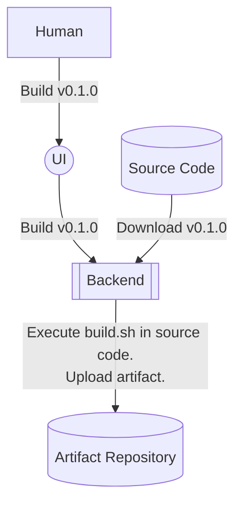
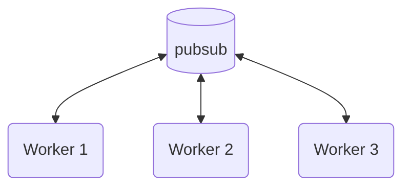
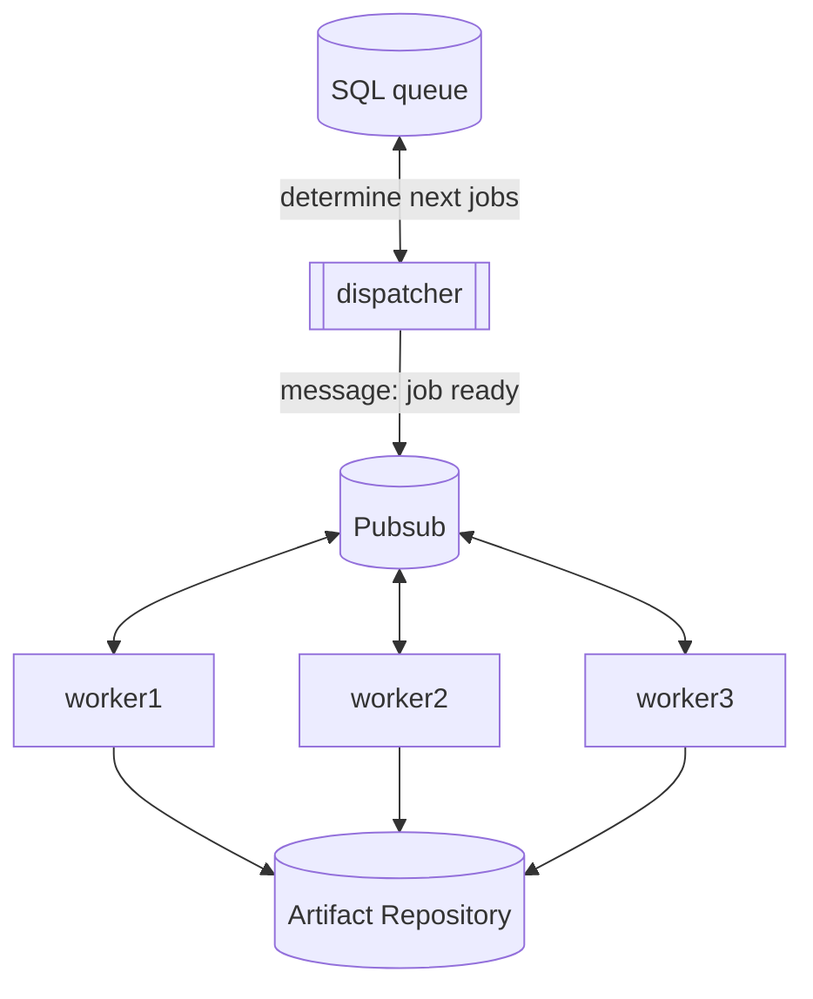
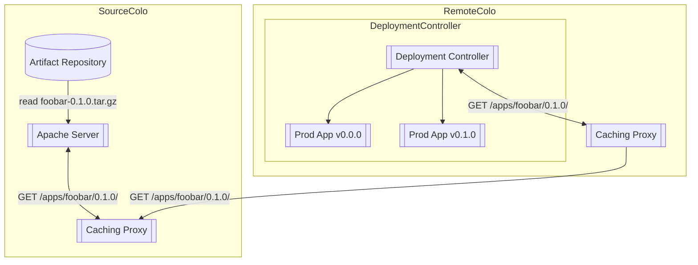
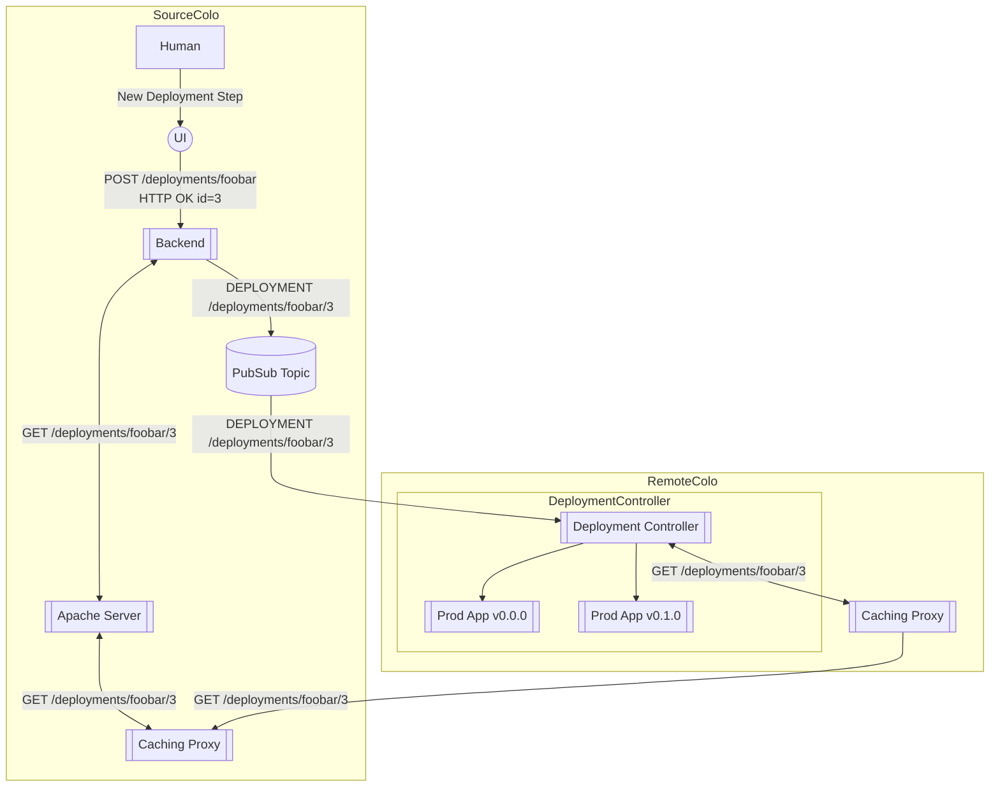

# Google Systems Design Interview With An Ex-Googler

https://www.youtube.com/watch?v=q0KGYwNbf-0

I will be taking notes of this video by Clement Mihailescu by listening to the prompts in the video and generating my own design. After I complete my design, I will listen to Clement's design and compare/contrast the differences.

<!-- more -->

## Code Deployment System

**Prompt**: I want you to design a global and fast code deployment system.

### Background

Code deployment systems are part of the CI/CD stack (and in fact, it literally _is_ the "Code Deployment" part of CI/CD). CI, or continuous integration, involves continually integrating changes to the code into some main branch. It ensures that there are no regressions introduces during these changes, and that any conflicting changes are handled in a well-defined process.

### Clarification

A clarification that Clemont asks for is what part of the code build process should we be architecting? The interviewer states that we should assume that the code has already been tested, and he wants us to build a system whereby the developers can go to a UI, click `Build` which will initiate a build process, and then `Deploy` which will deploy a specific tagged version to production servers.

### Considerations and Properties

#### Language-Specific Concerns

The artifact that gets built will have different "shapes" depending on the language in question. For example, a built artifact in Python often constitues a `.whl` file which contains a platform-specific build of the application or library, which means it will contain the compiled0`.pyc` files[^1], but also any shared libraries or other binary artifacts. We can also distribute a source distribution, which contains the raw Python source code, as well as the source for any C/C++ extensions. These source distributions often mean that there are _more_ files to distribute. 

In compiled languages like Go/C/C++, you might have one, or a small handful, or architecture-specific compiled artifacts. This means that relative to a Python source distribution, it will contain a smaller number of files of smaller total size.

Because of these considerations, our system needs to be able to handle both a small number of small files efficiently, but also a large number of medium-sized files (I'm being quite hand-wavy with the meaning of "size" here, but bear with me).

#### Do we care about Docker?

If we're in an environment that uses Docker, then the deployment bit of this question is greatly simplified. If we leave it up to the _producers_ of the artifacts (meaning the CI/CD pipelines) to generate a Docker container for us, then the deployment bit becomes a bit trivial. All we'd need to do is set up a few caching layers (probably with something like quay.io) and have our internal docker services pull from this caching layer.

That's a bit too easy though, so I'm going to assume for the purposes of this interview that we care about deploying code onto bare-metal.

#### Rollback-ability

We also want to ensure that our system is capable of rolling back deployments very quickly. This means that both the new and old vesions of the code (and preferrably, all of them) need to be easily reachable. The rollback mechanism should be controlled by some piece of metadata that lives on our production boxes, or by whatever control system that directs what . This might simply be an environment file that lives on the box that sources the right version, or a kubernetes pod, or whatever.

#### Style of rollout

There are a few different styles of rollout we could do:

1. Canary testing, whereby we deploy the new code to a small number of production servers and see if anything fails.
2. A/B testing, whereby a user will see either the A version or the B version of the deployment. We then compare the two to determine if the new version is misbehaving.
3. Parallel run, whereby a request is run through both implementations, but only one response is returned to the user. We can compare both responses to measure things like content, latency, and correctness.

For this interview, I'll adopt approach 1 as it's the simplest and arguably the most commonly used.

#### Scale

I peeked ahead a little (after I already designed my solution) and looked at some of the follow-up questions Clement asked:

1. How many regions? ~5-10
2. How many machines? Hundreds of thousands.
3. Availability? 2-3 nines (99% or 99.9%)
4. 30 minutes during entire deploy
5. 1000s of deploys per day.
6. 10GB per binary.

### Solution

Our solution needs to do two things:

1. Build the code into some artifact repository
2. Deploy the code to production

#### Source Build

This diagram shows a general flow of how our system will actually _build_ a piece of code. A human will make a request to some UI that specifies that we want to initiate a build for `v0.1.0` of our repo. This request goes to some "backend" (which we have not yet defined) that downloads the code, executes some build command (like some `build.sh` script that is defined in the repo itself), and uploads the artifact to some sort of repository. This repository can be an S3 bucket, a POSIX filesystem, or whatever we want. Let's just say it'll be an S3 blob store.

Our build backend needs to satisfy various properties:

1. It needs to be horizontally scalable.
2. It needs to prioritize builds in the queue based off of queue insertion time.
3. It needs to keep track of the state of the build.

##### Event-Driven

The first question becomes, what should our queue be? Well, we could have an event driven system where new builds go into some pubsub topic, which also acts as a queue. The message will be grabbed by a backend "worker", which itself could send a message saying the message was received, it will perform the build, upload it to a backend, then send another message indicating success.

**Pros**

1. The horizontal scaling of the worker pool is essentially limitless. We'd only be limited by the size of the pubsub cluster, which is fairly easy to do if we partition the topic correctly.
2. We also get prioritization for free as our workers would grab messages off the topic in roughly the order in which they were sent
3. The latency between from when the job is enqueued and when it gets claimed by a worker is 100% determined by the size of the queue and the number of workers. This is a good property to have as it means we can keep our workers maximally occupied and there is nothing inbetween the queue and the workers to slow the process down.

**Cons**

1. It becomes more difficult to determine what the current state of a build is. We'd need some sort of sidecar process that listens to the messages in the pubsub topic and keeps track of each build's state in a SQL database.
2. It's difficult to create some sort of fairshare algorithm between the code repositories. In my experience with build systems, sometimes a large repository can hold a build system hostage (due to a large number of builds being sent, or each build taking an enormous amount of time) and cause builds from other repos to become backlogged.

##### Event-Driven (With State Tracking)

Another solution is that our queue could live in a Postgres (or MySQL, or MariaDB, whatever). In this case, the database access should be protected behind some sort of arbiter process so that we don't have an unbounded number of workers trying to all perform complex tasks on the database, which would slow performance. It would also be unwise for the workers to directly access the database because then we're creating an implicit coupling between the database schema, and the schema the workers expect. If we isolate the schema access to a single process, it becomes more manageable to do backwards-incompatible migrations, should we ever need to.

The worker itself will look like this:

The general flow looks like this:

1. The dispatcher listens for `message: job submitted` from the pubsub queue, indicating we want a new build to be inserted into queue.
2. Dispatcher adds job to SQL queue.
3. Dispatcher selects next batch of jobs from SQL queue. This is determined based off of some priority tuple like `(creation_time,repo)` so that each repo can have individually-applied priorities. It sets the `STATUS` of these jobs to `PUBSUB SUBMITTED`.
4. Dispatcher sends a message to pubsub indicating that the jobs should be processed.
5. An arbitrary worker will receive the message and send a `message: job received` to the pubsub.
6. The dispatcher will receive the `message: job received` and set the status of the job in SQL to `RUNNING`, and optionally note which worker took the job (useful for debugging purposes).
7. The worker will perform the build. At the end, it uploads it to the artifact repository and sends a `message: job completed` to the pubsub.
8. The dispatcher receives this message and sets the status of the job to `COMPLETED`.

There is an important scenario to consider: what happens if the worker claims a job, but then dies halfway through the build process? We need some way to detect this failure scenario. One solution is that we could have the dispatcher periodically poll some HTTP endpoint exposed by the workers and check that it's healthy. Since we know which worker claimed a job, we can poll it to ensure it's healthy.

If the poll times out, the dispatcher can set the status of the job to `FAILED` and prevent any other work in the job until it's explicitly retried. In the case that the poll comes back and the worker says it's working on some other job, AND the dispatcher has not seen either a `message: job failed` or `message: job completed` message, we can assume that the job got lost somewhere and set its status to `FAILED`.

**Pros**

1. The dispatcher provides us with explicit state tracking. It knows the status of every job and keeps track of its state.
2. We still get the benefit of using event-driven message passing, which gives us a lot of room to scale.
3. The dispatcher performs health checks on the workers so we can detect hard failure conditions.
4. We have a lot of room to implement more sophisticated priority mechanisms, which can allow us to protect against a repo taking too much of the computing resources. For example, we could pop a maximum of 100 repos at a time, which allows us to do a sort of round-robin scheduling.

**Cons**

1. We're introducing a latency penalty, because there will be a period of time between when a job is enqueued in SQL, and when it gets submitted to the pubsub topic. 
2. The dispatcher might eventually become a bottleneck. Since it's a single process (which may be multithreaded), we're limited to the computing resources of a single node. We're also limited to how many operations we can do on the SQL database. However, since we're doing 1000s of deploys per day, it doesn't seem unreasonable for us to perform some single-digit multiple of SQL operations to keep track of that state. Plus, we can batch updates to the database, and make use of indicies, to improve performance.
3. We have a single point of failure. If the dispatcher fails, then the entire process grinds to a halt. This could be mitigated if we introduce multiple dispatchers that have simultaneous access to the database. However this introduces another source of complexity in the system as we need to ensure there are no race conditions. Additionally, multiple dispatchers will introduce even more load on the SQL server, which possibly means more contention, so we'd need to be mindful of the load and SQL contention of our database.

Overall, using an even-driven system with state tracking feels like the right compromise between latency and distributed state tracking. It allows us explicit prioritization logic between repos and can scale quite well to 1000s of operations per day.

#### Artifact Deployment

The deployment mechanism needs to communicate to all production nodes what version of the application should be runnning. We also need a way to distribute the artifact. We will first tackle the distribution question:

##### Artifact Distribution

We will design a system whereby the artifact is served through an HTTP endpoint. This can be as simple as a web server, like Apache, that has been told to expose some POSIX storage endpoint in our Artifact Repository. Because our endpoint should be globally available, we'll also want to have some tiered system of caching layers. It might look like this:

This architecture heavily utilizes a system of caching proxies, whereby each colocation has a pool of caching proxies that are configured to pull from some higher layer. This architecture has a few nice properties:

1. The artifact is cached at multiple layers, both in the original source colo, and at the remote colo. This means that a request only needs to be made once to the upstream source, then the rest of the colo can pull from the local copy of the data.
2. The caching proxies can be reconfigured to point to different locations, which will allow the organization to grow and change as the business needs grow/change.

[^1]: Yes, Python files do get compiled! But they get compiled into byte-code (not an executable), which is ultimately what gets read by the Python interpreter.

##### Artifact Deployment

Now that we've solved the deployment bit, we want to _tell_ the remote applications that a new version has been built and that we want them to upgrade. The way we'll do this is to expose another HTTP endpoint, called `/deployments/foobar/` (`foobar` being the name of our application) that will contain information on what things should be upgraded and how. When we update the deployment, we'll send a message to a pubsub topic that the deployment controllers will listen to that will tell it which version of the deployment to `GET`.

This diagram might look a bit involved, but it's actually quite simple. Here's the order of operations:

1. A human goes to the UI and creates a new deployment. The human specifies the application to update, the version to set the update to, and various bits of information like what percentage of machines it should be rolled out to, where it should be rolled out to, etc.
2. The UI makes a `POST` request to `/deployments/foobar` with this information to the deployment backend, and gets back the ID `3`.
3. The backend stores this deployment information in some sort of database.
4. The backend submits a message to a pubsub topic indicating that a new deployment has been created, and where it can be found.
5. The Deployment Controller receives this message and sends a `GET` request to `/deployments/foobar/3`.
6. This request falls back to a number of caching proxies all the way back to the deployment backend in the source colo.
7. The JSON containing the deployment information is returned to the deployment controller.
8. Based on the information provided, the deployment controller determines if its a target for this deployment, and if so, deploys the new version in the way specified in the JSON.

### Clement's Solution

#### Build
I won't go into detail his exact solution as you can find it in the video. In Clement's solution, his build system consists of a pool of workers that are all working off a build queue, where the queue is populated by certain triggers in our company's various repositories (such as a merge to master). He decides that the workers should dequeue by directly accessing the database, which is an anti-pattern as we are spreading the coupling between the SQL schema and the workers over some arbitrary number of works, instead of limiting it to just one or two dispatchers (as in my solution).

#### Distribution

His distribution mechanism relies on replicating the GCS buckets to multiple regions, which means that we now need to keep track of the status of the replication. Only after the replication succeeds can we deploy the artifact. This is a fairly complex solution because it relies on some blackbox replication system (which has unknown reliability/latency guarantees), and some external replication monitoring service. In my solution, my distribution mechanism relies on a single source of truth bucket and a series of tiered caching proxies. When we notify the servers that a new artifact is ready, they can _immediately_ send a request to download these new artifacts. The caching proxies will initially miss back to the source of truth. After the initial miss, subsequent requests in a remote colo for the artifact will hit the proxy's internal cache, which will dramatically speed up the download.

He also notes that it's unreasonable for all machines in a region to download directly from the GCS bucket, as that would introduce a ton of network overhead (and cost on the cloud side). He proposes that the machines in a region can participate in a P2P protocol so that they can share the artifacts amongst themselves. While this might work, it's an even greater source of complexity that can be operationally more difficult to manage. My solution of using a pool of caching proxies in each region is fairly simple and can be scaled horizontally quite well.

It's possible, however, that we could use _both_ the reverse caching proxy solution and a P2P solution down the line. For example, a server could first check if the file is available in the P2P network. If it's not, ask the caching proxy for the file (or, the caching proxy could be part of the P2P network! Interesting thought). This would give us some amount of redundancy because if the caching proxy pool goes down for whatever reason, the file is likely still available in the P2P network, which would allow the deployment to continue. This would help with the reliability aspect of our system.

