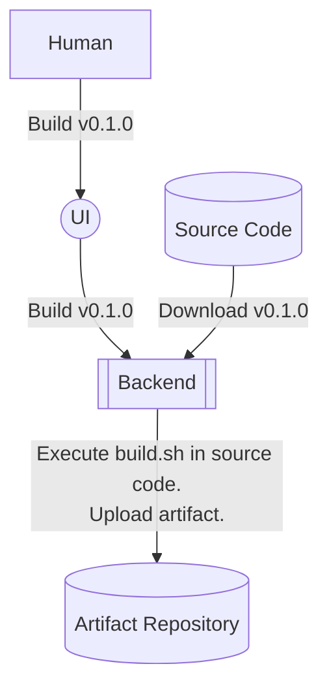
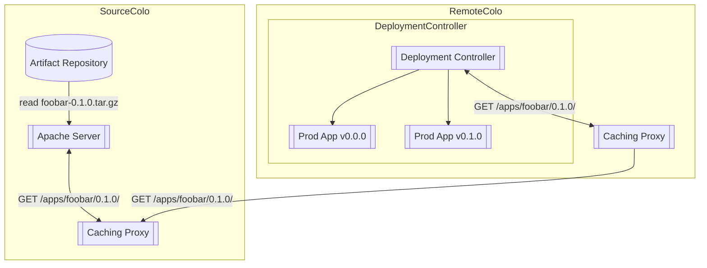
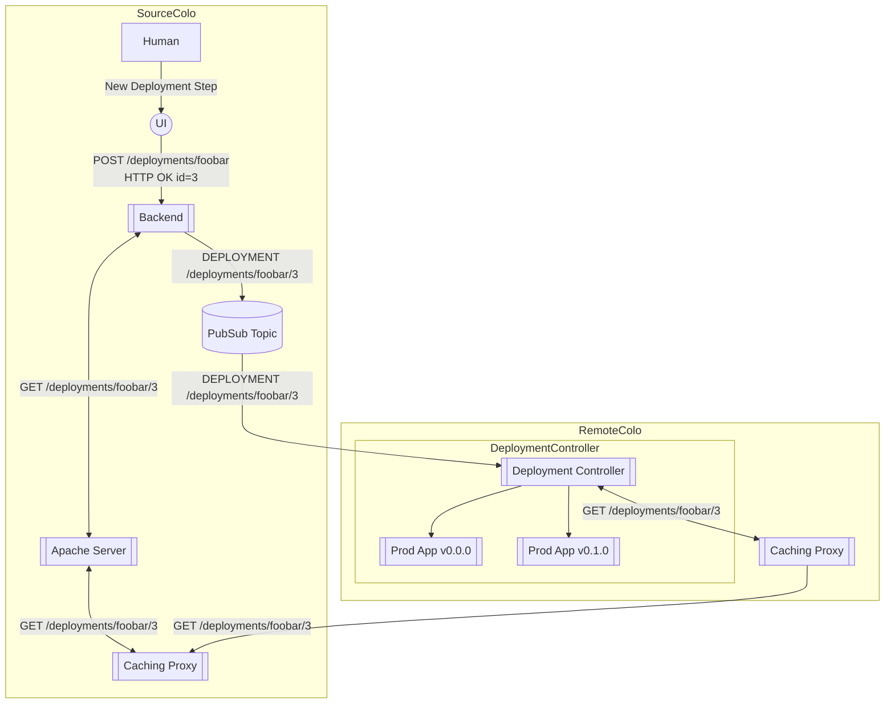

# Google Systems Design Interview With An Ex-Googler

https://www.youtube.com/watch?v=q0KGYwNbf-0

I will be taking notes of this video by Clement Mihailescu by listening to the prompts in the video and generating my own design. After I complete my design, I will listen to Clement's design and compare/contrast the differences.

<!-- more -->

## Code Deployment System

**Prompt**: I want you to design a global and fast code deployment system.

### Background

Code deployment systems are part of the CI/CD stack (and in fact, it literally _is_ the "Code Deployment" part of CI/CD). CI, or continuous integration, involves continually integrating changes to the code into some main branch. It ensures that there are no regressions introduces during these changes, and that any conflicting changes are handled in a well-defined process.

### Clarification

A clarification that Clemont asks for is what part of the code build process should we be architecting? The interviewer states that we should assume that the code has already been tested, and he wants us to build a system whereby the developers can go to a UI, click `Build` which will initiate a build process, and then `Deploy` which will deploy a specific tagged version to production servers.

### Considerations and Properties

#### Language-Specific Concerns

The artifact that gets built will have different "shapes" depending on the language in question. For example, a built artifact in Python often constitues a `.whl` file which contains a platform-specific build of the application or library, which means it will contain the compiled0`.pyc` files[^1], but also any shared libraries or other binary artifacts. We can also distribute a source distribution, which contains the raw Python source code, as well as the source for any C/C++ extensions. These source distributions often mean that there are _more_ files to distribute. 

In compiled languages like Go/C/C++, you might have one, or a small handful, or architecture-specific compiled artifacts. This means that relative to a Python source distribution, it will contain a smaller number of files of smaller total size.

Because of these considerations, our system needs to be able to handle both a small number of small files efficiently, but also a large number of medium-sized files (I'm being quite hand-wavy with the meaning of "size" here, but bear with me).

#### Do we care about Docker?

If we're in an environment that uses Docker, then the deployment bit of this question is greatly simplified. If we leave it up to the _producers_ of the artifacts (meaning the CI/CD pipelines) to generate a Docker container for us, then the deployment bit becomes a bit trivial. All we'd need to do is set up a few caching layers (probably with something like quay.io) and have our internal docker services pull from this caching layer.

That's a bit too easy though, so I'm going to assume for the purposes of this interview that we care about deploying code onto bare-metal.

#### Rollback-ability

We also want to ensure that our system is capable of rolling back deployments very quickly. This means that both the new and old vesions of the code (and preferrably, all of them) need to be easily reachable. The rollback mechanism should be controlled by some piece of metadata that lives on our production boxes, or by whatever control system that directs what . This might simply be an environment file that lives on the box that sources the right version, or a kubernetes pod, or whatever.

#### Style of rollout

There are a few different styles of rollout we could do:

1. Canary testing, whereby we deploy the new code to a small number of production servers and see if anything fails.
2. A/B testing, whereby a user will see either the A version or the B version of the deployment. We then compare the two to determine if the new version is misbehaving.
3. Parallel run, whereby a request is run through both implementations, but only one response is returned to the user. We can compare both responses to measure things like content, latency, and correctness.

For this interview, I'll adopt approach 1 as it's the simplest and arguably the most commonly used.

#### Scale

I peeked ahead a little (after I already designed my solution) and looked at some of the follow-up questions Clement asked:

1. How many regions? ~5-10
2. How many machines? Hundreds of thousands.
3. Availability? 2-3 nines (99% or 99.9%)
4. 30 minutes during entire deploy
5. 1000s of deploys per day.
6. 10GB per binary.

### Solution

Our solution needs to do two things:

1. Build the code into some artifact repository
2. Deploy the code to production

#### Source Build

#### Artifact Deployment

The deployment mechanism needs to communicate to all production nodes what version of the application should be runnning. We also need a way to distribute the artifact. We will first tackle the distribution question:

##### Artifact Distribution

We will design a system whereby the artifact is served through an HTTP endpoint. This can be as simple as a web server, like Apache, that has been told to expose some POSIX storage endpoint in our Artifact Repository. Because our endpoint should be globally available, we'll also want to have some tiered system of caching layers. It might look like this:

This architecture heavily utilizes a system of caching proxies, whereby each colocation has a pool of caching proxies that are configured to pull from some higher layer. This architecture has a few nice properties:

1. The artifact is cached at multiple layers, both in the original source colo, and at the remote colo. This means that a request only needs to be made once to the upstream source, then the rest of the colo can pull from the local copy of the data.
2. The caching proxies can be reconfigured to point to different locations, which will allow the organization to grow and change as the business needs grow/change.

[^1]: Yes, Python files do get compiled! But they get compiled into byte-code (not an executable), which is ultimately what gets read by the Python interpreter.

##### Artifact Deployment

Now that we've solved the deployment bit, we want to _tell_ the remote applications that a new version has been built and that we want them to upgrade. The way we'll do this is to expose another HTTP endpoint, called `/deployments/foobar/` (`foobar` being the name of our application) that will contain information on what things should be upgraded and how. When we update the deployment, we'll send a message to a pubsub topic that the deployment controllers will listen to that will tell it which version of the deployment to `GET`.

This diagram might look a bit involved, but it's actually quite simple. Here's the order of operations:

1. A human goes to the UI and creates a new deployment. The human specifies the application to update, the version to set the update to, and various bits of information like what percentage of machines it should be rolled out to, where it should be rolled out to, etc.
2. The UI makes a `POST` request to `/deployments/foobar` with this information to the deployment backend, and gets back the ID `3`.
3. The backend stores this deployment information in some sort of database.
4. The backend submits a message to a pubsub topic indicating that a new deployment has been created, and where it can be found.
5. The Deployment Controller receives this message and sends a `GET` request to `/deployments/foobar/3`.
6. This request falls back to a number of caching proxies all the way back to the deployment backend in the source colo.
7. The JSON containing the deployment information is returned to the deployment controller.
8. Based on the information provided, the deployment controller determines if its a target for this deployment, and if so, deploys the new version in the way specified in the JSON.

