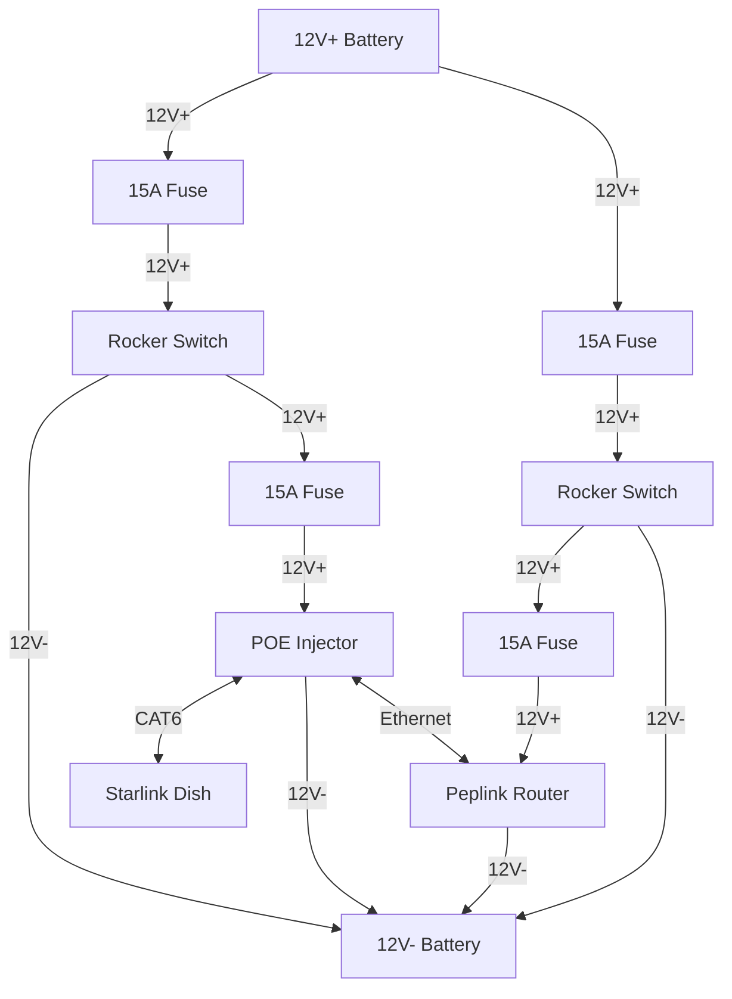

{ style="width: 100%; height: 200px; object-fit: cover; object-position: 0 60%" title="The US experienced a near nation-wide Aurora Borealis on Oct 10, 2024. I had the privilege to catch it as I was camped in Woodland Park." }

In a [previous blog post of mine](2023-06-21-intech-sol-horizon-cellular.md), I retrofitted my camper trailer with a cellular internet solution for remote work. After having over a year to gather data on the practical, real-world performance of the Peplink router, I've come to the realization that I am a huge nerd and want even more technology! In this post, I'll show you my journey with Starlink and my impressions with its usefulness as a remote-work solution.

<!-- more -->

## Background

You may be asking yourself whether Starlink is really _necessary_ for a remote working solution, to which I'm happy to proclaim a resounding _no_. I suppose I shouldn't be so dogmatic with that determination because it certainly depends on where exactly you plan on travelling. If you want to stay near civilization in any capacity, cellular internet at this point in 2024 is in almost all respects superior to anything else. It's not affected by weather (1) or trees, and it's available in nearly all locations that contain a small critical mass of people.
{ .annotate }

1. For the most part, obviously some cell towers rely on microwave relays to locations with real underground cables.

It didn't use to be this way. I remember the days when cell technology was atrocious, and getting access to a tower with decent throughput was a bit like winning a $2 lottery (and equally as satisfying. It's a quick jolt of dopamine until you realize that $2 ain't a lot of money, and you spent a lot of time trying to find that $2). With advances in signal processing and increased bandwidth sales from the FCC, cell has come a long way.

Over the last year with my Peplink solution, I found that if I was ever near any small town, or any interstate at all, I almost always had access to decent cell coverage. In the instances where I didn't have good cell coverage, 90% of those situations wouldn't have been saved by Elon's solution due to tree coverage. So you may ask, why get Starlink? I already told you, I'm a technology nerd and I like to brag to people about how cool my remote work solution is.

Jokes aside, the real reason comes from the recent product improvements Starlink has made, namely:

1. Reduction in price of their antenna.
2. Full support for internet-in-motion.
3. Data plans tailored specifically to RVers. Their mobile plans offer unlimited data and the ability to pause and restart your plan at will. This is the killer feature that I was awaiting because being tied to inflexible billing schemes or plans that require stationary antennas were all non-starters.
4. Increased reliability with the ongoing additions to their constellation.

## What's Included

When you buy the Starlink antenna, it comes with three components:

1. The antenna itself
2. A WiFi router
3. An AC-DC adapter

- {data-gallery="all"}
- {data-gallery="all"}

Any semi-experienced RVer will immediately balk at the idea of running an ACDC adapter due to the fact that the DC battery from the RV has to be inverted to 60Hz AC, then converted back to DC by the adapter. You might also balk at the idea of running a separate router when we already have our Peplink Cellular modem/router! Not to fear, as a quick search on the internet shows that technically speaking, the Starlink antenna does not _need_ these two components to operate.

There exist third-party Starlink PoE conversion kits that are powered by 12V DC and will step up to 50V DC required by the antenna. The "ethernet" cable that the antenna uses is a proprietary form factor despite having the same number of wiring pins as ethernet. These conversion kits will bridge the gap between the Starlink ethernet, which requires the 50V PoE line, and the standard ethernet that you can send directly to your router. The other benefit is that it cuts out the Starlink-specific router which further aids in power efficiency.

An example: https://www.amazon.com/XLTTYWL-Starlink-Protection-Conversion-Converter/dp/B0D4DH9TDN/ref=sr_1_1_sspa?crid=3MSWDXF0OT12S&dib=eyJ2IjoiMSJ9.qP1_Af53E-CvdtPv7Z8Ofgdi-WmGsrNUh_pUqCU7mqM0kg8eZHiREHnkRnKASukvw53-zE8QEdZO6suABv0KcHQfiospY-KimIqMMPnpQbNk5K_vh80IUghh1iwSzbiQcKmUpalRPqlGA16_wXySqkvt3eF_s-pXVME5gYX7Z61T9Rgdj0WD-E69bUHeRGb-Nd1BDfqmMsqpqLw6JJXGCyLvUgLKZRXsSs1KrRBXsITz7TCcLh7Mjng6T_IEG8nM4wyL9_NQabBKBn7Mygp1wjrQd02OEE3Kvdvs1Af6LkE.vc0XT6Ve0TMX39b01i6X0JvnvOz-mPwDYB2KpDLSJfA&dib_tag=se&keywords=starlink+gen+3+dc+conversion+kit&qid=1728328253&s=electronics&sprefix=starlink+gen+3+dc+conversion+ki%2Celectronics%2C171&sr=1-1-spons&sp_csd=d2lkZ2V0TmFtZT1zcF9hdGY&psc=1

For my proof-of-concept build, I will just use all the standard Starlink equipment and optimize it with a conversion kit at a later date.

## Setup

The setup was surprisingly simple. I downloaded the Starlink app and it took me through a series of setup tasks. After having plugged in the ACDC converter, the router, and the antenna together, the system for the most part set itself up. The antenna determines what cardinal direction it's pointing and will inform you that it prefers to point north. I found this wasn't strictly necessary and was in fact ill-advised because to my north-east was a large oak tree. After pointing the antenna directly north as instructed, the reliability and throughput tanked to an almost unusable level.

- {data-gallery="all"}
- {data-gallery="all"}

The obstruction visualization had me scan the sky with my phone's camera. I'm assuming it does some rudimentary "blue pixels good, anything else bad" algorithm where it determined the tree to be disruptive. The app also gives fairly detailed metrics into things like power draw, ping success rate, latency, throughput, and outage timelines.

## Performance

### An Unfair Situation

- {data-gallery="all"}
- {data-gallery="all"}
- {data-gallery="all"}

I spent a night in the Middle of Nowhere Nebraska and ran a few tests. The campsite I was at had a large oak tree that obscured about half of the sky, so we can consider this rather unfair, although informative of what we can expect in non-ideal situations.

The first test was a simple speed test in the middle of the night, where I was able to pull 147 Mbps down. The next speed test I took was at around 2:30PM the following day where I got 41Mbps down/28Mbps up. While that's over three times slower than the middle of the night, it's still fast enough for most activities.

Ping success rate, for my purposes, is the most important metric. I was able to get around 90% success rate in the middle of the day which is going to be an issue for realtime workloads like video calls or gaming.

#### Video Calls

I tested Starlink in a video call with about 20 participants. It performed fine for the most part but it would drop about every 10 minutes for sometimes longer than 15s. The Big Oak Tree (BOT for short) almost certainly is playing into this droppiness. It happened frequently enough to be distracting, and if I had been talking in this call, it would have been disruptive to the natural flow of communication and probably pretty annoying to the other participants.

The performance in this scenario is poor enough that I can't say I would rely solely on Starlink for video calls. I would want to switch to a cell connection if it's available.

### A Fair Situation

- {data-gallery="all"}
- {data-gallery="all"}
- {data-gallery="all"}

Another campgroud I stayed at had a much clearer view of the sky. It was dotted with some trees but overall it gave a fairly unobstructed view for starlink. I placed the dish on the top of the trailer and ran the same tests as above. I was able to achieve similar throughput, but in this case I obtained 99.8% reliability. That's pretty remarkable and is approaching an acceptable level for basically all workloads.

#### Video Calls

Video calls in this situation was pretty much seamless. I was able to communicate with fairly little interruptions, and it was nearly impossible to tell that I was using satellite internet!

## Installation

### Roof Mount

The Starlink mobility mount comes with 4 M8-1.25 35mm bolts. I drilled 4 8mm holes in the roof using the mount as a template (Starlink suggests 10mm but this wasn't necessary, the 8mm hole was big enough). It turns out that the provided bolts were too small, so I went to Home Depot and got some M8-1.25 40mm bolts. You can see the result below:

- .jpg){data-gallery="all"}
- {data-gallery="all"}
- {data-gallery="all"}
- {data-gallery="all"}
- {data-gallery="all"}

!!! danger

    Do NOT use 3M adhesive tape for the mount. The forces experienced by the dish when driving are too strong for any tape to properly hold it down. You MUST bolt or screw this mount on, there is no other option (ask me how I know 😬)

Once the bolts were secured to the roof, I applied a liberal amount of Dicor Self-Leveling Sealant around the edges and top of the mount. The mount feels _extremely_ sturdy and I was able to apply around 50 lbs of upward force without any noticable movement.

### Roof Cabling

For the cabling, I followed the same strategy I employed when I did my Peplink cellular install. I didn't take pictures of this process because it's identical to what I've already done. Here are the pictures from that blog post:

- {data-gallery="all"}
- {data-gallery="all"}
- {data-gallery="all"}
- {data-gallery="all"}
- {data-gallery="all"}
- {data-gallery="all"}
- {data-gallery="all"}

The only difference this time is that I drilled 1" holes in the wall next to the shower and used 3/4" rubber grommets around the holes to protect the cables from the sharp edges. I realized my mistake of not using grommets for the Peplink install almost immediately after I was done, so I took the opportunity to fix those cables as well.

- {data-gallery="all"}
- {data-gallery="all"}
- {data-gallery="all"}

### Interior Mounting

I drilled a hole next to the fuse box and routed the Starlink cable through it. My temporary setup using all of the Starlink-provided hardware looks something like this:

<figure markdown="span">
{ width="400" data-gallery="all" }
</figure>

To save battery, you don't want to be using the provided router and power supply due to the need to convert the AC current (which has itself been inverted from the DC battery supply) back into DC. In my case, I didn't need the router anyway because I already had one. So I bought a [Starlink v3 POE Injector](https://www.amazon.com/MSAFF-Starlink-PoE-Injector-Compatible/dp/B0D4DH9Y2N/ref=sr_1_1_sspa?dib=eyJ2IjoiMSJ9.Z6qSvfjBa8EYd9KHAdycRzcC6CdRxNxhCbj0RNrGcA39ntkvfgIVknH6ZUU5zDNYW09dqQFVfNSXJKITZwvrpXW-chzS3A8Nbny_7dXJCLSxYiSsfiD8JU_mbhGXQELUIprJwRWWe5BgrQUBqpwu6c36zKMBHHJGudyLonhS4xoJJrtOHjnUXJ_d9apIh-qkDZXX1utn1RbUsgSEVUMSSyXAUIZ5gJu_NvaEPsI4gVs.rXWssahXEcBrSI1ir_E1Oq7PCzv1fT2tM0QPv0HKWHE&dib_tag=se&hvadid=707411643986&hvdev=c&hvlocphy=9222890&hvnetw=g&hvqmt=e&hvrand=5113051804189032344&hvtargid=kwd-2335877465691&hydadcr=24144_13516741&keywords=starlink+gen+3+poe+injector&qid=1731887694&sr=8-1-spons&sp_csd=d2lkZ2V0TmFtZT1zcF9hdGY&psc=1) that takes 12V DC as input and supplies the dish with the higher voltage it needs to operate. This voltage is sent over the provided Starlink ethernet cable, thus the "Power Over Ethernet" (POE).

The POE injector has two other ports: one vanilla ethernet port that I'll plug into my Peplink router, and the other Starlink cable port that will be plugged into the dish.

### Electrical Routing

Both my Peplink router and the POE injector need a reliable source of 12V DC. I also wanted to install toggle two switches so I could toggle the power to the POE injector and the Peplink router independently (for example, in situations where cell service is sufficient. Cell radios only use about 5 watts, versus Starlink which uses around 50 watts).

The wiring flowchart isn't too complicated. It consists of two mirrored parts, one for the POE and another for the router: (1)
{ .annotate }

1. Technically, the router was already wired up but I didn't have it connected to a switch, so this project was an excuse to do that.

Basically, the rocker switch will gate the flow of electrons towards the positive terminal of the POE injector. The switch also has an LED indication light, so it needs a direct negative connection to the battery. The first picture below shows the terminus for the 12V+, located on the main DC cutoff switch. The negative terminal in the second picture is a bus bar that should have a few open slots.

- {data-gallery="all"}
- {data-gallery="all"}

Using standard 14AWG wiring and crimp connectors, I connected the pieces together. The pictures below show the rocker switch up close and what they look like after being installed.

- {data-gallery="all"}
- {data-gallery="all"}
- {data-gallery="all"}
- {data-gallery="all"}

And voila! It worked liked a charm! I waited for Starlink to boot up and amazingly it just... kind of worked? You might notice in an install like this that the Starlink app doesn't work anymore. This is because it needs a static route configured in the router:

- Network: 192.168.100.0
- Subnet Mask: 255.255.255.0 (1)
- Destination NIC: Ethernet port you plugged into the router.

1. Gateway `192.168.100.1` is implied.

It looks roughly like this:

{ style="width: 50%;" data-gallery="all" }

While this is close to the right configuration, I couldn't quite get the Starlink app to detect the dish on the local network. However after waiting a few minutes, the router successfully gained an internet connection and the app was able to give me diagnostic information about the dish through the internet (I'm guessing).

### Performance

I measured the power draw and the bandwidth performance of this new setup. With both the router and the dish turned on (and all other components in the RV turned off), I measured about 50 watts of draw steady state. The throughput was about as expected for Starlink: 103Mbps/16.5Mbps.

- {data-gallery="all"}
- {data-gallery="all"}
- {data-gallery="all"}

## Conclusion

While this post may lend to the idea that such a permanent Starlink install was easy, it was the distillation of many hours of failures and setbacks. Most notably, I had a separate install where I foolishly thought that using VHB tape to adhere the mount to the roof would be sufficient, but I was woefully wrong. It lasted most of my prior trip out west, but on the last leg of the trip, it was mysteriously absent from my roof. So somewhere out west, it's lying on the side of the road and hopefully didn't damage anyone's property. Yikes. After that incident, I decided to drill into the roof so that it was essentially impossible for it to happen again, and that is what you see here.

At this point, I have no further ambitions to improve my mobile data setup. This is a behemoth of remote work. Consider the fact that I now have 2 independent cellular WANs along with Starlink: the Peplink router gives me the flexibility to efficiently switch between the WANs depending on the physical constraints of wherever I am. Furthermore, I could choose to use Peplink's Speed Fusion Cloud product that will multiplex the packets across all the WANs, arbitrate and reconstitute them in a cloud datacenter, and send it off to the final destination. Such technology gives you truly seamless and effortless failover in the case one or more of your WANs suffers a degredation.

Speed Fusion Cloud does not receive as much attention as it deserves. It relies on a principle I grew familiar with during my time working as a backend engineer for a high frequency trading firm, i.e. duplicating packets across multiple paths and arbitrating them at the landing site. This was used to send packets between exchanges mainly through two routes: a fiber optic line (higher latency but reliable) and a microwave line (low latency but unreliable). This same principle is directly applicable to cellular and satellite WANs.

Anyway, let me know your thoughts in the comments below. Thanks!