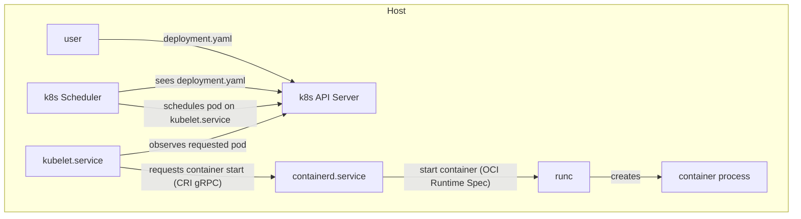
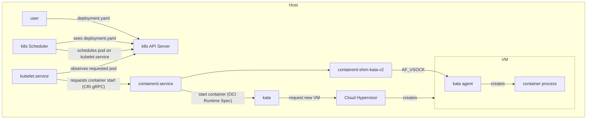

This post explores my experiences with installing a k8s cluster, managing it, and setting up a multi-tenant containers-as-a-service environment.

<!-- more -->

## Installing k8s

For this MVP setup, we will use a single GPU node. Fortunately I work at a company where getting access to large GPU servers isn't too difficult.

We follow the instructions at https://kubernetes.io/docs/setup/production-environment/tools/kubeadm/install-kubeadm/.

We see the kubelet is crashlooping as expected, as it hasn't received instructions from kubeadm yet:

```
# systemctl status kubelet
● kubelet.service - kubelet: The Kubernetes Node Agent
     Loaded: loaded (/lib/systemd/system/kubelet.service; enabled; vendor preset: enabled)
    Drop-In: /usr/lib/systemd/system/kubelet.service.d
             └─10-kubeadm.conf
     Active: activating (auto-restart) (Result: exit-code) since Wed 2025-07-30 18:21:41 UTC; 1s ago
       Docs: https://kubernetes.io/docs/
    Process: 2249230 ExecStart=/usr/bin/kubelet $KUBELET_KUBECONFIG_ARGS $KUBELET_CONFIG_ARGS $KUBELET_KUBEADM_ARGS $KUBELET_EXTRA_ARGS (code=exited, status=1/FAILURE)
   Main PID: 2249230 (code=exited, status=1/FAILURE)
```


## Configuring the container runtime

My hypervisor already has docker configured. You can see I have a leftover nats cluster:

```
# docker container ls
CONTAINER ID   IMAGE     COMMAND                  CREATED        STATUS        PORTS                                                                    NAMES
3d5c452fa47b   nats      "/nats-server --clus…"   2 months ago   Up 2 months   4222/tcp, 6222/tcp, 8222/tcp                                             docker-nats-2-1
6f5b78b90ff8   nats      "/nats-server --clus…"   2 months ago   Up 2 months   4222/tcp, 6222/tcp, 8222/tcp                                             docker-nats-1-1
ba97e9fa833b   nats      "/nats-server --clus…"   2 months ago   Up 2 months   0.0.0.0:4222->4222/tcp, 0.0.0.0:6222->6222/tcp, 0.0.0.0:8222->8222/tcp   docker-nats-1
```

### Enabling IPv4 packet forwarding

We need to allow the kernel to forward IPv4 packets between interfaces. Technically speaking, this is only needed in multi-node environments, but it's worth mentioning anyway:

```
# sysctl params required by setup, params persist across reboots
cat <<EOF | sudo tee /etc/sysctl.d/k8s.conf
net.ipv4.ip_forward = 1
EOF

# Apply sysctl params without reboot
sudo sysctl --system
```

The setting has been enabled:

```
# sysctl net.ipv4.ip_forward
net.ipv4.ip_forward = 1
```

### Configuring cgroup drivers

https://kubernetes.io/docs/setup/production-environment/container-runtimes/

Control groups are a Linux kernel feature that allow you to segment and isolate many parts of a system's resources. There are two main cgroup drivers k8s can use: the `cgroupfs` driver (enabled by default) and the recommended systemd cgroup driver. The `cgroupfs` driver, as the name suggests, interacts directly with the cgroup filesyste at `/sys/fs/cgroup`:

```
# ls /sys/fs/cgroup
blkio  cpu  cpu,cpuacct  cpuacct  cpuset  devices  freezer  hugetlb  memory  net_cls  net_cls,net_prio  net_prio  perf_event  pids  rdma  systemd  unified
```

My system has both cgroup v1 and v2 installed:

```
# mount | grep cgroup
tmpfs on /sys/fs/cgroup type tmpfs (ro,nosuid,nodev,noexec,mode=755)
cgroup2 on /sys/fs/cgroup/unified type cgroup2 (rw,nosuid,nodev,noexec,relatime,nsdelegate)
cgroup on /sys/fs/cgroup/systemd type cgroup (rw,nosuid,nodev,noexec,relatime,xattr,name=systemd)
cgroup on /sys/fs/cgroup/net_cls,net_prio type cgroup (rw,nosuid,nodev,noexec,relatime,net_cls,net_prio)
cgroup on /sys/fs/cgroup/cpu,cpuacct type cgroup (rw,nosuid,nodev,noexec,relatime,cpu,cpuacct)
cgroup on /sys/fs/cgroup/pids type cgroup (rw,nosuid,nodev,noexec,relatime,pids)
cgroup on /sys/fs/cgroup/perf_event type cgroup (rw,nosuid,nodev,noexec,relatime,perf_event)
cgroup on /sys/fs/cgroup/blkio type cgroup (rw,nosuid,nodev,noexec,relatime,blkio)
cgroup on /sys/fs/cgroup/freezer type cgroup (rw,nosuid,nodev,noexec,relatime,freezer)
cgroup on /sys/fs/cgroup/memory type cgroup (rw,nosuid,nodev,noexec,relatime,memory)
cgroup on /sys/fs/cgroup/cpuset type cgroup (rw,nosuid,nodev,noexec,relatime,cpuset)
cgroup on /sys/fs/cgroup/rdma type cgroup (rw,nosuid,nodev,noexec,relatime,rdma)
cgroup on /sys/fs/cgroup/devices type cgroup (rw,nosuid,nodev,noexec,relatime,devices)
cgroup on /sys/fs/cgroup/hugetlb type cgroup (rw,nosuid,nodev,noexec,relatime,hugetlb)
```

!!! quote 

    The cgroupfs driver is not recommended when systemd is the init system because systemd expects a single cgroup manager on the system. Additionally, if you use cgroup v2, use the systemd cgroup driver instead of cgroupfs.

We use systemd as the init system so we should follow their recommendation to use the systemd cgroup driver. They recommend the following yaml:

```yaml
apiVersion: kubelet.config.k8s.io/v1beta1
kind: KubeletConfiguration
...
cgroupDriver: systemd
```

We can see it has been configured to load a config file from this location:

```
# systemctl cat kubelet |& grep KUBELET_CONFIG_ARGS
Environment="KUBELET_CONFIG_ARGS=--config=/var/lib/kubelet/config.yaml"
```

We write:

```yaml
apiVersion: kubelet.config.k8s.io/v1beta1
kind: KubeletConfiguration
address: "10.254.192.244"
port: 20250
serializeImagePulls: false
cgroupDriver: systemd
evictionHard:
    memory.available:  "100Mi"
    nodefs.available:  "10%"
    nodefs.inodesFree: "5%"
    imagefs.available: "15%"
    imagefs.inodesFree: "5%"
```

To this file. The IP address used is the IP of the default interface as defined by `ip r s`.

## Create the k8s cluster

```
# kubeadm init
[init] Using Kubernetes version: v1.33.3
[preflight] Running pre-flight checks
W0730 18:44:39.635425 2257977 checks.go:1065] [preflight] WARNING: Couldn't create the interface used for talking to the container runtime: failed to create new CRI runtime service: validate service connection: validate CRI v1 runtime API for endpoint "unix:///var/run/containerd/containerd.sock": rpc error: code = Unimplemented desc = unknown service runtime.v1.RuntimeService
        [WARNING SystemVerification]: cgroups v1 support is in maintenance mode, please migrate to cgroups v2
[preflight] Pulling images required for setting up a Kubernetes cluster
[preflight] This might take a minute or two, depending on the speed of your internet connection
[preflight] You can also perform this action beforehand using 'kubeadm config images pull'
error execution phase preflight: [preflight] Some fatal errors occurred:
failed to create new CRI runtime service: validate service connection: validate CRI v1 runtime API for endpoint "unix:///var/run/containerd/containerd.sock": rpc error: code = Unimplemented desc = unknown service runtime.v1.RuntimeService[preflight] If you know what you are doing, you can make a check non-fatal with `--ignore-preflight-errors=...`
To see the stack trace of this error execute with --v=5 or higher
```

### What is containerd?

https://www.docker.com/blog/containerd-vs-docker/


containerd is the container runtime environment. It interacts directly with your host operating system. Docker is an abstraction layer that sits on top of containerd and it provides additional concepts like volumes, image management (i.e. downloading and caching images from dockerhub), networking etc.

### containerd CRI Plugin

It appears the container runtime is not configured correctly. We look at the containerd CLI enabled plugins:

```
# ctr plugins ls
TYPE                                   ID                       PLATFORMS      STATUS    
io.containerd.snapshotter.v1           aufs                     linux/amd64    skip      
io.containerd.event.v1                 exchange                 -              ok        
io.containerd.internal.v1              opt                      -              ok        
io.containerd.warning.v1               deprecations             -              ok        
io.containerd.snapshotter.v1           blockfile                linux/amd64    skip      
io.containerd.snapshotter.v1           btrfs                    linux/amd64    skip      
...
```

If we look at the containerd config, we see something interesting:

```
# cat !$
cat /etc/containerd/config.toml
#   Copyright 2018-2022 Docker Inc.

#   Licensed under the Apache License, Version 2.0 (the "License");
#   you may not use this file except in compliance with the License.
#   You may obtain a copy of the License at

#       http://www.apache.org/licenses/LICENSE-2.0

#   Unless required by applicable law or agreed to in writing, software
#   distributed under the License is distributed on an "AS IS" BASIS,
#   WITHOUT WARRANTIES OR CONDITIONS OF ANY KIND, either express or implied.
#   See the License for the specific language governing permissions and
#   limitations under the License.

disabled_plugins = ["cri"]
```

The CRI plugin is the Containers Runtime Interface, a gRPC API that kubernetes uses to talk to containerd. It seems obvious that we should comment out this line and restart containerd.

```
# systemctl restart containerd
# systemctl status containerd
● containerd.service - containerd container runtime
     Loaded: loaded (/lib/systemd/system/containerd.service; enabled; vendor preset: enabled)
     Active: active (running) since Wed 2025-07-30 19:01:25 UTC; 1s ago
```

We try kubeadm init again:

```
# kubeadm init --config ./kubeadm.yaml 
W0730 19:01:56.158637 2266197 common.go:101] your configuration file uses a deprecated API spec: "kubeadm.k8s.io/v1beta3" (kind: "ClusterConfiguration"). Please use 'kubeadm config migrate --old-config old-config-file --new-config new-config-file', which will write the new, similar spec using a newer API version.
W0730 19:01:56.158889 2266197 initconfiguration.go:333] error unmarshaling configuration schema.GroupVersionKind{Group:"kubeadm.k8s.io", Version:"v1beta3", Kind:"ClusterConfiguration"}: strict decoding error: unknown field "localAPIEndpoint"
[init] Using Kubernetes version: v1.32.0
[preflight] Running pre-flight checks
        [WARNING SystemVerification]: cgroups v1 support is in maintenance mode, please migrate to cgroups v2
error execution phase preflight: [preflight] Some fatal errors occurred:
        [ERROR KubeletVersion]: the kubelet version is higher than the control plane version. This is not a supported version skew and may lead to a malfunctional cluster. Kubelet version: "1.33.3" Control plane version: "1.32.0"
[preflight] If you know what you are doing, you can make a check non-fatal with `--ignore-preflight-errors=...`
To see the stack trace of this error execute with --v=5 or higher
```

### Config Schema Issue

We don't get the gRPC error this time. Great! But let's fix the config schema.

```diff
# diff kubeadm.yaml kubeadm-new.yaml 
1,4c1,30
< apiVersion: kubeadm.k8s.io/v1beta3
< kind: ClusterConfiguration
< kubernetesVersion: v1.32.0
< controlPlaneEndpoint: "10.254.192.244:6443"
---
> apiVersion: kubeadm.k8s.io/v1beta4
> bootstrapTokens:
> - groups:
>   - system:bootstrappers:kubeadm:default-node-token
>   token: hw4taj.tacc97bn9dm2rdhz
>   ttl: 24h0m0s
>   usages:
>   - signing
>   - authentication
> kind: InitConfiguration
> localAPIEndpoint:
>   advertiseAddress: 10.254.192.244
>   bindPort: 6443
> nodeRegistration:
>   criSocket: unix:///var/run/containerd/containerd.sock
>   imagePullPolicy: IfNotPresent
>   imagePullSerial: true
>   name: inst-5c3dw-san-jose-dev-a10-hypervisors-pool
>   taints:
>   - effect: NoSchedule
>     key: node-role.kubernetes.io/control-plane
> timeouts:
>   controlPlaneComponentHealthCheck: 4m0s
>   discovery: 5m0s
>   etcdAPICall: 2m0s
>   kubeletHealthCheck: 4m0s
>   kubernetesAPICall: 1m0s
>   tlsBootstrap: 5m0s
>   upgradeManifests: 5m0s
> ---
7c33,48
<     - "10.254.192.244"
---
>   - 10.254.192.244
> apiVersion: kubeadm.k8s.io/v1beta4
> caCertificateValidityPeriod: 87600h0m0s
> certificateValidityPeriod: 8760h0m0s
> certificatesDir: /etc/kubernetes/pki
> clusterName: kubernetes
> controlPlaneEndpoint: 10.254.192.244:6443
> controllerManager: {}
> dns: {}
> encryptionAlgorithm: RSA-2048
> etcd:
>   local:
>     dataDir: /var/lib/etcd
> imageRepository: registry.k8s.io
> kind: ClusterConfiguration
> kubernetesVersion: v1.32.0
9,10c50,54
<   podSubnet: "10.254.192.244/24"
<   serviceSubnet: "10.254.192.244/24"
---
>   dnsDomain: cluster.local
>   podSubnet: 10.254.192.244/24
>   serviceSubnet: 10.254.192.244/24
> proxy: {}
> scheduler: {}
# mv kubeadm-new.yaml kubeadm.yaml 
```

There are a few more bugs to work out:

```
# kubeadm init --config ./kubeadm.yaml 
[init] Using Kubernetes version: v1.32.0
[preflight] Running pre-flight checks
        [WARNING SystemVerification]: cgroups v1 support is in maintenance mode, please migrate to cgroups v2
error execution phase preflight: [preflight] Some fatal errors occurred:
        [ERROR KubeletVersion]: the kubelet version is higher than the control plane version. This is not a supported version skew and may lead to a malfunctional cluster. Kubelet version: "1.33.3" Control plane version: "1.32.0"
[preflight] If you know what you are doing, you can make a check non-fatal with `--ignore-preflight-errors=...`
To see the stack trace of this error execute with --v=5 or higher
```

### cgroupv2 issue

The kernel is indeed using cgroups v2:

```
# mount | grep cgroup2
cgroup2 on /sys/fs/cgroup/unified type cgroup2 (rw,nosuid,nodev,noexec,relatime,nsdelegate)
```

I suspect that kubeadm is looking at the old cgroups v1 directory at `/sys/fs/cgroup`, not the `unified` subpath. After a minor bit of searching, it appears we need to reconfigure the kernel to only expose the cgroup v2 interface. Kubeadm/kubelet don't appear to have a way to override the path they use when finding the cgroupfs. Enabling cgroup v2 is a kernel commandline parameter, so we must do this:

```text title="/etc/default/grub"
GRUB_CMDLINE_LINUX="systemd.unified_cgroup_hierarchy=1 cgroup_no_v1=all"
```

Then update grub:

```
# update-grub
Sourcing file `/etc/default/grub'
Sourcing file `/etc/default/grub.d/50-cloudimg-settings.cfg'
Sourcing file `/etc/default/grub.d/99-lambda.cfg'
Sourcing file `/etc/default/grub.d/init-select.cfg'
Generating grub configuration file ...
Found linux image: /boot/vmlinuz-5.14.15-custom
Found initrd image: /boot/initrd.img-5.14.15-custom
Adding boot menu entry for UEFI Firmware Settings
done
```

Then reboot the system:

```
# reboot
```

After it comes back, we see that only cgroups v2 is mounted:

```
# mount |& grep cgroup
cgroup2 on /sys/fs/cgroup type cgroup2 (rw,nosuid,nodev,noexec,relatime,nsdelegate)
```

Now that warning is gone:

```
# kubeadm init --config ./kubeadm.yaml 
[init] Using Kubernetes version: v1.32.0
[preflight] Running pre-flight checks
error execution phase preflight: [preflight] Some fatal errors occurred:
        [ERROR KubeletVersion]: the kubelet version is higher than the control plane version. This is not a supported version skew and may lead to a malfunctional cluster. Kubelet version: "1.33.3" Control plane version: "1.32.0"
[preflight] If you know what you are doing, you can make a check non-fatal with `--ignore-preflight-errors=...`
To see the stack trace of this error execute with --v=5 or higher
```

To fix the version error, I just needed to change this line:

```
# grep kubernetesVersion kubeadm.yaml 
kubernetesVersion: v1.33.3
```

We should also first ensure that containerd is configured to use systemd cgroups.

```toml title="/etc/containerd/config.toml"
[plugins."io.containerd.grpc.v1.cri".containerd.runtimes.runc.options]
  SystemdCgroup = true
```

We run it again and success!

```
root@inst-5c3dw-san-jose-dev-a10-hypervisors-pool:/home/ubuntu/lclipp/caas-experiment/k8s# kubeadm init --config ./kubeadm.yaml                                                                                                                                                                                                                                                                                                                                                                       
[init] Using Kubernetes version: v1.33.3
[preflight] Running pre-flight checks
[preflight] Pulling images required for setting up a Kubernetes cluster
[preflight] This might take a minute or two, depending on the speed of your internet connection
[preflight] You can also perform this action beforehand using 'kubeadm config images pull'
W0811 19:08:42.537308 2920198 checks.go:846] detected that the sandbox image "registry.k8s.io/pause:3.8" of the container runtime is inconsistent with that used by kubeadm.It is recommended to use "registry.k8s.io/pause:3.10" as the CRI sandbox image.
[certs] Using certificateDir folder "/etc/kubernetes/pki"
[certs] Generating "ca" certificate and key
[certs] Generating "apiserver" certificate and key
[certs] apiserver serving cert is signed for DNS names [inst-5c3dw-san-jose-dev-a10-hypervisors-pool kubernetes kubernetes.default kubernetes.default.svc kubernetes.default.svc.cluster.local] and IPs [10.254.192.1 10.254.192.244]
[certs] Generating "apiserver-kubelet-client" certificate and key
[certs] Generating "front-proxy-ca" certificate and key
[certs] Generating "front-proxy-client" certificate and key
[certs] Generating "etcd/ca" certificate and key
[certs] Generating "etcd/server" certificate and key
[certs] etcd/server serving cert is signed for DNS names [inst-5c3dw-san-jose-dev-a10-hypervisors-pool localhost] and IPs [10.254.192.244 127.0.0.1 ::1]
[certs] Generating "etcd/peer" certificate and key
[certs] etcd/peer serving cert is signed for DNS names [inst-5c3dw-san-jose-dev-a10-hypervisors-pool localhost] and IPs [10.254.192.244 127.0.0.1 ::1]
[certs] Generating "etcd/healthcheck-client" certificate and key
[certs] Generating "apiserver-etcd-client" certificate and key
[certs] Generating "sa" key and public key
[kubeconfig] Using kubeconfig folder "/etc/kubernetes"
[kubeconfig] Writing "admin.conf" kubeconfig file
[kubeconfig] Writing "super-admin.conf" kubeconfig file
[kubeconfig] Writing "kubelet.conf" kubeconfig file
[kubeconfig] Writing "controller-manager.conf" kubeconfig file
[kubeconfig] Writing "scheduler.conf" kubeconfig file
[etcd] Creating static Pod manifest for local etcd in "/etc/kubernetes/manifests"
[control-plane] Using manifest folder "/etc/kubernetes/manifests"
[control-plane] Creating static Pod manifest for "kube-apiserver"
[control-plane] Creating static Pod manifest for "kube-controller-manager"
[control-plane] Creating static Pod manifest for "kube-scheduler"
[kubelet-start] Writing kubelet environment file with flags to file "/var/lib/kubelet/kubeadm-flags.env"
[kubelet-start] Writing kubelet configuration to file "/var/lib/kubelet/config.yaml"
[kubelet-start] Starting the kubelet
[wait-control-plane] Waiting for the kubelet to boot up the control plane as static Pods from directory "/etc/kubernetes/manifests"
[kubelet-check] Waiting for a healthy kubelet at http://127.0.0.1:10248/healthz. This can take up to 4m0s
[kubelet-check] The kubelet is healthy after 501.697456ms
[control-plane-check] Waiting for healthy control plane components. This can take up to 4m0s
[control-plane-check] Checking kube-apiserver at https://10.254.192.244:6443/livez
[control-plane-check] Checking kube-controller-manager at https://127.0.0.1:10257/healthz
[control-plane-check] Checking kube-scheduler at https://127.0.0.1:10259/livez
[control-plane-check] kube-controller-manager is healthy after 1.503343452s
[control-plane-check] kube-scheduler is healthy after 2.132928007s
[control-plane-check] kube-apiserver is healthy after 3.501665962s
[upload-config] Storing the configuration used in ConfigMap "kubeadm-config" in the "kube-system" Namespace
[kubelet] Creating a ConfigMap "kubelet-config" in namespace kube-system with the configuration for the kubelets in the cluster
[upload-certs] Skipping phase. Please see --upload-certs
[mark-control-plane] Marking the node inst-5c3dw-san-jose-dev-a10-hypervisors-pool as control-plane by adding the labels: [node-role.kubernetes.io/control-plane node.kubernetes.io/exclude-from-external-load-balancers]
[mark-control-plane] Marking the node inst-5c3dw-san-jose-dev-a10-hypervisors-pool as control-plane by adding the taints [node-role.kubernetes.io/control-plane:NoSchedule]
[bootstrap-token] Using token: hw4taj.tacc97bn9dm2rdhz
[bootstrap-token] Configuring bootstrap tokens, cluster-info ConfigMap, RBAC Roles
[bootstrap-token] Configured RBAC rules to allow Node Bootstrap tokens to get nodes
[bootstrap-token] Configured RBAC rules to allow Node Bootstrap tokens to post CSRs in order for nodes to get long term certificate credentials
[bootstrap-token] Configured RBAC rules to allow the csrapprover controller automatically approve CSRs from a Node Bootstrap Token
[bootstrap-token] Configured RBAC rules to allow certificate rotation for all node client certificates in the cluster
[bootstrap-token] Creating the "cluster-info" ConfigMap in the "kube-public" namespace
[kubelet-finalize] Updating "/etc/kubernetes/kubelet.conf" to point to a rotatable kubelet client certificate and key
[addons] Applied essential addon: CoreDNS
^[[C[addons] Applied essential addon: kube-proxy

Your Kubernetes control-plane has initialized successfully!

To start using your cluster, you need to run the following as a regular user:

  mkdir -p $HOME/.kube
  sudo cp -i /etc/kubernetes/admin.conf $HOME/.kube/config
  sudo chown $(id -u):$(id -g) $HOME/.kube/config

Alternatively, if you are the root user, you can run:

  export KUBECONFIG=/etc/kubernetes/admin.conf

You should now deploy a pod network to the cluster.
Run "kubectl apply -f [podnetwork].yaml" with one of the options listed at:
  https://kubernetes.io/docs/concepts/cluster-administration/addons/

You can now join any number of control-plane nodes by copying certificate authorities
and service account keys on each node and then running the following as root:

  kubeadm join 10.254.192.244:6443 --token hw4taj.tacc97bn9dm2rdhz \
        --discovery-token-ca-cert-hash sha256:d9d4815435bb0ca3b618d79a829546884a604345101833f63a03e676754edc30 \
        --control-plane 

Then you can join any number of worker nodes by running the following on each as root:

kubeadm join 10.254.192.244:6443 --token hw4taj.tacc97bn9dm2rdhz \
        --discovery-token-ca-cert-hash sha256:d9d4815435bb0ca3b618d79a829546884a604345101833f63a03e676754edc30 
```

### Check kubelet.service

It appears it's not able to contact the API server (which is supposed to run on the same node):

```
E0730 21:01:10.126250   11574 kubelet_node_status.go:548] "Error updating node status, will retry" err="error getting node \"inst-5c3dw-san-jose-dev-a10-hypervisors-pool\": Get \"https://10.254.192.244:6443/api/v1/nodes/inst-5c3dw-san-jose-dev-a10-hypervisors-pool?timeout=10s\": dial tcp 10.254.192.244:6443: connect: conn>
```

We can use a tool called `crictl` that is a runtime-agnostic replacement for docker ps, docker logs etc, but designed specifically for Kubernetes.(1)
{ .annotate }

1. Why does it exist? Kubernetes doesn’t require Docker anymore — it talks to the container runtime via a standardized API called CRI. Different runtimes implement this (e.g., containerd, CRI-O, Mirantis cri-dockerd). crictl provides a consistent way to inspect and debug containers and pods regardless of which runtime is in use.

What is the apiserver doing?

```
# crictl ps -a |& grep apiserver
fd00ab5bd2e19       a92b4b92a9916       2 minutes ago        Exited              kube-apiserver            19                  175c92b5831d6       kube-apiserver-inst-5c3dw-san-jose-dev-a10-hypervisors-pool            kube-system
```

It's not running, we check the logs:

```
# crictl logs fd00ab5bd2e19
WARN[0000] Config "/etc/crictl.yaml" does not exist, trying next: "/usr/bin/crictl.yaml" 
WARN[0000] runtime connect using default endpoints: [unix:///run/containerd/containerd.sock unix:///run/crio/crio.sock unix:///var/run/cri-dockerd.sock]. As the default settings are now deprecated, you should set the endpoint instead. 
I0730 21:01:10.607488       1 options.go:249] external host was not specified, using 10.254.192.244
I0730 21:01:10.609025       1 server.go:147] Version: v1.33.3
I0730 21:01:10.609042       1 server.go:149] "Golang settings" GOGC="" GOMAXPROCS="" GOTRACEBACK=""
W0730 21:01:10.999479       1 logging.go:55] [core] [Channel #2 SubChannel #3]grpc: addrConn.createTransport failed to connect to {Addr: "127.0.0.1:2379", ServerName: "127.0.0.1:2379", }. Err: connection error: desc = "transport: Error while dialing: dial tcp 127.0.0.1:2379: connect: connection refused"
W0730 21:01:10.999566       1 logging.go:55] [core] [Channel #1 SubChannel #4]grpc: addrConn.createTransport failed to connect to {Addr: "127.0.0.1:2379", ServerName: "127.0.0.1:2379", }. Err: connection error: desc = "transport: Error while dialing: dial tcp 127.0.0.1:2379: connect: connection refused"
I0730 21:01:11.000358       1 shared_informer.go:350] "Waiting for caches to sync" controller="node_authorizer"
I0730 21:01:11.006018       1 shared_informer.go:350] "Waiting for caches to sync" controller="*generic.policySource[*k8s.io/api/admissionregistration/v1.ValidatingAdmissionPolicy,*k8s.io/api/admissionregistration/v1.ValidatingAdmissionPolicyBinding,k8s.io/apiserver/pkg/admission/plugin/policy/validating.Validator]"
I0730 21:01:11.011647       1 plugins.go:157] Loaded 14 mutating admission controller(s) successfully in the following order: NamespaceLifecycle,LimitRanger,ServiceAccount,NodeRestriction,TaintNodesByCondition,Priority,DefaultTolerationSeconds,DefaultStorageClass,StorageObjectInUseProtection,RuntimeClass,DefaultIngressClass,PodTopologyLabels,MutatingAdmissionPolicy,MutatingAdmissionWebhook.
I0730 21:01:11.011668       1 plugins.go:160] Loaded 13 validating admission controller(s) successfully in the following order: LimitRanger,ServiceAccount,PodSecurity,Priority,PersistentVolumeClaimResize,RuntimeClass,CertificateApproval,CertificateSigning,ClusterTrustBundleAttest,CertificateSubjectRestriction,ValidatingAdmissionPolicy,ValidatingAdmissionWebhook,ResourceQuota.
I0730 21:01:11.011770       1 instance.go:233] Using reconciler: lease
W0730 21:01:11.012277       1 logging.go:55] [core] [Channel #5 SubChannel #6]grpc: addrConn.createTransport failed to connect to {Addr: "127.0.0.1:2379", ServerName: "127.0.0.1:2379", }. Err: connection error: desc = "transport: Error while dialing: dial tcp 127.0.0.1:2379: connect: connection refused"
W0730 21:01:12.000165       1 logging.go:55] [core] [Channel #2 SubChannel #3]grpc: addrConn.createTransport failed to connect to {Addr: "127.0.0.1:2379", ServerName: "127.0.0.1:2379", }. Err: connection error: desc = "transport: Error while dialing: dial tcp 127.0.0.1:2379: connect: connection refused"
W0730 21:01:12.000275       1 logging.go:55] [core] [Channel #1 SubChannel #4]grpc: addrConn.createTransport failed to connect to {Addr: "127.0.0.1:2379", ServerName: "127.0.0.1:2379", }. Err: connection error: desc = "transport: Error while dialing: dial tcp 127.0.0.1:2379: connect: connection refused"
W0730 21:01:12.013075       1 logging.go:55] [core] [Channel #5 SubChannel #6]grpc: addrConn.createTransport failed to connect to {Addr: "127.0.0.1:2379", ServerName: "127.0.0.1:2379", }. Err: connection error: desc = "transport: Error while dialing: dial tcp 127.0.0.1:2379: connect: connection refused"
W0730 21:01:13.490656       1 logging.go:55] [core] [Channel #2 SubChannel #3]grpc: addrConn.createTransport failed to connect to {Addr: "127.0.0.1:2379", ServerName: "127.0.0.1:2379", }. Err: connection error: desc = "transport: Error while dialing: dial tcp 127.0.0.1:2379: connect: connection refused"
W0730 21:01:13.621854       1 logging.go:55] [core] [Channel #5 SubChannel #6]grpc: addrConn.createTransport failed to connect to {Addr: "127.0.0.1:2379", ServerName: "127.0.0.1:2379", }. Err: connection error: desc = "transport: Error while dialing: dial tcp 127.0.0.1:2379: connect: connection refused"
W0730 21:01:13.827507       1 logging.go:55] [core] [Channel #1 SubChannel #4]grpc: addrConn.createTransport failed to connect to {Addr: "127.0.0.1:2379", ServerName: "127.0.0.1:2379", }. Err: connection error: desc = "transport: Error while dialing: dial tcp 127.0.0.1:2379: connect: connection refused"
W0730 21:01:15.879253       1 logging.go:55] [core] [Channel #2 SubChannel #3]grpc: addrConn.createTransport failed to connect to {Addr: "127.0.0.1:2379", ServerName: "127.0.0.1:2379", }. Err: connection error: desc = "transport: Error while dialing: dial tcp 127.0.0.1:2379: connect: connection refused"
W0730 21:01:16.391114       1 logging.go:55] [core] [Channel #1 SubChannel #4]grpc: addrConn.createTransport failed to connect to {Addr: "127.0.0.1:2379", ServerName: "127.0.0.1:2379", }. Err: connection error: desc = "transport: Error while dialing: dial tcp 127.0.0.1:2379: connect: connection refused"
W0730 21:01:16.629331       1 logging.go:55] [core] [Channel #5 SubChannel #6]grpc: addrConn.createTransport failed to connect to {Addr: "127.0.0.1:2379", ServerName: "127.0.0.1:2379", }. Err: connection error: desc = "transport: Error while dialing: dial tcp 127.0.0.1:2379: connect: connection refused"
W0730 21:01:19.947000       1 logging.go:55] [core] [Channel #2 SubChannel #3]grpc: addrConn.createTransport failed to connect to {Addr: "127.0.0.1:2379", ServerName: "127.0.0.1:2379", }. Err: connection error: desc = "transport: Error while dialing: dial tcp 127.0.0.1:2379: connect: connection refused"
W0730 21:01:20.334115       1 logging.go:55] [core] [Channel #1 SubChannel #4]grpc: addrConn.createTransport failed to connect to {Addr: "127.0.0.1:2379", ServerName: "127.0.0.1:2379", }. Err: connection error: desc = "transport: Error while dialing: dial tcp 127.0.0.1:2379: connect: connection refused"
W0730 21:01:20.969026       1 logging.go:55] [core] [Channel #5 SubChannel #6]grpc: addrConn.createTransport failed to connect to {Addr: "127.0.0.1:2379", ServerName: "127.0.0.1:2379", }. Err: connection error: desc = "transport: Error while dialing: dial tcp 127.0.0.1:2379: connect: connection refused"
W0730 21:01:26.938075       1 logging.go:55] [core] [Channel #5 SubChannel #6]grpc: addrConn.createTransport failed to connect to {Addr: "127.0.0.1:2379", ServerName: "127.0.0.1:2379", }. Err: connection error: desc = "transport: Error while dialing: dial tcp 127.0.0.1:2379: connect: connection refused"
W0730 21:01:27.059469       1 logging.go:55] [core] [Channel #1 SubChannel #4]grpc: addrConn.createTransport failed to connect to {Addr: "127.0.0.1:2379", ServerName: "127.0.0.1:2379", }. Err: connection error: desc = "transport: Error while dialing: dial tcp 127.0.0.1:2379: connect: connection refused"
W0730 21:01:27.645963       1 logging.go:55] [core] [Channel #2 SubChannel #3]grpc: addrConn.createTransport failed to connect to {Addr: "127.0.0.1:2379", ServerName: "127.0.0.1:2379", }. Err: connection error: desc = "transport: Error while dialing: dial tcp 127.0.0.1:2379: connect: connection refused"
F0730 21:01:31.013150       1 instance.go:226] Error creating leases: error creating storage factory: context deadline exceeded
```

Port 2379 is the client API port for etcd, so let's see what's wrong there.

```
# crictl ps -a |& grep etcd
8d6f6ec0c1da2       499038711c081       3 minutes ago        Exited              etcd                      16                  c9a80c0d59849       etcd-inst-5c3dw-san-jose-dev-a10-hypervisors-pool                      kube-system
# crictl logs [...]
{"level":"info","ts":"2025-07-30T21:02:07.516400Z","caller":"osutil/interrupt_unix.go:64","msg":"received signal; shutting down","signal":"terminated"}
```

#### Incorrect containerd cgroup v2 configuration

It was shutdown by something. On further investigation, I found [this Github issue](https://github.com/etcd-io/etcd/issues/13670) that suggests the containerd runtime is not using cgroups driver approrpiately. We change our config file:

```toml title="/etc/containerd/config.toml"
version = 2
[plugins]
  [plugins."io.containerd.grpc.v1.cri"]
   [plugins."io.containerd.grpc.v1.cri".containerd]
      [plugins."io.containerd.grpc.v1.cri".containerd.runtimes]
        [plugins."io.containerd.grpc.v1.cri".containerd.runtimes.runc]
          runtime_type = "io.containerd.runc.v2"
          [plugins."io.containerd.grpc.v1.cri".containerd.runtimes.runc.options]
            SystemdCgroup = true
```

We restart `containerd.service` and `kubelet.service`. Things seem to be running now!

```
# crictl ps -a
WARN[0000] Config "/etc/crictl.yaml" does not exist, trying next: "/usr/bin/crictl.yaml" 
WARN[0000] runtime connect using default endpoints: [unix:///run/containerd/containerd.sock unix:///run/crio/crio.sock unix:///var/run/cri-dockerd.sock]. As the default settings are now deprecated, you should set the endpoint instead. 
WARN[0000] Image connect using default endpoints: [unix:///run/containerd/containerd.sock unix:///run/crio/crio.sock unix:///var/run/cri-dockerd.sock]. As the default settings are now deprecated, you should set the endpoint instead. 
CONTAINER           IMAGE               CREATED             STATE               NAME                      ATTEMPT             POD ID              POD                                                                    NAMESPACE
fc06e383ddd14       af855adae7960       14 seconds ago      Running             kube-proxy                23                  33c1780f1d81a       kube-proxy-sn66m                                                       kube-system
2511a21164725       a92b4b92a9916       17 seconds ago      Running             kube-apiserver            25                  0fa0394d6af4e       kube-apiserver-inst-5c3dw-san-jose-dev-a10-hypervisors-pool            kube-system
238b3d008fe83       499038711c081       17 seconds ago      Running             etcd                      10                  d9b0fbe4ff979       etcd-inst-5c3dw-san-jose-dev-a10-hypervisors-pool                      kube-system
6579f945aa549       bf97fadcef430       17 seconds ago      Running             kube-controller-manager   28                  671c5bd069518       kube-controller-manager-inst-5c3dw-san-jose-dev-a10-hypervisors-pool   kube-system
558e9c0399021       41376797d5122       17 seconds ago      Running             kube-scheduler            25                  a312b6a729349       kube-scheduler-inst-5c3dw-san-jose-dev-a10-hypervisors-pool            kube-system
```

We can check that kubectl indeed sees the system pods:

```
# kubectl get pods -n kube-system
NAME                                                                   READY   STATUS    RESTARTS         AGE
coredns-674b8bbfcf-k5jwk                                               0/1     Pending   0                117m
coredns-674b8bbfcf-v29ns                                               0/1     Pending   0                117m
etcd-inst-5c3dw-san-jose-dev-a10-hypervisors-pool                      1/1     Running   10 (2m45s ago)   2m33s
kube-apiserver-inst-5c3dw-san-jose-dev-a10-hypervisors-pool            1/1     Running   25 (6m25s ago)   117m
kube-controller-manager-inst-5c3dw-san-jose-dev-a10-hypervisors-pool   1/1     Running   28 (4m33s ago)   117m
kube-proxy-sn66m                                                       1/1     Running   23 (3m14s ago)   117m
kube-scheduler-inst-5c3dw-san-jose-dev-a10-hypervisors-pool            1/1     Running   25 (2m44s ago)   117m
```

However, coredns is not running. Why?

```
  Warning  FailedScheduling  120m                 default-scheduler  0/1 nodes are available: 1 node(s) had untolerated taint {node.kubernetes.io/not-ready: }. preemption: 0/1 nodes are available: 1 Preemption is not helpful for scheduling.
```

This is telling us that the node itself is not ready. We can confirm that by looking at the node:

```
# kubectl get nodes -o wide
NAME                                           STATUS     ROLES           AGE    VERSION   INTERNAL-IP      EXTERNAL-IP   OS-IMAGE             KERNEL-VERSION   CONTAINER-RUNTIME
inst-5c3dw-san-jose-dev-a10-hypervisors-pool   NotReady   control-plane   125m   v1.33.3   10.254.192.244   <none>        Ubuntu 20.04.3 LTS   5.14.15-custom   containerd://1.7.20
```

The kubelet says this:

```
E0730 21:44:40.048656   69503 kubelet.go:3117] "Container runtime network not ready" networkReady="NetworkReady=false reason:NetworkPluginNotReady message:Network plugin returns error: cni plugin not initialized"
```

We haven't initialized a [network plugin](https://kubernetes.io/docs/concepts/extend-kubernetes/compute-storage-net/network-plugins/). For that, we'll use Cilium.

### Create the CNI Network Plugin

In a multi-tenancy environment, the question becomes: how do you isolate each tenancy from each other? For the network, there are two general paths we could take:

1. Use a fully-blown fabric-level SDN like OVN. This is useful if you want each tenancy to have full VRF capabilities, for example in clouds that provide VPNs. Such a system would allow customers to not only have their own isolated tenancy, but it would allow them to customize their VPN so that multiple resources can live inside of the same network overlay. OVN is incredibly complex, howevever, and often requires expert network engineers to deploy and manage.
2. Use an eBPF tool that enforces network policies on the host level. The traffic traversing such a system would rely upon a network fabric that does not by itself separate tenancies into separate VRFs and VLANs, but strong tenancy isolation can still be achieved through end-to-end traffic encryption between the pods in a k8s network. This is generally a simpler approach to take because it does not require an SDN that can manage VRFs on switches. You do not need to manage VLANs, it does not have infrastructural dependencies on switches, it has built-in encryption and observability, and such eBPF tools like the k8s-native Cilium project are by definition k8s-native and can be managed by the k8s control plane as first-class citizens.

We'll use [Cilium](https://cilium.io/get-started/) for this.

!!! quote "What is Cilium?"

    Cilium is an open source project to provide networking, security, and observability for cloud native environments such as Kubernetes clusters and other container orchestration platforms.

    At the foundation of Cilium is a new Linux kernel technology called eBPF, which enables the dynamic insertion of powerful security, visibility, and networking control logic into the Linux kernel. eBPF is used to provide high-performance networking, multi-cluster and multi-cloud capabilities, advanced load balancing, transparent encryption, extensive network security capabilities, transparent observability, and much more.

#### Install the Cilium CLI

```
root@inst-5c3dw-san-jose-dev-a10-hypervisors-pool:/home/ubuntu# CILIUM_CLI_VERSION=$(curl -s https://raw.githubusercontent.com/cilium/cilium-cli/main/stable.txt)
root@inst-5c3dw-san-jose-dev-a10-hypervisors-pool:/home/ubuntu# CLI_ARCH=amd64
root@inst-5c3dw-san-jose-dev-a10-hypervisors-pool:/home/ubuntu# if [ "$(uname -m)" = "aarch64" ]; then CLI_ARCH=arm64; fi
root@inst-5c3dw-san-jose-dev-a10-hypervisors-pool:/home/ubuntu# curl -L --fail --remote-name-all https://github.com/cilium/cilium-cli/releases/download/${CILIUM_CLI_VERSION}/cilium-linux-${CLI_ARCH}.tar.gz{,.sha256sum}
  % Total    % Received % Xferd  Average Speed   Time    Time     Time  Current
                                 Dload  Upload   Total   Spent    Left  Speed
  0     0    0     0    0     0      0      0 --:--:-- --:--:-- --:--:--     0
100 56.6M  100 56.6M    0     0  43.5M      0  0:00:01  0:00:01 --:--:-- 54.9M
  % Total    % Received % Xferd  Average Speed   Time    Time     Time  Current
                                 Dload  Upload   Total   Spent    Left  Speed
  0     0    0     0    0     0      0      0 --:--:-- --:--:-- --:--:--     0
100    92  100    92    0     0    412      0 --:--:-- --:--:-- --:--:--   412
root@inst-5c3dw-san-jose-dev-a10-hypervisors-pool:/home/ubuntu# sha256sum --check cilium-linux-${CLI_ARCH}.tar.gz.sha256sum
cilium-linux-amd64.tar.gz: OK
root@inst-5c3dw-san-jose-dev-a10-hypervisors-pool:/home/ubuntu# sudo tar xzvfC cilium-linux-${CLI_ARCH}.tar.gz /usr/local/bin
cilium
root@inst-5c3dw-san-jose-dev-a10-hypervisors-pool:/home/ubuntu# rm cilium-linux-${CLI_ARCH}.tar.gz{,.sha256sum}
root@inst-5c3dw-san-jose-dev-a10-hypervisors-pool:/home/ubuntu# 
```

#### Install Cilium

https://docs.cilium.io/en/stable/gettingstarted/k8s-install-default/#create-the-cluster

```
root@inst-5c3dw-san-jose-dev-a10-hypervisors-pool:/home/ubuntu# kubectl config get-contexts
CURRENT   NAME                          CLUSTER      AUTHINFO           NAMESPACE
*         kubernetes-admin@kubernetes   kubernetes   kubernetes-admin   
root@inst-5c3dw-san-jose-dev-a10-hypervisors-pool:/home/ubuntu# cilium install --version 1.18.0
ℹ️   Using Cilium version 1.18.0
🔮 Auto-detected cluster name: kubernetes
🔮 Auto-detected kube-proxy has been installed
root@inst-5c3dw-san-jose-dev-a10-hypervisors-pool:/home/ubuntu# cilium status
    /¯¯\
 /¯¯\__/¯¯\    Cilium:             OK
 \__/¯¯\__/    Operator:           OK
 /¯¯\__/¯¯\    Envoy DaemonSet:    OK
 \__/¯¯\__/    Hubble Relay:       disabled
    \__/       ClusterMesh:        disabled

DaemonSet              cilium                   Desired: 1, Ready: 1/1, Available: 1/1
DaemonSet              cilium-envoy             Desired: 1, Ready: 1/1, Available: 1/1
Deployment             cilium-operator          Desired: 1, Ready: 1/1, Available: 1/1
Containers:            cilium                   Running: 1
                       cilium-envoy             Running: 1
                       cilium-operator          Running: 1
                       clustermesh-apiserver    
                       hubble-relay             
Cluster Pods:          2/2 managed by Cilium
Helm chart version:    1.18.0
Image versions         cilium             quay.io/cilium/cilium:v1.18.0@sha256:dfea023972d06ec183cfa3c9e7809716f85daaff042e573ef366e9ec6a0c0ab2: 1
                       cilium-envoy       quay.io/cilium/cilium-envoy:v1.34.4-1753677767-266d5a01d1d55bd1d60148f991b98dac0390d363@sha256:231b5bd9682dfc648ae97f33dcdc5225c5a526194dda08124f5eded833bf02bf: 1
                       cilium-operator    quay.io/cilium/operator-generic:v1.18.0@sha256:398378b4507b6e9db22be2f4455d8f8e509b189470061b0f813f0fabaf944f51: 1
root@inst-5c3dw-san-jose-dev-a10-hypervisors-pool:/home/ubuntu# 
```

We can run the provided Cilium connectivity test:

```
root@inst-5c3dw-san-jose-dev-a10-hypervisors-pool:/home/ubuntu# cilium connectivity test
ℹ️   Monitor aggregation detected, will skip some flow validation steps                                                                                                                                             ✨ [kubernetes] Creating namespace cilium-test-1 for connectivity check...
✨ [kubernetes] Deploying echo-same-node service...                                                       
✨ [kubernetes] Deploying DNS test server configmap...
✨ [kubernetes] Deploying same-node deployment...                                                         
✨ [kubernetes] Deploying client deployment...
✨ [kubernetes] Deploying client2 deployment...                                                           
⌛ [kubernetes] Waiting for deployment cilium-test-1/client to become ready...
⌛ [kubernetes] Waiting for deployment cilium-test-1/client2 to become ready...
⌛ [kubernetes] Waiting for deployment cilium-test-1/echo-same-node to become ready...
⌛ [kubernetes] Waiting for pod cilium-test-1/client-645b68dcf7-xjr6c to reach DNS server on cilium-test-1/echo-same-node-5f44c8d48c-k5rqm pod...
⌛ [kubernetes] Waiting for pod cilium-test-1/client2-66475877c6-gj74x to reach DNS server on cilium-test-1/echo-same-node-5f44c8d48c-k5rqm pod...
⌛ [kubernetes] Waiting for pod cilium-test-1/client-645b68dcf7-xjr6c to reach default/kubernetes service...
⌛ [kubernetes] Waiting for pod cilium-test-1/client2-66475877c6-gj74x to reach default/kubernetes service...
⌛ [kubernetes] Waiting for Service cilium-test-1/echo-same-node to become ready...
⌛ [kubernetes] Waiting for Service cilium-test-1/echo-same-node to be synchronized by Cilium pod kube-system/cilium-mt9xp
⌛ [kubernetes] Waiting for NodePort 10.254.192.244:32475 (cilium-test-1/echo-same-node) to become ready...
⌛ [kubernetes] Waiting for NodePort 10.254.192.244:32475 (cilium-test-1/echo-same-node) to become ready...
[...]
[=] [cilium-test-1] Test [check-log-errors] [123/123]
.....
  [.] Action [check-log-errors/no-errors-in-logs:kubernetes/kube-system/cilium-mt9xp (config)]
  [-] Scenario [check-log-errors/no-errors-in-logs]
  [.] Action [check-log-errors/no-errors-in-logs:kubernetes/kube-system/cilium-envoy-jvbms (cilium-envoy)]
  [.] Action [check-log-errors/no-errors-in-logs:kubernetes/kube-system/cilium-mt9xp (mount-bpf-fs)]
  [.] Action [check-log-errors/no-errors-in-logs:kubernetes/kube-system/cilium-mt9xp (clean-cilium-state)]
  [.] Action [check-log-errors/no-errors-in-logs:kubernetes/kube-system/cilium-mt9xp (install-cni-binaries)]
  [.] Action [check-log-errors/no-errors-in-logs:kubernetes/kube-system/cilium-mt9xp (cilium-agent)]
  ❌ Found 1 logs in kubernetes/kube-system/cilium-mt9xp (cilium-agent) matching list of errors that must be investigated:
time=2025-07-31T18:11:30.753850455Z level=error msg="cannot read proc file" module=agent.controlplane.l7-proxy file-path=/proc/net/udp6 error="open /proc/net/udp6: no such file or directory" (8 occurrences)
.  [.] Action [check-log-errors/no-errors-in-logs:kubernetes/kube-system/cilium-mt9xp (mount-cgroup)]
.  [.] Action [check-log-errors/no-errors-in-logs:kubernetes/kube-system/cilium-mt9xp (apply-sysctl-overwrites)]
.  [.] Action [check-log-errors/no-errors-in-logs:kubernetes/kube-system/cilium-operator-64ddb69dfd-ndzbc (cilium-operator)]
.
📋 Test Report [cilium-test-1]
❌ 1/74 tests failed (1/293 actions), 49 tests skipped, 1 scenarios skipped:
Test [check-log-errors]:
  🟥 check-log-errors/no-errors-in-logs:kubernetes/kube-system/cilium-mt9xp (cilium-agent): Found 1 logs in kubernetes/kube-system/cilium-mt9xp (cilium-agent) matching list of errors that must be investigated:
time=2025-07-31T18:11:30.753850455Z level=error msg="cannot read proc file" module=agent.controlplane.l7-proxy file-path=/proc/net/udp6 error="open /proc/net/udp6: no such file or directory" (8 occurrences)
[cilium-test-1] 1 tests failed
```

Most of the tests passed except for one. The log message indicates that cilium was attempting to find the IPv6 UDP psuedo-file. Upon investigation, this appears to be a file that the kernel exposes that allows processes to inspect all active IPv6 UDP sockets. For example we can try reading the regular `/proc/net/udp` file:

```
root@inst-5c3dw-san-jose-dev-a10-hypervisors-pool:/home/ubuntu# cat /proc/net/udp
  sl  local_address rem_address   st tx_queue rx_queue tr tm->when retrnsmt   uid  timeout inode ref pointer drops             
 3909: 3500007F:0035 00000000:0000 07 00000000:00000000 00:00000000 00000000   101        0 125020 2 ffff93191c9d6300 0        
 3924: F4C0FE0A:0044 00000000:0000 07 00000000:00000000 00:00000000 00000000   100        0 1089789 2 ffff9398b6d4de80 0       
 3967: 00000000:006F 00000000:0000 07 00000000:00000000 00:00000000 00000000     0        0 147480 2 ffff9398d9d78000 0        
 4179: 0100007F:0143 00000000:0000 07 00000000:00000000 00:00000000 00000000     0        0 49261 2 ffff9319799b1200 0         
12328: 00000000:2118 00000000:0000 07 00000000:00000000 00:00000000 00000000     0        0 2139786 2 ffff9398f80f7500 0       
50191: 0100007F:B4FF 00000000:0000 07 00000000:00000000 00:00000000 00000000     0        0 2172164 2 ffff9399caa11b00 0       
51407: 0100007F:B9BF 0100007F:0143 01 00000000:00000000 00:00000000 00000000     0        0 53410 2 ffff9319d6a70000 0     
```

When we look at the kernel's dmesg logs, we see it explicitly states that ipv6 has been administratively disabled:

```
root@inst-5c3dw-san-jose-dev-a10-hypervisors-pool:/home/ubuntu# dmesg | grep -i ipv6
[    0.000000] Command line: BOOT_IMAGE=/boot/vmlinuz-5.14.15-custom root=UUID=3603dbb9-70be-449b-b3ba-5cad4dc8c67f ro systemd.unified_cgroup_hierarchy=1 cgroup_no_v1=all rd.driver.pre=vfio-pci video=efifb:off vga=normal nofb nomodeset usbcore.nousb hugepagesz=1G default_hugepagesz=1G transparent_hugepage=never ipv6.disable=1 console=tty1 console=ttyS0 intel_iommu=on hugepages=906
[    1.880268] Kernel command line: BOOT_IMAGE=/boot/vmlinuz-5.14.15-custom root=UUID=3603dbb9-70be-449b-b3ba-5cad4dc8c67f ro systemd.unified_cgroup_hierarchy=1 cgroup_no_v1=all rd.driver.pre=vfio-pci video=efifb:off vga=normal nofb nomodeset usbcore.nousb hugepagesz=1G default_hugepagesz=1G transparent_hugepage=never ipv6.disable=1 console=tty1 console=ttyS0 intel_iommu=on hugepages=906
[  147.786693] IPv6: Loaded, but administratively disabled, reboot required to enable
[  167.393552] systemd[1]: Binding to IPv6 address not available since kernel does not support IPv6.
[  167.499789] systemd[1]: Binding to IPv6 address not available since kernel does not support IPv6.
```

We do indeed see it was disabled from the kernel commandline:

```
root@inst-5c3dw-san-jose-dev-a10-hypervisors-pool:/home/ubuntu# cat /proc/cmdline
BOOT_IMAGE=/boot/vmlinuz-5.14.15-custom root=UUID=3603dbb9-70be-449b-b3ba-5cad4dc8c67f ro systemd.unified_cgroup_hierarchy=1 cgroup_no_v1=all rd.driver.pre=vfio-pci video=efifb:off vga=normal nofb nomodeset usbcore.nousb hugepagesz=1G default_hugepagesz=1G transparent_hugepage=never ipv6.disable=1 console=tty1 console=ttyS0 intel_iommu=on hugepages=906
```

No matter, this is just an experiment so there is no need for IPv6.

We check the node health and see that it's marked as Ready:

```
root@inst-5c3dw-san-jose-dev-a10-hypervisors-pool:/home/ubuntu# kubectl get nodes -o wide
NAME                                           STATUS   ROLES           AGE   VERSION   INTERNAL-IP      EXTERNAL-IP   OS-IMAGE             KERNEL-VERSION   CONTAINER-RUNTIME
inst-5c3dw-san-jose-dev-a10-hypervisors-pool   Ready    control-plane   22h   v1.33.3   10.254.192.244   <none>        Ubuntu 20.04.3 LTS   5.14.15-custom   containerd://1.7.20
```

We also see that CoreDNS is working, in addition to the newly created cilium pods:

```
root@inst-5c3dw-san-jose-dev-a10-hypervisors-pool:/home/ubuntu# kubectl get pods -n kube-system
NAME                                                                   READY   STATUS    RESTARTS       AGE
cilium-envoy-jvbms                                                     1/1     Running   0              17m
cilium-mt9xp                                                           1/1     Running   0              17m
cilium-operator-64ddb69dfd-ndzbc                                       1/1     Running   0              17m
coredns-674b8bbfcf-k5jwk                                               1/1     Running   0              22h
coredns-674b8bbfcf-v29ns                                               1/1     Running   0              22h
etcd-inst-5c3dw-san-jose-dev-a10-hypervisors-pool                      1/1     Running   10 (20h ago)   20h
kube-apiserver-inst-5c3dw-san-jose-dev-a10-hypervisors-pool            1/1     Running   25 (20h ago)   22h
kube-controller-manager-inst-5c3dw-san-jose-dev-a10-hypervisors-pool   1/1     Running   28 (20h ago)   22h
kube-proxy-sn66m                                                       1/1     Running   23 (20h ago)   22h
kube-scheduler-inst-5c3dw-san-jose-dev-a10-hypervisors-pool            1/1     Running   25 (20h ago)   22h
```

That sounds like a success!

## Test a simple ML job

<div class="annotate" markdown>
Our k8s cluster is nowhere near the state where we need it to be, it it should allow us to do some basic ML jobs.(1) Some of the critical pieces we haven't yet implemented are:

1. Virtualized running environments. The containers shouldn't use the host kernel, they should use their own isolated VM.
2. Isolated network overlay via cilium.
3. Observability platform.
4. GPU PCIe passthrough to the VMs.

</div>

1. Actually, I'm expecting the containers to not have any access to the GPU devices as we haven't explicitly configured it to do so, but we'll see what happens anyway.


We create a k8s deployment file for a convolutional neural network that identifies handwritten digits from the MNIST dataset. I've uploaded this to dockerhub at `landontclipp/serverless-test`. We just need to run a deployment of this and see what happens.

```yaml title="deployment.yaml"
apiVersion: apps/v1
kind: Deployment
metadata:
  name: serverless-test-deployment
  namespace: default
spec:
  replicas: 1
  selector:
    matchLabels:
      app: serverless-test
  template:
    metadata:
      labels:
        app: serverless-test
    spec:
      containers:
        - name: serverless-test
          image: landontclipp/serverless-test:v1.0.5
          imagePullPolicy: Always
          command: ["python3", "-u", "mnist_image_classifier.py"]
      restartPolicy: Always
```

And then apply it

```
kubectl apply -f ./deployment.yaml
```

We see k8s is deploying the pod:

```
root@inst-5c3dw-san-jose-dev-a10-hypervisors-pool:/home/ubuntu/lclipp/worker-basic/k8s# kubectl get pods
NAME                                          READY   STATUS              RESTARTS   AGE
serverless-test-deployment-6c7657c859-66pn6   0/1     ContainerCreating   0          5s
```

The container eventually fails (not suprisingly):

```
  Warning  BackOff    11s                  kubelet            Back-off restarting failed container serverless-test in pod serverless-test-deployment-6c7657c859-66pn6_default(b50a7fa8-bb90-46f1-aba4-f17a2bb67161)
```

It appears there is some application-level issue:

```
root@inst-5c3dw-san-jose-dev-a10-hypervisors-pool:/home/ubuntu/lclipp/worker-basic/k8s# kubectl logs serverless-test-deployment-56bcd9f69-f4crw
font_manager.py     :1639 2025-07-31 21:51:45,306 generated new fontManager
starting data loader
train_loader begin
100%|██████████| 9.91M/9.91M [00:01<00:00, 6.56MB/s]
100%|██████████| 28.9k/28.9k [00:00<00:00, 432kB/s]
100%|██████████| 1.65M/1.65M [00:00<00:00, 3.00MB/s]
100%|██████████| 4.54k/4.54k [00:00<00:00, 7.64MB/s]
train_loader end
test_loader begin
test_loader end
Using device: cpu
//mnist_image_classifier.py:49: UserWarning: Implicit dimension choice for log_softmax has been deprecated. Change the call to include dim=X as an argument.
  return F.log_softmax(x)
/opt/conda/lib/python3.11/site-packages/torch/nn/_reduction.py:51: UserWarning: size_average and reduce args will be deprecated, please use reduction='sum' instead.
  warnings.warn(warning.format(ret))

Test set: Avg. loss: 2.3316, Accuracy: 1137/10000 (11%)

starting training epoch 1
Train Epoch: 1 [0/60000 (0%)]   Loss: 2.375533
Traceback (most recent call last):
  File "//mnist_image_classifier.py", line 175, in <module>
    classifier()
  File "//mnist_image_classifier.py", line 169, in classifier
    train(epoch)
  File "//mnist_image_classifier.py", line 140, in train
    torch.save(network.state_dict(), f"{RESULTS_DIR}/model.pth")
  File "/opt/conda/lib/python3.11/site-packages/torch/serialization.py", line 964, in save
    with _open_zipfile_writer(f) as opened_zipfile:
         ^^^^^^^^^^^^^^^^^^^^^^^
  File "/opt/conda/lib/python3.11/site-packages/torch/serialization.py", line 828, in _open_zipfile_writer
    return container(name_or_buffer)
           ^^^^^^^^^^^^^^^^^^^^^^^^^
  File "/opt/conda/lib/python3.11/site-packages/torch/serialization.py", line 792, in __init__
    torch._C.PyTorchFileWriter(
RuntimeError: Parent directory /runpod-volume/ does not exist.
```

This is my fault actually. This image was originally meant to run in the runpod.io environment. I just need to modify it a little bit to not expect this volume to exist (and I'm not sure it actually needed it anyway).

I make a [minor change](https://github.com/LandonTClipp/worker-basic/commit/b54fc02f3bdb5fed86b1e43cd12eac1ee31d2359) and also change the deployment to be able to write its model output to `/output` which we will create as a k8s persistent volume.

=== "`persistentvolumeclaim.yaml`"

    ```yaml title="persistentvolumeclaim.yaml"
    apiVersion: v1
    kind: PersistentVolumeClaim
    metadata:
    name: model-output
    namespace: default
    spec:
    accessModes:
        - ReadWriteOnce
    resources:
        requests:
        storage: 5Gi
    ```

=== "`deployment.yaml`"

    ```yaml title="deployment.yaml"
    apiVersion: apps/v1
    kind: Deployment
    metadata:
    name: serverless-test-deployment
    namespace: default
    spec:
    replicas: 1
    selector:
        matchLabels:
        app: serverless-test
    template:
        metadata:
        labels:
            app: serverless-test
        spec:
        containers:
            - name: serverless-test
            image: landontclipp/serverless-test:v1.0.6
            imagePullPolicy: Always
            command: ["python3", "-u", "mnist_image_classifier.py"]
            volumeMounts:
                - name: model-output
                mountPath: /output
        restartPolicy: Always
        volumes:
            - name: model-output
            persistentVolumeClaim:
                claimName: model-output
    ```

```
root@inst-5c3dw-san-jose-dev-a10-hypervisors-pool:/home/ubuntu/lclipp/worker-basic/k8s# kubectl apply -f deployment.yaml 
deployment.apps/serverless-test-deployment configured
root@inst-5c3dw-san-jose-dev-a10-hypervisors-pool:/home/ubuntu/lclipp/worker-basic/k8s# kubectl apply -f persistentvolumeclaim.yaml 
persistentvolumeclaim/model-output created
```

The pods are stuck in pending state because of this error in the persistentstorageclaim:

```
  Normal  FailedBinding  13s (x26 over 6m26s)  persistentvolume-controller  no persistent volumes available for this claim and no storage class is set
```

We didn't specify an actual persistentvolume for this claim, whoops. I make a directory on the host at `/data` and tell k8s about this:

```yaml title="persistentvolume.yaml"
apiVersion: v1
kind: PersistentVolume
metadata:
  name: model-output-pv
spec:
  capacity:
    storage: 1Gi
  accessModes:
    - ReadWriteOnce
  hostPath:
    path: /data/model-output-pv
```

!!! note

    This is an interesting segue to explore how we could attach an NFS storage provider for our CaaS service. For now we'll just use on-disk local filesystems. It would be interesting to support an S3 storage class so that containers could mount something like s3fs to their s3 bucket.


After we apply that, the ML job is finally running!

```
root@inst-5c3dw-san-jose-dev-a10-hypervisors-pool:/home/ubuntu/lclipp/worker-basic/k8s# kubectl logs serverless-test-deployment-56564b8c9b-h44lx | tail -n 20
Train Epoch: 1 [49280/60000 (82%)]      Loss: 0.855628
Train Epoch: 1 [49920/60000 (83%)]      Loss: 0.460283
Train Epoch: 1 [50560/60000 (84%)]      Loss: 0.428732
Train Epoch: 1 [51200/60000 (85%)]      Loss: 0.789118
Train Epoch: 1 [51840/60000 (86%)]      Loss: 0.559741
Train Epoch: 1 [52480/60000 (87%)]      Loss: 0.579006
Train Epoch: 1 [53120/60000 (88%)]      Loss: 0.531399
Train Epoch: 1 [53760/60000 (90%)]      Loss: 0.441080
Train Epoch: 1 [54400/60000 (91%)]      Loss: 0.308792
Train Epoch: 1 [55040/60000 (92%)]      Loss: 0.508296
Train Epoch: 1 [55680/60000 (93%)]      Loss: 0.662792
Train Epoch: 1 [56320/60000 (94%)]      Loss: 0.566424
Train Epoch: 1 [56960/60000 (95%)]      Loss: 0.376733
Train Epoch: 1 [57600/60000 (96%)]      Loss: 0.437733
Train Epoch: 1 [58240/60000 (97%)]      Loss: 0.469119
Train Epoch: 1 [58880/60000 (98%)]      Loss: 0.629886
Train Epoch: 1 [59520/60000 (99%)]      Loss: 0.352319

Test set: Avg. loss: 0.2009, Accuracy: 9394/10000 (94%)
```

We can also see the model weights written to the host:

```
root@inst-5c3dw-san-jose-dev-a10-hypervisors-pool:/home/ubuntu/lclipp/worker-basic/k8s# ls -lah /data/model-output-pv/
total 192K
drwxr-xr-x 2 root root 4.0K Jul 31 22:16 .
drwxr-xr-x 3 root root 4.0K Jul 31 22:15 ..
-rw-r--r-- 1 root root  89K Jul 31 22:20 model.pth
-rw-r--r-- 1 root root  89K Jul 31 22:20 optimizer.pth
```

## Deploy Kata Containers

https://dev.to/kikifachry/deploy-kata-containers-in-ubuntu-2404-17le

The k8s cluster as it is uses a vanilla container runtime whereby the containers use the host kernel. In a multi-tenant environment, the host kernel cannot be directly used by the containers, so we must provide them with their own virtualized kernel. Or in other words, run the containers in a virtual machine.

The current architecture looks roughly like this:



As you can see on the diagram, the container is a process managed directly by the host kernel. We want to swap in the `runc` binary (which implements the OCI runtime spec) with the Kata containers shim:



### Install

```
root@inst-5c3dw-san-jose-dev-a10-hypervisors-pool:/home/ubuntu/lclipp/caas-experiment/kata# ./kata-manager.sh 
INFO: Checking dependencies
INFO: Running pre-checks
ERROR: containerd already installed
```

We need to stop and remove containerd:

```
root@inst-5c3dw-san-jose-dev-a10-hypervisors-pool:/home/ubuntu/lclipp/caas-experiment/kata# systemctl stop containerd
root@inst-5c3dw-san-jose-dev-a10-hypervisors-pool:/home/ubuntu/lclipp/caas-experiment/kata# apt remove --purge containerd.io
Reading package lists... Done
Building dependency tree       
Reading state information... Done
The following packages were automatically installed and are no longer required:
  docker-ce-rootless-extras golang-1.13 golang-1.13-doc golang-1.13-go golang-1.13-race-detector-runtime golang-1.13-src golang-doc golang-go golang-race-detector-runtime golang-src libxen-dev slirp4netns
Use 'sudo apt autoremove' to remove them.
The following packages will be REMOVED:
  containerd.io docker-ce
0 upgraded, 0 newly installed, 2 to remove and 289 not upgraded.
After this operation, 230 MB disk space will be freed.
Do you want to continue? [Y/n] y
(Reading database ... 111594 files and directories currently installed.)
Removing docker-ce (5:27.1.2-1~ubuntu.20.04~focal) ...
Removing containerd.io (1.7.20-1) ...
Processing triggers for man-db (2.9.1-1) ...
```

The installation now proceeds as normal:

```
root@inst-5c3dw-san-jose-dev-a10-hypervisors-pool:/home/ubuntu/lclipp/caas-experiment/kata# ./kata-manager.sh 
INFO: Checking dependencies
INFO: Running pre-checks
INFO: Downloading Kata Containers release (latest version)
[...]
```

It fails with outdated glibc libraries:

```
INFO: Using default Kata Containers configuration
kata-runtime: /lib/x86_64-linux-gnu/libc.so.6: version `GLIBC_2.34' not found (required by kata-runtime)
kata-runtime: /lib/x86_64-linux-gnu/libc.so.6: version `GLIBC_2.32' not found (required by kata-runtime)
```

Update libc6

```
root@inst-5c3dw-san-jose-dev-a10-hypervisors-pool:/home/ubuntu/lclipp/caas-experiment/kata# sudo apt update
Hit:1 https://apt.releases.hashicorp.com focal InRelease
Hit:2 https://prod-cdn.packages.k8s.io/repositories/isv:/kubernetes:/core:/stable:/v1.33/deb  InRelease                                                      
Hit:3 https://10.254.192.232/artifactory/lambda-custom focal InRelease                                                                 
Hit:4 http://security.ubuntu.com/ubuntu focal-security InRelease                                          
Hit:5 https://10.254.192.232/artifactory/lambda-host-packagelock focal InRelease                          
Hit:6 https://10.254.192.232/artifactory/lambda-infra focal InRelease                                
Hit:7 http://us-sanjose-1-ad-1.clouds.archive.ubuntu.com/ubuntu focal InRelease                      
Hit:8 http://us-sanjose-1-ad-1.clouds.archive.ubuntu.com/ubuntu focal-updates InRelease
Hit:9 http://us-sanjose-1-ad-1.clouds.archive.ubuntu.com/ubuntu focal-backports InRelease
Reading package lists... Done
Building dependency tree       
Reading state information... Done
289 packages can be upgraded. Run 'apt list --upgradable' to see them.
root@inst-5c3dw-san-jose-dev-a10-hypervisors-pool:/home/ubuntu/lclipp/caas-experiment/kata# sudo apt install libc6
Reading package lists... Done
Building dependency tree       
Reading state information... Done
The following packages were automatically installed and are no longer required:
  docker-ce-rootless-extras golang-1.13 golang-1.13-doc golang-1.13-go golang-1.13-race-detector-runtime golang-1.13-src golang-doc golang-go golang-race-detector-runtime golang-src libxen-dev slirp4netns
Use 'sudo apt autoremove' to remove them.
The following additional packages will be installed:
  libc-dev-bin libc6-dev
Suggested packages:
  glibc-doc manpages-dev
Recommended packages:
  manpages manpages-dev
The following packages will be upgraded:
  libc-dev-bin libc6 libc6-dev
3 upgraded, 0 newly installed, 0 to remove and 286 not upgraded.
Need to get 5312 kB of archives.
After this operation, 0 B of additional disk space will be used.
Do you want to continue? [Y/n] y
Get:1 http://us-sanjose-1-ad-1.clouds.archive.ubuntu.com/ubuntu focal-updates/main amd64 libc6-dev amd64 2.31-0ubuntu9.18 [2520 kB]
Get:2 http://us-sanjose-1-ad-1.clouds.archive.ubuntu.com/ubuntu focal-updates/main amd64 libc-dev-bin amd64 2.31-0ubuntu9.18 [71.7 kB]
Get:3 http://us-sanjose-1-ad-1.clouds.archive.ubuntu.com/ubuntu focal-updates/main amd64 libc6 amd64 2.31-0ubuntu9.18 [2720 kB]
Fetched 5312 kB in 1s (4451 kB/s)
Preconfiguring packages ...
(Reading database ... 111569 files and directories currently installed.)
Preparing to unpack .../libc6-dev_2.31-0ubuntu9.18_amd64.deb ...
Unpacking libc6-dev:amd64 (2.31-0ubuntu9.18) over (2.31-0ubuntu9.16) ...
Preparing to unpack .../libc-dev-bin_2.31-0ubuntu9.18_amd64.deb ...
Unpacking libc-dev-bin (2.31-0ubuntu9.18) over (2.31-0ubuntu9.16) ...
Preparing to unpack .../libc6_2.31-0ubuntu9.18_amd64.deb ...
Unpacking libc6:amd64 (2.31-0ubuntu9.18) over (2.31-0ubuntu9.16) ...
Setting up libc6:amd64 (2.31-0ubuntu9.18) ...
Setting up libc-dev-bin (2.31-0ubuntu9.18) ...
Setting up libc6-dev:amd64 (2.31-0ubuntu9.18) ...
Processing triggers for man-db (2.9.1-1) ...
Processing triggers for libc-bin (2.31-0ubuntu9.2) ...
root@inst-5c3dw-san-jose-dev-a10-hypervisors-pool:/home/ubuntu/lclipp/caas-experiment/kata# 
```

#### Outdated Ubuntu `(20.04.3)`
Ah, it seems my distro of Ubuntu (`20.04.3 LTS (Focal Fossa)`) simply doesn't have the glibc version I need. We need to update the whole OS. This update will be annoying because do-release-upgrade requires all packages to be upgraded. So we must do that...

```
root@inst-5c3dw-san-jose-dev-a10-hypervisors-pool:/home/ubuntu/lclipp/caas-experiment/kata# do-release-upgrade                    
Checking for a new Ubuntu release                                                                                                                                                                                   
Please install all available updates for your release before upgrading.                                                                                                                                             
root@inst-5c3dw-san-jose-dev-a10-hypervisors-pool:/home/ubuntu/lclipp/caas-experiment/kata# apt update                                                                                                              
Hit:1 https://apt.releases.hashicorp.com focal InRelease                                                                                                                                                            
Hit:2 https://10.254.192.232/artifactory/lambda-custom focal InRelease                                                                     
Hit:3 https://10.254.192.232/artifactory/lambda-host-packagelock focal InRelease                                                         
Hit:4 https://10.254.192.232/artifactory/lambda-infra focal InRelease                                                                  
Hit:5 http://security.ubuntu.com/ubuntu focal-security InRelease                                                                                                                                                    
Hit:6 http://us-sanjose-1-ad-1.clouds.archive.ubuntu.com/ubuntu focal InRelease                                                                                                                                     
Hit:8 http://us-sanjose-1-ad-1.clouds.archive.ubuntu.com/ubuntu focal-updates InRelease                                                                                                                             
Hit:9 http://us-sanjose-1-ad-1.clouds.archive.ubuntu.com/ubuntu focal-backports InRelease                                                                                                                           
Hit:7 https://prod-cdn.packages.k8s.io/repositories/isv:/kubernetes:/core:/stable:/v1.33/deb  InRelease                                                                                                             
Reading package lists... Done                                                                                                                                                                                       
Building dependency tree                                                                                                                                                                                            
Reading state information... Done                                                                                                                                                                                   
286 packages can be upgraded. Run 'apt list --upgradable' to see them.                                                                                                                                              
root@inst-5c3dw-san-jose-dev-a10-hypervisors-pool:/home/ubuntu/lclipp/caas-experiment/kata# apt upgrade -y                                                                                                          
Reading package lists... Done                                                                                                                                                                                       
Building dependency tree                                                                                                                                                                                            
Reading state information... Done                                                                                                                                                                                   
Calculating upgrade... Done                                                                
```

We now need to reboot the host before trying the distro upgrade again. This is an involved process and takes quite a while, so be sure to follow the system prompts and let it do its thing. We now see the kernel upgraded to Ubuntu Jammy.

We re-run the kata-manager.sh script and it seems to have succeeded:

```
# 2025-08-01T21:20:07+00:00: Service installed for Kata Containers
INFO: Installed /etc/systemd/system/containerd.service
INFO: Created /etc/containerd/config.toml
INFO: Backed up containerd config file '/etc/containerd/config.toml' to '/etc/containerd/config.toml-pre-kata-2025-08-01'
# 2025-08-01T21:20:07+00:00: Added by kata-manager.sh
[plugins]
  [plugins."io.containerd.grpc.v1.cri"]
    [plugins."io.containerd.grpc.v1.cri".containerd]
      default_runtime_name = "kata"
      [plugins."io.containerd.grpc.v1.cri".containerd.runtimes]
        [plugins."io.containerd.grpc.v1.cri".containerd.runtimes.kata]
          runtime_type = "io.containerd.kata.v2"
  privileged_without_host_devices = true
  [plugins."io.containerd.grpc.v1.cri".containerd.runtimes.kata.options]
    ConfigPath = "/opt/kata/share/defaults/kata-containers/configuration.toml"
        [plugins."io.containerd.grpc.v1.cri".containerd.runtimes.kata-clh]
          runtime_type = "io.containerd.kata-clh.v2"
  privileged_without_host_devices = true
  [plugins."io.containerd.grpc.v1.cri".containerd.runtimes.kata-clh.options]
    ConfigPath = "/opt/kata/share/defaults/kata-containers/configuration-clh.toml"
INFO: Modified containerd config file '/etc/containerd/config.toml'
Created symlink /etc/systemd/system/multi-user.target.wants/containerd.service → /etc/systemd/system/containerd.service.
INFO: Configured containerd (debug disabled)

containerd github.com/containerd/containerd v1.7.28 b98a3aace656320842a23f4a392a33f46af97866
INFO: Testing Kata Containers

WARN[0000] Not running network checks as super user      arch=amd64 name=kata-runtime pid=6619 source=runtime
INFO[0000] CPU property found                            arch=amd64 description="Intel Architecture CPU" name=GenuineIntel pid=6619 source=runtime type=attribute
INFO[0000] CPU property found                            arch=amd64 description="Virtualization support" name=vmx pid=6619 source=runtime type=flag
INFO[0000] CPU property found                            arch=amd64 description="64Bit CPU" name=lm pid=6619 source=runtime type=flag
INFO[0000] CPU property found                            arch=amd64 description=SSE4.1 name=sse4_1 pid=6619 source=runtime type=flag
INFO[0000] kernel property found                         arch=amd64 description="Host Support for Linux VM Sockets" name=vhost_vsock pid=6619 source=runtime type=module
INFO[0000] kernel property found                         arch=amd64 description="Intel KVM" name=kvm_intel pid=6619 source=runtime type=module
INFO[0000] kernel property found                         arch=amd64 description="Kernel-based Virtual Machine" name=kvm pid=6619 source=runtime type=module
INFO[0000] kernel property found                         arch=amd64 description="Host kernel accelerator for virtio" name=vhost pid=6619 source=runtime type=module
INFO[0000] kernel property found                         arch=amd64 description="Host kernel accelerator for virtio network" name=vhost_net pid=6619 source=runtime type=module
System is capable of running Kata Containers
INFO[0000] device available                              arch=amd64 check-type=full device=/dev/kvm name=kata-runtime pid=6619 source=runtime
INFO[0000] feature available                             arch=amd64 check-type=full feature=create-vm name=kata-runtime pid=6619 source=runtime
System can currently create Kata Containers
quay.io/prometheus/busybox:latest:                                                resolved       |++++++++++++++++++++++++++++++++++++++| 
index-sha256:dfa54ef35e438b9e71ac5549159074576b6382f95ce1a434088e05fd6b730bc4:    done           |++++++++++++++++++++++++++++++++++++++| 
manifest-sha256:f173c44fab35484fa0e940e42929efe2a2f506feda431ba72c5f0d79639d7f55: done           |++++++++++++++++++++++++++++++++++++++| 
config-sha256:56a9b5a744a674481a5c034fec45ebf470a58ab844cd0da4d26b89bd27df5e36:   done           |++++++++++++++++++++++++++++++++++++++| 
layer-sha256:1617e25568b2231fdd0d5caff63b06f6f7738d8d961f031c80e47d35aaec9733:    done           |++++++++++++++++++++++++++++++++++++++| 
layer-sha256:9fa9226be034e47923c0457d916aa68474cdfb23af8d4525e9baeebc4760977a:    done           |++++++++++++++++++++++++++++++++++++++| 
elapsed: 1.2 s                                                                    total:  768.4  (640.0 KiB/s)                                     
unpacking linux/amd64 sha256:dfa54ef35e438b9e71ac5549159074576b6382f95ce1a434088e05fd6b730bc4...
done: 111.975443ms
INFO: Running "sudo ctr run --runtime io.containerd.kata.v2 --rm quay.io/prometheus/busybox:latest kata-manager-sh-test-kata uname -r"
INFO: Test successful:

INFO:   Host kernel version      : 5.14.15-custom
INFO:   Container kernel version : 6.12.36

INFO: Kata Containers and containerd are now installed

WARNINGS:

- Use distro-packages where possible

  If your distribution packages Kata Containers, you should use these packages rather
  than running this script.

- Packages will **not** be automatically updated

  Since a package manager is not being used, it is **your** responsibility
  to ensure these packages are kept up-to-date when new versions are released
  to ensure you are using a version that includes the latest security and bug fixes.

- Potentially untested versions or version combinations

  This script installs the *newest* versions of Kata Containers
  and containerd from binary release packages. These versions may
  not have been tested with your distribution version.

root@inst-5c3dw-san-jose-dev-a10-hypervisors-pool:/home/ubuntu/lclipp/caas-experiment/kata# 
```

These are the installed versions:

```
root@inst-5c3dw-san-jose-dev-a10-hypervisors-pool:/home/ubuntu/lclipp/caas-experiment/kata# ./kata-manager.sh -l
INFO: Getting version details
INFO: Kata Containers: installed version: Kata Containers containerd shim (Golang): id: "io.containerd.kata.v2", version: 3.19.1, commit: acae4480ac84701d7354e679714cc9d084b37f44
INFO: Kata Containers: latest version: 3.19.1

INFO: containerd: installed version: containerd github.com/containerd/containerd v1.7.28 b98a3aace656320842a23f4a392a33f46af97866
INFO: containerd: latest version: v2.1.4

INFO: Docker (moby): installed version: Docker version 27.1.2, build d01f264
INFO: Docker (moby): latest version: v28.3.3
```

### Note on runc

Because our hypervisor is both a worker node and a control plane, we need to allow the CRI containers to work with both runc (for the control-plane containers that need to not run in a virtualized environment) and kata runtimes (for untrusted user workloads). When we installed kata, it wiped out the runc configuration probably because normal production installs don't mix runtimes. I manually added back runc and made it the default runtime:

```toml title="/etc/containerd/config.toml"
# 2025-08-01T21:20:07+00:00: Added by kata-manager.sh
[plugins]
  [plugins."io.containerd.grpc.v1.cri"]
    [plugins."io.containerd.grpc.v1.cri".containerd]
      default_runtime_name = "runc"
      [plugins."io.containerd.grpc.v1.cri".containerd.runtimes]
        [plugins."io.containerd.grpc.v1.cri".containerd.runtimes.runc]
          runtime_type = "io.containerd.runc.v2"
          [plugins."io.containerd.grpc.v1.cri".containerd.runtimes.runc.options]
            BinaryName = "runc"
            SystemdCgroup = true
        [plugins."io.containerd.grpc.v1.cri".containerd.runtimes.kata]
          runtime_type = "io.containerd.kata.v2"
  privileged_without_host_devices = true
  [plugins."io.containerd.grpc.v1.cri".containerd.runtimes.kata.options]
    ConfigPath = "/opt/kata/share/defaults/kata-containers/configuration.toml"
        [plugins."io.containerd.grpc.v1.cri".containerd.runtimes.kata-clh]
          runtime_type = "io.containerd.kata-clh.v2"
  privileged_without_host_devices = true
  [plugins."io.containerd.grpc.v1.cri".containerd.runtimes.kata-clh.options]
    ConfigPath = "/opt/kata/share/defaults/kata-containers/configuration-clh.toml"
```

Note that kata containers will need to be run using the RuntimeClass parameter to specify they should run using the kata runtime.

### Test with a simple container

We follow the linked blog post and pull down an image to test the new kata installation.

```
root@inst-5c3dw-san-jose-dev-a10-hypervisors-pool:/home/ubuntu/lclipp/caas-experiment/kata# ctr image pull docker.io/rockylinux/rockylinux:latest
docker.io/rockylinux/rockylinux:latest:                                           resolved       |++++++++++++++++++++++++++++++++++++++| 
index-sha256:fc370d748f4cd1e6ac3d1b6460fb82201897fa15a16f43e947940df5aca1a56e:    done           |++++++++++++++++++++++++++++++++++++++| 
manifest-sha256:2f0bf3347b762fb21264670b046758782673694883cdf031af3aba982f656830: done           |++++++++++++++++++++++++++++++++++++++| 
config-sha256:523ffac7fb2e245e5e7c407b9f7377be9c6c3bf03d380981168311f49030da17:   done           |++++++++++++++++++++++++++++++++++++++| 
layer-sha256:71cc2ddb2ecf0e2a974aec10b55487120f03759e86e08b50a7f4c5d77638ab9b:    done           |++++++++++++++++++++++++++++++++++++++| 
elapsed: 2.7 s                                                                    total:  72.2 M (26.7 MiB/s)                                      
unpacking linux/amd64 sha256:fc370d748f4cd1e6ac3d1b6460fb82201897fa15a16f43e947940df5aca1a56e...
done: 1.061369607s
root@inst-5c3dw-san-jose-dev-a10-hypervisors-pool:/home/ubuntu/lclipp/caas-experiment/kata# 
```

```
root@inst-5c3dw-san-jose-dev-a10-hypervisors-pool:/home/ubuntu/lclipp/caas-experiment/kata# uname -a
Linux inst-5c3dw-san-jose-dev-a10-hypervisors-pool 5.14.15-custom #1 SMP Thu Oct 28 11:32:42 PDT 2021 x86_64 x86_64 x86_64 GNU/Linux
root@inst-5c3dw-san-jose-dev-a10-hypervisors-pool:/home/ubuntu/lclipp/caas-experiment/kata# ctr run --runtime io.containerd.kata.v2 --rm docker.io/rockylinux/rockylinux:latest rocky-defaut uname -a
Linux f2c4f0c6b7fd 6.12.36 #1 SMP Sun Jul 20 19:15:21 UTC 2025 x86_64 x86_64 x86_64 GNU/Linux
```

What the above shows three separate things:

<div class="annotate" markdown>
1. The host kernel is at 5.14.15
2. We try booting a container with the normal runc runtime (which remember is the non-virtualized container runtime) and we are completely blocked because `runc` itself is not found. This is probably desirable for our experiment; it should be impossible to launch non-virtualized containers.(1)
3. When we explicitly launch in the kata runtime, we see the kernel version of `6.12.36` is indeed different from the host, indicating a successful virtualized environment!
</div>

1. Actually, it turns out you _do_ need to retain the runc runtime, see the [notes on runc above](#note-on-runc)

## Ensure kata uses cloud-hypervisor

I'm not sure what VMM it's using, so let's check. If you recall the [notes on runc above](#note-on-runc), upon closer inspection we can see that the `io.containerd.kata.v2` runtime points to `/opt/kata/share/defaults/kata-containers/configuration.toml`, which is actually a symlink to `/opt/kata/share/defaults/kata-containers/configuration-qemu.toml`. We want to change the config so that kata only supports cloud-hypervisor. Our config file now looks like:

```toml title="/etc/containerd/config.toml"
# 2025-08-01T21:20:07+00:00: Added by kata-manager.sh
[plugins]
  [plugins."io.containerd.grpc.v1.cri"]
    [plugins."io.containerd.grpc.v1.cri".containerd]
      # Keep runc default for control plane
      default_runtime_name = "runc"
      # This applies to all privileged pods under CRI
      privileged_without_host_devices = true

      [plugins."io.containerd.grpc.v1.cri".containerd.runtimes]
        [plugins."io.containerd.grpc.v1.cri".containerd.runtimes.runc]
          runtime_type = "io.containerd.runc.v2"
          [plugins."io.containerd.grpc.v1.cri".containerd.runtimes.runc.options]
            BinaryName = "runc"
            SystemdCgroup = true

        [plugins."io.containerd.grpc.v1.cri".containerd.runtimes.kata]
          runtime_type = "io.containerd.kata.v2"
          [plugins."io.containerd.grpc.v1.cri".containerd.runtimes.kata.options]
            ConfigPath = "/opt/kata/share/defaults/kata-containers/configuration-clh.toml"
```

We can confirm that the `configuration-clh.toml` file is indeed using kata-containers:

```toml title="/opt/kata/share/defaults/kata-containers/configuration-clh.toml"
[hypervisor.clh]
path = "/opt/kata/bin/cloud-hypervisor"
kernel = "/opt/kata/share/kata-containers/vmlinux.container"
image = "/opt/kata/share/kata-containers/kata-containers.img"
```

And as a final sanity check, we restart containerd/kubelet and confirm we can still launch a container:

```
root@inst-5c3dw-san-jose-dev-a10-hypervisors-pool:/home/ubuntu# ctr run --rm --runtime io.containerd.kata.v2 docker.io/rockylinux/rockylinux:latest rocky-defaut uname -a
Linux f2c4f0c6b7fd 6.12.36 #1 SMP Sun Jul 20 19:15:21 UTC 2025 x86_64 x86_64 x86_64 GNU/Linux
```

## Overnight Problems

I came back to the cluster the next day and noticed all of the pods were crash looping. I traced it back to the kubelet repeatedly killing the etcd container after it complained of its "sandbox" differing from what was expected.(1) The kubelet importantly did not tell me _why_ it thought the sandbox was in an incorrect state. I eventually ran across [this blog post](https://gjhenrique.com/cgroups-k8s/) that seems to have found the answer. The short of it came down to the fact that containerd appears to have incorrectly handled the pod cgroups in a way that caused systemd to attempt to mess with the cgroup parameters outside of the knowledge of kubelet. Because systemd did this, the kubelet saw the cgroup was missing the `cpuset` controller and thus marked the "sandbox" as having changed, necessitating a pod restart. 
{ .annotate }

1. A sandbox in k8s terminology is the isolated environment that holds a pod's shared namespaces. It's set up by the container runtime when a pod is created, the runtime (containerd, CRI-O etc) launches a tiny, long-lived container called the pause container. That pause container (which you can actually download as a regular container image) creates and owns the pod's network namespace, IPC namespace, and the pod-level cgroup. All the other containers in the pod join that same sandbox instead of making their own. That's why containers in a pod can `localhost` each other and share linux resources.

While I cannot definitely prove that my situation was identical to the blog poster's, I did confirm some similar cgroup behavior. Namely, conatinerd was creating the pod cgroups here:

```
root@inst-5c3dw-san-jose-dev-a10-hypervisors-pool:/tmp# ls -lahd /sys/fs/cgroup/system.slice/kubepods-burstable-pod*
drwxr-xr-x 2 root root 0 Aug 12 16:15 /sys/fs/cgroup/system.slice/kubepods-burstable-pod1cb906775da66a3175cc9b6ea7b90e13.slice:cri-containerd:2f4e6d27fffb44a10c04097efc7f7d19956113aab1a60747a6b891cadcb63140
drwxr-xr-x 2 root root 0 Aug 12 19:59 /sys/fs/cgroup/system.slice/kubepods-burstable-pod1cb906775da66a3175cc9b6ea7b90e13.slice:cri-containerd:e6a693352338f4beff0e718ff7ae26ab7c0f4bb750a5febde8503f0d6d909a6c
drwxr-xr-x 2 root root 0 Aug 12 16:17 /sys/fs/cgroup/system.slice/kubepods-burstable-pod97c9be78f8bf0c2388883fb88ac7d9af.slice:cri-containerd:b316a30419c71056948be64381b6029acc10a06ab916b2e830c5d256e523897a
drwxr-xr-x 2 root root 0 Aug 12 19:59 /sys/fs/cgroup/system.slice/kubepods-burstable-pod97c9be78f8bf0c2388883fb88ac7d9af.slice:cri-containerd:d5405e5cbd99b922d62ee3b03b8140ef9beb210e1613c5e3a14e478baf10c344
```

When it should have been creating them here:

```
root@inst-5c3dw-san-jose-dev-a10-hypervisors-pool:/tmp# ls -lahd /sys/fs/cgroup/kubepods.slice/kubepods-burstable.slice/kubepods-burstable-pod*
drwxr-xr-x 4 root root 0 Aug 12 19:59 /sys/fs/cgroup/kubepods.slice/kubepods-burstable.slice/kubepods-burstable-pod0f1c3e848cb28fafbc6d3918f714b342.slice
drwxr-xr-x 2 root root 0 Aug 12 19:59 /sys/fs/cgroup/kubepods.slice/kubepods-burstable.slice/kubepods-burstable-pod1cb906775da66a3175cc9b6ea7b90e13.slice
drwxr-xr-x 4 root root 0 Aug 12 19:59 /sys/fs/cgroup/kubepods.slice/kubepods-burstable.slice/kubepods-burstable-pod5abc4736ba4b4bb5175fe72bb8343a42.slice
drwxr-xr-x 2 root root 0 Aug 12 19:59 /sys/fs/cgroup/kubepods.slice/kubepods-burstable.slice/kubepods-burstable-pod97c9be78f8bf0c2388883fb88ac7d9af.slice
drwxr-xr-x 4 root root 0 Aug 12 20:02 /sys/fs/cgroup/kubepods.slice/kubepods-burstable.slice/kubepods-burstable-podc8190eb4_633c_46c3_a30d_a6826069c23f.slice
```

My suspicion is that containerd was using the old cgroupfs driver, even though I had explicitly configured it to use the SystemdCgroup driver. I decided to upgrade containerd from my installed version to the latest:

```
root@inst-5c3dw-san-jose-dev-a10-hypervisors-pool:/tmp# containerd --version
containerd github.com/containerd/containerd/v2 v2.1.3 c787fb98911740dd3ff2d0e45ce88cdf01410486
```

After doing this, the crash loops stopped:

```
root@inst-5c3dw-san-jose-dev-a10-hypervisors-pool:/tmp# kubectl -n kube-system get pods
NAME                                                                   READY   STATUS    RESTARTS        AGE
cilium-9z6f7                                                           1/1     Running   0               17m
cilium-envoy-2rb5j                                                     1/1     Running   0               17m
cilium-operator-9b8b47cd8-g7bg6                                        1/1     Running   0               17m
etcd-inst-5c3dw-san-jose-dev-a10-hypervisors-pool                      1/1     Running   4 (21m ago)     4h8m
kube-apiserver-inst-5c3dw-san-jose-dev-a10-hypervisors-pool            1/1     Running   9 (20m ago)     4h19m
kube-controller-manager-inst-5c3dw-san-jose-dev-a10-hypervisors-pool   1/1     Running   12 (4h2m ago)   4h30m
kube-scheduler-inst-5c3dw-san-jose-dev-a10-hypervisors-pool            1/1     Running   10 (4h2m ago)   4h30m
```

## Configure GPU Passthrough

The host I'm using has 4 Nvidia "3D Controllers" which are A10s. We need to configure cloud-hypervisor to pass these through to the VM. Before we do that, we need to think of the k8s scheduling considerations. Currently, the cluster does not know about the resource contraints of the GPUs, so we must tell it about these. Once we tell it about the hardware, we need some way to parametrize the pods such that they will be attached to only one of these GPUs (for bonus points, we could make it configurable how many GPUs are passed through).

To start, we'll statically pass through an arbitrarily selected GPU. Let's do the one at PCI address `pci@0000:17:00.0`. We confirm [IOMMU](/notes/sysadmin/cpu/#iommu) is enabled:

```
root@inst-5c3dw-san-jose-dev-a10-hypervisors-pool:/home/ubuntu# grep iommu /proc/cmdline
BOOT_IMAGE=/boot/vmlinuz-5.14.15-custom root=UUID=3603dbb9-70be-449b-b3ba-5cad4dc8c67f ro systemd.unified_cgroup_hierarchy=1 cgroup_no_v1=all rd.driver.pre=vfio-pci video=efifb:off vga=normal nofb nomodeset usbcore.nousb hugepagesz=1G default_hugepagesz=1G transparent_hugepage=never ipv6.disable=1 console=tty1 console=ttyS0 intel_iommu=on hugepages=906
```

lshw also shows that this device is already using the [vfio-pci](/docs/notes/sysadmin/misc.md#vfio) driver:

```
  *-display
       description: 3D controller
       product: GA102GL [A10]
       vendor: NVIDIA Corporation
       physical id: 0
       bus info: pci@0000:17:00.0
       version: a1
       width: 64 bits
       clock: 33MHz
       capabilities: pm bus_master cap_list
       configuration: driver=vfio-pci latency=0
```

### NVIDIA GPU Operator

Nvidia provides a GPU operator that works specifically with Kata containers: https://docs.nvidia.com/datacenter/cloud-native/gpu-operator/24.9.1/gpu-operator-kata.html. We can leverage this for our purposes. First, we'll label our single worker node as such:

```
root@inst-5c3dw-san-jose-dev-a10-hypervisors-pool:/tmp# kubectl label node inst-5c3dw-san-jose-dev-a10-hypervisors-pool nvidia.com/gpu.workload.config=vm-passthrough
node/inst-5c3dw-san-jose-dev-a10-hypervisors-pool labeled
```

We apply the confidential-containers operator:

```
root@inst-5c3dw-san-jose-dev-a10-hypervisors-pool:/tmp# export VERSION=v0.15.0
root@inst-5c3dw-san-jose-dev-a10-hypervisors-pool:/tmp# kubectl apply -k "github.com/confidential-containers/operator/config/release?ref=${VERSION}"
namespace/confidential-containers-system created
customresourcedefinition.apiextensions.k8s.io/ccruntimes.confidentialcontainers.org created
serviceaccount/cc-operator-controller-manager created
role.rbac.authorization.k8s.io/cc-operator-leader-election-role created
clusterrole.rbac.authorization.k8s.io/cc-operator-manager-role created
clusterrole.rbac.authorization.k8s.io/cc-operator-metrics-auth-role created
clusterrole.rbac.authorization.k8s.io/cc-operator-metrics-reader created
rolebinding.rbac.authorization.k8s.io/cc-operator-leader-election-rolebinding created
clusterrolebinding.rbac.authorization.k8s.io/cc-operator-manager-rolebinding created
clusterrolebinding.rbac.authorization.k8s.io/cc-operator-metrics-auth-rolebinding created
configmap/cc-operator-manager-config created
service/cc-operator-controller-manager-metrics-service created
deployment.apps/cc-operator-controller-manager created
```

We can see this operator running:

```
root@inst-5c3dw-san-jose-dev-a10-hypervisors-pool:/tmp# kubectl get pod,svc -n confidential-containers-system
NAME                                                  READY   STATUS    RESTARTS   AGE
pod/cc-operator-controller-manager-755b756c8d-dfhgq   1/1     Running   0          70s

NAME                                                     TYPE        CLUSTER-IP      EXTERNAL-IP   PORT(S)    AGE
service/cc-operator-controller-manager-metrics-service   ClusterIP   10.254.192.61   <none>        8443/TCP   70s
```

We download the sample confidential-containers config and modify the ccNodeSelector according to the gpu-operator docs:

```
root@inst-5c3dw-san-jose-dev-a10-hypervisors-pool:/home/ubuntu/lclipp/caas-experiment/k8s# kubectl apply --dry-run=client -o yaml \
    -k "github.com/confidential-containers/operator/config/samples/ccruntime/default?ref=${VERSION}" > ccruntime.yaml
root@inst-5c3dw-san-jose-dev-a10-hypervisors-pool:/home/ubuntu/lclipp/caas-experiment/k8s# ls
ccruntime.yaml  cnn-mnist  kubeadm.yaml
root@inst-5c3dw-san-jose-dev-a10-hypervisors-pool:/home/ubuntu/lclipp/caas-experiment/k8s# vim ccruntime.yaml 
root@inst-5c3dw-san-jose-dev-a10-hypervisors-pool:/home/ubuntu/lclipp/caas-experiment/k8s# kubectl apply -f ./ccruntime.yaml 
ccruntime.confidentialcontainers.org/ccruntime-sample created
```

We can see the different runtime classes now:

```
root@inst-5c3dw-san-jose-dev-a10-hypervisors-pool:/home/ubuntu/lclipp/caas-experiment/k8s# kubectl get runtimeclass
NAME                 HANDLER              AGE
kata                 kata-qemu            2s
kata-clh             kata-clh             2s
kata-qemu            kata-qemu            2s
kata-qemu-coco-dev   kata-qemu-coco-dev   2s
kata-qemu-snp        kata-qemu-snp        2s
kata-qemu-tdx        kata-qemu-tdx        2s
```

Now to install gpu-operator. We need to install helm first:

```
root@inst-5c3dw-san-jose-dev-a10-hypervisors-pool:/tmp# wget https://get.helm.sh/helm-v3.17.4-linux-amd64.tar.gz
--2025-08-12 21:01:36--  https://get.helm.sh/helm-v3.17.4-linux-amd64.tar.gz
Resolving get.helm.sh (get.helm.sh)... 13.107.246.69, 2620:1ec:bdf::69
Connecting to get.helm.sh (get.helm.sh)|13.107.246.69|:443... connected.
HTTP request sent, awaiting response... 200 OK
Length: 17492957 (17M) [application/x-tar]
Saving to: ‘helm-v3.17.4-linux-amd64.tar.gz’

helm-v3.17.4-linux-amd64.tar.gz                              100%[============================================================================================================================================>]  16.68M  23.5MB/s    in 0.7s    

2025-08-12 21:01:37 (23.5 MB/s) - ‘helm-v3.17.4-linux-amd64.tar.gz’ saved [17492957/17492957]

root@inst-5c3dw-san-jose-dev-a10-hypervisors-pool:/tmp# tar -xzf ./helm-v3.17.4-linux-amd64.tar.gz 
root@inst-5c3dw-san-jose-dev-a10-hypervisors-pool:/tmp# cp linux-amd64/helm /usr/local/bin
root@inst-5c3dw-san-jose-dev-a10-hypervisors-pool:/tmp# 
```

Add the repo:

```
root@inst-5c3dw-san-jose-dev-a10-hypervisors-pool:/home/ubuntu/lclipp/caas-experiment/k8s/gpu-operator# helm repo add nvidia https://helm.ngc.nvidia.com/nvidia
"nvidia" already exists with the same configuration, skipping
root@inst-5c3dw-san-jose-dev-a10-hypervisors-pool:/home/ubuntu/lclipp/caas-experiment/k8s/gpu-operator# helm repo update
Hang tight while we grab the latest from your chart repositories...
...Successfully got an update from the "nvidia" chart repository
Update Complete. ⎈Happy Helming!⎈
```

Install via helm:

```
root@inst-5c3dw-san-jose-dev-a10-hypervisors-pool:/home/ubuntu/lclipp/caas-experiment/k8s/gpu-operator# helm install --wait --generate-name    -n gpu-operator --create-namespace    nvidia/gpu-operator    --version=v25.3.2    --set sandboxWorkloads.enabled=true    --set kataManager.enabled=true  --set sandboxWorkloads.defaultWorkload=vm-passthrough
W0812 21:10:43.045286 1618864 warnings.go:70] spec.template.spec.affinity.nodeAffinity.preferredDuringSchedulingIgnoredDuringExecution[0].preference.matchExpressions[0].key: node-role.kubernetes.io/master is use "node-role.kubernetes.io/control-plane" instead
W0812 21:10:43.045294 1618864 warnings.go:70] spec.template.spec.affinity.nodeAffinity.preferredDuringSchedulingIgnoredDuringExecution[0].preference.matchExpressions[0].key: node-role.kubernetes.io/master is use "node-role.kubernetes.io/control-plane" instead
NAME: gpu-operator-1755033042
LAST DEPLOYED: Tue Aug 12 21:10:42 2025
NAMESPACE: gpu-operator
STATUS: deployed
REVISION: 1
TEST SUITE: None
```

We can see Kata Manager and VFIO manager running:

```
root@inst-5c3dw-san-jose-dev-a10-hypervisors-pool:/home/ubuntu/lclipp/caas-experiment/k8s/gpu-operator# kubectl get pods -n gpu-operator
NAME                                                              READY   STATUS        RESTARTS   AGE
gpu-operator-1755033042-node-feature-discovery-gc-54689d78prdts   1/1     Running       0          56s
gpu-operator-1755033042-node-feature-discovery-master-8467mfhh5   1/1     Running       0          56s
gpu-operator-1755033042-node-feature-discovery-worker-w7vwg       1/1     Running       0          56s
gpu-operator-6d8ddb9b8c-l7lh6                                     1/1     Running       0          56s
nvidia-kata-manager-ft8gl                                         1/1     Running       0          32s
nvidia-sandbox-validator-bv8q6                                    1/1     Terminating   0          33s
nvidia-vfio-manager-rtdj4                                         0/1     Init:0/1      0          32s
```

#### `nvidia-kata-manager` issue related to networking

After a while, the nvidia-kata-manager pod was restarting:

```
root@inst-5c3dw-san-jose-dev-a10-hypervisors-pool:/home/ubuntu/lclipp/caas-experiment/k8s/gpu-operator# kubectl get pods -n gpu-operator
NAME                                                              READY   STATUS    RESTARTS      AGE
gpu-operator-1755033042-node-feature-discovery-gc-54689d78prdts   1/1     Running   0             7m28s
gpu-operator-1755033042-node-feature-discovery-master-8467mfhh5   1/1     Running   0             7m28s
gpu-operator-1755033042-node-feature-discovery-worker-w7vwg       1/1     Running   0             7m28s
gpu-operator-6d8ddb9b8c-l7lh6                                     1/1     Running   0             7m28s
nvidia-kata-manager-ft8gl                                         1/1     Running   2 (42s ago)   7m4s
nvidia-sandbox-device-plugin-daemonset-2994m                      1/1     Running   0             6m24s
nvidia-sandbox-validator-vxg7q                                    1/1     Running   0             6m24s
nvidia-vfio-manager-rtdj4                                         1/1     Running   0             7m4s
```

The errors:

```
root@inst-5c3dw-san-jose-dev-a10-hypervisors-pool:/home/ubuntu/lclipp/caas-experiment/k8s/clusterrolebindings# kubectl -n gpu-operator logs nvidia-kata-manager-ft8gl
Starting k8s-kata-manager
W0812 21:35:44.132097 2549393 main.go:171] No namespace specified, using current namespace
I0812 21:35:44.132241 2549393 main.go:224] K8s-kata-manager Worker undefined
I0812 21:35:44.132248 2549393 main.go:225] NodeName: 'inst-5c3dw-san-jose-dev-a10-hypervisors-pool'
I0812 21:35:44.132252 2549393 main.go:226] Kubernetes namespace: 'gpu-operator'
I0812 21:35:44.132256 2549393 main.go:228] Parsing configuration file
I0812 21:35:44.132398 2549393 main.go:205] configuration file "/etc/kata-manager/config.yaml" parsed
I0812 21:35:44.132492 2549393 main.go:237] Running with configuration:
artifactsDir: /opt/nvidia-gpu-operator/artifacts/runtimeclasses
runtimeClasses:
- artifacts:
    url: nvcr.io/nvidia/cloud-native/kata-gpu-artifacts:ubuntu22.04-535.54.03
  name: kata-nvidia-gpu
- artifacts:
    url: nvcr.io/nvidia/cloud-native/kata-gpu-artifacts:ubuntu22.04-535.86.10-snp
  name: kata-nvidia-gpu-snp
  nodeSelector:
    nvidia.com/cc.capable: "true"
I0812 21:35:44.132717 2549393 main.go:394] Initializing
I0812 21:35:44.132762 2549393 main.go:252] Loading kernel modules required for kata workloads
I0812 21:35:44.132769 2549393 main.go:456] Loading kernel module vhost-vsock
I0812 21:35:44.135002 2549393 main.go:456] Loading kernel module vhost-net
I0812 21:35:44.136651 2549393 main.go:467] Generating a CDI specification for all NVIDIA GPUs configured for passthrough
I0812 21:35:44.224356 2549393 lib-vfio.go:65] Found NVIDIA device: address=0000:17:00.0, driver=vfio-pci, iommu_group=25, deviceId=2236
I0812 21:35:44.224378 2549393 lib-vfio.go:65] Found NVIDIA device: address=0000:31:00.0, driver=vfio-pci, iommu_group=31, deviceId=2236
I0812 21:35:44.224383 2549393 lib-vfio.go:65] Found NVIDIA device: address=0000:b1:00.0, driver=vfio-pci, iommu_group=182, deviceId=2236
I0812 21:35:44.224388 2549393 lib-vfio.go:65] Found NVIDIA device: address=0000:ca:00.0, driver=vfio-pci, iommu_group=188, deviceId=2236
I0812 21:35:44.224952 2549393 option.go:101] Loading config: /runtime/config-dir/config.toml
I0812 21:35:44.225042 2549393 option.go:119] Successfully loaded config
E0812 21:38:50.789654 2549393 main.go:292] error pulling artifact: failed to resolve ubuntu22.04-535.54.03: Get "https://nvcr.io/v2/nvidia/cloud-native/kata-gpu-artifacts/manifests/ubuntu22.04-535.54.03": dial tcp: lookup nvcr.io: i/o timeout
I0812 21:38:50.789699 2549393 main.go:516] Shutting Down
I0812 21:38:50.789808 2549393 main.go:219] Exiting
E0812 21:38:50.789833 2549393 main.go:182] failed to resolve ubuntu22.04-535.54.03: Get "https://nvcr.io/v2/nvidia/cloud-native/kata-gpu-artifacts/manifests/ubuntu22.04-535.54.03": dial tcp: lookup nvcr.io: i/o timeout
```

Hmm, it seems the containers don't have access to the internet. We installed cilium using the CLI, but let's try using the helm chart as shown in their [docs page](https://docs.cilium.io/en/latest/network/kubernetes/kata/).

```
root@inst-5c3dw-san-jose-dev-a10-hypervisors-pool:/home/ubuntu/lclipp/caas-experiment/k8s# curl -LO https://github.com/cilium/cilium/archive/main.tar.gz
tar xzf main.tar.gz                                                                                                      
cd cilium-main/install/kubernetes                                                                                        
  % Total    % Received % Xferd  Average Speed   Time    Time     Time  Current                                                                                                                                                                   
                                 Dload  Upload   Total   Spent    Left  Speed                                                                                                                                                                     
  0     0    0     0    0     0      0      0 --:--:-- --:--:-- --:--:--     0                                                                                                                                                                    
100 80.4M    0 80.4M    0     0  10.8M      0 --:--:--  0:00:07 --:--:-- 11.1M                                                                                                                                                                    
root@inst-5c3dw-san-jose-dev-a10-hypervisors-pool:/home/ubuntu/lclipp/caas-experiment/k8s/cilium-main/install/kubernetes# ls          
Makefile  Makefile.digests  Makefile.values  cilium                                                                                                                                                                                               
root@inst-5c3dw-san-jose-dev-a10-hypervisors-pool:/home/ubuntu/lclipp/caas-experiment/k8s/cilium-main/install/kubernetes# ls cilium                
Chart.yaml  LICENSE  README.md  README.md.gotmpl  files  templates  values.schema.json  values.yaml  values.yaml.tmpl                                                                                                                             
root@inst-5c3dw-san-jose-dev-a10-hypervisors-pool:/home/ubuntu/lclipp/caas-experiment/k8s/cilium-main/install/kubernetes# helm install cilium ./cilium \
  --namespace kube-system
NAME: cilium
LAST DEPLOYED: Tue Aug 12 21:58:09 2025
NAMESPACE: kube-system
STATUS: deployed
REVISION: 1
TEST SUITE: None
NOTES:
You have successfully installed Cilium with Hubble.

Your release version is 1.19.0-dev.
```

Cilium says not all of the cilium-operator pods are available:

```
root@inst-5c3dw-san-jose-dev-a10-hypervisors-pool:/home/ubuntu/lclipp/caas-experiment/k8s/cilium-main/install/kubernetes# cilium status
    /¯¯\
 /¯¯\__/¯¯\    Cilium:             OK
 \__/¯¯\__/    Operator:           1 errors, 2 warnings
 /¯¯\__/¯¯\    Envoy DaemonSet:    OK
 \__/¯¯\__/    Hubble Relay:       disabled
    \__/       ClusterMesh:        disabled

DaemonSet              cilium                   Desired: 1, Ready: 1/1, Available: 1/1
DaemonSet              cilium-envoy             Desired: 1, Ready: 1/1, Available: 1/1
Deployment             cilium-operator          Desired: 2, Ready: 1/2, Available: 1/2, Unavailable: 1/2
Containers:            cilium                   Running: 1
                       cilium-envoy             Running: 1
                       cilium-operator          Running: 1, Pending: 1
                       clustermesh-apiserver    
                       hubble-relay             
Cluster Pods:          11/11 managed by Cilium
Helm chart version:    1.19.0-dev
Image versions         cilium             quay.io/cilium/cilium-ci:latest: 1
                       cilium-envoy       quay.io/cilium/cilium-envoy:v1.35.0-1754542821-43b62ac18029bf5e22cbcc9e7141ee55eb09555d@sha256:2173f013b41e71cf8d65503cc9710c106746efbd93ae0ef3f46ee65de13b19f6: 1
                       cilium-operator    quay.io/cilium/operator-generic-ci:latest: 2
Errors:                cilium-operator    cilium-operator                     1 pods of Deployment cilium-operator are not ready
Warnings:              cilium-operator    cilium-operator-7fc566c698-9nh95    pod is pending
                       cilium-operator    cilium-operator-7fc566c698-9nh95    pod is pending
```

Because the node is not available:

```
root@inst-5c3dw-san-jose-dev-a10-hypervisors-pool:/home/ubuntu/lclipp/caas-experiment/k8s/cilium-main/install/kubernetes# kubectl describe node inst-5c3dw-san-jose-dev-a10-hypervisors-pool | tail -n 20
  kube-system                     cilium-envoy-rvhhc                                                      0 (0%)        0 (0%)      0 (0%)           0 (0%)         4m34s
  kube-system                     cilium-operator-7fc566c698-gxtpx                                        0 (0%)        0 (0%)      0 (0%)           0 (0%)         4m34s
  kube-system                     etcd-inst-5c3dw-san-jose-dev-a10-hypervisors-pool                       1 (0%)        0 (0%)      1Gi (0%)         0 (0%)         5h51m
  kube-system                     kube-apiserver-inst-5c3dw-san-jose-dev-a10-hypervisors-pool             1 (0%)        0 (0%)      1Gi (0%)         0 (0%)         6h1m
  kube-system                     kube-controller-manager-inst-5c3dw-san-jose-dev-a10-hypervisors-pool    1 (0%)        0 (0%)      1Gi (0%)         0 (0%)         6h13m
  kube-system                     kube-scheduler-inst-5c3dw-san-jose-dev-a10-hypervisors-pool             100m (0%)     0 (0%)      0 (0%)           0 (0%)         6h13m
Allocated resources:
  (Total limits may be over 100 percent, i.e., overcommitted.)
  Resource                Requests     Limits
  --------                --------     ------
  cpu                     3715m (2%)   700m (0%)
  memory                  3722Mi (3%)  6282Mi (6%)
  ephemeral-storage       0 (0%)       0 (0%)
  hugepages-1Gi           0 (0%)       0 (0%)
  hugepages-2Mi           0 (0%)       0 (0%)
  nvidia.com/GA102GL_A10  0            0
Events:
  Type    Reason            Age                  From           Message
  ----    ------            ----                 ----           -------
  Normal  CIDRNotAvailable  3m (x563 over 123m)  cidrAllocator  Node inst-5c3dw-san-jose-dev-a10-hypervisors-pool status is now: CIDRNotAvailable
```

With a little research, it appears we need to tell the `kube-controller-manager` to not allocate node CIDRs because we are using the Cilium IPAM instead. We need to set this value to false:

```
grep allocate-node-cidr /etc/kubernetes/manifests/kube-controller-manager.yaml
    - --allocate-node-cidrs=true
```

A relevant Github issue describing the confusing nature of this parameter: https://github.com/cilium/cilium/issues/37759

We can see now that the kubernetes IPAM is not allocating any pod CIDRs, but Cilium is:

```
root@inst-5c3dw-san-jose-dev-a10-hypervisors-pool:/home/ubuntu# kubectl get nodes -o custom-columns=NAME:.metadata.name,PODCIDR:.spec.podCIDR,PODCIDRs:.spec.podCIDRs
NAME                                           PODCIDR   PODCIDRs
inst-5c3dw-san-jose-dev-a10-hypervisors-pool   <none>    <none>
root@inst-5c3dw-san-jose-dev-a10-hypervisors-pool:/home/ubuntu# kubectl get ciliumnodes.cilium.io -A \
  -o custom-columns=NAME:.metadata.name,PODCIDRs:.spec.ipam.podCIDRs
NAME                                           PODCIDRs
inst-5c3dw-san-jose-dev-a10-hypervisors-pool   [10.0.0.0/24]
```

The cilium pod is still pending:

```
root@inst-5c3dw-san-jose-dev-a10-hypervisors-pool:/home/ubuntu# kubectl -n kube-system get pod -l name=cilium-operator
NAME                               READY   STATUS    RESTARTS   AGE
cilium-operator-7fc566c698-gxtpx   1/1     Running   0          17h
cilium-operator-7fc566c698-zpxd6   0/1     Pending   0          14m
```

It's because there are no free ports:

```
Events:
  Type     Reason            Age                  From               Message
  ----     ------            ----                 ----               -------
  Warning  FailedScheduling  4m27s (x3 over 14m)  default-scheduler  0/1 nodes are available: 1 node(s) didn't have free ports for the requested pod ports. preemption: 0/1 nodes are available: 1 node(s) didn't have free ports for the requested pod ports.
```

Cilium is likely expecting a negative affinity for the two replicas. The fact that we're running on a single-node cluster means that it's simply trying to allocate two pods with the same port numbers on the same node, which obviously won't work. We can scale back the deployment to one pod:

```
root@inst-5c3dw-san-jose-dev-a10-hypervisors-pool:/home/ubuntu# kubectl -n kube-system scale deploy cilium-operator --replicas=1
deployment.apps/cilium-operator scaled
```

Now Cilium is healthy:

```
root@inst-5c3dw-san-jose-dev-a10-hypervisors-pool:/home/ubuntu# cilium status
    /¯¯\
 /¯¯\__/¯¯\    Cilium:             OK
 \__/¯¯\__/    Operator:           OK
 /¯¯\__/¯¯\    Envoy DaemonSet:    OK
 \__/¯¯\__/    Hubble Relay:       disabled
    \__/       ClusterMesh:        disabled

DaemonSet              cilium                   Desired: 1, Ready: 1/1, Available: 1/1
DaemonSet              cilium-envoy             Desired: 1, Ready: 1/1, Available: 1/1
Deployment             cilium-operator          Desired: 1, Ready: 1/1, Available: 1/1
Containers:            cilium                   Running: 1
                       cilium-envoy             Running: 1
                       cilium-operator          Running: 1
                       clustermesh-apiserver    
                       hubble-relay             
Cluster Pods:          11/11 managed by Cilium
Helm chart version:    1.19.0-dev
Image versions         cilium             quay.io/cilium/cilium-ci:latest: 1
                       cilium-envoy       quay.io/cilium/cilium-envoy:v1.35.0-1754542821-43b62ac18029bf5e22cbcc9e7141ee55eb09555d@sha256:2173f013b41e71cf8d65503cc9710c106746efbd93ae0ef3f46ee65de13b19f6: 1
                       cilium-operator    quay.io/cilium/operator-generic-ci:latest: 1
```

We can also see now that our original problem of the kata-manager not being able to contact the outside world has been resolved:

```
root@inst-5c3dw-san-jose-dev-a10-hypervisors-pool:/home/ubuntu# kubectl -n gpu-operator logs nvidia-kata-manager-wvz4f
Starting k8s-kata-manager
W0813 15:47:02.372799 2113338 main.go:171] No namespace specified, using current namespace
I0813 15:47:02.372925 2113338 main.go:224] K8s-kata-manager Worker undefined
I0813 15:47:02.372930 2113338 main.go:225] NodeName: 'inst-5c3dw-san-jose-dev-a10-hypervisors-pool'
I0813 15:47:02.372933 2113338 main.go:226] Kubernetes namespace: 'gpu-operator'
I0813 15:47:02.372936 2113338 main.go:228] Parsing configuration file
I0813 15:47:02.373067 2113338 main.go:205] configuration file "/etc/kata-manager/config.yaml" parsed
I0813 15:47:02.373162 2113338 main.go:237] Running with configuration:
artifactsDir: /opt/nvidia-gpu-operator/artifacts/runtimeclasses
runtimeClasses:
- artifacts:
    url: nvcr.io/nvidia/cloud-native/kata-gpu-artifacts:ubuntu22.04-535.54.03
  name: kata-nvidia-gpu
- artifacts:
    url: nvcr.io/nvidia/cloud-native/kata-gpu-artifacts:ubuntu22.04-535.86.10-snp
  name: kata-nvidia-gpu-snp
  nodeSelector:
    nvidia.com/cc.capable: "true"
I0813 15:47:02.373378 2113338 main.go:394] Initializing
I0813 15:47:02.373421 2113338 main.go:252] Loading kernel modules required for kata workloads
I0813 15:47:02.373427 2113338 main.go:456] Loading kernel module vhost-vsock
I0813 15:47:02.375227 2113338 main.go:456] Loading kernel module vhost-net
I0813 15:47:02.376866 2113338 main.go:467] Generating a CDI specification for all NVIDIA GPUs configured for passthrough
I0813 15:47:02.466544 2113338 lib-vfio.go:65] Found NVIDIA device: address=0000:17:00.0, driver=vfio-pci, iommu_group=25, deviceId=2236
I0813 15:47:02.466573 2113338 lib-vfio.go:65] Found NVIDIA device: address=0000:31:00.0, driver=vfio-pci, iommu_group=31, deviceId=2236
I0813 15:47:02.466577 2113338 lib-vfio.go:65] Found NVIDIA device: address=0000:b1:00.0, driver=vfio-pci, iommu_group=182, deviceId=2236
I0813 15:47:02.466581 2113338 lib-vfio.go:65] Found NVIDIA device: address=0000:ca:00.0, driver=vfio-pci, iommu_group=188, deviceId=2236
I0813 15:47:02.467100 2113338 option.go:101] Loading config: /runtime/config-dir/config.toml
I0813 15:47:02.467181 2113338 option.go:119] Successfully loaded config
```

### Run an Example Workload

At this point, it appears from a superficial perspective that the cluster is healthy and everything has been configured. We first determine the resource name for the GPU passthrough:

```
root@inst-5c3dw-san-jose-dev-a10-hypervisors-pool:/home/ubuntu/lclipp/worker-basic/k8s# kubectl get nodes -l nvidia.com/gpu.present -o json | \
  jq '.items[0].status.allocatable |
    with_entries(select(.key | startswith("nvidia.com/"))) |
    with_entries(select(.value != "0"))'
{
  "nvidia.com/GA102GL_A10": "4"
}
```

As expected, this shows us 4 A10 GPUs. Our deployment/pod manifest needs specific annotations to request both the kata runtime class (using cloud-hypervisor) and the specific kind of GPU we want. We apply the following pod manifest that specifies the `cdi.k8s.io` annotation (selects the specific GPU index we want) and the A10 resource it needs:

```yaml title="cuda-vectoradd-kata.yaml
apiVersion: v1
kind: Pod
metadata:
  name: cuda-vectoradd-kata
  annotations:
    cdi.k8s.io/gpu: "nvidia.com/pgpu=0"
    io.katacontainers.config.hypervisor.default_memory: "16384"
spec:
  runtimeClassName: kata-clh
  restartPolicy: OnFailure
  containers:
  - name: cuda-vectoradd
    image: "nvcr.io/nvidia/k8s/cuda-sample:vectoradd-cuda11.7.1-ubuntu20.04"
    resources:
      limits:
        "nvidia.com/GA102GL_A10": 1
```

#### Note on Runtimeclass and Handlers

When we view the runtime classes configured in k8s:

```
root@inst-5c3dw-san-jose-dev-a10-hypervisors-pool:/home/ubuntu/lclipp/caas-experiment/k8s/cuda-vectoradd-kata-test# kubectl get runtimeclass
NAME                  HANDLER               AGE
kata                  kata-qemu             19h
kata-clh              kata-clh              19h
kata-nvidia-gpu       kata-nvidia-gpu       19h
kata-nvidia-gpu-snp   kata-nvidia-gpu-snp   19h
kata-qemu             kata-qemu             19h
kata-qemu-coco-dev    kata-qemu-coco-dev    19h
kata-qemu-snp         kata-qemu-snp         19h
kata-qemu-tdx         kata-qemu-tdx         19h
nvidia                nvidia                19h
```

We must pause and think about what this means. A runtimeclass in k8s is simply a label that maps a name to a runtime handler. The "handler" is a parameter passed to containerd that specifies the exact kind of OCI runtime we want this to run under. For example, the kata-clh runtime config can be inspected via the containerd config.

```toml title="/etc/containerd/config.toml"
imports = ["/etc/containerd/config.toml.d/nydus-snapshotter.toml", "/opt/kata/containerd/config.d/kata-deploy.toml"]
version = 2

[plugins."io.containerd.grpc.v1.cri".containerd]
disable_snapshot_annotations = false
default_runtime_name = "runc"

[plugins."io.containerd.grpc.v1.cri".containerd.runtimes.runc]
runtime_type = "io.containerd.runc.v2"
privileged_without_host_devices = false

[plugins."io.containerd.grpc.v1.cri".containerd.runtimes.runc.options]
BinaryName = "runc"
SystemdCgroup = true

[plugins."io.containerd.grpc.v1.cri".containerd.runtimes.kata]
runtime_type = "io.containerd.kata.v2"
privileged_without_host_devices = true

[plugins."io.containerd.grpc.v1.cri".containerd.runtimes.kata.options]
ConfigPath = "/opt/kata/share/defaults/kata-containers/configuration-clh.toml"
```

We don't see the `kata-clh` runtime here, so let's look at the imported `kata-deploy.toml` config.

```toml title="/opt/kata/containerd/config.d/kata-deploy.toml"
[plugins."io.containerd.grpc.v1.cri".containerd.runtimes.kata-clh]
runtime_type = "io.containerd.kata-clh.v2"
runtime_path = "/opt/kata/bin/containerd-shim-kata-v2"
privileged_without_host_devices = true
pod_annotations = ["io.katacontainers.*"]

[plugins."io.containerd.grpc.v1.cri".containerd.runtimes.kata-clh.options]
ConfigPath = "/opt/kata/share/defaults/kata-containers/configuration-clh.toml"

[plugins."io.containerd.grpc.v1.cri".containerd.runtimes.kata-qemu]
runtime_type = "io.containerd.kata-qemu.v2"
runtime_path = "/opt/kata/bin/containerd-shim-kata-v2"
privileged_without_host_devices = true
pod_annotations = ["io.katacontainers.*"]

[plugins."io.containerd.grpc.v1.cri".containerd.runtimes.kata-qemu.options]
ConfigPath = "/opt/kata/share/defaults/kata-containers/configuration-qemu.toml"

[plugins."io.containerd.grpc.v1.cri".containerd.runtimes.kata-qemu-coco-dev]
runtime_type = "io.containerd.kata-qemu-coco-dev.v2"
runtime_path = "/opt/kata/bin/containerd-shim-kata-v2"
privileged_without_host_devices = true
pod_annotations = ["io.katacontainers.*"]
snapshotter = "nydus"

[plugins."io.containerd.grpc.v1.cri".containerd.runtimes.kata-qemu-coco-dev.options]
ConfigPath = "/opt/kata/share/defaults/kata-containers/configuration-qemu-coco-dev.toml"

[plugins."io.containerd.grpc.v1.cri".containerd.runtimes.kata-qemu-tdx]
runtime_type = "io.containerd.kata-qemu-tdx.v2"
runtime_path = "/opt/kata/bin/containerd-shim-kata-v2"
privileged_without_host_devices = true
pod_annotations = ["io.katacontainers.*"]
snapshotter = "nydus"

[plugins."io.containerd.grpc.v1.cri".containerd.runtimes.kata-qemu-tdx.options]
ConfigPath = "/opt/kata/share/defaults/kata-containers/configuration-qemu-tdx.toml"

[plugins."io.containerd.grpc.v1.cri".containerd.runtimes.kata-qemu-snp]
runtime_type = "io.containerd.kata-qemu-snp.v2"
runtime_path = "/opt/kata/bin/containerd-shim-kata-v2"
privileged_without_host_devices = true
pod_annotations = ["io.katacontainers.*"]
snapshotter = "nydus"

[plugins."io.containerd.grpc.v1.cri".containerd.runtimes.kata-qemu-snp.options]
ConfigPath = "/opt/kata/share/defaults/kata-containers/configuration-qemu-snp.toml"
```

Aha. Here we can see the `#!toml [plugins."io.containerd.grpc.v1.cri".containerd.runtimes.kata-clh]` config. This specifies things like:

1. The path to the containerd shim executable.
2. The kata configuration (which is the most important bit)
3. Other annotation bits

If we look at a small portion of the kata configuration:

```toml title="/opt/kata/share/defaults/kata-containers/configuration-clh.toml"
[hypervisor.clh]
path = "/opt/kata/bin/cloud-hypervisor"
kernel = "/opt/kata/share/kata-containers/vmlinux.container"
image = "/opt/kata/share/kata-containers/kata-containers.img"
```

We can it specifies the VMM path to cloud-hypervisor, the kernel to load, and the VM image.

## Major Lessons

1. Ensure your kernel is only using cgroupsv2
2. Ensure both containerd (or whatever container runtime you're using) and the kubelet are both using the Systemd cgroup driver.
3. Update your kernel to the latest version
4. Update containerd to the latest version
5. Update k8s to the latest version
6. If using kata containers, ensure `runc` is still installed for the control plane nodes.