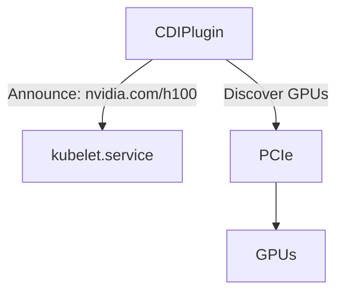
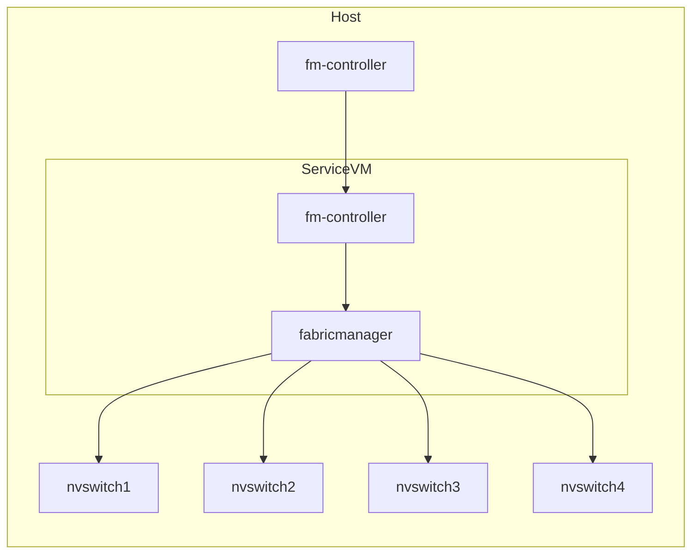

This post explores how to create a Containers as a Service cloud product tailored for GPU-based workloads.

## Introduction

The core directive of most cloud companies is simple: get as many customers to rent your physical hardware as possible. The way in which this hardware gets exposed to customers can be thought of as a pyramid of increasing virtualization. 

<!-- more -->

This pyramid looks something like this:

1. Bare metal clusters in a private, single-tenant network.
2. Bare metal clusters in a shared, multi-tenant network.
3. Virtual machines via a VMM like QEMU, cloud-hypervisor, firecracker etc.
4. Containers as a Service
5. Functions as a Service

When you look at a company like AWS, most of these layers have specific product names:

1. AWS Outpost
2. AWS EC2 Metal
3. AWS EC2 (vanilla)
4. AWS Elastic Container Service
5. AWS Lambda

The last two in this list are interesting cases of what's called a "serverless" infrastructure. Instead of your customer getting access to an entire host operating system, whether that be through a bare-metal OS or a virtualized one, they provide only the _container_ or the _code itself_ to run. The customer does not care to manage OS versions, they don't want to wrangle systemd, they don't care _how_ it gets run, only that it does get run somewhere. "Serverless" of course is a bit of a misnomer because the container or the function still has to run on a server somewhere, but the cloud company itself is the one that manages the complexity of managing the lifecycle of these compute resources in a transparent way.

A Containers as a Service (CaaS) product, as with all cloud products, needs to be concerned about how to properly isolate tenancies. Historically speaking, a "container" refers to an OCI-compliant "image" that packages an executable, a rootFS, and any software dependencies the executable runs. This executable is run as a normal process on the host kernel with various security gates around it, such as cgroups, network namespaces, filesystem mount namespaces (similar in a way to a chroot), PID namespaces, etc. that all serve to isolate this process from others.[^1] This is a pretty good level of isolation for some use-cases, but astute readers may notice that there is a huge vector of attack: the kernel itself. The Linux kernel has been known to have major security vulnerabilities, some of which have allowed [container escapes](https://www.aquasec.com/blog/new-linux-kernel-vulnerability-escaping-containers-by-abusing-cgroups/). Of course the kernel doesn't comprise of just the kernel itself, but also all kernel-mode drivers (KMD) that is either part of mainline linux or loaded as third-party kernel modules. Any of these drivers and modules can be vectors for abuse, so therefore they cannot be used to handle multiple different tenancies.

If you don't want to share tenancies, what do you do? Well, each tenancy runs in its own VM of course. From the context of a CaaS product, there are a few different ways you can run containers inside of VMs. You can create a bespoke control plane that accepts a container, spins up a VM on a host, and runs that container inside of the VM (that kinda sounds like k8s doesn't it?). You could rely on one of the various OCI container runtimes that virtualize a kernel for the container process to use.[^2] If you don't like reinventing the wheel, you can use a combination of open-source projects like Kubernetes for your control plane and Kata containers for your container runtime.

## Requirements

Before designing our system, let's deploy our _requirements_ onto pen and paper (or, uh, HTML and CSS):

1. Host multiple different tenancies on a single server.
2. Host multiple different tenancies on a single network fabric.
3. Provide access to anywhere from 1 to 8 GPUs to a single container process.
4. Provide access to networked storage via NFS.
5. Containers should boot in a "reasonable" time (a couple of minutes max).

Let's also call out an explicit non-requirement: containers will not have access to a high-performance fabric like Infiniband. Containers may be able to use an ethernet-based fabric to communicate, but for the sake of simplicity, we will disregard Infiniband.

## Control Plane

Before getting down to brass tacks, we need to design our system on a higher level. Let's assert that we have a datacenter with 100 servers each with 8 H100 SXM5 NVLink GPUs. We need a system that can accept inbound requests to run a container (perhaps with some resource requirements like the number of GPUs needed), figure out the tetris logic of where this workload can slot into the physical hardware, then deploy that workload onto the server in question. The control plane needs explicit knowledge of the state of each workload, where it's running, and what resources it's consuming. Like we alluded to before, this sounds exactly like what Kubernetes does, so let's use it!

### Aside about KMDs and NVIDIA GPU Operator

Recall our discussion on Kernel Mode Drivers: the host operating system itself cannot use vulnerability-prone KMDs. This means that NVIDIA drivers, which speak directly to the GPUs over PCIe, cannot be installed on the host. The guest Virtual Machine must be the one to host the Nvidia KMDs. This complicates our k8s install quite substantially because it means we cannot use the niceties of the [NVIDIA GPU Operator](https://docs.nvidia.com/datacenter/cloud-native/gpu-operator/latest/index.html) that do various useful things like announcing GPUs to Kubernetes, managing firmware versions, publishing DCGM metrics, establishing RDMA transactions etc. This means that without custom work, Kubernetes will be completely blind to the presence of these GPUs.[^3]

### CDI

Kubernetes has a method for exposing the presence of resources through this thing called the Container Device Interface (CDI). On a high level, the CDI itself is a feature of the kubelet running on each node in the cluster. Administrators wishing to expose hardware to the cluster must implement a process that talks to the kubelet (often which is just a Unix Domain Socket implementing gRPC), announce the name of the resource being exposed, and the number of that resource currently existing on the node. 



The information given to the Kubelet is really just as simple as a key-value pair, the key being something like `nvidia.com/h100` that describes the type of hardware, and an integer `8` that says how many of that resource there are. Technically speaking, the CDI Device Plugin itself exposes a Unix Domain Socket that it tells the kubelet the existence of, and when the kubelet wants an update to the resource, it will talk to this socket. In this way, CDI Device Plugins operate in a pull-based model.

Because we can't use GPU Operator, I decided to implement my own CDI plugin. It was surprisingly simple, and LLMs were very helpful in creating the boilerplate I needed. The CDI plugin was written in Go, packaged into a container, and then deployed to my cluster as a k8s Daemonset. The manifest is as simple as this:

```yaml
apiVersion: v1
kind: ServiceAccount
metadata: { name: vfio-device-plugin, namespace: kube-system }
---
apiVersion: apps/v1
kind: DaemonSet
metadata:
  name: vfio-device-plugin
  namespace: kube-system
spec:
  selector: { matchLabels: { app: vfio-device-plugin } }
  template:
    metadata:
      labels: { app: vfio-device-plugin }
    spec:
      serviceAccountName: vfio-device-plugin
      nodeSelector:
        kubernetes.io/arch: amd64
      tolerations:
      - operator: Exists
      containers:
      - name: plugin
        image: docker.io/landontclipp/k8s-gpu-device-plugin:0.0.10
        imagePullPolicy: IfNotPresent
        env:
        volumeMounts:
        - name: kubelet-sock
          mountPath: /var/lib/kubelet/device-plugins
        - name: var-run-cdi
          mountPath: /var/run/cdi
        - name: dev-vfio
          mountPath: /dev/vfio
      volumes:
      - name: kubelet-sock
        hostPath:
          path: /var/lib/kubelet/device-plugins
          type: Directory
      - name: var-run-cdi
        hostPath:
          path: /var/run/cdi
          type: Directory
      - name: dev-vfio
        hostPath:
          path: /dev/vfio
          type: Directory
```

You'll see two interesting things here:

1. `/var/lib/kubelet/device-plugins`: This is the host filesystem location of where the kubelet socket lives, and also where we are deciding to place the CDI plugin's socket. You can see an example here:

    ```
    $ ls -lh /var/lib/kubelet/device-plugins
    total 12K
    srwxr-xr-x 1 root root    0 Oct  1 21:37 kubelet.sock
    -rw------- 1 root root 2.2K Oct 15 20:26 kubelet_internal_checkpoint
    srwxr-xr-x 1 root root    0 Oct  1 21:39 nvidia-gpu.sock
    ```

2. `/var/run/cdi`: This is a directory that will contain specific instructions to containerd on how specifically to provide the container access to the requested resource. A snippet of a file in this directory:

    ```json title="/var/run/cdi/nvidia-gpu.json"
    {
        "cdiVersion": "0.7.0",
        "kind": "nvidia.com/gpu",
        "containerEdits": {},
        "devices": [
            {
                "name": "0",
                "containerEdits": {
                    "deviceNodes": [
                        {
                            "path": "/dev/vfio/66",
                            "type": "c",
                            "permissions": "rwm"
                        }
                    ]
                }
            }
        },
    ```

    The name of the file is not important -- containerd parses all JSON documents. This particular file announces that this is the `nvidia.com/gpu` kind of resource and then lists the available devices in the `devices` map.

With these pieces of information, we can now state the steps that happen when a container, submitted to k8s, requests 1 `nvidia.com/gpu` resource:

1. The k8s scheduler looks at all of the available nodes and finds one with 1 available GPU.
2. The k8s scheduler selects a specific GPU index. It does this because if you remember, it has explicit knowledge of which GPUs have been allocated to which workloads on which nodes.
3. The k8s scheduler posts this container to be run on a specific node with a specific GPU to the k8s API Scheduler.
4. The kubelet on the selected node notices a new job as been posted to it. It submits the container spec to containerd.
5. Containerd pulls down the image, sees that a `nvidia.com/gpu` resource has been requested, it consults the `/var/run/cdi/nvidia-gpu.json` file, modifies the OCI container spec according to the `containerEdits` specified in that file, and instantiates the container runtime with the newly modified spec.

After the container process boots, it should see the a character-typed device node in `/dev/vfio`.[^4]

## Container Runtime

### An Introduction

You'll remember that in a previous section, we mentioned that the tenancies cannot share the same host kernel or KMDs. How do we run containers inside of a VM? We can leverage another concept called the [Container Runtime Interface](https://kubernetes.io/docs/concepts/architecture/cri/). Containerd can be configured to utilize multiple different "container runtimes". Of course the default runtime when you download containerd is `runc`, which runs the containers as regular process on the host kernel. There is another OCI-compliant runtime called [Kata Containers](https://katacontainers.io/) that can be exposed to containerd using config like this:

```toml title="/etc/containerd/config.toml"
[plugins."io.containerd.grpc.v1.cri".containerd.runtimes.kata-qemu-nvidia-gpu]
runtime_type = "io.containerd.kata-qemu-nvidia-gpu.v2"
runtime_path = "/opt/kata/bin/containerd-shim-kata-v2"
privileged_without_host_devices = true
pod_annotations = ["io.katacontainers.*"]

[plugins."io.containerd.grpc.v1.cri".containerd.runtimes.kata-qemu-nvidia-gpu.options]
ConfigPath = "/opt/kata/share/defaults/kata-containers/configuration-qemu-nvidia-gpu.toml"
```

containerd also needs to expose the CRI interface (by default, it doesn't):

```
# ctr plugins ls |& grep cri
io.containerd.grpc.v1                  cri                      linux/amd64    ok  
```

Now, when a Pod or Daemonset or other such deployable unit is marked with:

```yaml
spec:
  runtimeClassName: kata-qemu-nvidia-gpu
```

The kubelet will request that containerd use this runtime instead of the default. When we launch a container through k8s with this runtime, we can see the interesting bits in the OCI spec using a command like `crictl inspect 6da11814ac01e`:

```json
{
  "info": {
    "config": {
      "CDI_devices": [
        {
          "name": "nvidia.com/gpu=6"
        }
      ],
```

The `=6` specifies the specific name of the GPU. This is not requesting 6 GPUs, but rather 1 GPU with the index (or name) of `6`.

We see the runtime type:

```json
    "runtimeType": "io.containerd.kata-qemu-nvidia-gpu.v2",
```

We see the `devices` that containerd added to the spec:

```json
      "linux": {
        "cgroupsPath": "kubepods-podcbd00543_8fa0_44c0_9093_ee4aa64ade4c.slice:cri-containerd:6da11814ac01eddddbaf2c7ddd94c83fbca09c3ca59ba5725250819aaab0a8d9",
        "devices": [
          {
            "major": 240,
            "minor": 6,
            "path": "/dev/vfio/112",
            "type": "c"
          }
        ],
```

### Kata Containers

[Kata Containers](https://katacontainers.io/) is a project backed by NVIDIA that runs OCI containers inside of a MicroVM. Whe containerd calls out to the Kata shim `/opt/kata/bin/containerd-shim-kata-v2`, the shim performs these steps:

1. Boot up a QEMU VM with a pre-defined VM image.
2. Create a VSOCK port for that VM.
3. Wait for the Kata agent inside of the VM to boot.
4. Communicate through VSOCK with the kata-agent, request the kata-agent to run the container using a normal `runc` runtime.
5. Stream results back to containerd.

The idea itself is simple: run the container inside of a VM and go on with your day. Of course reality is more complicated than this. Recall that our requirement states that the VM should boot in a couple of minutes at most. This is simple for VMs that have no interesting devices being enumerated on the PCIe bus, but these large H100 GPUs with large BARs can be a real bear to the boot process. Not only do we need to now manage NVIDIA kernel driver versions, but we need to ensure that PCIe enumeration does not take a long time. When the kernel boots, the PCI subsystem walks the device tree and maps each BAR into virtual address space. i.e., it sets up page table mappings so that drivers can access device memory through MMIO. For large BARs (like the 64GB for H100s), this mapping step involves creating a lot more 4KB page entries which can noticeably slow down the early init process.

One of the main ways to speed up VM boot processes, besides PCIe enumeration considerations, is to wrangle systemd. MicroVMs like those which are running container workloads probably don't need the systemd init system, and in fact NVIDIA created their own replacement to it called [NVRC](https://github.com/NVIDIA/nvrc). NVRC does a lot of things that systemd does but without all of the ceremony. This includes things like:

1. Spinning up daemons.
2. Configuring syslog.
3. Interacting with devices on PCIe.
4. Managing system users.

## NVLink Isolation

One of the core components of NVIDIA DGX or HGX systems is the presence of an all-to-all GPU interconnect called NVLink. NVLink is a high-performance bus, resident on the sever motherboard itself, that is entirely separate and distinct from the PCIe bus.  


Most DGX/HGX platforms have 4 switches in the NVLink fabric. The fabric can be partitioned in various ways that are pre-defined in the hardware itself. This is interesting to us because our requirements state that we need to support multiple tenancies on the same server, so we need to think about how to isolate the GPUs from each other.

NVIDIA provides a service called [nv-fabricmanager](https://docs.nvidia.com/datacenter/tesla/fabric-manager-user-guide/index.html) that normally runs as a systemd service on the host kernel. Because we're virtualizing our tenancies and removing NVIDIA kernel drivers from the host, we need to also run nv-fabricmanager inside of a VM. NVIDIA provides three different virtualization models for running fabricmanager:

1. Full passthrough: A VM gets both all of the GPUs on a machine and all NVSwitches. 
2. Shared NVSwitch Multitenancy: Multiple tenants are sharing the NVLink fabric.
3. vGPU Multitenancy: GPUs are exposed to VMs through their SR-IOV Virtual Functions. The GPU and NVswitch physical functions are managed by the host itself.

Option 1 doesn't satisfy our requirements, and option 3 requires a special license to run their vGPU stack, so option 2 is the next best thing. Their documents for this model says that you must run fabricmanager inside of a trusted "Service VM". This Service VM will contain two basic components:

1. fabricmanager itself
2. A service that tells fabricmanager how the fabric should be partitioned.



NVIDIA doesn't provide a good CLI tool for the fabricmanager, so there is a custom tool I use that lets us interact with it. You can see the supported partition types here:

```
./fmctl --address 127.0.0.1:6666 list
PARTITION ID  STATUS    GPUs  NVLINKS  GPU PHYSICAL IDs
------------  ------    ----  -------  ----------------
0             Inactive  8     144      1,2,3,4,5,6,7,8
1             Inactive  4     72       1,2,3,4
2             Inactive  4     72       5,6,7,8
3             Inactive  2     36       1,3
4             Inactive  2     36       2,4
5             Inactive  2     36       5,7
6             Inactive  2     36       6,8
7             Active    1     0        1
8             Active    1     0        2
9             Active    1     0        3
10            Active    1     0        4
11            Active    1     0        5
12            Active    1     0        6
13            Active    1     0        7
14            Active    1     0        8
```

In my particular setup, I've isolated all the GPUs from each other which is why partitions 7-14 are activated. If I wanted a 2x instance, I'd set partitions 3-6, for 4x instances, 1-2, and for 8x instances, only partition 0.


[^1]: In fact, this is why OCI containers intrinsically rely on the Linux kernel because all of these features are _Linux_ features, and is why containers running in MacOS or Windows require a Linux Virtual Machine. That's not to say there couldn't be a runtime that works in MacOS and Windows natively, but it would require exact feature parity and also risks containers behaving differently on different OSs, which is bad.
[^2]: The two interesting competitors here are gVisor and Kata Containers.
[^3]: Technically speaking, NVIDIA does provide a way to run sandboxed workloads using [Kata containers](https://docs.nvidia.com/datacenter/cloud-native/gpu-operator/latest/gpu-operator-kata.html), but in the author's experience, this path is extremely fraught with pitfalls, bugs, and in general seems to be poorly supported. They even call this out that using GPU Operator with sandboxed workloads is explicitly a "Technology Preview" and is not fully supported. 
[^4]: This does not get exposed as a bind mount, but rather as a new device node created with `mknod`.