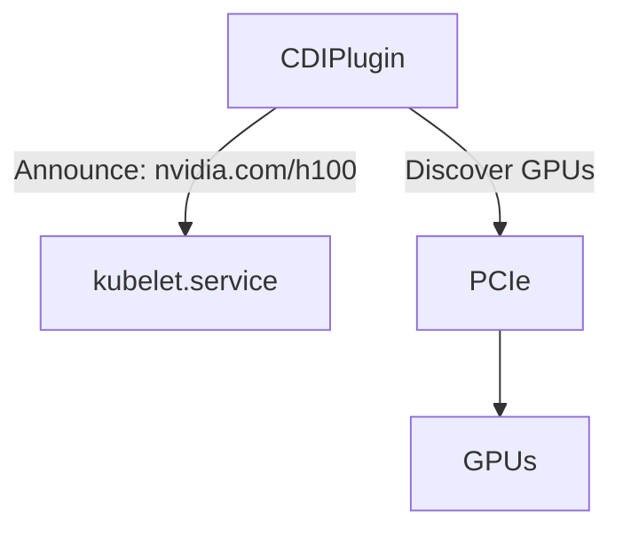
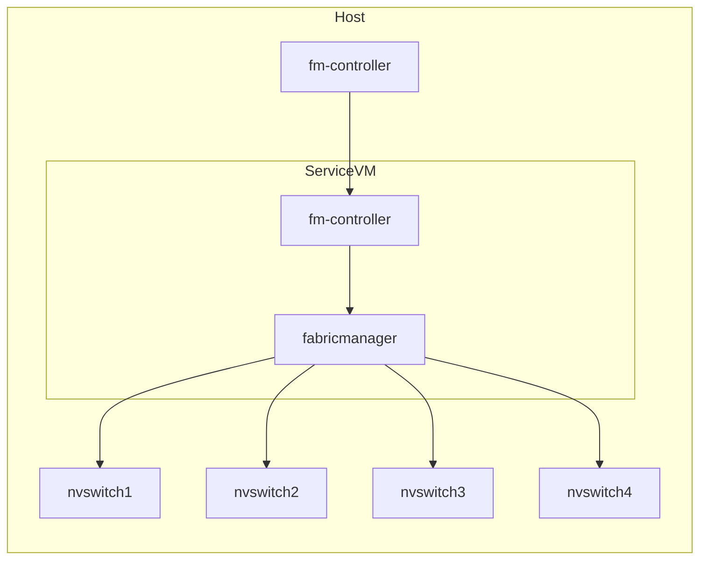
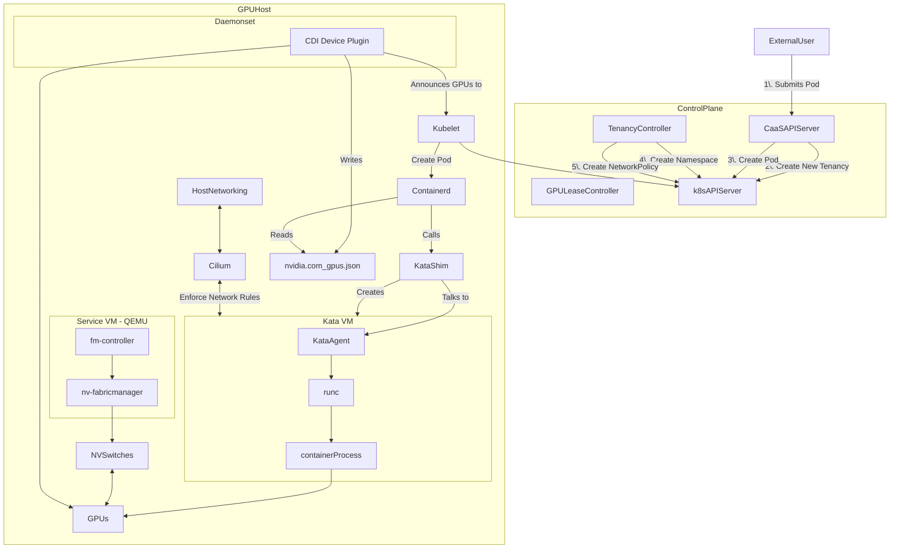

This post explores how to create a Containers as a Service cloud product tailored for GPU-based workloads.

## Introduction

!!! warning "Disclaimer"

    The views and opinions expressed in this blog are solely my own and do not reflect the views, opinions, or positions of my employer or any organization I am affiliated with.

The core directive of most cloud companies is simple: get as many customers to rent your physical hardware as possible. The way in which this hardware gets exposed to customers can be thought of as a pyramid of increasing virtualization. 

<!-- more -->

This pyramid looks something like this:

1. Bare metal clusters in a private, single-tenant network.
2. Bare metal clusters in a shared, multi-tenant network.
3. Virtual machines via a VMM like QEMU, cloud-hypervisor, firecracker etc.
4. Containers as a Service
5. Functions as a Service

When you look at a company like AWS, most of these layers have specific product names:

1. AWS Outpost
2. AWS EC2 Metal
3. AWS EC2 (vanilla)
4. AWS Elastic Container Service
5. AWS Lambda

The last two in this list are interesting cases of what's called a "serverless" infrastructure. Instead of your customer getting access to an entire host operating system, whether that be through a bare-metal OS or a virtualized one, they provide only the _container_ or the _code itself_ to run. The customer does not care to manage OS versions, they don't want to wrangle systemd, they don't care _how_ it gets run, only that it does get run somewhere. "Serverless" of course is a bit of a misnomer because the container or the function still has to run on a server somewhere, but the cloud company itself is the one that manages the complexity of managing the lifecycle of these compute resources in a transparent way.

A Containers as a Service (CaaS) product, as with all cloud products, needs to be concerned about how to properly isolate tenancies. Historically speaking, a "container" refers to an OCI-compliant "image" that packages an executable, a rootFS, and any software dependencies the executable runs. This executable is run as a normal process on the host kernel with various security gates around it, such as cgroups, network namespaces, filesystem mount namespaces (similar in a way to a chroot), PID namespaces, etc. that all serve to isolate this process from others.[^1] This is a pretty good level of isolation for some use-cases, but astute readers may notice that there is a huge vector of attack: the kernel itself. The Linux kernel has been known to have major security vulnerabilities, some of which have allowed [container escapes](https://www.aquasec.com/blog/new-linux-kernel-vulnerability-escaping-containers-by-abusing-cgroups/). Of course the kernel doesn't comprise of just the kernel itself, but also all kernel-mode drivers (KMD) that is either part of mainline linux or loaded as third-party kernel modules. Any of these drivers and modules can be vectors for abuse, so therefore they cannot be used to handle multiple different tenancies.

If you don't want to share tenancies, what do you do? Well, each tenancy runs in its own VM of course. From the context of a CaaS product, there are a few different ways you can run containers inside of VMs. You can create a bespoke control plane that accepts a container, spins up a VM on a host, and runs that container inside of the VM (that kinda sounds like k8s doesn't it?). You could rely on one of the various OCI container runtimes that virtualize a kernel for the container process to use.[^2] If you don't like reinventing the wheel, you can use a combination of open-source projects like Kubernetes for your control plane and Kata containers for your container runtime.

## Requirements

Before designing our system, let's deploy our _requirements_ onto pen and paper (or, uh, HTML and CSS):

1. Host multiple different tenancies on a single server.
2. Host multiple different tenancies on a single network fabric.
3. Provide access to anywhere from 1 to 8 GPUs to a single container process.
4. Provide access to networked storage via NFS.
5. Containers should boot in a "reasonable" time (a couple of minutes max).

Let's also call out an explicit non-requirement: containers will not have access to a high-performance fabric like Infiniband. Containers may be able to use an ethernet-based fabric to communicate, but for the sake of simplicity, we will disregard Infiniband.

## Control Plane

Before getting down to brass tacks, we need to design our system on a higher level. Let's assert that we have a datacenter with 100 servers each with 8 H100 SXM5 NVLink GPUs. We need a system that can accept inbound requests to run a container (perhaps with some resource requirements like the number of GPUs needed), figure out the tetris logic of where this workload can slot into the physical hardware, then deploy that workload onto the server in question. The control plane needs explicit knowledge of the state of each workload, where it's running, and what resources it's consuming. Like we alluded to before, this sounds exactly like what Kubernetes does, so let's use it!

## Aside about KMDs and NVIDIA GPU Operator

Recall our discussion on Kernel Mode Drivers: the host operating system itself cannot use vulnerability-prone KMDs. This means that NVIDIA drivers, which speak directly to the GPUs over PCIe, cannot be installed on the host. The guest Virtual Machine must be the one to host the Nvidia KMDs. This complicates our k8s install quite substantially because it means we cannot use the niceties of the [NVIDIA GPU Operator](https://docs.nvidia.com/datacenter/cloud-native/gpu-operator/latest/index.html) that do various useful things like announcing GPUs to Kubernetes, managing firmware versions, publishing DCGM metrics, establishing RDMA transactions etc. This means that without custom work, Kubernetes will be completely blind to the presence of these GPUs.[^3]

## CDI Device Plugin

Kubernetes has a method for exposing the presence of resources through this thing called the Container Device Interface (CDI). On a high level, the CDI itself is a feature of the kubelet running on each node in the cluster. Administrators wishing to expose hardware to the cluster must implement a process that talks to the kubelet (often which is just a Unix Domain Socket implementing gRPC), announce the name of the resource being exposed, and the number of that resource currently existing on the node. 



The information given to the Kubelet is really just as simple as a key-value pair, the key being something like `nvidia.com/h100` that describes the type of hardware, and an integer `8` that says how many of that resource there are. Technically speaking, the CDI Device Plugin itself exposes a Unix Domain Socket that it tells the kubelet the existence of, and when the kubelet wants an update to the resource, it will talk to this socket. In this way, CDI Device Plugins operate in a pull-based model.

Because we can't use GPU Operator, I decided to implement my own CDI plugin. It was surprisingly simple, and LLMs were very helpful in creating the boilerplate I needed. The CDI plugin was written in Go, packaged into a container, and then deployed to my cluster as a k8s Daemonset. The manifest is as simple as this:

```yaml
apiVersion: v1
kind: ServiceAccount
metadata: { name: vfio-device-plugin, namespace: kube-system }
---
apiVersion: apps/v1
kind: DaemonSet
metadata:
  name: vfio-device-plugin
  namespace: kube-system
spec:
  selector: { matchLabels: { app: vfio-device-plugin } }
  template:
    metadata:
      labels: { app: vfio-device-plugin }
    spec:
      serviceAccountName: vfio-device-plugin
      nodeSelector:
        kubernetes.io/arch: amd64
      tolerations:
      - operator: Exists
      containers:
      - name: plugin
        image: docker.io/landontclipp/k8s-gpu-device-plugin:0.0.10
        imagePullPolicy: IfNotPresent
        env:
        volumeMounts:
        - name: kubelet-sock
          mountPath: /var/lib/kubelet/device-plugins
        - name: var-run-cdi
          mountPath: /var/run/cdi
        - name: dev-vfio
          mountPath: /dev/vfio
      volumes:
      - name: kubelet-sock
        hostPath:
          path: /var/lib/kubelet/device-plugins
          type: Directory
      - name: var-run-cdi
        hostPath:
          path: /var/run/cdi
          type: Directory
      - name: dev-vfio
        hostPath:
          path: /dev/vfio
          type: Directory
```

You'll see two interesting things here:

1. `/var/lib/kubelet/device-plugins`: This is the host filesystem location of where the kubelet socket lives, and also where we are deciding to place the CDI plugin's socket. You can see an example here:

    ```
    $ ls -lh /var/lib/kubelet/device-plugins
    total 12K
    srwxr-xr-x 1 root root    0 Oct  1 21:37 kubelet.sock
    -rw------- 1 root root 2.2K Oct 15 20:26 kubelet_internal_checkpoint
    srwxr-xr-x 1 root root    0 Oct  1 21:39 nvidia-gpu.sock
    ```

2. `/var/run/cdi`: This is a directory that will contain specific instructions to containerd on how specifically to provide the container access to the requested resource. A snippet of a file in this directory:

    ```json title="/var/run/cdi/nvidia-gpu.json"
    {
        "cdiVersion": "0.7.0",
        "kind": "nvidia.com/gpu",
        "containerEdits": {},
        "devices": [
            {
                "name": "0",
                "containerEdits": {
                    "deviceNodes": [
                        {
                            "path": "/dev/vfio/66",
                            "type": "c",
                            "permissions": "rwm"
                        }
                    ]
                }
            }
        },
    ```

    The name of the file is not important -- containerd parses all JSON documents. This particular file announces that this is the `nvidia.com/gpu` kind of resource and then lists the available devices in the `devices` map.

With these pieces of information, we can now state the steps that happen when a container, submitted to k8s, requests 1 `nvidia.com/gpu` resource:

1. The k8s scheduler looks at all of the available nodes and finds one with 1 available GPU.
2. The k8s scheduler selects a specific GPU index. It does this because if you remember, it has explicit knowledge of which GPUs have been allocated to which workloads on which nodes.
3. The k8s scheduler posts this container to be run on a specific node with a specific GPU to the k8s API Scheduler.
4. The kubelet on the selected node notices a new job as been posted to it. It submits the container spec to containerd.
5. Containerd pulls down the image, sees that a `nvidia.com/gpu` resource has been requested, it consults the `/var/run/cdi/nvidia-gpu.json` file, modifies the OCI container spec according to the `containerEdits` specified in that file, and instantiates the container runtime with the newly modified spec.

After the container process boots, it should see the a character-typed device node in `/dev/vfio`.[^4]

## Container Runtime

### An Introduction

You'll remember that in a previous section, we mentioned that the tenancies cannot share the same host kernel or KMDs. How do we run containers inside of a VM? We can leverage another concept called the [Container Runtime Interface](https://kubernetes.io/docs/concepts/architecture/cri/). Containerd can be configured to utilize multiple different "container runtimes". Of course the default runtime when you download containerd is `runc`, which runs the containers as regular process on the host kernel. There is another OCI-compliant runtime called [Kata Containers](https://katacontainers.io/) that can be exposed to containerd using config like this:

```toml title="/etc/containerd/config.toml"
[plugins."io.containerd.grpc.v1.cri".containerd.runtimes.kata-qemu-nvidia-gpu]
runtime_type = "io.containerd.kata-qemu-nvidia-gpu.v2"
runtime_path = "/opt/kata/bin/containerd-shim-kata-v2"
privileged_without_host_devices = true
pod_annotations = ["io.katacontainers.*"]

[plugins."io.containerd.grpc.v1.cri".containerd.runtimes.kata-qemu-nvidia-gpu.options]
ConfigPath = "/opt/kata/share/defaults/kata-containers/configuration-qemu-nvidia-gpu.toml"
```

containerd also needs to expose the CRI interface (by default, it doesn't):

```
# ctr plugins ls |& grep cri
io.containerd.grpc.v1                  cri                      linux/amd64    ok  
```

Now, when a Pod or Daemonset or other such deployable unit is marked with:

```yaml
spec:
  runtimeClassName: kata-qemu-nvidia-gpu
```

The kubelet will request that containerd use this runtime instead of the default. When we launch a container through k8s with this runtime, we can see the interesting bits in the OCI spec using a command like `crictl inspect 6da11814ac01e`:

```json
{
  "info": {
    "config": {
      "CDI_devices": [
        {
          "name": "nvidia.com/gpu=6"
        }
      ],
```

The `=6` specifies the specific name of the GPU. This is not requesting 6 GPUs, but rather 1 GPU with the index (or name) of `6`.

We see the runtime type:

```json
    "runtimeType": "io.containerd.kata-qemu-nvidia-gpu.v2",
```

We see the `devices` that containerd added to the spec:

```json
      "linux": {
        "cgroupsPath": "kubepods-podcbd00543_8fa0_44c0_9093_ee4aa64ade4c.slice:cri-containerd:6da11814ac01eddddbaf2c7ddd94c83fbca09c3ca59ba5725250819aaab0a8d9",
        "devices": [
          {
            "major": 240,
            "minor": 6,
            "path": "/dev/vfio/112",
            "type": "c"
          }
        ],
```

### Kata Containers

[Kata Containers](https://katacontainers.io/) is a project backed by NVIDIA that runs OCI containers inside of a MicroVM. Whe containerd calls out to the Kata shim `/opt/kata/bin/containerd-shim-kata-v2`, the shim performs these steps:

1. Boot up a QEMU VM with a pre-defined VM image.
2. Create a VSOCK port for that VM.
3. Wait for the Kata agent inside of the VM to boot.
4. Communicate through VSOCK with the kata-agent, request the kata-agent to run the container using a normal `runc` runtime.
5. Stream results back to containerd.

The idea itself is simple: run the container inside of a VM and go on with your day. Of course reality is more complicated than this. Recall that our requirement states that the VM should boot in a couple of minutes at most. This is simple for VMs that have no interesting devices being enumerated on the PCIe bus, but these large H100 GPUs with large BARs can be a real bear to the boot process. Not only do we need to now manage NVIDIA kernel driver versions, but we need to ensure that PCIe enumeration does not take a long time. When the kernel boots, the PCI subsystem walks the device tree and maps each BAR into virtual address space. i.e., it sets up page table mappings so that drivers can access device memory through MMIO. For large BARs (like the 64GB for H100s), this mapping step involves creating a lot more 4KB page entries which can noticeably slow down the early init process.

One of the main ways to speed up VM boot processes, besides PCIe enumeration considerations, is to wrangle systemd. MicroVMs like those which are running container workloads probably don't need the systemd init system, and in fact NVIDIA created their own replacement to it called [NVRC](https://github.com/NVIDIA/nvrc). NVRC does a lot of things that systemd does but without all of the ceremony. This includes things like:

1. Spinning up daemons.
2. Configuring syslog.
3. Interacting with devices on PCIe.
4. Managing system users.

## NVLink Isolation

One of the core components of NVIDIA DGX or HGX systems is the presence of an all-to-all GPU interconnect called NVLink. NVLink is a high-performance bus, resident on the sever motherboard itself, that is entirely separate and distinct from the PCIe bus.  


Most DGX/HGX platforms have 4 switches in the NVLink fabric. The fabric can be partitioned in various ways that are pre-defined in the hardware itself. This is interesting to us because our requirements state that we need to support multiple tenancies on the same server, so we need to think about how to isolate the GPUs from each other.

NVIDIA provides a service called [nv-fabricmanager](https://docs.nvidia.com/datacenter/tesla/fabric-manager-user-guide/index.html) that normally runs as a systemd service on the host kernel. Because we're virtualizing our tenancies and removing NVIDIA kernel drivers from the host, we need to also run nv-fabricmanager inside of a VM. NVIDIA provides three different virtualization models for running fabricmanager:

1. Full passthrough: A VM gets both all of the GPUs on a machine and all NVSwitches. 
2. Shared NVSwitch Multitenancy: Multiple tenants are sharing the NVLink fabric.
3. vGPU Multitenancy: GPUs are exposed to VMs through their SR-IOV Virtual Functions. The GPU and NVswitch physical functions are managed by the host itself.

Option 1 doesn't satisfy our requirements, and option 3 requires a special license to run their vGPU stack, so option 2 is the next best thing. Their documents for this model says that you must run fabricmanager inside of a trusted "Service VM". This Service VM will contain two basic components:

1. fabricmanager itself
2. A service that tells fabricmanager how the fabric should be partitioned.



NVIDIA doesn't provide a good CLI tool for the fabricmanager, so there is a custom tool I use that lets us interact with it. You can see the supported partition types here:

```
./fmctl --address 127.0.0.1:6666 list
PARTITION ID  STATUS    GPUs  NVLINKS  GPU PHYSICAL IDs
------------  ------    ----  -------  ----------------
0             Inactive  8     144      1,2,3,4,5,6,7,8
1             Inactive  4     72       1,2,3,4
2             Inactive  4     72       5,6,7,8
3             Inactive  2     36       1,3
4             Inactive  2     36       2,4
5             Inactive  2     36       5,7
6             Inactive  2     36       6,8
7             Active    1     0        1
8             Active    1     0        2
9             Active    1     0        3
10            Active    1     0        4
11            Active    1     0        5
12            Active    1     0        6
13            Active    1     0        7
14            Active    1     0        8
```

In my particular setup, I've isolated all the GPUs from each other which is why partitions 7-14 are activated. If I wanted a 2x instance, I'd set partitions 3-6, for 4x instances, 1-2, and for 8x instances, only partition 0.

### `fabricmanager` Deployment

The Service VM can be deployed in a number of different ways. When I was working with Kata containers, I naturally gravitated towards launching a Kata Container Daemonset in which I could host fabricmanager, however I learned that despite a lot of the Kata project making references to fabricmanager, it was not actually fully implemented at the time. I [worked with NVIDIA](https://github.com/NVIDIA/nvrc/pull/55) on some updates to the NVRC init system to support it, but I eventually decided to use libvirt to run the VM instead. 

The VM image I used to run the fabricmanager is priorietary and closed source, but the idea is basically the same as the diagram above. The NVswitches need to be passed into the VM as normal, which means binding them to the vfio-pci kernel driver. On the HGX system I was using, one important bit that also needs to be passed into the VM, in addition to the NVSwitches themselves, is the memory controller for the NVSwitches:

```
lspci -s 0000:03:00.1 -v
03:00.1 Memory controller: PMC-Sierra Inc. Device 4128
        [redacted]
        Kernel driver in use: vfio-pci
```

One other interesting thing to note is that older NVSwitch systems expose the NVSwitches as PCIe bridge devices. Newer systems expose them as ConnectX-7 Infiniband cards which is mainly in preparation for new generations of hardware like the GB200 NVL72 racks whereby the NVLink fabric exits the chassis, allowing one to connect up to 72 GB200 Superchips (or as Nvidia's marketing team would like you to call it nowadays, 148 GPUs). A marketing picture of this kind of system is shown below.


## Aside on HGX Support in Kata

Nvidia supports two different classes of their superpod deployments. The first, called DGX, is hardware procured, designed, and deployed by Nvidia according to strict and rigorous standards. The second, called HGX, is a licensing agreement that server OEMs make with Nvidia that allows customer to design more customized NVSwitch-based superpod systems. Kata Containers, being a project led by Nvidia, has historically only worked with DGX systems. Minute (or even major) differences in hardware can cause real problems when you're dealing with virtualization because the physical way in which components are connected can dramatically differ. One interesting difference between Supermicro and Nvidia superpod systems is the fact that Supermicro places their NVSwitches behind a single IOMMU group:


while Nvidia DGX puts them behind individual IOMMU groups.[^5] In my research, this difference proved to be difficult to reconcile in Kata due to some simple incorrect assumptions. It seems like this can be rectified, but my conversations with the Kata devs seem to indicate it would require additional development to correct. Regardless, the libvirt route seemed to work well enough for me, so we can abandon our attempts to run this natively in Kata.

## Networking

Another component that must be isolated is the network itself. By default, k8s pods can talk to each other if you have a proper Container Network Interface (CNI) plugin installed. The CNI I chose to go with is [Cilium](https://cilium.io/). Cilium works by implementing the CNI spec; when packets exit out of a container, they are intercepted by Cilium via eBPF trickery. Cilium will determine whether or not the packet is allowed to continue based on however you've configured the CiliumNetworkPolicy. For a simple use-case, the only thing we really need to configure is that cross-namespace traffic is disallowed. For example:

```yaml
apiVersion: cilium.io/v2
kind: CiliumNetworkPolicy
metadata:
  creationTimestamp: "2025-10-01T21:46:07Z"
  generation: 1
  name: ingress-egress-rules
  namespace: tenant-landon
  resourceVersion: "5457770"
  uid: 65f501a0-d037-46f3-99cb-e585f1b7d6e8
spec:
  egress:
  - toEndpoints:
    - matchLabels:
        k8s:io.kubernetes.pod.namespace: tenant-landon
  endpointSelector: {}
  ingress:
  - fromEndpoints:
    - matchLabels:
        k8s:io.kubernetes.pod.namespace: tenant-landon
```

Cilium is also nice because it has explicit awareness of Kubernetes objects like namespaces, service accounts, and any other metadata you might want to create rules off of. This is contrasted to some other CNIs that have historically only allowed IP-based rules which is brittle for various reasons.

## Tenancy Controller

From the perspective of the k8s cluster, it does not necessarily know ahead of time which tenancies will exist in the future. A pod can come in at any time from any customer old or new, so we must find a way to gracefully handle the case where a datacenter has not been prepared for a new tenancy. Fortunately, our simple cluster really only needs to manage two separate things:

1. The Kubernetes namespaces
2. The CiliumNetworkPolicy

When a pod is submitted by a never-before-seen user to our CaaS public-facing REST API (which we haven't really discussed, but just pretend it exists for now), we need some way to attach it to a "Tenancy" resource that once ready will allow the pod to be submitted. This custom resource we need is something we can define using a Custom Resource Definition (CRD). The CRD document we post to k8s is a simple as this:

```yaml
apiVersion: apiextensions.k8s.io/v1
kind: CustomResourceDefinition
metadata:
  annotations:
    controller-gen.kubebuilder.io/version: v0.18.0
  name: tenancies.core.topofmind.dev
spec:
  group: core.topofmind.dev
  names:
    kind: Tenancy
    listKind: TenancyList
    plural: tenancies
    singular: tenancy
  scope: Cluster
```

The Tenancy resource basically only needs one parameter: the name of the tenancy. So the CaaS API Server needs to do a few basic steps:

1. When the container request comes in, check to see if the `Tenancy` already exists.
2. If the `Tenancy` resource doesn't exist, create it (or just skip step 1 and 2 and do an Upsert operation instead).
3. Submit the pod with a dependency on this `Tenancy` being in some sort of "ready" state.

The Tenant controller now needs to watch for updates to `Tenancy` resources and perform the following actions when one is created:

1. Create a new namespace
2. Create the `CiliumNetworkPolicy` that blocks inter-namespace traffic.
3. Set the `Tenancy` state to "ready".

From this point, the k8s API Server should schedule the pod onto an available node because all of the dependent resources have now been successfully created and tenancies will be properly isolated. You can extend this kind of system for more intricate setups, such as partitioning an Infiniband fabric, managing VRFs in an ethernet fabric, setting firewall rules, allocating public IPs etc.

## Managing GPU Firmware

An interesting problem we run into when untrusted tenancies are asked to run the kernel drivers for our GPUs is that the tenancies can theoretically flash any kind of firmware that the card itself will accept. NVIDIA has previously stated that their GPUs will only accept authentic, signature-verified firmware signed by NVIDIA, but it's simply insufficient to trust that this process will always work. It's also unclear how exactly this works, although it is almost certainly a kind of public key infrastructure (PKI) with a chain of trust. While the security concerns might be overblown, it's simply good stewardship of a cluster to ensure that your resources are as homogeneous as possible.

There are at least two possible ways to handle this in k8s. We could add a finalizer to the pod submissions (this basically just tells k8s to pause garbage collection until the finalizer key is removed), create a controller that watches exited pods and runs the firmware check, have the controller delete the relevant `metadata.finalizers` key, and then allow k8s to fully delete the pod. Another method is to create a CRD that represents a GPU lease. In this scenario, a GPU lease will be granted before a specific job has been run but after it has been scheduled. The GPU lease controller will watch for leases that have a pod in some completed state, schedule a firmware check, then remove the lease (which may trigger its own post-lease finalizers) or transition the lease back to some `Free` state. The GPU CDI device plugin would need explicit awareness of leases so that it does not hand out a GPU that still has an active lease on it.

Both of these methods are functionally similar, but a GPU Lease, which may be cluster-scoped instead of namespace-scoped (as in the finalizer idea) are more robust from a security standpoint (because the tenant does not own it) and more flexible as it allows us to create more a comprehensive and flexible state machine.

## Putting the Pieces Together

We've talked a lot about all the individual components, but let's put them together into a cohesive story.



I tried my best to resist the temptation of being overly pedantic when creating that diagram, and somehow I feel that I still failed. Regardless, this provides a high-level overview of all the relevant components needed to make this system work. And work it does! I submitted the following self-explanatory payload to my CaaS API Server:

```json
{
  "container-url": "nvcr.io/nvidia/k8s/cuda-sample:vectoradd-cuda12.5.0-ubi8",
  "tenancy": "landon"
}
```

The container is a sample CUDA workload that NVIDIA publishes [here](https://catalog.ngc.nvidia.com/orgs/nvidia/teams/k8s/containers/cuda-sample?version=vectoradd-cuda12.5.0-ubi8). 

```
Starting...

 CUDA Device Query (Runtime API) version (CUDART static linking)

Detected 1 CUDA Capable device(s)

Device 0: "NVIDIA H100 80GB HBM3"
  CUDA Driver Version / Runtime Version          13.0 / 12.5
  CUDA Capability Major/Minor version number:    9.0
  Total amount of global memory:                 81079 MBytes (85017755648 bytes)
  (132) Multiprocessors, (128) CUDA Cores/MP:    16896 CUDA Cores
  GPU Max Clock rate:                            1980 MHz (1.98 GHz)
  Memory Clock rate:                             2619 Mhz
  Memory Bus Width:                              5120-bit
  L2 Cache Size:                                 52428800 bytes
  Maximum Texture Dimension Size (x,y,z)         1D=(131072), 2D=(131072, 65536), 3D=(16384, 16384, 16384)
  Maximum Layered 1D Texture Size, (num) layers  1D=(32768), 2048 layers
  Maximum Layered 2D Texture Size, (num) layers  2D=(32768, 32768), 2048 layers
  Total amount of constant memory:               65536 bytes
  Total amount of shared memory per block:       49152 bytes
  Total shared memory per multiprocessor:        233472 bytes
  Total number of registers available per block: 65536
  Warp size:                                     32
  Maximum number of threads per multiprocessor:  2048
  Maximum number of threads per block:           1024
  Max dimension size of a thread block (x,y,z): (1024, 1024, 64)
  Max dimension size of a grid size    (x,y,z): (2147483647, 65535, 65535)
  Maximum memory pitch:                          2147483647 bytes
  Texture alignment:                             512 bytes
  Concurrent copy and kernel execution:          Yes with 3 copy engine(s)
  Run time limit on kernels:                     No
  Integrated GPU sharing Host Memory:            No
  Support host page-locked memory mapping:       Yes
  Alignment requirement for Surfaces:            Yes
  Device has ECC support:                        Enabled
  Device supports Unified Addressing (UVA):      Yes
  Device supports Managed Memory:                Yes
  Device supports Compute Preemption:            Yes
  Supports Cooperative Kernel Launch:            Yes
  Supports MultiDevice Co-op Kernel Launch:      Yes
  Device PCI Domain ID / Bus ID / location ID:   0 / 2 / 0
  Compute Mode:
     < Default (multiple host threads can use ::cudaSetDevice() with device simultaneously) >

deviceQuery, CUDA Driver = CUDART, CUDA Driver Version = 13.0, CUDA Runtime Version = 12.5, NumDevs = 1
Result = PASS
```

And a short GPU Burn:

```
==========
== CUDA ==
==========

CUDA Version 13.0.1

Container image Copyright (c) 2016-2023, NVIDIA CORPORATION & AFFILIATES. All rights reserved.

This container image and its contents are governed by the NVIDIA Deep Learning Container License.
By pulling and using the container, you accept the terms and conditions of this license:
https://developer.nvidia.com/ngc/nvidia-deep-learning-container-license

A copy of this license is made available in this container at /NGC-DL-CONTAINER-LICENSE for your convenience.

GPU 0: NVIDIA H100 80GB HBM3 (UUID: GPU-c6b0ca29-53c0-326e-8aaa-cfa1653e18d1)
Using compare file: compare.ptx
Burning for 120 seconds.

100.0%  proc'd: 5600 (51402 Gflop/s)   errors: 0   temps: 56 C

Killing processes with SIGTERM (soft kill)
Using compare file: compare.ptx
Burning for 120 seconds.
Initialized device 0 with 81079 MB of memory (80484 MB available, using 72436 MB of it), using FLOATS
Results are 268435456 bytes each, thus performing 280 iterations
Freed memory for dev 0
Uninitted cublas
done

Tested 1 GPUs:
        GPU 0: OK
```

Success! 

## Multi-GPU Containers

The setup I've created allows the user to specify how many GPUs they want their container to have access to between the values 1 and 8 inclusive. In my testing, I found that attempting to spawn multi-GPU Kata VMs was very difficult. A single-GPU VM on my system took about 2 minutes to spawn, most of that time seemingly spent on various bookkeeping steps after the GPU is ACPI hot-plugged, things like PCIe enumeration, device BAR mapping, NVIDIA driver initialization. These are the same concerns I [noted above](#kata-containers). I found that attempting to mount 8 GPUs was so slow in fact that Kubernetes eventually determined that the pod launch failed, eventually killing the VM and causing it to get into a crash loop. After aggressively increasing the various timeouts involved with pod launches, I found the VMs took around 30 minutes in the 8 GPU case. I brought this up to the Kata maintainers and they seemed surprised, noting that their launches took far less time.

Some sleuthing suggests that a lot of this performance issue comes from the way the hypervisor maps the guest-physical memory addresses to host-physical memory addresses. These mappings appear to happen in 4 KiB chunks, which of course would turn into a huge number of mappings that need to be created for just a single GPU. This is an area of further investigation.

## My Impressions

Broadening our scope of thinking beyond just "how do I build GPU CaaS", we ask ourselves "why build GPU CaaS"? There is a ton of complexity being introduced when we involve virtualization which means the maintenance burden is higher than a bare-metal deployment. It will also be true that Kata support for newer generations of hardware will always lag by some amount regardless of how diligent its developers are, especially considering the fact that there are multiple manufacturers of these HGX systems whose hardware differences must all be accounted for.

If you're a company and want to make the most money possible, you view these shortcomings of CaaS in the context of the broader lifecycle of NVIDIA hardware. Cutting edge systems will normally be acquired by large mega corporations who are willing to shell out gobs of money for private deployments, which usually means single tenancy (for the most part) and no virtualization needed. Certainly there will be no real need to partition servers themselves. Maybe you'd want to partition the cluster itself in various ways, but there's no benefit to slicing down servers beyond their 8x GPUs. So this begs the question: what happens when the cutting edge hardware depreciates and the mega corporations want to move onto a newer generation? Well, you can recycle this now neglected hardware into the public domain; give smaller companies with smaller budges smaller slices of it. That indeed is where CaaS shines.

After using Kata for a number of months, my general impression of it is that its support for GPU workloads is still young and immature. It works well in the full-passthrough model, and especially so on systems without an NVLink fabric (because the complexities involved in the fabricmanager disappear), but even on an H100 HGX system, which is 3 years old at the time of writing, getting it to properly function was a struggle. This is not a fault of the talented people working on the project. Instead, it's a business fault. Kata appears to have not even begun to implement GPU support until maybe a year ago, and even so, there are only one or two primary developers working on it. The amount they've achieved in that short time is impressive, but it goes to show that it will take a lot more resources to get it to where it needs to be.

This is where the industry is going at the moment: more focus is being paid to large, monolithic, single-tenancy (ish) deployments. This is evident in companies like Coreweave who are almost completely disinterested in servicing contracts less than a billion dollars. CaaS will always have its place, but its role will primarily be to recycle used hardware. Virtualization is really f-cking difficult and spending the intellectual energy to make it work for high-performance workloads is not necessarily justifiable in the current economic climate, at least for bleeding edge hardware.

[^1]: In fact, this is why OCI containers intrinsically rely on the Linux kernel because all of these features are _Linux_ features, and is why containers running in MacOS or Windows require a Linux Virtual Machine. That's not to say there couldn't be a runtime that works in MacOS and Windows natively, but it would require exact feature parity and also risks containers behaving differently on different OSs, which is bad.
[^2]: The two interesting competitors here are gVisor and Kata Containers.
[^3]: Technically speaking, NVIDIA does provide a way to run sandboxed workloads using [Kata containers](https://docs.nvidia.com/datacenter/cloud-native/gpu-operator/latest/gpu-operator-kata.html), but in the author's experience, this path is extremely fraught with pitfalls, bugs, and in general seems to be poorly supported. They even call this out that using GPU Operator with sandboxed workloads is explicitly a "Technology Preview" and is not fully supported. 
[^4]: This does not get exposed as a bind mount, but rather as a new device node created with `mknod`.
[^5]: The exact logic the Linux kernel uses to determine IOMMU groups is slightly mysterious to me, but from my understanding it is based on whether or not the kernel believes that PCIe endpoints could communicate directly with each other without reaching out to the root complex (called Peer-to-Peer or P2P connection). You can see that the NVSwitches sit behind a common bridge at a certain level (`0000:04`).