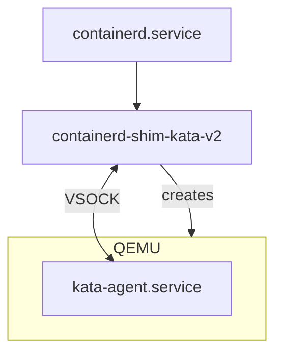

If you recall in my [previous post](2025-10-21-gpu-containers-as-a-service.md), we looked into how to utilize Kata VMs to create a multi-tenant, GPU-based Kubernetes cluster. We briefly mentioned various performance problems related to the VM boot process. This post will dive deeper into this issue and shed some insight into where time is being spent during the VM boot.

<!-- more -->

## VM Console Logs

The first thing we should establish is the timeline of events. Recall in the previous post that we're running Kata containers inside of a Kubernetes cluster. We attach 7 GPUs to the VM (instead of 8, because one of them on my machine is broken) and watch the Kata agent logs. To recap, this is a diagram that shows how the OCI components are fitting together:



By enabling various debug flags in the Kata runtime config and by setting `level = "debug"` in the containerd config, we can view all of the logs coming not only from the QEMU dmesg logs, but also the kata-agent itself. Let's now boot a VM and see what's happening. We can look at the containerd logs, grep for the specific sandbox we care about, and can see an example log message:

```
Nov 20 16:25:32 dal03-sgpu-160 containerd[2771108]: time="2025-11-20T16:25:32.996810781Z" level=debug msg="reading guest console" console-protocol=unix console-url=/run/vc/vm/38f55c4a058a0f7227e64edd75f2aed134bee7db4b211f071be84fb44d17b0bb/console.sock name=containerd-shim-v2 pid=3426175 sandbox=38f55c4a058a0f7227e64edd75f2aed134bee7db4b211f071be84fb44d17b0bb source=virtcontainers subsystem=sandbox vmconsole="{\"msg\":\"policy check: StatsContainerRequest\",\"level\":\"DEBG\",\"ts\":\"2025-11-20T16:25:33.010026353Z\",\"version\":\"0.1.0\",\"name\":\"kata-agent\",\"subsystem\":\"rpc\",\"source\":\"agent\",\"pid\":\"1\"}"
```

Let's use some additional awk trickery to clean this up. All we really care about is the `vmconsole` field, so let's separate that out and make the formatting a bit nicer:

```bash
journalctl -u containerd -S '40m ago' |& grep sandbox=38f55c4a058a0f7227e64edd75f2aed134bee7db4b211f071be84fb44d17b0bb | awk -F'vmconsole=' '{ print $2 }'  | jq -r > vmconsole.txt
```

The first messages we see are the dmesg logs which are kernel-level messages:

```
[    0.437005] brd: module loaded
[    0.443558] loop: module loaded
[    0.443819] virtio_scsi virtio1: 1/0/0 default/read/poll queues
[...]
```

Shortly after this, we also see kata-agent logs:

```
{"msg":"\"proc\" is already mounted at \"/proc\"","level":"INFO","ts":"2025-11-20T16:05:09.356676179Z","pid":"1","version":"0.1.0","subsystem":"baremount","name":"kata-agent","source":"agent"}
{"msg":"\"sysfs\" is already mounted at \"/sys\"","level":"INFO","ts":"2025-11-20T16:05:09.356699617Z","pid":"1","version":"0.1.0","subsystem":"baremount","source":"agent","name":"kata-agent"}
{"msg":"\"dev\" is already mounted at \"/dev\"","level":"INFO","ts":"2025-11-20T16:05:09.356718292Z","name":"kata-agent","version":"0.1.0","pid":"1","subsystem":"baremount","source":"agent"}
```

Kata-agent was configured to redirect its log message to `/dev/console`, which makes sense, so this is what we want. Let's zoom down further for more relevant info. It starts off by checking for cloud-init data (which it doesn't find any because I have not configured it):

```
{"msg":"Initdata check device `ptmx`","level":"DEBG","ts":"2025-11-20T16:05:09.359571917Z","source":"agent","name":"kata-agent","version":"0.1.0","subsystem":"initdata","pid":"1"}
{"msg":"Initdata check device `pts`","level":"DEBG","ts":"2025-11-20T16:05:09.359640437Z","subsystem":"initdata","name":"kata-agent","pid":"1","version":"0.1.0","source":"agent"}
{"msg":"Initdata check device `shm`","level":"DEBG","ts":"2025-11-20T16:05:09.3596694Z","version":"0.1.0","name":"kata-agent","pid":"1","subsystem":"initdata","source":"agent"}
```

We can see it receiving some commands from the containerd shim:

```
{"msg":"rpc call from shim to agent: \"create_sandbox\"","level":"INFO","ts":"2025-11-20T16:05:09.374408769Z","source":"agent","subsystem":"rpc","version":"0.1.0","name":"kata-agent","pid":"1"}
```

We begin to see the dmesg logs again and we can see the precense of the GPUs showing up on the VM's PCIe bus only 3 seconds after the kernel first booted:

```
[    3.201931] pci 0000:02:00.0: [10de:2330] type 00 class 0x030200 PCIe Endpoint
[    3.202399] pci 0000:02:00.0: BAR 0 [mem 0x00000000-0x00ffffff 64bit pref]
[    3.202551] pci 0000:02:00.0: BAR 2 [mem 0x00000000-0x1fffffffff 64bit pref]
[    3.202726] pci 0000:02:00.0: BAR 4 [mem 0x00000000-0x01ffffff 64bit pref]
[    3.202962] pci 0000:02:00.0: Max Payload Size set to 128 (was 256, max 256)
[    3.203347] pci 0000:02:00.0: Enabling HDA controller
[    4.858791] pci 0000:02:00.0: 252.048 Gb/s available PCIe bandwidth, limited by 16.0 GT/s PCIe x16 link at 0000:00:05.0 (capable of 504.112 Gb/s with 32.0 GT/s PCIe x16 link)
[    5.681204] pci 0000:02:00.0: BAR 2 [mem 0x3a4000000000-0x3a5fffffffff 64bit pref]: assigned
[    5.681521] pci 0000:02:00.0: BAR 4 [mem 0x3a6000000000-0x3a6001ffffff 64bit pref]: assigned
[    5.681842] pci 0000:02:00.0: BAR 0 [mem 0x3a6002000000-0x3a6002ffffff 64bit pref]: assigned
[    6.505076] pci 0000:02:00.0: nv_msi_ht_cap_quirk_leaf+0x0/0x20 took 803659 usecs
```

!!! tip

    For those curious, `10de` is the PCIe vendor code for NVIDIA and `2330` is the PCIe Device ID for NVIDIA H100 GPUs. 

It's showing us the BAR regions of each GPU. In fact, we should be able to see seven instances of this kind of message:

```bash
$ grep '\[10de\:2330\]' vmconsole.txt 
[    3.201931] pci 0000:02:00.0: [10de:2330] type 00 class 0x030200 PCIe Endpoint
[    7.329101] pci 0000:06:00.0: [10de:2330] type 00 class 0x030200 PCIe Endpoint
[    8.159058] pci 0000:05:00.0: [10de:2330] type 00 class 0x030200 PCIe Endpoint
[    8.165639] pci 0000:04:00.0: [10de:2330] type 00 class 0x030200 PCIe Endpoint
[    8.170375] pci 0000:03:00.0: [10de:2330] type 00 class 0x030200 PCIe Endpoint
[    8.177573] pci 0000:08:00.0: [10de:2330] type 00 class 0x030200 PCIe Endpoint
[    8.182313] pci 0000:07:00.0: [10de:2330] type 00 class 0x030200 PCIe Endpoint
$ grep '\[10de\:2330\]' vmconsole.txt  | wc -l
7
```

We can then see the kata-agent receives a uevent from the kernel regarding the presence of these GPUs being enumerated on the bus. For some context, userspace programs can subscribe to kernel uevent messages so that we can be alerted when something about a device has changed. In this case, the kata-agent cares about when a GPU device appears on the bus. Let's grep for the `0000:07:00.0` device to see the whole end-to-end flow:

```
$ grep '0000:07:00.0' vmconsole.txt 
{"msg":"Waiting for PciMatcher { devpath: \"/devices/pci0000:00/0000:00:0a.0/0000:07:00.0\" }","level":"INFO","ts":"2025-11-20T16:05:15.701000961Z","version":"0.1.0","name":"kata-agent","subsystem":"uevent","pid":"1","source":"agent"}
{"msg":"Waiting for PciMatcher { devpath: \"/devices/pci0000:00/0000:00:0a.0/0000:07:00.0\" }: waiting on channel","level":"INFO","ts":"2025-11-20T16:05:15.701021912Z","subsystem":"uevent","source":"agent","pid":"1","version":"0.1.0","name":"kata-agent"}
[    8.182313] pci 0000:07:00.0: [10de:2330] type 00 class 0x030200 PCIe Endpoint
[    8.182722] pci 0000:07:00.0: BAR 0 [mem 0x00000000-0x00ffffff 64bit pref]
[    8.182858] pci 0000:07:00.0: BAR 2 [mem 0x00000000-0x1fffffffff 64bit pref]
[    8.183003] pci 0000:07:00.0: BAR 4 [mem 0x00000000-0x01ffffff 64bit pref]
[    8.183217] pci 0000:07:00.0: Max Payload Size set to 128 (was 256, max 256)
[    8.184788] pci 0000:07:00.0: Enabling HDA controller
[    8.186130] pci 0000:07:00.0: 252.048 Gb/s available PCIe bandwidth, limited by 16.0 GT/s PCIe x16 link at 0000:00:0a.0 (capable of 504.112 Gb/s with 32.0 GT/s PCIe x16 link)
[    8.186969] pci 0000:07:00.0: BAR 2 [mem 0x390000000000-0x391fffffffff 64bit pref]: assigned
[    8.187249] pci 0000:07:00.0: BAR 4 [mem 0x392000000000-0x392001ffffff 64bit pref]: assigned
[    8.187528] pci 0000:07:00.0: BAR 0 [mem 0x392002000000-0x392002ffffff 64bit pref]: assigned
{"msg":"got uevent message","level":"INFO","ts":"2025-11-20T16:05:15.71233274Z","subsystem":"uevent","pid":"1","version":"0.1.0","source":"agent","name":"kata-agent","event":"Uevent { action: \"add\", devpath: \"/devices/pci0000:00/0000:00:0a.0/0000:07:00.0\", devname: \"\", subsystem: \"pci\", seqnum: \"1379\", interface: \"\" }"}
{"msg":"Waiting for PciMatcher { devpath: \"/devices/pci0000:00/0000:00:0a.0/0000:07:00.0\" }: found Uevent { action: \"add\", devpath: \"/devices/pci0000:00/0000:00:0a.0/0000:07:00.0\", devname: \"\", subsystem: \"pci\", seqnum: \"1379\", interface: \"\" } on channel","level":"INFO","ts":"2025-11-20T16:05:15.712365772Z","version":"0.1.0","subsystem":"uevent","source":"agent","name":"kata-agent","pid":"1"}
[   32.130338] nvidia 0000:07:00.0: enabling device (0140 -> 0142)
{"msg":"got uevent message","level":"INFO","ts":"2025-11-20T16:05:42.96188988Z","pid":"1","subsystem":"uevent","source":"agent","name":"kata-agent","version":"0.1.0","event":"Uevent { action: \"bind\", devpath: \"/devices/pci0000:00/0000:00:0a.0/0000:07:00.0\", devname: \"\", subsystem: \"pci\", seqnum: \"1387\", interface: \"\" }"}
{"msg":"ignoring event","level":"DEBG","ts":"2025-11-20T16:05:42.961921263Z","name":"kata-agent","source":"agent","pid":"1","version":"0.1.0","subsystem":"uevent","uevent":"Uevent { action: \"bind\", devpath: \"/devices/pci0000:00/0000:00:0a.0/0000:07:00.0\", devname: \"\", subsystem: \"pci\", seqnum: \"1387\", interface: \"\" }"}
```

We can see the following steps happening:

1. Kata subscribes to the uevent system for this particular BDF.
2. The kernel enumerates the PCIe bus, finds this device, and assignes (what I assume to be) MMIO regions for the device BARs.
3. The kata agent is informed by the kernel that this device has been added.
4. The kata agent saves a reference to this device in-memory and then waits for the CDI spec for this device to be injected by the shim. We see this in the logs:

    ```
    {"msg":"waiting for CDI spec(s) to be generated (0 of 100 max tries) \"unresolvable CDI devices nvidia.com/gpu=3, nvidia.com/gpu=1, nvidia.com/gpu=4, nvidia.com/gpu=6, nvidia.com/gpu=5, nvidia.com/gpu=2, nvidia.com/gpu=0\"","level":"INFO","ts":"2025-11-20T16:05:15.71245172Z","source":"agent","name":"kata-agent","version":"0.1.0","subsystem":"rpc","pid":"1"}
    ```

What can we gather here? Well, the PCIe endpoints representing the GPUs show up in the VM in a matter of a few seconds from first boot. The agent recognizes this immediately. After this step, the kata-agent ends up waiting a _LONG_ time for the CDI spec to be injected from the Kata shim. What does this mean precisely? Well, if you recall in the previous blog post regarding the [CDI device plugin](2025-10-21-gpu-containers-as-a-service.md#cdi-device-plugin), our CDI plugin on the host creates a file at `/var/run/cdi/nvidia-gpu.json` that describes the OCI container spec edits that must be made to inject these GPUs into the container sandbox. The first few lines of this file look something like:

```json title="/var/run/cdi/nvidia-gpu.json"
{
  "cdiVersion": "0.7.0",
  "kind": "nvidia.com/gpu",
  "containerEdits": {},
  "devices": [
    {
      "name": "0",
      "containerEdits": {
        "deviceNodes": [
          {
            "path": "/dev/vfio/66",
            "type": "c",
            "permissions": "rwm"
          }
        ]
      }
    },
```

What the agent is telling us is that, for whatever reason, the CDI spec has not shown up in the guest's `/var/run/cdi` directory (which is populated by the nvidia-ctk toolkit, called from the NVRC init system), so the agent doesn't yet know which edits it needs to make to the container to properly expose the GPU to the process. In fact, look at how long it waits!

```
$ grep 'waiting for CDI spec' vmconsole.txt 
{"msg":"waiting for CDI spec(s) to be generated (0 of 100 max tries) \"unresolvable CDI devices nvidia.com/gpu=3, nvidia.com/gpu=1, nvidia.com/gpu=4, nvidia.com/gpu=6, nvidia.com/gpu=5, nvidia.com/gpu=2, nvidia.com/gpu=0\"","level":"INFO","ts":"2025-11-20T16:05:15.71245172Z","source":"agent","name":"kata-agent","version":"0.1.0","subsystem":"rpc","pid":"1"}
[...]
{"msg":"waiting for CDI spec(s) to be generated (39 of 100 max tries) \"unresolvable CDI devices nvidia.com/gpu=3, nvidia.com/gpu=1, nvidia.com/gpu=4, nvidia.com/gpu=6, nvidia.com/gpu=5, nvidia.com/gpu=2, nvidia.com/gpu=0\"","level":"INFO","ts":"2025-11-20T16:06:37.462492776Z","name":"kata-agent","subsystem":"rpc","pid":"1","version":"0.1.0","source":"agent"}
```

It spends over a minute just waiting. Given the overall boot time of the VM (which I've gotten down to 2 minutes), this represents HALF of the entire boot process. The question is why?

Another clue we have are some messages from the guest NVIDIA Kernel Driver:

```
$ grep 'enabling device' vmconsole.txt 
[   11.721284] nvidia 0000:02:00.0: enabling device (0140 -> 0142)
[   15.137841] nvidia 0000:06:00.0: enabling device (0140 -> 0142)
[   18.534911] nvidia 0000:05:00.0: enabling device (0140 -> 0142)
[   22.032357] nvidia 0000:04:00.0: enabling device (0140 -> 0142)
[   25.719357] nvidia 0000:03:00.0: enabling device (0140 -> 0142)
[   28.918995] nvidia 0000:08:00.0: enabling device (0140 -> 0142)
[   32.130338] nvidia 0000:07:00.0: enabling device (0140 -> 0142)
```

It seems that each instance of "enabling device" takes the driver around 4 seconds to complete, or about 28 seconds total for all 7 GPUs. It's possible this could be a red herring because it does seem that more time is spent on waiting for the CDI specs to arrive, not for the driver to enable all devices.

It also spends an additional 13 seconds handling some kind of bug:

```
# grep gpuClearFbhubPoisonIntrForBug2924523_GA100 vmconsole.txt 
[   35.757629] NVRM: gpuClearFbhubPoisonIntrForBug2924523_GA100: FBHUB Interrupt detected. Clearing it.
[   37.904920] NVRM: gpuClearFbhubPoisonIntrForBug2924523_GA100: FBHUB Interrupt detected. Clearing it.
[   40.019364] NVRM: gpuClearFbhubPoisonIntrForBug2924523_GA100: FBHUB Interrupt detected. Clearing it.
[   42.144963] NVRM: gpuClearFbhubPoisonIntrForBug2924523_GA100: FBHUB Interrupt detected. Clearing it.
[   44.272692] NVRM: gpuClearFbhubPoisonIntrForBug2924523_GA100: FBHUB Interrupt detected. Clearing it.
[   46.396907] NVRM: gpuClearFbhubPoisonIntrForBug2924523_GA100: FBHUB Interrupt detected. Clearing it.
[   48.518811] NVRM: gpuClearFbhubPoisonIntrForBug2924523_GA100: FBHUB Interrupt detected. Clearing it.
```

The time spent waiting for `nvidia-ctk` to create the CDI file could also be the fault of the NVIDIA driver itself. What's obvious is that cold starts of GPUs take a long time, and utilizing alternative technologies like NVIDIA vGPU (whereby the kernel driver is always loaded either on the host or in a sibling VM like what [edera.dev](edera.dev) does.

## Using `bpftrace` to Time DMA Mappings

One of my suspicions in the boot performance issue was that a lot of time was being spent in creating the DMA mappings between the GPUs and physical CPU memory. One of the most crucial parts of creating DMA mappings is pinning pages in memory. To pin a page means that you force the page to be backed by real physical memory (as opposed requiring page faults to lazily back a page into memory only when the page is touched). Because the GPUs are being passed through using the vfio-pci kernel driver, we can look in the VFIO source code to see what function call does this. It is in fact a function called [`vfio_pin_pages_remote`](https://github.com/torvalds/linux/blob/8e621c9a337555c914cf1664605edfaa6f839774/drivers/vfio/vfio_iommu_type1.c#L676).

There is a technology in the Linux kernel called eBPF which stands for Extended Berkley Packet Filter. It was originally created as a way to filter packets flowing into and out of network cards, but the technology was extended to allow us to trace basically any part of the kernel we want. The [`bpftrace`](https://bpftrace.org/) tool in particular is something we can use to create eBPF programs.

Let's look at a program I created:

```bpf title="vfio_trace.bpf"
kprobe:vfio_pin_pages_remote {
    @start[tid] = nsecs;

    $sec = strftime("%Y-%m-%dT%H:%M:%S", nsecs);
    $nsec = nsecs % 1000000000;

    printf("%s.%09dZ: vfio_pin_pages_remote(): vaddr=0x%lx npage=%lu size=%luB limit=%lu pid=%d\n",
           $sec, $nsec, arg1, arg2, arg2 * 4096, arg4, pid);
}
kretprobe:vfio_pin_pages_remote {
    $d = (nsecs - @start[tid]) / 1e6;

    $sec = strftime("%Y-%m-%dT%H:%M:%S", nsecs);
    $nsec = nsecs % 1000000000;

    printf("%s.%09dZ: vfio_pin_pages_remote took %d ms\n", $sec, $nsec, $d);
    @hist = hist($d);
    delete(@start[tid]);
}
```

There are two components to this:

### `kprobe`

This section creates a callback that is triggered at the beginning of the function call. Using the eBPF language (which looks a lot like C in many respects), we save the start time of the execution and then print some of the arguments of the call along with a timestamp.

### `kretprobe`

This callback is similar to `kprobe` except it is called after the function exits. We grab the start time (based off of the thread ID `tid`) and subtract it from the end time. This gives us the runtime in milliseconds which we can then print.

The result is messages like this:

```
vfio_pin_pages_remote(): vaddr=0x74de00000000 npage=33554432 size=137438953472B limit=2048 pid=3449227                                                                                                                                             
vfio_pin_pages_remote took 3274 ms   
```

When the traces end, bpftrace also gives us a histogram of the function runtimes:

```
@hist:                                                                                                                                                                                                                                             
[0]                   89 |@@@@@@@@@@@@@@@@@@@@@@@@@@@@@@@@@@@@@@@@@@@@@@@@@@@@|
[1]                    2 |@                                                   |
[2, 4)                 8 |@@@@                                                |
[4, 8)                 0 |                                                    |
[8, 16)                0 |                                                    |
[16, 32)               0 |                                                    |
[32, 64)               1 |                                                    |
[64, 128)              0 |                                                    |
[128, 256)             0 |                                                    |
[256, 512)             0 |                                                    |
[512, 1K)              0 |                                                    |
[1K, 2K)               0 |                                                    |
[2K, 4K)               7 |@@@@                                                |
[4K, 8K)               0 |                                                    |
[8K, 16K)              0 |                                                    |
[16K, 32K)             1 |                                                    |
```

Using these timestamps, we can now cross-reference what's happening on the host side regarding DMA mappings and the guest side. Let's try it!

### Booting a new VM

I booted a new Kata VM and saved the containerd logs:

```
# journalctl -u containerd -S '40 minutes ago' |& grep 'sandbox=c9f7bf13c1911810fa49a6be9a9d1efe0872d4088a008ac9eddd5bece6e56889' | awk -F'vmconsole=' '{ print $2 }'  | jq -r > vmconsole2.txt
```

You can view those [here](https://f005.backblazeb2.com/file/landons-blog/assets/posts/2025-11-19-gpu-passthrough-boot/vmconsole.txt).

The output of the bpftrace program lives [here](https://f005.backblazeb2.com/file/landons-blog/assets/posts/2025-11-19-gpu-passthrough-boot/bpftrace_out.txt).

The first significant traces we can see are these 128GiB sections.

```
2025-11-20T17:56:21.688170596Z: vfio_pin_pages_remote(): vaddr=0x786c40000000 npage=33554432 size=137438953472B limit=2048 pid=3454228
2025-11-20T17:56:25.955145443Z: vfio_pin_pages_remote took 3266 ms
```

There are seven of them in fact (coincidence? I think not!). The first one happens at timestamp `2025-11-20T17:56:21.688170596Z`. What was happening in the guest around this time?

```
[   21.101954] nvidia 0000:02:00.0: enabling device (0140 -> 0142)
{"msg":"waiting for CDI spec(s) to be generated (5 of 100 max tries) \"unresolvable CDI devices nvidia.com/gpu=2, nvidia.com/gpu=0, nvidia.com/gpu=1, nvidia.com/gpu=6, nvidia.com/gpu=5, nvidia.com/gpu=3, nvidia.com/gpu=4\"","level":"INFO","ts":"2025-11-20T17:56:21.93953012Z","version":"0.1.0","name":"kata-agent","source":"agent","pid":"1","subsystem":"rpc"}
{"msg":"got uevent message","level":"INFO","ts":"2025-11-20T17:56:21.947065025Z","source":"agent","subsystem":"uevent","name":"kata-agent","version":"0.1.0","pid":"1","event":"Uevent { action: \"bind\", devpath: \"/devices/pci0000:00/0000:00:05.0/0000:02:00.0\", devname: \"\", subsystem: \"pci\", seqnum: \"1381\", interface: \"\" }"}
{"msg":"ignoring event","level":"DEBG","ts":"2025-11-20T17:56:21.947096369Z","source":"agent","version":"0.1.0","name":"kata-agent","pid":"1","subsystem":"uevent","uevent":"Uevent { action: \"bind\", devpath: \"/devices/pci0000:00/0000:00:05.0/0000:02:00.0\", devname: \"\", subsystem: \"pci\", seqnum: \"1381\", interface: \"\" }"}
```

The kata-agent noticed that the GPU device at `0000:02:00.0` was bound to the NVIDIA driver. It isn't until about 3221 milliseconds later that the NVIDIA driver gets bound to the next GPU:

```
[   24.322027] nvidia 0000:07:00.0: enabling device (0140 -> 0142)
```

This matches almost exactly with the runtime of `vfio_pin_pages_remote`. This process repeats for a total of 7 times until the next semi-significant DMA mappings occur:

```
2025-11-20T17:57:56.948647354Z: vfio_pin_pages_remote(): vaddr=0x7832c0000000 npage=26214400 size=107374182400B limit=2048 pid=3454228
2025-11-20T17:57:56.437252192Z: vfio_pin_pages_remote took 488 ms
```

While these calls take less time, there are far more of them that happen in rapid succession starting from the timestamp `2025-11-20T17:57:56.948647354Z` and ending in `2025-11-20T17:58:13.178330994Z` for a total of roughly 17 seconds. Again, we look inside the guest:

```
{"msg":"rpc call from shim to agent: \"online_cpu_mem\"","level":"INFO","ts":"2025-11-20T17:58:13.487517854Z","pid":"1","source":"agent","name":"kata-agent","version":"0.1.0","subsystem":"rpc"}
```

There's a flurry of memory devices being added.

```
{"msg":"got uevent message","level":"INFO","ts":"2025-11-20T17:58:13.50283434Z","source":"agent","subsystem":"uevent","pid":"1","version":"0.1.0","name":"kata-agent","event":"Uevent { action: \"add\", devpath: \"/devices/system/memory/memory176\", devname: \"\", subsystem: \"memory\", seqnum: \"1400\", interface: \"\" }"}
{"msg":"got uevent message","level":"INFO","ts":"2025-11-20T17:58:13.50289347Z","version":"0.1.0","name":"kata-agent","subsystem":"uevent","pid":"1","source":"agent","event":"Uevent { action: \"add\", devpath: \"/devices/system/memory/memory177\", devname: \"\", subsystem: \"memory\", seqnum: \"1401\", interface: \"\" }"}
{"msg":"got uevent message","level":"INFO","ts":"2025-11-20T17:58:13.502941403Z","version":"0.1.0","source":"agent","pid":"1","subsystem":"uevent","name":"kata-agent","event":"Uevent { action: \"add\", devpath: \"/devices/system/memory/memory178\", devname: \"\", subsystem: \"memory\", seqnum: \"1402\", interface: \"\" }"}
{"msg":"got uevent message","level":"INFO","ts":"2025-11-20T17:58:13.50298798Z","version":"0.1.0","subsystem":"uevent","pid":"1","source":"agent","name":"kata-agent","event":"Uevent { action: \"add\", devpath: \"/devices/system/memory/memory179\", devname: \"\", subsystem: \"memory\", seqnum: \"1403\", interface: \"\" }"}
{"msg":"got uevent message","level":"INFO","ts":"2025-11-20T17:58:13.503030684Z","subsystem":"uevent","source":"agent","pid":"1","version":"0.1.0","name":"kata-agent","event":"Uevent { action: \"add\", devpath: \"/devices/system/memory/memory180\", devname: \"\", subsystem: \"memory\", seqnum: \"1404\", interface: \"\" }"}
{"msg":"got uevent message","level":"INFO","ts":"2025-11-20T17:58:13.503075124Z","pid":"1","version":"0.1.0","source":"agent","name":"kata-agent","subsystem":"uevent","event":"Uevent { action: \"add\", devpath: \"/devices/system/memory/memory181\", devname: \"\", subsystem: \"memory\", seqnum: \"1405\", interface: \"\" }"}
```

The guest receives the last memory device around this message:

```
{"msg":"got uevent message","level":"INFO","ts":"2025-11-20T17:58:13.55354784Z","name":"kata-agent","source":"agent","subsystem":"uevent","pid":"1","version":"0.1.0","event":"Uevent { action: \"add\", devpath: \"/devices/system/memory/memory927\", devname: \"\", subsystem: \"memory\", seqnum: \"2151\", interface: \"\" }"}
```

Which also lines up with the last time `vfio_pin_pages_remote` is called:

```
025-11-20T17:58:12.678281961Z: vfio_pin_pages_remote(): vaddr=0x784ac0000000 npage=1048576 size=4294967296B limit=2048 pid=3454228
2025-11-20T17:58:13.178330994Z: vfio_pin_pages_remote took 500 ms
```

### Interpreting the Results

We now have a fairly clear picture of where a lot of the time is being spent.

<table>
    <tr>
        <td> timestamp </td>
        <td> side </td>
        <td> time from last event </td>
        <td> description </td>
    </tr>
    <tr>
        <td> <code>2025-11-20T17:55:59.692656146Z</code> </td>
        <td> guest </td>
        <td> 1.2 seconds from T=0 </td>
        <td> The VM boots and calls out to the Kata agent. </td>
    </tr>
    <tr>
        <td> <code>2025-11-20T17:56:00.118714278Z</code> </td>
        <td> guest </td>
        <td> 0.5 seconds </td>
        <td> The kata agent finishes its initial sanity checks and bookkeeping tasks. A minimal amount of memory is hotplugged. </td>
    </tr>
    <tr>
        <td> <code>2025-11-20T17:56:11</code> </td>
        <td> guest </td>
        <td> ~11 seconds </td>
        <td>
            <div class="markdown">
                The PCIe enumeration process in the kernel notices its first NVIDIA GPU:

                ```
                [   12.582377] pci 0000:02:00.0: [10de:2330] type 00 class 0x030200 PCIe Endpoint
                ```
            </div>
        </td>
    </tr>
    <tr>
        <td> <code>2025-11-20T17:56:13.514397783Z</code> </td>
        <td> guest </td>
        <td> 2 seconds </td>
        <td> 
            <div class="markdown">
                The PCI device is added and Kata notices:

                ```json
                {
                    "msg": "got uevent message",
                    "level": "INFO",
                    "ts": "2025-11-20T17:56:13.514397783Z",
                    "pid": "1",
                    "version": "0.1.0",
                    "subsystem": "uevent",
                    "name": "kata-agent",
                    "source": "agent",
                    "event": "Uevent { action: \"add\", devpath: \"/devices/pci0000:00/0000:00:05.0/0000:02:00.0\"[...]"
                }
                ```
            </div>
        </td>
    </tr>
    <tr>
        <td> <code>2025-11-20T17:56:14.369905314Z</code> </td>
        <td> guest </td>
        <td> 1 second </td>
        <td> 
            <div class="markdown">
                The last GPU device is added to the PCI tree.
            </div>
        </td>
    </tr>
    <tr>
        <td> <code>2025-11-20T17:56:18.466861384Z</code> </td>
        <td> host </td>
        <td> 4 seconds </td>
        <td> 
            <div class="markdown">

                The first heavyweight `vfio_pin_pages_remote` call is made. This roughly corresponds to the guest-side NVIDIA kernel driver making this statement:

                ```
                [   21.101954] nvidia 0000:02:00.0: enabling device (0140 -> 0142)
                ```

            </div>
        </td>
    </tr>
    <tr>
        <td> <code>2025-11-20T17:56:42.438059073Z</code> </td>
        <td> host </td>
        <td> 24 seconds </td>
        <td> 
            <div class="markdown">
                The last heavyweight `vfio_pin_pages_remote` call completes. This tells us each page pin for the GPUs takes about 3 seconds, which again matches the timings we get from bpftrace.


                ```
                2025-11-20T17:56:39.269298767Z: vfio_pin_pages_remote(): vaddr=0x784c00000000 npage=33554432 size=137438953472B limit=2048 pid=3454228
                2025-11-20T17:56:42.438059073Z: vfio_pin_pages_remote took 3168 ms
                ```
            </div>
        </td>
    </tr>
    <tr>
        <td> <code>2025-11-20T17:57:40.052488828Z</code> </td>
        <td> guest </td>
        <td> 58 seconds </td>
        <td> 
            <div class="markdown">
                The CDI specs for all devices were injected successfully to kata-agent.

                ```
                {"msg":"waiting for CDI spec(s) to be generated (40 of 100 max tries) \"unresolvable CDI devices nvidia.com/gpu=2, nvidia.com/gpu=0, nvidia.com/gpu=1, nvidia.com/gpu=6, nvidia.com/gpu=5, nvidia.com/gpu=3, nvidia.com/gpu=4\"","level":"INFO","ts":"2025-11-20T17:57:37.23937483Z","subsystem":"rpc","name":"kata-agent","source":"agent","pid":"1","version":"0.1.0"}
                {"msg":"handling signal","level":"INFO","ts":"2025-11-20T17:57:37.775940382Z","subsystem":"signals","version":"0.1.0","pid":"1","name":"kata-agent","source":"agent","signal":"SIGCHLD"}
                {"msg":"wait_status","level":"INFO","ts":"2025-11-20T17:57:37.775976033Z","version":"0.1.0","subsystem":"signals","source":"agent","pid":"1","name":"kata-agent","wait_status result":"Signaled(Pid(139), SIGKILL, false)"}
                {"msg":"child exited unexpectedly","level":"INFO","ts":"2025-11-20T17:57:37.775999136Z","pid":"1","child-pid":"139","source":"agent","subsystem":"signals","name":"kata-agent","version":"0.1.0"}
                {"msg":"all devices injected successfully, modified CDI container spec:
                ```
            </div>
        </td>
    </tr>
</table>

What did we learn from this? Well, the page pinning steps indeed take a long time to complete at around 24 seconds. That is significant, but it's not as significant as the amount of time that the kata-agent waits for the CDI specs to be injected into it.

The kata devs told me that after the devices are initialized and bound to the NVIDIA kernel driver, the Kata init system (NVRC) calls out to nvidia-ctk to create the CDI. This is where the point of synchronization comes from, so we must investigate this more.

### Can't we use IOMMU Hugepages?

This page pinning step is an obvious area for performance improvements. One might reflexively reach for the idea of reducing the number of pages that have to be pinned. We can look again at one of our heavyweight `vfio_pin_pages_remote` calls:

```
2025-11-24T23:06:01.865912341Z: vfio_pin_pages_remote(): vaddr=0x7d92c0000000 npage=33554432 size=137438953472B limit=2048 pid=705877                                                                                                              
2025-11-24T23:06:04.337004440Z: vfio_pin_pages_remote took 3471 ms  
```

If we divide the size by the number of pages, we get 4096. My intuition tells me that Intel VT-d _should_ be able to support hugepages for DMA mappings, and [it in fact does](https://edc.intel.com/content/www/us/en/design/ipla/software-development-platforms/client/platforms/alder-lake-desktop/12th-generation-intel-core-processors-datasheet-volume-1-of-2/004/intel-virtualization-technology-for-directed-i-o/#:~:text=The%20processor%20supports%20the%20following%20added%20new,Intel%C2%AE%20VT%2Dd%20engine%20when%20iGfx%20is%20enabled.). However, the Linux IOMMU driver **does not** support it for a few reasons. IOMMU mappings need to be pinned, aligned, and contiguous at hugepage boundaries in host physical memory. Memory allocated by QEMU often is not contiguous, and even when it has hugepages, they may not be aligned. We can see how the Intel IOMMU driver handles these mappings:

```c title="https://github.com/torvalds/linux/blob/v6.17/drivers/iommu/intel/iommu.c#L3590-L3594"
	/* Round up size to next multiple of PAGE_SIZE, if it and
	   the low bits of hpa would take us onto the next page */
	size = aligned_nrpages(hpa, size);
	return __domain_mapping(dmar_domain, iova >> VTD_PAGE_SHIFT,
				hpa >> VTD_PAGE_SHIFT, size, prot, gfp);
```

```c title="https://github.com/torvalds/linux/blob/v6.17/drivers/iommu/intel/iommu.h#L1085-L1090"
/* Returns a number of VTD pages, but aligned to MM page size */
static inline unsigned long aligned_nrpages(unsigned long host_addr, size_t size)
{
	host_addr &= ~PAGE_MASK;
	return PAGE_ALIGN(host_addr + size) >> VTD_PAGE_SHIFT;
}
```

```c title="https://github.com/torvalds/linux/blob/v6.17/include/linux/mm.h#L208-L209"
/* to align the pointer to the (next) page boundary */
#define PAGE_ALIGN(addr) ALIGN(addr, PAGE_SIZE)
```

And this `PAGE_SIZE` is statically compiled to 4KiB. So we're out of luck. This might be a further area of investigation to look into why this problem has not been solved and what attempts (if any) have been made to solve it.

## Using Linux function_graph Tracer 

For a bit of fun, I wanted try the linux ftrace utility. This should give us the same information as bpftrace but through a different mechanism. We do this with the following steps:

```
cd /sys/kernel/tracing

# Turn on
echo 1 > tracing_on

# Use the function_graph tracer
echo function_graph > current_tracer

# Only trace the function we care about
echo vfio_pin_pages_remote > set_ftrace_filter

# We boot a Kata VM

# Turn off
echo 0 > tracing_on

# Inspect
cat trace > /tmp/trace.out
less /tmp/trace.out
```
<div class="result">

```
223) $ 3389981 us  |  vfio_pin_pages_remote [vfio_iommu_type1]();
223) ! 899.140 us  |  vfio_pin_pages_remote [vfio_iommu_type1]();
223) ! 370.991 us  |  vfio_pin_pages_remote [vfio_iommu_type1]();
223) ! 125.701 us  |  vfio_pin_pages_remote [vfio_iommu_type1]();
108) $ 3460872 us  |  vfio_pin_pages_remote [vfio_iommu_type1]();
108) ! 852.023 us  |  vfio_pin_pages_remote [vfio_iommu_type1]();
108) ! 372.259 us  |  vfio_pin_pages_remote [vfio_iommu_type1]();
108) ! 133.358 us  |  vfio_pin_pages_remote [vfio_iommu_type1]();
223) $ 3542329 us  |  vfio_pin_pages_remote [vfio_iommu_type1]();
223) ! 901.558 us  |  vfio_pin_pages_remote [vfio_iommu_type1]();
223) ! 400.939 us  |  vfio_pin_pages_remote [vfio_iommu_type1]();
223) ! 137.331 us  |  vfio_pin_pages_remote [vfio_iommu_type1]();
108) $ 3748615 us  |  vfio_pin_pages_remote [vfio_iommu_type1]();
108) ! 938.270 us  |  vfio_pin_pages_remote [vfio_iommu_type1]();
223) ! 388.741 us  |  vfio_pin_pages_remote [vfio_iommu_type1]();
223) ! 123.352 us  |  vfio_pin_pages_remote [vfio_iommu_type1]();
108) $ 3173935 us  |  vfio_pin_pages_remote [vfio_iommu_type1]();
108) ! 853.867 us  |  vfio_pin_pages_remote [vfio_iommu_type1]();
108) ! 390.508 us  |  vfio_pin_pages_remote [vfio_iommu_type1]();
108) ! 139.837 us  |  vfio_pin_pages_remote [vfio_iommu_type1]();
108) $ 3288427 us  |  vfio_pin_pages_remote [vfio_iommu_type1]();
108) ! 964.999 us  |  vfio_pin_pages_remote [vfio_iommu_type1]();
108) ! 407.721 us  |  vfio_pin_pages_remote [vfio_iommu_type1]();
108) ! 141.893 us  |  vfio_pin_pages_remote [vfio_iommu_type1]();
108) $ 3358507 us  |  vfio_pin_pages_remote [vfio_iommu_type1]();
108) ! 954.615 us  |  vfio_pin_pages_remote [vfio_iommu_type1]();
```

</div>

We see a similar result. There are 7 heavyweight page pinning calls that each take about 3.5 seconds.

## Aside on MMIO Mappings

So far, we have measured the IOMMU mapping performance which deals specifically with giving the passed-through GPU devices DMA capabilities into the guest physical address space. There is another side of memory mapping that deals with CPU access into the GPU, which in a way can be considered DMA in the opposite direction. This of course is called Memory-Mapped IO (MMIO).

I won't go into the history of why MMIO exists. Instead, we first need to consider how MMIO is being established in this case. We're running a QEMU VMM that is using Linux KVM acceleration. KVM is essentially Linux's implementation of a type-1 hypervisor: it allows userspace processes like QEMU to offload virtualization tasks to the kernel rather than having to emulate everything themselves. Thus, the KVM code is where QEMU will be requesting to establish MMIO mappings.

To summarize more, the vfio-pci kernel driver exposes the device BARs as offsets into a file descriptor. This host-side MMIO mapping has already been created as part of the PCIe enumeration process. What QEMU must do is establish with KVM a callback that says "when the guest attempts to access this range of memory, let me handle the page fault." This is done by calling the `KVM_SET_USER_MEMORY_REGION` ioctl which establishes a guest memory region (which is perhaps obvious). QEMU then purposefully does not map this region to any RAM, which in effect creates a memory region "hole" in the guest memory. When the guest touches this hole, KVM can't resolve it to RAM, so it calls back to QEMU to handle this page fault (this is considered a VM Exit scenario). After receiving this callback from KVM, QEMU will forward the access to the vfio-pci kernel driver using the appropriate file handle. This guest-physical-memory to device file descriptor mapping is maintained by QEMU itself. From this point onward, vfio-pci relies on normal host MMIO mappings to then talk directly to the device in question.

To put it more concretely in what this looks like from QEMU's source code:

```c title="https://github.com/qemu/qemu/blob/v10.1.2/accel/kvm/kvm-all.c#L3402"
int kvm_vcpu_ioctl(CPUState *cpu, unsigned long type, ...)
{
    int ret;
    void *arg;
    va_list ap;

    va_start(ap, type);
    arg = va_arg(ap, void *);
    va_end(ap);

    trace_kvm_vcpu_ioctl(cpu->cpu_index, type, arg);
    accel_cpu_ioctl_begin(cpu);
    ret = ioctl(cpu->kvm_fd, type, arg);
    accel_cpu_ioctl_end(cpu);
    if (ret == -1) {
        ret = -errno;
    }
    return ret;
}
```

This `ioctl` is called from an outer loop called `kvm_cpu_exec`, specifically this line:

```c title="https://github.com/qemu/qemu/blob/v10.1.2/accel/kvm/kvm-all.c#L3205"
        run_ret = kvm_vcpu_ioctl(cpu, KVM_RUN, 0);
```

The return code is then checked for various cases, one of them being `KVM_EXIT_MMIO`:

```c title="https://github.com/qemu/qemu/blob/v10.1.2/accel/kvm/kvm-all.c#L3253-L3261"
        case KVM_EXIT_MMIO:
            /* Called outside BQL */
            address_space_rw(&address_space_memory,
                             run->mmio.phys_addr, attrs,
                             run->mmio.data,
                             run->mmio.len,
                             run->mmio.is_write);
            ret = 0;
            break;
```

The question we can then ask is: what boot-time performance hit is incurred from creating these MMIO mappings? From the host kernel's perspective, there is no work done at all; QEMU simply created a guest memory region and left a hole for MMIO regions. There is still a performance hit incurred when the kernel must walk the page tables to determine whether or not this memory access is backed by RAM or if it must be handled by QEMU, but that can be optimized just like any other page-table access pattern through the use of hugepages. 

What about QEMU's performance hit when creating these mappings? This is also unlikely to be significant. We assume that the QEMU developers are smart and they would only have to create one mapping per BAR. Most PCIe devices only have a small handful of BARs, so the only work QEMU must do is:

1. Discover the device BARs
2. Create a range in memory reserved for MMIO to those BARs (which should be a constant time operation, i.e. independent of the actual size of the BARs).
3. Translate the MMIO page fault into the correct vfio-pci file descriptor (which again should be effectively a constant-time operation).

You can see that there is really no opportunity for the creation, maintenance, or servicing of these mappings to have any significant affect on boot-time performance. Just like we discovered with IOMMU mappings, the only real optimization to be made here is to reduce the size of the page trees that the Linux kernel must walk, which again is most often done by giving QEMU access to hugepages.

## Hugepages

### Turned Off

In the last few sections, we've established pretty clearly that hugepages are necessary for increasing the boot performance of QEMU. Kata containers allows us to specify hypervisor-level configuration options that we'll be interested in: https://github.com/kata-containers/kata-containers/blob/55489818d6d5c2ab4c8dbd586c1001474048c2b9/docs/how-to/how-to-set-sandbox-config-kata.md

These are passed in as Kubernetes annotations. Specifically, we care about `io.katacontainers.config.hypervisor.enable_hugepages`. We have to configure Kata to allow certain parameters to be passed, so I have this specified:

```toml title="configuration.toml"
[hypervisor.qemu]
enable_annotations = ["enable_hugepages", "default_memory", "enable_iommu", "virtio_fs_extra_args", "kernel_params"] 
```

Now when we set `io.katacontainers.config.hypervisor.enable_hugepages` in k8s manifest annotations, it overrides the relevant configuration set in that same `configuration.toml` file. This is the explanation given in the default Kata config file:

```toml title="configuration.toml"
# Enable huge pages for VM RAM, default false
# Enabling this will result in the VM memory
# being allocated using huge pages.
# This is useful when you want to use vhost-user network
# stacks within the container. This will automatically
# result in memory pre allocation
#enable_hugepages = true
```

First we must tell the Linux kernel to create hugepages. I have already configured my kernel with 1GiB hugepages:

```
$ cat /sys/kernel/mm/hugepages/hugepages-1048576kB/nr_hugepages
504
```

You can also see this reflected in k8s:

```
$ kubectl describe node dal03-sgpu-160 |& grep hugepages
  hugepages-1Gi:        504Gi
  hugepages-2Mi:        0
```

Let's first boot a Kata QEMU VM with no hugepages attached (and to be clear, the container image has already been downloaded):

```yaml title="pod.yaml"
apiVersion: v1
kind: Pod
metadata:
  name: cdi-vfio-gpu0-test-160
  annotations:
    io.katacontainers.config.hypervisor.default_memory: "10240"
    #io.katacontainers.config.hypervisor.enable_hugepages: "true"
spec:
  runtimeClassName: kata-qemu-nvidia-gpu
  restartPolicy: Never
  nodeName: dal03-sgpu-160
  containers:
  - name: check
    image: ubuntu:22.04
    resources:
      limits:
        nvidia.com/gpu: 7
        cpu: 500m
        memory: 100Gi
        #hugepages-1Gi: 125Gi
      requests:
        nvidia.com/gpu: 7
        cpu: 500m
        memory: 100Gi
        #hugepages-1Gi: 125Gi
    command:
      - /bin/bash
      - -lc
      - sleep 9999
```

!!! tip "Pod Overhead"

    Also note that the Kata RuntimeClass needs to have overhead set:

    ```yaml
    apiVersion: node.k8s.io/v1
    handler: kata-qemu-nvidia-gpu
    kind: RuntimeClass
    metadata:
    creationTimestamp: "2025-09-09T20:16:14Z"
    name: kata-qemu-nvidia-gpu
    resourceVersion: "17416951"
    uid: ba2819f0-4370-44c8-b745-9cdfa49890ff
    overhead:
    podFixed:
        cpu: "1"
        memory: 20Gi
    scheduling:
    nodeSelector:
        katacontainers.io/kata-runtime: "true"
    ```

    The Pod overhead specifies how much additional memory overhead should be added to the pod cgroup to account for memory taken up by QEMU and the host kernel itself related to bookkeeping structures (mainly page tables, it seems). You can see that 20GiB + 100GiB are represented exactly in the cgroup limit:

    ```
    $ cat /sys/fs/cgroup/kubepods.slice/kubepods-podea116782_533a_4cc7_af74_c19661ac9c47.slice/memory.max
    128849018880
    ```

    Not specifying this overhead will cause the Linux cgroup OOM killer to kill your pod, because QEMU will allocate 100GiB of shared memory for the guest in addition to the host kernel overhead that is taken up to maintain the 4KiB page table mappings.

We submit the pod and find the difference between the start (submission) time and the time the pod transitioned to a `Running` state:

```
$ kubectl describe pod cdi-vfio-gpu0-test-160 |& grep 'Nov 2025'
Start Time:          Mon, 24 Nov 2025 21:21:09 +0000
      Started:      Mon, 24 Nov 2025 21:24:12 +0000
```

Or in other words, 3:03 minutes. It's also interesting to look at various memory statistics:


The page table bytes themselves (accounted as part of what the host kernel uses) are almost 2GiB! That's significant. The overall kernel bytes, which includes page tables but also any other data structures in use to support this QEMU process, is 3.43GiB. We can also take a look at the process memory map:

??? note "pmap"

    ```
    $ pmap 678295
    678295:   /opt/kata/bin/qemu-system-x86_64 -name sandbox-6b5d0d72fe60c5c4055f1fb0137b5d6138b3b79d299ec09d9d91191a5f5ad6aa,debug-threads=on -uuid b3ea4564-b366-45e7-90eb-f98e3c1015e6 -machine q35,accel=kvm -cpu host,pmu=off -qmp unix:fd=3,server=on,wait=off -m 10240M,slots=10,maxmem=2060538M -device pci-bridge,bus=pcie.0,id=pci-bridge-0,chassis_nr=1,shpc=off,addr=2,io-reserve=4k,mem-reserve=1m,pref64-reserve=1m -device virtio-serial-pci,disable-modern=false,id=serial0 -device virtconsole,chardev=charconsole0,id=console0 -chardev socket,id=charconsole0,path=/run/vc/vm/6b5d0d72fe60c5c4055f1fb0137b5d6138b3b79d299ec09d9d91191a5f5ad6aa/console.sock,server=on,wait=off -device virtio-scsi-pci,id=scsi0,disable-modern=false -object rng-random,id=rng0,filename=/dev/urandom -device virtio-rng-pci,rng=rng0 -device pcie-root-port,id=rp0,bus=pcie.0,chassis=0,slot=0,multifunction=off,pref64-reserve=274877906944B,mem-reserve=4194304B -device pcie-root-port,id=rp1,bus=pcie.0,chassis=0,slot=1,multifunction=off,pref64-reserve=274877906944B,mem-reserve=4194304B -device pcie-root-port,id=rp2,bus=pcie.0,chassis=0,slot=2,multifunction=off,pref64-reserve=274877906944B,mem-reserve=4194304B -device pcie-root-port,id=rp3,bus=pcie.0,chassis=0,slot=3,multifunction=off,pref64-reserve=274877906944B,mem-reserve=4194304B -device pcie-root-port,id=rp4,bus=pcie.0,chassis=0,slot=4,multifunction=off,pref64-reserve=274877906944B,mem-reserve=4194304B -device pcie-root-port,id=rp5,bus=pcie.0,chassis=0,slot=5,multifunction=off,pref64-reserve=274877906944B,mem-reserve=4194304B -device pcie-root-port,id=rp6,bus=pcie.0,chassis=0,slot=6,multifunction=off,pref64-reserve=274877906944B,mem-reserve=4194304B -devicepcie-root-port,id=rp7,bus=pcie.0,chassis=0,slot=7,multifunction=off,pref64-reserve=274877906944B,mem-reserve=4194304B -device pcie-root-port,id=rp8,bus=pcie.0,chassis=0,slot=8,multifunction=off,pref64-reserve=274877906944B,mem-reserve=4194304B -device pcie-root-port,id=rp9,bus=pcie.0,chassis=0,slot=9,multifunction=off,pref64-reserve=274877906944B,mem-reserve=4194304B -device vhost-vsock-pci,disable-modern=false,vhostfd=4,id=vsock-1243457778,guest-cid=1243457778 -chardev socket,id=char-ae1f2f6fcddb4b1b,path=/run/vc/vm/6b5d0d72fe60c5c4055f1fb0137b5d6138b3b79d299ec09d9d91191a5f5ad6aa/vhost-fs.sock -device vhost-user-fs-pci,chardev=char-ae1f2f6fcddb4b1b,tag=kataShared,queue-size=1024 -netdev tap,id=network-0,vhost=on,vhostfds=5,fds=6 -device driver=virtio-net-pci,netdev=network-0,mac=7a:d1:ec:bc:16:2a,disable-modern=false,mq=on,vectors=4 -rtc base=utc,driftfix=slew,clock=host -global kvm-pit.lost_tick_policy=discard -vga none -no-user-config -nodefaults -nographic --no-reboot -object memory-backend-file,id=dimm1,size=10240M,mem-path=/dev/shm,share=on -numa node,memdev=dimm1 -kernel /opt/kata/share/kata-containers/vmlinux-6.12.47-166-nvidia-gpu -initrd /opt/kata/share/kata-containers/kata-ubuntu-noble-nvidia-gpu-580.65.06.initrd -append tsc=reliable no_timer_check rcupdate.rcu_expedited=1 i8042.direct=1 i8042.dumbkbd=1 i8042.nopnp=1 i8042.noaux=1 noreplace-smp reboot=k cryptomgr.notests net.ifnames=0 pci=lastbus=0 console=hvc0 console=hvc1 debug panic=1 nr_cpus=224 selinux=0 scsi_mod.scan=none agent.log=debug agent.debug_console agent.debug_console_vport=1026 agent.debug_console agent.debug_console_vport=1026 agent.hotplug_timeout=20 cgroup_no_v1=all -pidfile /run/vc/vm/6b5d0d72fe60c5c4055f1fb0137b5d6138b3b79d299ec09d9d91191a5f5ad6aa/pid -smp 1,cores=1,threads=1,sockets=224,maxcpus=224
    000055558a964000 122196K rw---   [ anon ]
    00007a35bffff000 104857600K rw-s- qemu_back_mem.mem0.FMRypy (deleted)
    00007a4ebffff000      4K -----   [ anon ]
    00007a4ec0000000 134217728K rw-s-   [ anon ]
    00007a6f00000000 134217728K rw-s-   [ anon ]
    00007a8f40000000 134217728K rw-s-   [ anon ]
    00007aaf80000000 134217728K rw-s-   [ anon ]
    00007acfc0000000 134217728K rw-s-   [ anon ]
    00007af000000000 134217728K rw-s-   [ anon ]
    00007b1020000000    132K rw---   [ anon ]
    00007b1020021000  65404K -----   [ anon ]
    00007b1024000000  32768K rw-s-   [ anon ]
    00007b1028000000  16384K rw-s-   [ anon ]
    00007b102a000000  32768K rw-s-   [ anon ]
    00007b102e000000  16384K rw-s-   [ anon ]
    00007b1030000000  32768K rw-s-   [ anon ]
    00007b1034000000  16384K rw-s-   [ anon ]
    00007b1036000000  32768K rw-s-   [ anon ]
    00007b103a000000  16384K rw-s-   [ anon ]
    00007b103c000000  32768K rw-s-   [ anon ]
    00007b1040000000 134217728K rw-s-   [ anon ]
    00007b3042000000  16384K rw-s-   [ anon ]
    00007b3044000000  32768K rw-s-   [ anon ]
    00007b3048000000  32768K rw-s-   [ anon ]
    00007b304a200000 132788K r---- kata-ubuntu-noble-nvidia-gpu-580.65.06.initrd
    00007b3052400000 289048K rw--- vmlinux-6.12.47-166-nvidia-gpu
    00007b3064000000  52388K rw---   [ anon ]
    00007b3067329000  13148K -----   [ anon ]
    00007b306a000000  16384K rw-s-   [ anon ]
    00007b306c000000    132K rw---   [ anon ]
    00007b306c021000  65404K -----   [ anon ]
    00007b3072000000  16384K rw-s-   [ anon ]
    00007b3073fff000 10485760K rw-s- qemu_back_mem.dimm1.NFzjyN (deleted)
    00007b32f3fff000      4K -----   [ anon ]
    00007b32f4000000    132K rw---   [ anon ]
    00007b32f4021000  65404K -----   [ anon ]
    00007b32f97ff000      4K -----   [ anon ]
    00007b32f9800000   8192K rw---   [ anon ]
    00007b32fa000000      4K rw---   [ anon ]
    00007b32fa001000      4K -----   [ anon ]
    00007b32fa200000     64K rw---   [ anon ]
    00007b32fa210000      4K -----   [ anon ]
    00007b32fa400000   2048K rw---   [ anon ]
    00007b32fa600000      4K -----   [ anon ]
    00007b32fa800000    256K rw---   [ anon ]
    00007b32fa840000      4K -----   [ anon ]
    00007b32faa0a000    924K rw---   [ anon ]
    00007b32fac00000    128K rw---   [ anon ]
    00007b32fac20000      4K -----   [ anon ]
    00007b32fac64000   1648K rw---   [ anon ]
    00007b32fae00000    256K rw---   [ anon ]
    00007b32fae40000      4K -----   [ anon ]
    00007b32faef9000      4K -----   [ anon ]
    00007b32faefa000   8192K rw---   [ anon ]
    00007b32fb6fa000      4K -----   [ anon ]
    00007b32fb6fb000   8192K rw---   [ anon ]
    00007b32fbefb000   1040K rw---   [ anon ]
    00007b32fbfff000      4K -----   [ anon ]
    00007b32fc000000   8192K rw---   [ anon ]
    00007b32fc800000   3020K r---- qemu-system-x86_64
    00007b32fcaf3000   7144K r-x-- qemu-system-x86_64
    00007b32fd1ed000   3804K r---- qemu-system-x86_64
    00007b32fd5a4000  12140K r---- qemu-system-x86_64
    00007b32fe17f000    892K rw--- qemu-system-x86_64
    00007b32fe25e000     64K rw---   [ anon ]
    00007b32fe2a6000     12K rw-s-   [ anon ]
    00007b32fe2a9000     12K rw-s-   [ anon ]
    00007b32fe2ac000      4K rw-s- zero (deleted)
    00007b32fe2ad000    520K rw---   [ anon ]
    00007b32fe32f000      4K -----   [ anon ]
    00007b32fe330000   1024K rw---   [ anon ]
    00007ffc432c8000    132K rw---   [ stack ]
    00007ffc4335a000     16K r----   [ anon ]
    00007ffc4335e000      8K r-x--   [ anon ]
    ffffffffff600000      4K --x--   [ anon ]
    total       1056085680K
    ```

??? pmap "pmap extended format"

    ```
    # pmap 695044 -X
    695044:   /opt/kata/bin/qemu-system-x86_64 -name sandbox-7e02176c05039fe1b548e19b4740185b85dd41d64d53de2516f3e499eb171d63,debug-threads=on -uuid 0187de4d-dde5-4903-8df3-c58c3157cff5 -machine q35,accel=kvm -cpu host,pmu=off -qmp unix:fd=3,server=on,wait=off -m 10240M,slots=10,maxmem=2060538M -device pci-bridge,bus=pcie.0,id=pci-bridge-0,chassis_nr=1,shpc=off,addr=2,io-reserve=4k,mem-reserve=1m,pref64-reserve=1m -device virtio-serial-pci,disable-modern=false,id=serial0 -device virtconsole,chardev=charconsole0,id=console0 -chardev socket,id=charconsole0,path=/run/vc/vm/7e02176c05039fe1b548e19b4740185b85dd41d64d53de2516f3e499eb171d63/console.sock,server=on,wait=off -device virtio-scsi-pci,id=scsi0,disable-modern=false -object rng-random,id=rng0,filename=/dev/urandom -device virtio-rng-pci,rng=rng0 -device pcie-root-port,id=rp0,bus=pcie.0,chassis=0,slot=0,multifunction=off,pref64-reserve=274877906944B,mem-reserve=4194304B -device pcie-root-port,id=rp1,bus=pcie.0,chassis=0,slot=1,multifunction=off,pref64-reserve=274877906944B,mem-reserve=4194304B -device pcie-root-port,id=rp2,bus=pcie.0,chassis=0,slot=2,multifunction=off,pref64-reserve=274877906944B,mem-reserve=4194304B -device pcie-root-port,id=rp3,bus=pcie.0,chassis=0,slot=3,multifunction=off,pref64-reserve=274877906944B,mem-reserve=4194304B -device pcie-root-port,id=rp4,bus=pcie.0,chassis=0,slot=4,multifunction=off,pref64-reserve=274877906944B,mem-reserve=4194304B -device pcie-root-port,id=rp5,bus=pcie.0,chassis=0,slot=5,multifunction=off,pref64-reserve=274877906944B,mem-reserve=4194304B -device pcie-root-port,id=rp6,bus=pcie.0,chassis=0,slot=6,multifunction=off,pref64-reserve=274877906944B,mem-reserve=4194304B -device pcie-root-port,id=rp7,bus=pcie.0,chassis=0,slot=7,multifunction=off,pref64-reserve=274877906944B,mem-reserve=4194304B -device pcie-root-port,id=rp8,bus=pcie.0,chassis=0,slot=8,multifunction=off,pref64-reserve=274877906944B,mem-reserve=4194304B -device pcie-root-port,id=rp9,bus=pcie.0,chassis=0,slot=9,multifunction=off,pref64-reserve=274877906944B,mem-reserve=4194304B -device vhost-vsock-pci,disable-modern=false,vhostfd=4,id=vsock-521422038,guest-cid=521422038 -chardev socket,id=char-9891c1fc58405e2d,path=/run/vc/vm/7e02176c05039fe1b548e19b4740185b85dd41d64d53de2516f3e499eb171d63/vhost-fs.sock -device vhost-user-fs-pci,chardev=char-9891c1fc58405e2d,tag=kataShared,queue-size=1024 -netdev tap,id=network-0,vhost=on,vhostfds=5,fds=6 -device driver=virtio-net-pci,netdev=network-0,mac=be:67:c5:11:20:26,disable-modern=false,mq=on,vectors=4 -rtc base=utc,driftfix=slew,clock=host -global kvm-pit.lost_tick_policy=discard -vga none -no-user-config -nodefaults -nographic --no-reboot -object memory-backend-file,id=dimm1,size=10240M,mem-path=/dev/shm,share=on -numa node,memdev=dimm1 -kernel /opt/kata/share/kata-containers/vmlinux-6.12.47-166-nvidia-gpu -initrd /opt/kata/share/kata-containers/kata-ubuntu-noble-nvidia-gpu-580.65.06.initrd -append tsc=reliable no_timer_check rcupdate.rcu_expedited=1 i8042.direct=1 i8042.dumbkbd=1 i8042.nopnp=1 i8042.noaux=1 noreplace-smp reboot=k cryptomgr.notests net.ifnames=0 pci=lastbus=0 console=hvc0 console=hvc1 debug panic=1 nr_cpus=224 selinux=0 scsi_mod.scan=none agent.log=debug agent.debug_console agent.debug_console_vport=1026 agent.debug_console agent.debug_console_vport=1026 agent.hotplug_timeout=20 cgroup_no_v1=all -pidfile /run/vc/vm/7e02176c05039fe1b548e19b4740185b85dd41d64d53de2516f3e499eb171d63/pid -smp 1,cores=1,threads=1,sockets=224,maxcpus=224
            Address Perm       Offset Device   Inode       Size       Rss       Pss Pss_Dirty Referenced Anonymous  KSM LazyFree ShmemPmdMapped FilePmdMapped Shared_Hugetlb Private_Hugetlb Swap SwapPss Locked THPeligible ProtectionKey Mapping
        555585386000 rw-p     00000000  00:00       0     122196    105904    105904    105904     105904    105904    0        0              0             0              0               0    0       0      0           0             0 [heap]
        711ebffff000 rw-s     00000000  00:1c     252  104857600 104857600 104857600 104857600  104857600         0    0        0              0             0              0               0    0       0      0           0             0 qemu_back_mem.mem0.mvNUmy (deleted)
        7137bffff000 ---p     00000000  00:00       0          4         0         0         0          0         0    0        0              0             0              0               0    0       0      0           0             0 
        7137c0000000 rw-s 57a000000000  00:0f    1050  134217728         0         0         0          0         0    0        0              0             0              0               0    0       0      0           0             0 anon_inode:[vfio-device]
        715800000000 rw-s 53a000000000  00:0f    1050  134217728         0         0         0          0         0    0        0              0             0              0               0    0       0      0           0             0 anon_inode:[vfio-device]
        717840000000 rw-s 4fa000000000  00:0f    1050  134217728         0         0         0          0         0    0        0              0             0              0               0    0       0      0           0             0 anon_inode:[vfio-device]
        719880000000 rw-s 43a000000000  00:0f    1050  134217728         0         0         0          0         0    0        0              0             0              0               0    0       0      0           0             0 anon_inode:[vfio-device]
        71b8c0000000 rw-s 3fa000000000  00:0f    1050  134217728         0         0         0          0         0    0        0              0             0              0               0    0       0      0           0             0 anon_inode:[vfio-device]
        71d900000000 rw-s 3da000000000  00:0f    1050  134217728         0         0         0          0         0    0        0              0             0              0               0    0       0      0           0             0 anon_inode:[vfio-device]
        71f940000000 rw-s 3ba000000000  00:0f    1050  134217728         0         0         0          0         0    0        0              0             0              0               0    0       0      0           0             0 anon_inode:[vfio-device]
        72194c000000 rw-p     00000000  00:00       0        132        52        52        52         52        52    0        0              0             0              0               0    0       0      0           0             0 
        72194c021000 ---p     00000000  00:00       0      65404         0         0         0          0         0    0        0              0             0              0               0    0       0      0           0             0 
        721952000000 rw-s 57e040000000  00:0f    1050      32768         0         0         0          0         0    0        0              0             0              0               0    0       0      0           0             0 anon_inode:[vfio-device]
        721956000000 rw-s 57e042000000  00:0f    1050      16384         0         0         0          0         0    0        0              0             0              0               0    0       0      0           0             0 anon_inode:[vfio-device]
        721958000000 rw-s 53e040000000  00:0f    1050      32768         0         0         0          0         0    0        0              0             0              0               0    0       0      0           0             0 anon_inode:[vfio-device]
        72195c000000 rw-s 53e042000000  00:0f    1050      16384         0         0         0          0         0    0        0              0             0              0               0    0       0      0           0             0 anon_inode:[vfio-device]
        72195e000000 rw-s 4fe040000000  00:0f    1050      32768         0         0         0          0         0    0        0              0             0              0               0    0       0      0           0             0 anon_inode:[vfio-device]
        721962000000 rw-s 4fe042000000  00:0f    1050      16384         0         0         0          0         0    0        0              0             0              0               0    0       0      0           0             0 anon_inode:[vfio-device]
        721964000000 rw-s 43e040000000  00:0f    1050      32768         0         0         0          0         0    0        0              0             0              0               0    0       0      0           0             0 anon_inode:[vfio-device]
        721968000000 rw-s 43e042000000  00:0f    1050      16384         0         0         0          0         0    0        0              0             0              0               0    0       0      0           0             0 anon_inode:[vfio-device]
        72196a000000 rw-s 3fe040000000  00:0f    1050      32768         0         0         0          0         0    0        0              0             0              0               0    0       0      0           0             0 anon_inode:[vfio-device]
        72196e000000 rw-s 3fe042000000  00:0f    1050      16384         0         0         0          0         0    0        0              0             0              0               0    0       0      0           0             0 anon_inode:[vfio-device]
        721970000000 rw-s 3de040000000  00:0f    1050      32768         0         0         0          0         0    0        0              0             0              0               0    0       0      0           0             0 anon_inode:[vfio-device]
        721974000000 rw-s 3be040000000  00:0f    1050      32768         0         0         0          0         0    0        0              0             0              0               0    0       0      0           0             0 anon_inode:[vfio-device]
        721976200000 r--p     00000000 103:1f 6553611     132788    132788    132788         0     132788         0    0        0              0             0              0               0    0       0      0           0             0 kata-ubuntu-noble-nvidia-gpu-580.65.06.initrd
        72197e400000 rw-p     00000000 103:1f 6553612     289048     20864     20864         0      20864         0    0        0              0             0              0               0    0       0      0           0             0 vmlinux-6.12.47-166-nvidia-gpu
        721990000000 rw-p     00000000  00:00       0      52392      2060      2060      2060       2060      2060    0        0              0             0              0               0    0       0      0           0             0 
        72199332a000 ---p     00000000  00:00       0      13144         0         0         0          0         0    0        0              0             0              0               0    0       0      0           0             0 
        721996000000 rw-s 3de042000000  00:0f    1050      16384         0         0         0          0         0    0        0              0             0              0               0    0       0      0           0             0 anon_inode:[vfio-device]
        721998000000 rw-p     00000000  00:00       0        132        64        64        64         64        64    0        0              0             0              0               0    0       0      0           0             0 
        721998021000 ---p     00000000  00:00       0      65404         0         0         0          0         0    0        0              0             0              0               0    0       0      0           0             0 
        72199e000000 rw-s 3be042000000  00:0f    1050      16384         0         0         0          0         0    0        0              0             0              0               0    0       0      0           0             0 anon_inode:[vfio-device]
        72199ffff000 rw-s     00000000  00:1c     251   10485760  10485760  10475768  10475768   10485760         0    0        0              0             0              0               0    0       0      0           0             0 qemu_back_mem.dimm1.R0EWjI (deleted)
        721c1ffff000 ---p     00000000  00:00       0          4         0         0         0          0         0    0        0              0             0              0               0    0       0      0           0             0 
        721c20000000 rw-p     00000000  00:00       0        132        12        12        12         12        12    0        0              0             0              0               0    0       0      0           0             0 
        721c20021000 ---p     00000000  00:00       0      65404         0         0         0          0         0    0        0              0             0              0               0    0       0      0           0             0 
        721c245ff000 ---p     00000000  00:00       0          4         0         0         0          0         0    0        0              0             0              0               0    0       0      0           0             0 
        721c24600000 rw-p     00000000  00:00       0       8192        12        12        12         12        12    0        0              0             0              0               0    0       0      0           0             0 
        721c24e00000 rw-p     00000000  00:00       0          4         4         4         4          4         4    0        0              0             0              0               0    0       0      0           0             0 
        721c24e01000 ---p     00000000  00:00       0          4         0         0         0          0         0    0        0              0             0              0               0    0       0      0           0             0 
        721c25000000 rw-p     00000000  00:00       0         64        64         4         4         64        64   60        0              0             0              0               0    0       0      0           0             0 
        721c25010000 ---p     00000000  00:00       0          4         0         0         0          0         0    0        0              0             0              0               0    0       0      0           0             0 
        721c25200000 rw-p     00000000  00:00       0       2048      2048        54        54       2048      2048 2004        0              0             0              0               0    0       0      0           0             0 
        721c25400000 ---p     00000000  00:00       0          4         0         0         0          0         0    0        0              0             0              0               0    0       0      0           0             0 
        721c25600000 rw-p     00000000  00:00       0        256       160       160       160        160       160    0        0              0             0              0               0    0       0      0           0             0 
        721c25640000 ---p     00000000  00:00       0          4         0         0         0          0         0    0        0              0             0              0               0    0       0      0           0             0 
        721c2580a000 rw-p     00000000  00:00       0        924       924       924       924        924       924    0        0              0             0              0               0    0       0      0           0             0 
        721c25a00000 rw-p     00000000  00:00       0        128         0         0         0          0         0    0        0              0             0              0               0    0       0      0           0             0 
        721c25a20000 ---p     00000000  00:00       0          4         0         0         0          0         0    0        0              0             0              0               0    0       0      0           0             0 
        721c25c00000 rw-p     00000000  00:00       0        256       256       256       256        256       256    0        0              0             0              0               0    0       0      0           0             0 
        721c25c40000 ---p     00000000  00:00       0          4         0         0         0          0         0    0        0              0             0              0               0    0       0      0           0             0 
        721c25c5c000 rw-p     00000000  00:00       0       1648      1648      1648      1648       1648      1648    0        0              0             0              0               0    0       0      0           0             0 
        721c25e39000 ---p     00000000  00:00       0          4         0         0         0          0         0    0        0              0             0              0               0    0       0      0           0             0 
        721c25e3a000 rw-p     00000000  00:00       0       8192        32        32        32         32        32    0        0              0             0              0               0    0       0      0           0             0 
        721c2663a000 ---p     00000000  00:00       0          4         0         0         0          0         0    0        0              0             0              0               0    0       0      0           0             0 
        721c2663b000 rw-p     00000000  00:00       0       8192        12        12        12         12        12    0        0              0             0              0               0    0       0      0           0             0 
        721c26e3b000 rw-p     00000000  00:00       0        780       780       780       780        780       780    0        0              0             0              0               0    0       0      0           0             0 
        721c26efe000 ---p     00000000  00:00       0          4         0         0         0          0         0    0        0              0             0              0               0    0       0      0           0             0 
        721c26eff000 rw-p     00000000  00:00       0       1024         4         4         4          4         4    0        0              0             0              0               0    0       0      0           0             0 
        721c26fff000 ---p     00000000  00:00       0          4         0         0         0          0         0    0        0              0             0              0               0    0       0      0           0             0 
        721c27000000 rw-p     00000000  00:00       0       8192         8         8         8          8         8    0        0              0             0              0               0    0       0      0           0             0 
        721c27800000 r--p     00000000 103:1f 6553641       3020      3020      3020         0       3020         0    0        0              0             0              0               0    0       0      0           0             0 qemu-system-x86_64
        721c27af3000 r-xp     002f3000 103:1f 6553641       7144      6776      6776         0       6776         0    0        0              0             0              0               0    0       0      0           0             0 qemu-system-x86_64
        721c281ed000 r--p     009ed000 103:1f 6553641       3804      2012      2012         0       2012         0    0        0              0             0              0               0    0       0      0           0             0 qemu-system-x86_64
        721c285a4000 r--p     00da3000 103:1f 6553641      12140      1560      1560      1560       1560      1560    0        0              0             0              0               0    0       0      0           0             0 qemu-system-x86_64
        721c2917f000 rw-p     0197e000 103:1f 6553641        892       892       892       888        892       888    0        0              0             0              0               0    0       0      0           0             0 qemu-system-x86_64
        721c2925e000 rw-p     00000000  00:00       0         64        48        48        48         48        48    0        0              0             0              0               0    0       0      0           0             0 
        721c2929b000 rw-s     00000000  00:0f    1050         12         8         8         8          8         0    0        0              0             0              0               0    0       0      0           0             0 anon_inode:kvm-vcpu:223
        721c2929e000 rw-s     00000000  00:0f    1050         12        12        12        12         12         0    0        0              0             0              0               0    0       0      0           0             0 anon_inode:kvm-vcpu:0
        721c292a1000 rw-s     00000000  00:01   90199          4         4         4         4          4         0    0        0              0             0              0               0    0       0      0           0             0 zero (deleted)
        721c292a2000 rw-p     00000000  00:00       0        780       780       780       780        780       780    0        0              0             0              0               0    0       0      0           0             0 
        7ffd7248b000 rw-p     00000000  00:00       0        132        40        40        40         40        40    0        0              0             0              0               0    0       0      0           0             0 [stack]
        7ffd7254c000 r--p     00000000  00:00       0         16         0         0         0          0         0    0        0              0             0              0               0    0       0      0           0             0 [vvar]
        7ffd72550000 r-xp     00000000  00:00       0          8         4         0         0          4         0    0        0              0             0              0               0    0       0      0           0             0 [vdso]
    ffffffffff600000 --xp     00000000  00:00       0          4         0         0         0          0         0    0        0              0             0              0               0    0       0      0           0             0 [vsyscall]
                                                    ========== ========= ========= ========= ========== ========= ==== ======== ============== ============= ============== =============== ==== ======= ====== =========== ============= 
                                                    1056085680 115626212 115614162 115448698  115626212    117360 2064        0              0             0              0               0    0       0      0           0             0 KB 
    ```

### Turned On

Let's now do the same measurements but with hugepages being granted to the QEMU process. We only make a few minor modifications:

```diff
7c7
<     #io.katacontainers.config.hypervisor.enable_hugepages: "true"
---
>     io.katacontainers.config.hypervisor.enable_hugepages: "true"
20c20
<         #hugepages-1Gi: 125Gi
---
>         hugepages-1Gi: 125Gi
25c25
<         #hugepages-1Gi: 125Gi
---
>         hugepages-1Gi: 125Gi
```

<div class="result">

```yaml title="pod.yaml"
apiVersion: v1
kind: Pod
metadata:
  name: cdi-vfio-gpu0-test-160
  annotations:
    io.katacontainers.config.hypervisor.default_memory: "10240"
    io.katacontainers.config.hypervisor.enable_hugepages: "true"
spec:
  runtimeClassName: kata-qemu-nvidia-gpu
  restartPolicy: Never
  nodeName: dal03-sgpu-160
  containers:
  - name: check
    image: ubuntu:22.04
    resources:
      limits:
        nvidia.com/gpu: 7
        cpu: 500m
        memory: 100Gi
        hugepages-1Gi: 125Gi
      requests:
        nvidia.com/gpu: 7
        cpu: 500m
        memory: 100Gi
        hugepages-1Gi: 125Gi
    command:
      - /bin/bash
      - -lc
      - sleep 9999
```

</div>

We submit the pod and do the same measurements:

```
# kubectl describe pod cdi-vfio-gpu0-test-160 |& grep 'Nov 2025'
Start Time:          Mon, 24 Nov 2025 21:50:22 +0000
      Started:      Mon, 24 Nov 2025 21:52:48 +0000
```

That's 2:26 minutes, 37 seconds faster than before. Our memory statistics are also much better:


Something a little more subtle, but still worth noting, is that both the secondary page tables (used in things like Extended Page Tables) and the slab memory (used for grouping data types together in memory) are both far reduced. More noteworthy is the fact that our `Memory Total Bytes` is strangely around 3GiB. Why would that be? Well, when we allocated the hugepages before the pod was spun up, that memory utilization becomes persistent and is counted against the "free" memory of the system. You'll note that a command like `free` will count those pre-allocated hugepages against the `used` column. For whatever reason, the cgroup system does not consider the resident set size of the RAM backing a hugepage to be part of a process's utilization. I'm sure there is a good reason for it.

Let's look at this process's memory map:

??? note "pmap"

    ```
    pmap 686403 
    686403:   /opt/kata/bin/qemu-system-x86_64 -name sandbox-3f219f48134f8da7b5faa009eccaafd50eef417c5e2d6ea4ed0f86c7ddacefaf,debug-threads=on -uuid de67ce82-f347-4ec3-aafb-90a16666e57b -machine q35,accel=kvm -cpu host,pmu=off -qmp unix:fd=3,server=on,wait=off -m 10240M,slots=10,maxmem=2060538M -device pci-bridge,bus=pcie.0,id=pci-bridge-0,chassis_nr=1,shpc=off,addr=2,io-reserve=4k,mem-reserve=1m,pref64-reserve=1m -device virtio-serial-pci,disable-modern=false,id=serial0 -device virtconsole,chardev=charconsole0,id=console0 -chardev socket,id=charconsole0,path=/run/vc/vm/3f219f48134f8da7b5faa009eccaafd50eef417c5e2d6ea4ed0f86c7ddacefaf/console.sock,server=on,wait=off -device virtio-scsi-pci,id=scsi0,disable-modern=false -object rng-random,id=rng0,filename=/dev/urandom -device virtio-rng-pci,rng=rng0 -device pcie-root-port,id=rp0,bus=pcie.0,chassis=0,slot=0,multifunction=off,pref64-reserve=274877906944B,mem-reserve=4194304B -device pcie-root-port,id=rp1,bus=pcie.0,chassis=0,slot=1,multifunction=off,pref64-reserve=274877906944B,mem-reserve=4194304B -device pcie-root-port,id=rp2,bus=pcie.0,chassis=0,slot=2,multifunction=off,pref64-reserve=274877906944B,mem-reserve=4194304B -device pcie-root-port,id=rp3,bus=pcie.0,chassis=0,slot=3,multifunction=off,pref64-reserve=274877906944B,mem-reserve=4194304B -device pcie-root-port,id=rp4,bus=pcie.0,chassis=0,slot=4,multifunction=off,pref64-reserve=274877906944B,mem-reserve=4194304B -device pcie-root-port,id=rp5,bus=pcie.0,chassis=0,slot=5,multifunction=off,pref64-reserve=274877906944B,mem-reserve=4194304B -device pcie-root-port,id=rp6,bus=pcie.0,chassis=0,slot=6,multifunction=off,pref64-reserve=274877906944B,mem-reserve=4194304B -device pcie-root-port,id=rp7,bus=pcie.0,chassis=0,slot=7,multifunction=off,pref64-reserve=274877906944B,mem-reserve=4194304B -device pcie-root-port,id=rp8,bus=pcie.0,chassis=0,slot=8,multifunction=off,pref64-reserve=274877906944B,mem-reserve=4194304B -device pcie-root-port,id=rp9,bus=pcie.0,chassis=0,slot=9,multifunction=off,pref64-reserve=274877906944B,mem-reserve=4194304B -device vhost-vsock-pci,disable-modern=false,vhostfd=4,id=vsock-3257660399,guest-cid=3257660399 -chardev socket,id=char-c3493397927c7b53,path=/run/vc/vm/3f219f48134f8da7b5faa009eccaafd50eef417c5e2d6ea4ed0f86c7ddacefaf/vhost-fs.sock -device vhost-user-fs-pci,chardev=char-c3493397927c7b53,tag=kataShared,queue-size=1024 -netdev tap,id=network-0,vhost=on,vhostfds=5,fds=6 -device driver=virtio-net-pci,netdev=network-0,mac=f6:c9:df:61:71:4b,disable-modern=false,mq=on,vectors=4 -rtc base=utc,driftfix=slew,clock=host -global kvm-pit.lost_tick_policy=discard -vga none -no-user-config -nodefaults -nographic --no-reboot -object memory-backend-file,id=dimm1,size=10240M,mem-path=/dev/hugepages,share=on,prealloc=on -numa node,memdev=dimm1 -kernel /opt/kata/share/kata-containers/vmlinux-6.12.47-166-nvidia-gpu -initrd /opt/kata/share/kata-containers/kata-ubuntu-noble-nvidia-gpu-580.65.06.initrd -append tsc=reliable no_timer_check rcupdate.rcu_expedited=1 i8042.direct=1 i8042.dumbkbd=1 i8042.nopnp=1 i8042.noaux=1 noreplace-smp reboot=k cryptomgr.notests net.ifnames=0 pci=lastbus=0 console=hvc0 console=hvc1 debug panic=1 nr_cpus=224 selinux=0 scsi_mod.scan=none agent.log=debug agent.debug_console agent.debug_console_vport=1026 agent.debug_console agent.debug_console_vport=1026 agent.hotplug_timeout=20 cgroup_no_v1=all -pidfile /run/vc/vm/3f219f48134f8da7b5faa009eccaafd50eef417c5e2d6ea4ed0f86c7ddacefaf/pid -smp 1,cores=1,threads=1,sockets=224,maxcpus=224
    000055556e427000 122196K rw---   [ anon ]
    0000736480000000 104857600K rw-s- qemu_back_mem.mem0.nWhJ9P (deleted)
    0000737d80000000      4K -----   [ anon ]
    0000737dc0000000 134217728K rw-s-   [ anon ]
    0000739e00000000 134217728K rw-s-   [ anon ]
    000073be40000000 134217728K rw-s-   [ anon ]
    000073de80000000 134217728K rw-s-   [ anon ]
    000073fec0000000 134217728K rw-s-   [ anon ]
    0000741f00000000 134217728K rw-s-   [ anon ]
    0000743f38000000    132K rw---   [ anon ]
    0000743f38021000  65404K -----   [ anon ]
    0000743f40000000 134217728K rw-s-   [ anon ]
    0000745f48000000  32768K rw-s-   [ anon ]
    0000745f4c000000  16384K rw-s-   [ anon ]
    0000745f4e000000  32768K rw-s-   [ anon ]
    0000745f52000000  16384K rw-s-   [ anon ]
    0000745f54000000  32768K rw-s-   [ anon ]
    0000745f58000000  16384K rw-s-   [ anon ]
    0000745f5a000000  32768K rw-s-   [ anon ]
    0000745f5e000000  16384K rw-s-   [ anon ]
    0000745f60000000  32768K rw-s-   [ anon ]
    0000745f64000000  16384K rw-s-   [ anon ]
    0000745f66000000  32768K rw-s-   [ anon ]
    0000745f6a000000  16384K rw-s-   [ anon ]
    0000745f6c000000  32768K rw-s-   [ anon ]
    0000745f6e400000 289048K rw--- vmlinux-6.12.47-166-nvidia-gpu
    0000745f80000000 10485760K rw-s- qemu_back_mem.dimm1.8mPNaQ (deleted)
    0000746200000000      4K -----   [ anon ]
    0000746202000000  16384K rw-s-   [ anon ]
    0000746203e00000 132788K r---- kata-ubuntu-noble-nvidia-gpu-580.65.06.initrd
    000074620c000000    132K rw---   [ anon ]
    000074620c021000  65404K -----   [ anon ]
    0000746210000000  56880K rw---   [ anon ]
    000074621378c000   8656K -----   [ anon ]
    0000746214000000    132K rw---   [ anon ]
    0000746214021000  65404K -----   [ anon ]
    00007462197ff000      4K -----   [ anon ]
    0000746219800000   8192K rw---   [ anon ]
    000074621a000000      4K rw---   [ anon ]
    000074621a001000      4K -----   [ anon ]
    000074621a200000     64K rw---   [ anon ]
    000074621a210000      4K -----   [ anon ]
    000074621a400000   2048K rw---   [ anon ]
    000074621a600000      4K -----   [ anon ]
    000074621a800000    256K rw---   [ anon ]
    000074621a840000      4K -----   [ anon ]
    000074621aa0a000    924K rw---   [ anon ]
    000074621ac00000    128K rw---   [ anon ]
    000074621ac20000      4K -----   [ anon ]
    000074621ac64000   1648K rw---   [ anon ]
    000074621ae00000    256K rw---   [ anon ]
    000074621ae40000      4K -----   [ anon ]
    000074621af3a000      4K -----   [ anon ]
    000074621af3b000   8192K rw---   [ anon ]
    000074621b73b000      4K -----   [ anon ]
    000074621b73c000   8192K rw---   [ anon ]
    000074621bf3c000    780K rw---   [ anon ]
    000074621bfff000      4K -----   [ anon ]
    000074621c000000   8192K rw---   [ anon ]
    000074621c800000   3020K r---- qemu-system-x86_64
    000074621caf3000   7144K r-x-- qemu-system-x86_64
    000074621d1ed000   3804K r---- qemu-system-x86_64
    000074621d5a4000  12140K r---- qemu-system-x86_64
    000074621e17f000    892K rw--- qemu-system-x86_64
    000074621e25e000     64K rw---   [ anon ]
    000074621e274000     12K rw-s-   [ anon ]
    000074621e277000     12K rw-s-   [ anon ]
    000074621e27a000      4K rw-s- zero (deleted)
    000074621e27b000    780K rw---   [ anon ]
    000074621e33e000      4K -----   [ anon ]
    000074621e33f000   1024K rw---   [ anon ]
    00007fffd39f2000    136K rw---   [ stack ]
    00007fffd3b9a000     16K r----   [ anon ]
    00007fffd3b9e000      8K r-x--   [ anon ]
    ffffffffff600000      4K --x--   [ anon ]
    total       1056085684K

    ```

??? note "pmap extended format"

    ```
    pmap 686403 -X
    686403:   /opt/kata/bin/qemu-system-x86_64 -name sandbox-3f219f48134f8da7b5faa009eccaafd50eef417c5e2d6ea4ed0f86c7ddacefaf,debug-threads=on -uuid de67ce82-f347-4ec3-aafb-90a16666e57b -machine q35,accel=kvm -cpu host,pmu=off -qmp unix:fd=3,server=on,wait=off -m 10240M,slots=10,maxmem=2060538M -device pci-bridge,bus=pcie.0,id=pci-bridge-0,chassis_nr=1,shpc=off,addr=2,io-reserve=4k,mem-reserve=1m,pref64-reserve=1m -device virtio-serial-pci,disable-modern=false,id=serial0 -device virtconsole,chardev=charconsole0,id=console0 -chardev socket,id=charconsole0,path=/run/vc/vm/3f219f48134f8da7b5faa009eccaafd50eef417c5e2d6ea4ed0f86c7ddacefaf/console.sock,server=on,wait=off -device virtio-scsi-pci,id=scsi0,disable-modern=false -object rng-random,id=rng0,filename=/dev/urandom -device virtio-rng-pci,rng=rng0 -device pcie-root-port,id=rp0,bus=pcie.0,chassis=0,slot=0,multifunction=off,pref64-reserve=274877906944B,mem-reserve=4194304B -device pcie-root-port,id=rp1,bus=pcie.0,chassis=0,slot=1,multifunction=off,pref64-reserve=274877906944B,mem-reserve=4194304B -device pcie-root-port,id=rp2,bus=pcie.0,chassis=0,slot=2,multifunction=off,pref64-reserve=274877906944B,mem-reserve=4194304B -device pcie-root-port,id=rp3,bus=pcie.0,chassis=0,slot=3,multifunction=off,pref64-reserve=274877906944B,mem-reserve=4194304B -device pcie-root-port,id=rp4,bus=pcie.0,chassis=0,slot=4,multifunction=off,pref64-reserve=274877906944B,mem-reserve=4194304B -device pcie-root-port,id=rp5,bus=pcie.0,chassis=0,slot=5,multifunction=off,pref64-reserve=274877906944B,mem-reserve=4194304B -device pcie-root-port,id=rp6,bus=pcie.0,chassis=0,slot=6,multifunction=off,pref64-reserve=274877906944B,mem-reserve=4194304B -device pcie-root-port,id=rp7,bus=pcie.0,chassis=0,slot=7,multifunction=off,pref64-reserve=274877906944B,mem-reserve=4194304B -device pcie-root-port,id=rp8,bus=pcie.0,chassis=0,slot=8,multifunction=off,pref64-reserve=274877906944B,mem-reserve=4194304B -device pcie-root-port,id=rp9,bus=pcie.0,chassis=0,slot=9,multifunction=off,pref64-reserve=274877906944B,mem-reserve=4194304B -device vhost-vsock-pci,disable-modern=false,vhostfd=4,id=vsock-3257660399,guest-cid=3257660399 -chardev socket,id=char-c3493397927c7b53,path=/run/vc/vm/3f219f48134f8da7b5faa009eccaafd50eef417c5e2d6ea4ed0f86c7ddacefaf/vhost-fs.sock -device vhost-user-fs-pci,chardev=char-c3493397927c7b53,tag=kataShared,queue-size=1024 -netdev tap,id=network-0,vhost=on,vhostfds=5,fds=6 -device driver=virtio-net-pci,netdev=network-0,mac=f6:c9:df:61:71:4b,disable-modern=false,mq=on,vectors=4 -rtc base=utc,driftfix=slew,clock=host -global kvm-pit.lost_tick_policy=discard -vga none -no-user-config -nodefaults -nographic --no-reboot -object memory-backend-file,id=dimm1,size=10240M,mem-path=/dev/hugepages,share=on,prealloc=on -numa node,memdev=dimm1 -kernel /opt/kata/share/kata-containers/vmlinux-6.12.47-166-nvidia-gpu -initrd /opt/kata/share/kata-containers/kata-ubuntu-noble-nvidia-gpu-580.65.06.initrd -append tsc=reliable no_timer_check rcupdate.rcu_expedited=1 i8042.direct=1 i8042.dumbkbd=1 i8042.nopnp=1 i8042.noaux=1 noreplace-smp reboot=k cryptomgr.notests net.ifnames=0 pci=lastbus=0 console=hvc0 console=hvc1 debug panic=1 nr_cpus=224 selinux=0 scsi_mod.scan=none agent.log=debug agent.debug_console agent.debug_console_vport=1026 agent.debug_console agent.debug_console_vport=1026 agent.hotplug_timeout=20 cgroup_no_v1=all -pidfile /run/vc/vm/3f219f48134f8da7b5faa009eccaafd50eef417c5e2d6ea4ed0f86c7ddacefaf/pid -smp 1,cores=1,threads=1,sockets=224,maxcpus=224
            Address Perm       Offset Device     Inode       Size    Rss    Pss Pss_Dirty Referenced Anonymous  KSM LazyFree ShmemPmdMapped FilePmdMapped Shared_Hugetlb Private_Hugetlb Swap SwapPss Locked THPeligible ProtectionKey Mapping
        55556e427000 rw-p     00000000  00:00         0     122196 105836 105836    105836     105836    105836    0        0              0             0              0               0    0       0      0           0             0 [heap]
        736480000000 rw-s     00000000  00:22 192796858  104857600      0      0         0          0         0    0        0              0             0              0       104857600    0       0      0           0             0 qemu_back_mem.mem0.nWhJ9P (deleted)
        737d80000000 ---p     00000000  00:00         0          4      0      0         0          0         0    0        0              0             0              0               0    0       0      0           0             0 
        737dc0000000 rw-s 43a000000000  00:0f      1050  134217728      0      0         0          0         0    0        0              0             0              0               0    0       0      0           0             0 anon_inode:[vfio-device]
        739e00000000 rw-s 3fa000000000  00:0f      1050  134217728      0      0         0          0         0    0        0              0             0              0               0    0       0      0           0             0 anon_inode:[vfio-device]
        73be40000000 rw-s 3da000000000  00:0f      1050  134217728      0      0         0          0         0    0        0              0             0              0               0    0       0      0           0             0 anon_inode:[vfio-device]
        73de80000000 rw-s 3ba000000000  00:0f      1050  134217728      0      0         0          0         0    0        0              0             0              0               0    0       0      0           0             0 anon_inode:[vfio-device]
        73fec0000000 rw-s 57a000000000  00:0f      1050  134217728      0      0         0          0         0    0        0              0             0              0               0    0       0      0           0             0 anon_inode:[vfio-device]
        741f00000000 rw-s 53a000000000  00:0f      1050  134217728      0      0         0          0         0    0        0              0             0              0               0    0       0      0           0             0 anon_inode:[vfio-device]
        743f38000000 rw-p     00000000  00:00         0        132     52     52        52         52        52    0        0              0             0              0               0    0       0      0           0             0 
        743f38021000 ---p     00000000  00:00         0      65404      0      0         0          0         0    0        0              0             0              0               0    0       0      0           0             0 
        743f40000000 rw-s 4fa000000000  00:0f      1050  134217728      0      0         0          0         0    0        0              0             0              0               0    0       0      0           0             0 anon_inode:[vfio-device]
        745f48000000 rw-s 43e040000000  00:0f      1050      32768      0      0         0          0         0    0        0              0             0              0               0    0       0      0           0             0 anon_inode:[vfio-device]
        745f4c000000 rw-s 43e042000000  00:0f      1050      16384      0      0         0          0         0    0        0              0             0              0               0    0       0      0           0             0 anon_inode:[vfio-device]
        745f4e000000 rw-s 3fe040000000  00:0f      1050      32768      0      0         0          0         0    0        0              0             0              0               0    0       0      0           0             0 anon_inode:[vfio-device]
        745f52000000 rw-s 3fe042000000  00:0f      1050      16384      0      0         0          0         0    0        0              0             0              0               0    0       0      0           0             0 anon_inode:[vfio-device]
        745f54000000 rw-s 3de040000000  00:0f      1050      32768      0      0         0          0         0    0        0              0             0              0               0    0       0      0           0             0 anon_inode:[vfio-device]
        745f58000000 rw-s 3de042000000  00:0f      1050      16384      0      0         0          0         0    0        0              0             0              0               0    0       0      0           0             0 anon_inode:[vfio-device]
        745f5a000000 rw-s 3be040000000  00:0f      1050      32768      0      0         0          0         0    0        0              0             0              0               0    0       0      0           0             0 anon_inode:[vfio-device]
        745f5e000000 rw-s 3be042000000  00:0f      1050      16384      0      0         0          0         0    0        0              0             0              0               0    0       0      0           0             0 anon_inode:[vfio-device]
        745f60000000 rw-s 57e040000000  00:0f      1050      32768      0      0         0          0         0    0        0              0             0              0               0    0       0      0           0             0 anon_inode:[vfio-device]
        745f64000000 rw-s 57e042000000  00:0f      1050      16384      0      0         0          0         0    0        0              0             0              0               0    0       0      0           0             0 anon_inode:[vfio-device]
        745f66000000 rw-s 53e040000000  00:0f      1050      32768      0      0         0          0         0    0        0              0             0              0               0    0       0      0           0             0 anon_inode:[vfio-device]
        745f6a000000 rw-s 53e042000000  00:0f      1050      16384      0      0         0          0         0    0        0              0             0              0               0    0       0      0           0             0 anon_inode:[vfio-device]
        745f6c000000 rw-s 4fe040000000  00:0f      1050      32768      0      0         0          0         0    0        0              0             0              0               0    0       0      0           0             0 anon_inode:[vfio-device]
        745f6e400000 rw-p     00000000 103:1f   6553612     289048  20864  20864         0      20864         0    0        0              0             0              0               0    0       0      0           0             0 vmlinux-6.12.47-166-nvidia-gpu
        745f80000000 rw-s     00000000  00:22 192846868   10485760      0      0         0          0         0    0        0              0             0        3145728         7340032    0       0      0           0             0 qemu_back_mem.dimm1.8mPNaQ (deleted)
        746200000000 ---p     00000000  00:00         0          4      0      0         0          0         0    0        0              0             0              0               0    0       0      0           0             0 
        746202000000 rw-s 4fe042000000  00:0f      1050      16384      0      0         0          0         0    0        0              0             0              0               0    0       0      0           0             0 anon_inode:[vfio-device]
        746203e00000 r--p     00000000 103:1f   6553611     132788 132788 132788         0     132788         0    0        0              0             0              0               0    0       0      0           0             0 kata-ubuntu-noble-nvidia-gpu-580.65.06.initrd
        74620c000000 rw-p     00000000  00:00         0        132     68     68        68         68        68    0        0              0             0              0               0    0       0      0           0             0 
        74620c021000 ---p     00000000  00:00         0      65404      0      0         0          0         0    0        0              0             0              0               0    0       0      0           0             0 
        746210000000 rw-p     00000000  00:00         0      56880   2228   2228      2228       2228      2228    0        0              0             0              0               0    0       0      0           0             0 
        74621378c000 ---p     00000000  00:00         0       8656      0      0         0          0         0    0        0              0             0              0               0    0       0      0           0             0 
        746214000000 rw-p     00000000  00:00         0        132     12     12        12         12        12    0        0              0             0              0               0    0       0      0           0             0 
        746214021000 ---p     00000000  00:00         0      65404      0      0         0          0         0    0        0              0             0              0               0    0       0      0           0             0 
        7462197ff000 ---p     00000000  00:00         0          4      0      0         0          0         0    0        0              0             0              0               0    0       0      0           0             0 
        746219800000 rw-p     00000000  00:00         0       8192     12     12        12         12        12    0        0              0             0              0               0    0       0      0           0             0 
        74621a000000 rw-p     00000000  00:00         0          4      4      4         4          4         4    0        0              0             0              0               0    0       0      0           0             0 
        74621a001000 ---p     00000000  00:00         0          4      0      0         0          0         0    0        0              0             0              0               0    0       0      0           0             0 
        74621a200000 rw-p     00000000  00:00         0         64     64      4         4         64        64   60        0              0             0              0               0    0       0      0           0             0 
        74621a210000 ---p     00000000  00:00         0          4      0      0         0          0         0    0        0              0             0              0               0    0       0      0           0             0 
        74621a400000 rw-p     00000000  00:00         0       2048   2048     54        54       2048      2048 2004        0              0             0              0               0    0       0      0           0             0 
        74621a600000 ---p     00000000  00:00         0          4      0      0         0          0         0    0        0              0             0              0               0    0       0      0           0             0 
        74621a800000 rw-p     00000000  00:00         0        256    160    160       160        160       160    0        0              0             0              0               0    0       0      0           0             0 
        74621a840000 ---p     00000000  00:00         0          4      0      0         0          0         0    0        0              0             0              0               0    0       0      0           0             0 
        74621aa0a000 rw-p     00000000  00:00         0        924    924    924       924        924       924    0        0              0             0              0               0    0       0      0           0             0 
        74621ac00000 rw-p     00000000  00:00         0        128      0      0         0          0         0    0        0              0             0              0               0    0       0      0           0             0 
        74621ac20000 ---p     00000000  00:00         0          4      0      0         0          0         0    0        0              0             0              0               0    0       0      0           0             0 
        74621ac64000 rw-p     00000000  00:00         0       1648   1648   1648      1648       1648      1648    0        0              0             0              0               0    0       0      0           0             0 
        74621ae00000 rw-p     00000000  00:00         0        256    256    256       256        256       256    0        0              0             0              0               0    0       0      0           0             0 
        74621ae40000 ---p     00000000  00:00         0          4      0      0         0          0         0    0        0              0             0              0               0    0       0      0           0             0 
        74621af3a000 ---p     00000000  00:00         0          4      0      0         0          0         0    0        0              0             0              0               0    0       0      0           0             0 
        74621af3b000 rw-p     00000000  00:00         0       8192     32     32        32         32        32    0        0              0             0              0               0    0       0      0           0             0 
        74621b73b000 ---p     00000000  00:00         0          4      0      0         0          0         0    0        0              0             0              0               0    0       0      0           0             0 
        74621b73c000 rw-p     00000000  00:00         0       8192     12     12        12         12        12    0        0              0             0              0               0    0       0      0           0             0 
        74621bf3c000 rw-p     00000000  00:00         0        780    780    780       780        780       780    0        0              0             0              0               0    0       0      0           0             0 
        74621bfff000 ---p     00000000  00:00         0          4      0      0         0          0         0    0        0              0             0              0               0    0       0      0           0             0 
        74621c000000 rw-p     00000000  00:00         0       8192      8      8         8          8         8    0        0              0             0              0               0    0       0      0           0             0 
        74621c800000 r--p     00000000 103:1f   6553641       3020   3020   3020         0       3020         0    0        0              0             0              0               0    0       0      0           0             0 qemu-system-x86_64
        74621caf3000 r-xp     002f3000 103:1f   6553641       7144   6776   6776         0       6776         0    0        0              0             0              0               0    0       0      0           0             0 qemu-system-x86_64
        74621d1ed000 r--p     009ed000 103:1f   6553641       3804   2012   2012         0       2012         0    0        0              0             0              0               0    0       0      0           0             0 qemu-system-x86_64
        74621d5a4000 r--p     00da3000 103:1f   6553641      12140   1560   1560      1560       1560      1560    0        0              0             0              0               0    0       0      0           0             0 qemu-system-x86_64
        74621e17f000 rw-p     0197e000 103:1f   6553641        892    892    892       888        892       888    0        0              0             0              0               0    0       0      0           0             0 qemu-system-x86_64
        74621e25e000 rw-p     00000000  00:00         0         64     48     48        48         48        48    0        0              0             0              0               0    0       0      0           0             0 
        74621e274000 rw-s     00000000  00:0f      1050         12      8      8         8          8         0    0        0              0             0              0               0    0       0      0           0             0 anon_inode:kvm-vcpu:223
        74621e277000 rw-s     00000000  00:0f      1050         12     12     12        12         12         0    0        0              0             0              0               0    0       0      0           0             0 anon_inode:kvm-vcpu:0
        74621e27a000 rw-s     00000000  00:01     26803          4      4      4         4          4         0    0        0              0             0              0               0    0       0      0           0             0 zero (deleted)
        74621e27b000 rw-p     00000000  00:00         0        780    780    780       780        780       780    0        0              0             0              0               0    0       0      0           0             0 
        74621e33e000 ---p     00000000  00:00         0          4      0      0         0          0         0    0        0              0             0              0               0    0       0      0           0             0 
        74621e33f000 rw-p     00000000  00:00         0       1024      4      4         4          4         4    0        0              0             0              0               0    0       0      0           0             0 
        7fffd39f2000 rw-p     00000000  00:00         0        136     40     40        40         40        40    0        0              0             0              0               0    0       0      0           0             0 [stack]
        7fffd3b9a000 r--p     00000000  00:00         0         16      0      0         0          0         0    0        0              0             0              0               0    0       0      0           0             0 [vvar]
        7fffd3b9e000 r-xp     00000000  00:00         0          8      4      0         0          4         0    0        0              0             0              0               0    0       0      0           0             0 [vdso]
    ffffffffff600000 --xp     00000000  00:00         0          4      0      0         0          0         0    0        0              0             0              0               0    0       0      0           0             0 [vsyscall]
                                                        ========== ====== ====== ========= ========== ========= ==== ======== ============== ============= ============== =============== ==== ======= ====== =========== ============= 
                                                        1056085684 282956 280898    115434     282956    117464 2064        0              0             0        3145728       112197632    0       0      0           0             0 KB 
    ```

In case you didn't believe me that hugepages are turned on, we can drill down and compare the most relevant lines of this memory map. Recall the memory mapping of these `qemu_back_mem` entries with hugepages turned off:

=== "off"

    ```
            Address Perm       Offset Device   Inode       Size       Rss       Pss Pss_Dirty Referenced Anonymous  KSM LazyFree ShmemPmdMapped FilePmdMapped Shared_Hugetlb Private_Hugetlb Swap SwapPss Locked THPeligible ProtectionKey Mapping

        711ebffff000 rw-s     00000000  00:1c     252  104857600 104857600 104857600 104857600  104857600         0    0        0              0             0              0               0    0       0      0           0             0 qemu_back_mem.mem0.mvNUmy (deleted)
        72199ffff000 rw-s     00000000  00:1c     251   10485760  10485760  10475768  10475768   10485760         0    0        0              0             0              0               0    0       0      0           0             0 qemu_back_mem.dimm1.R0EWjI (deleted)

    ```

    The `{Shared,Private}_Hugetlb` lines for these are both zero.

=== "on"

    ```
            Address Perm       Offset Device     Inode       Size    Rss    Pss Pss_Dirty Referenced Anonymous  KSM LazyFree ShmemPmdMapped FilePmdMapped Shared_Hugetlb Private_Hugetlb Swap SwapPss Locked THPeligible ProtectionKey Mapping

        736480000000 rw-s     00000000  00:22 192796858  104857600      0      0         0          0         0    0        0              0             0              0       104857600    0       0      0           0             0 qemu_back_mem.mem0.nWhJ9P (deleted)
        745f80000000 rw-s     00000000  00:22 192846868   10485760      0      0         0          0         0    0        0              0             0        3145728         7340032    0       0      0           0             0 qemu_back_mem.dimm1.8mPNaQ (deleted)

    ```

    The Hugetlb columns are now non-zero.

!!! tip

    If you pass in the `-p` flag, you can see that these entries are actually files QEMU opened in `/dev/shm`. For example:

    ```
    0000711ebffff000 104857600K rw-s- /dev/shm/qemu_back_mem.mem0.mvNUmy (deleted)
    ```

## Performance Problems with VFIO MMIO Mappings

When I first started the Kata containers exploration, I was running it on Linux kernel 5.15.0. Multi-GPU containers suffered from extremely long boot times, over 30 minutes in the 8-GPU case. Additionally, the boot time seemed to scale almost exponentially the more GPUs were being attached to the VM. I later updated to kernel 6.8.0 at the recommendation of the Kata developers and also switched to the IOMMUFD backend for vfio-pci. After doing this, the boot times were reduced essentially by one order of magnitude. Let me unpack exactly what all of that means...

Apparently, older versions of Linux used to page fault every single page that was being IOMMU-mapped, something confirmed by an email I sent to the Linux IOMMU developers: https://lore.kernel.org/linux-iommu/20251122001953.GL233636@ziepe.ca/T/#t

```
* Explanation of VM Boot Performance Gains with IOMMUFD
@ 2025-11-17 17:31 Landon Clipp
  2025-11-22  0:19 ` Jason Gunthorpe
  0 siblings, 1 reply; 2+ messages in thread
From: Landon Clipp @ 2025-11-17 17:31 UTC (permalink / raw)
  To: iommu

Hi folks,

I have a Kubernetes cluster whereby containers are spawned inside of
VMs (Kata Containers). These VMs have 8 NVIDIA H100 GPUs (from a
Supermicro HGX box) passed through with vfio-pci. Passing through the
GPUs with the legacy VFIO cdev corresponded to boot times of around 30
minutes, while passing through with the IOMMUFD API brought it down to
around 3 minutes.

I have asked numerous Linux virtualization experts as to why I am
seeing this behavior and none have been able to properly answer. I
wanted to know if there was some salient difference between how
IOMMUFD and the legacy VFIO API handle IOMMU page mappings that would
account for this performance difference.

Regards,
--
Landon Clipp

^ permalink raw reply	[flat|nested] 2+ messages in thread
* Re: Explanation of VM Boot Performance Gains with IOMMUFD
  2025-11-17 17:31 Explanation of VM Boot Performance Gains with IOMMUFD Landon Clipp
@ 2025-11-22  0:19 ` Jason Gunthorpe
  0 siblings, 0 replies; 2+ messages in thread
From: Jason Gunthorpe @ 2025-11-22  0:19 UTC (permalink / raw)
  To: Landon Clipp; +Cc: iommu

On Mon, Nov 17, 2025 at 11:31:03AM -0600, Landon Clipp wrote:
> Hi folks,
> 
> I have a Kubernetes cluster whereby containers are spawned inside of
> VMs (Kata Containers). These VMs have 8 NVIDIA H100 GPUs (from a
> Supermicro HGX box) passed through with vfio-pci. Passing through the
> GPUs with the legacy VFIO cdev corresponded to boot times of around 30
> minutes, while passing through with the IOMMUFD API brought it down to
> around 3 minutes.

30 mins seems so unreasonable, are you sure you aren't hitting one of
those kernels that is faulting every GPU page? That was fixed at some
point. Though iommufd with the OOT patch would hit the same issue.

I fully expect that when qemu uses a memfd and uses dmabuf iommufd
will boot much, much faster that vfio ever could, it has so much less
overhead.

Jason

^ permalink raw reply	[flat|nested] 2+ messages in thread
end of thread, other threads:[~2025-11-22  0:19 UTC | newest]

Thread overview: 2+ messages (download: mbox.gz follow: Atom feed
-- links below jump to the message on this page --
2025-11-17 17:31 Explanation of VM Boot Performance Gains with IOMMUFD Landon Clipp
2025-11-22  0:19 ` Jason Gunthorpe
This is a public inbox, see mirroring instructions
for how to clone and mirror all data and code used for this inbox;
as well as URLs for NNTP newsgroup(s).
```

This seems to independently agree with what I was seeing internally at the company [Lambda](lambda.ai) that I work for. We had been having issues with the VFIO driver unnecessarily faulting in every page of MMIO-mapped memory. This was mainly because VFIO was originally designed to map device IOVAs to physical RAM, so in this case it obviously makes sense to fault in every page to ensure the page always exists in memory. However when MMIO mappings were being created between host virtual addresses to PCIe device BARs, it incorrectly faulted in every single page. This amounted to walking across 33 million pages for every map or unmap of the MMIO regions for a single H100 GPU!

As much as I would love to show you the exact pull request that fixed this, honestly the answer I received second hand is good enough for me. The moral of the story is that you should always use the latest Linux kernel version that you reasonably can. 

### Is IOMMUFD Faster Than Legacy VFIO Backend?

!!! warning

    This section is wrong because it relied on bad assumptions that I made. I am redoing this section after I submit some upstream PRs to Kata to fix IOMMUFD logic.

To recap, the vfio-pci Linux kernel driver provides a way for userspace programs to act as device drivers. This is relevant when guest VMs need to run NVIDIA kernel drivers for the GPUs, as you'll recall that we attach vfio-pci to the GPU as its driver, then we provide QEMU a handle (such as `/dev/vfio/33` or whatever the path is) for that device. This gives QEMU access to the VFIO API. QEMU then maps the device BARs it sees into the guest's MMIO region so that the NVIDIA kernel driver _inside_ can attach to it. Yes it is all a very complicated dance, and if you're confused, don't worry. It took me a long time to get this straight in my head.

Anyway, the vfio-pci kernel driver had a legacy integration with the Linux IOMMU subsystem that was implemented in `drivers/vfio/vfio_iommu_type1.c`. This is the legacy IOMMU backend code VFIO used. For a number of reasons that aren't totally relevant (and that are explained [here](https://www.qemu.org/docs/master/devel/vfio-iommufd.html)), the VFIO driver was updated to allow users to provide an IOMMUFD file descriptor to the VFIO driver. Instead of interacting with IOMMU groups (as done in the legacy VFIO backend), users have access to IOMMUFD file descriptors that represent single PCIe devices.

It was previously suggested to me that using IOMMUFD would give me large performance benefits when IOMMU mapping operations were done. I pitted IOMMUFD against the legacy VFIO backend to see if there was any noticable performance difference. I did this by updating my CDI device DaemonSet to pass in the `/dev/vfio/devices/*` paths like so:

```json title="/var/run/cdi/nvidia-gpu.json"
{
  "cdiVersion": "0.7.0",
  "kind": "nvidia.com/gpu",
  "containerEdits": {},
  "devices": [
    {
      "name": "0",
      "containerEdits": {
        "deviceNodes": [
          {
            "path": "/dev/vfio/devices/vfio0",
            "type": "c",
            "permissions": "rwm"
          }
        ]
      }
    },
```

I then tested the VM boot performance with and without this change.

#### Legacy VFIO Backend

The runtime with the legacy backend is as such:

```
Start Time:          Mon, 08 Dec 2025 20:14:58 +0000
      Started:      Mon, 08 Dec 2025 20:17:23 +0000
```

That's 2:25 minutes. And you can see the legacy VFIO handles being used:

```
# ls -lah /proc/1196278/fd |& egrep 'vfio|iommu'
lrwx------ 1 root root  64 Dec  8 20:15 127 -> /dev/vfio/57
lrwx------ 1 root root  64 Dec  8 20:15 128 -> /dev/vfio/vfio
lrwx------ 1 root root  64 Dec  8 20:15 129 -> anon_inode:kvm-vfio
lrwx------ 1 root root  64 Dec  8 20:15 130 -> anon_inode:[vfio-device]
lrwx------ 1 root root  64 Dec  8 20:15 135 -> /dev/vfio/46
lrwx------ 1 root root  64 Dec  8 20:15 136 -> anon_inode:[vfio-device]
lrwx------ 1 root root  64 Dec  8 20:15 141 -> /dev/vfio/16
lrwx------ 1 root root  64 Dec  8 20:15 142 -> anon_inode:[vfio-device]
lrwx------ 1 root root  64 Dec  8 20:15 147 -> /dev/vfio/132
lrwx------ 1 root root  64 Dec  8 20:15 148 -> anon_inode:[vfio-device]
lrwx------ 1 root root  64 Dec  8 20:15 153 -> /dev/vfio/112
lrwx------ 1 root root  64 Dec  8 20:15 154 -> anon_inode:[vfio-device]
lrwx------ 1 root root  64 Dec  8 20:15 159 -> /dev/vfio/86
lrwx------ 1 root root  64 Dec  8 20:15 160 -> anon_inode:[vfio-device]
lrwx------ 1 root root  64 Dec  8 20:15 165 -> /dev/vfio/66
lrwx------ 1 root root  64 Dec  8 20:15 166 -> anon_inode:[vfio-device]
```

#### IOMMUFD VFIO Backend

With the above change:

```
Start Time:          Mon, 08 Dec 2025 20:09:54 +0000
      Started:      Mon, 08 Dec 2025 20:11:48 +0000
```

That's 1:54 minutes, which is a solid 31 second reduction in performance! It's a clear difference when we tweak that single factor.

```
# ls -lah /proc/1193235/fd |& egrep 'vfio|iommu'
lrwx------ 1 root root  64 Dec  8 20:11 127 -> /dev/iommu
lrwx------ 1 root root  64 Dec  8 20:11 128 -> /dev/vfio/devices/vfio7
lrwx------ 1 root root  64 Dec  8 20:11 129 -> anon_inode:kvm-vfio
lrwx------ 1 root root  64 Dec  8 20:11 134 -> /dev/iommu
lrwx------ 1 root root  64 Dec  8 20:11 135 -> /dev/vfio/devices/vfio0
lrwx------ 1 root root  64 Dec  8 20:11 140 -> /dev/iommu
lrwx------ 1 root root  64 Dec  8 20:11 141 -> /dev/vfio/devices/vfio1
lrwx------ 1 root root  64 Dec  8 20:11 146 -> /dev/iommu
lrwx------ 1 root root  64 Dec  8 20:11 147 -> /dev/vfio/devices/vfio2
lrwx------ 1 root root  64 Dec  8 20:11 152 -> /dev/iommu
lrwx------ 1 root root  64 Dec  8 20:11 153 -> /dev/vfio/devices/vfio3
lrwx------ 1 root root  64 Dec  8 20:11 158 -> /dev/iommu
lrwx------ 1 root root  64 Dec  8 20:11 159 -> /dev/vfio/devices/vfio4
lrwx------ 1 root root  64 Dec  8 20:11 164 -> /dev/iommu
lrwx------ 1 root root  64 Dec  8 20:11 165 -> /dev/vfio/devices/vfio6
```

!!! note

    Getting Kata to successfully use the IOMMUFD backend requires a patch that is not merged upstream: https://github.com/kata-containers/kata-containers/pull/12173

## Parting Thoughts

This post didn't have an exact agenda other than to prove to the world that Kata can in fact boot in 2 minutes given proper environmental configuration. If you didn't read anything else from this post, the key takeaways are:

1. Use the latest Linux kernel version you can.
2. Use hugepages.
3. Use a kernel with 64KiB pages instead of 4KiB.
4. Use the IOMMUFD backend for VFIO.

The other big takeaway is that there is still work to be done in this field, mainly surrounding Linux's inability to take advantage of Intel's VT-d hugepage capability. Linux appears to be hard-coded to use only 4KiB pages to program the Intel IOMMU when VT-d additionally supports 1MiB and 1GiB. Solving this can shave an additional ~30 seconds off of our boot time.

[Jason Gunthorpe](https://www.linkedin.com/in/jason-gunthorpe-5b154394/) et al specifically have been doing incredible work in this domain. Jason's talks on IOMMUFD are really interesting and I recommend giving those videos below a watch.

!!! warning

    There are almost certainly issues with conclusions I've made, or errors in my reasoning. There are only a select few people in the world who _actually_ know what they're talking about regarding IOMMUs, and I'm not one of them! If you find anything incorrect in this post, please feel free to leave a comment below.

## References

- https://www.openeuler.org/en/blog/wxggg/2020-11-29-vfio-passthrough-2.html
- https://cpaelzer.github.io/blogs/007-vfio-slow-startup/
- https://xillybus.com/tutorials/iommu-swiotlb-linux
- https://www.youtube.com/watch?v=IE_A8wSWV7g
- https://www.youtube.com/watch?v=ZkzqRznaR44
