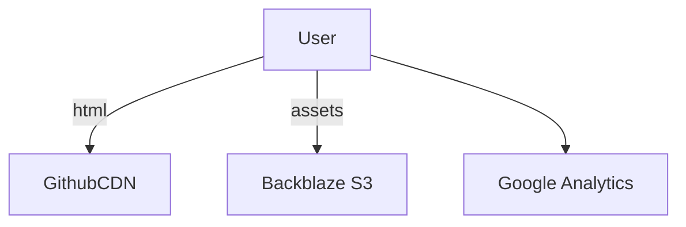
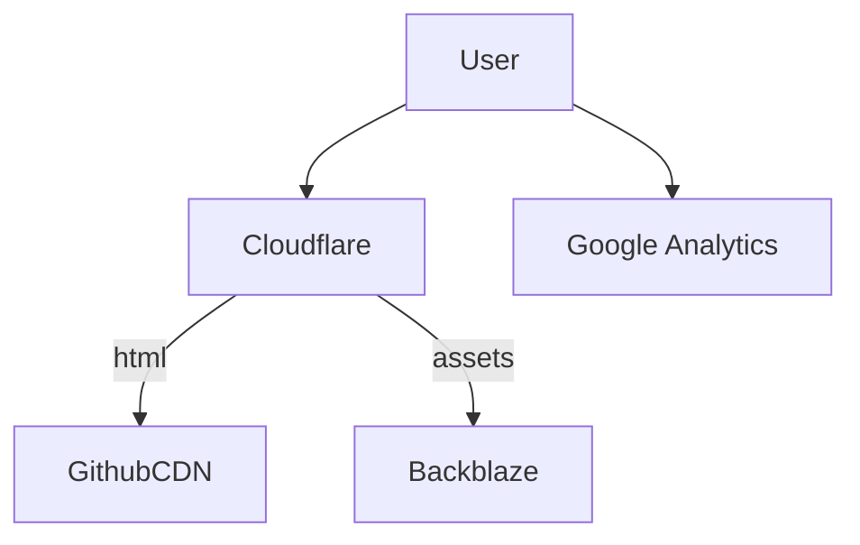

Readers of my blog have unknowingly been contributing to something I shamefully admit: I've been tracking you. I know when you view my blog site, where you're from, what you're looking at, when you click on elements, and for how long you stay on my pages. This is made quite simple, actually. However, I realized my site tracking is no longer totally effective, and I found another easy way around it. This is how.

<!-- more -->

## Google Analytics

If you look at the HTML source code on every page of my blog site, you'll see this section in the `#!html <head>`:

```html
<script id="__analytics">
function __md_analytics() {
    function e() {
        dataLayer.push(arguments)
    }
    window.dataLayer = window.dataLayer || [], e("js", new Date), e("config", "G-F9YVCCMVEX"), document.addEventListener("DOMContentLoaded", (function() {
        document.forms.search && document.forms.search.query.addEventListener("blur", (function() {
            this.value && e("event", "search", {
                search_term: this.value
            })
        }));
        document$.subscribe((function() {
            var t = document.forms.feedback;
            if (void 0 !== t)
                for (var a of t.querySelectorAll("[type=submit]")) a.addEventListener("click", (function(a) {
                    a.preventDefault();
                    var n = document.location.pathname,
                        d = this.getAttribute("data-md-value");
                    e("event", "feedback", {
                        page: n,
                        data: d
                    }), t.firstElementChild.disabled = !0;
                    var r = t.querySelector(".md-feedback__note [data-md-value='" + d + "']");
                    r && (r.hidden = !1)
                })), t.hidden = !1
        })), location$.subscribe((function(t) {
            e("config", "G-F9YVCCMVEX", {
                page_path: t.pathname
            })
        }))
    }));
    var t = document.createElement("script");
    t.async = !0, t.src = "https://www.googletagmanager.com/gtag/js?id=G-F9YVCCMVEX", document.getElementById("__analytics").insertAdjacentElement("afterEnd", t)
}
</script>
```

This clever little piece of javascript creates a number of _event listeners_. When you interact with anything on the page (including loading it), your browser is instructed to send an event to Google analytics describing what happened. If you open up my post on the [Colorado San Juan Mountains](2025-12-09-san-juan-mountains.md), open up the dev tools, and click on one of the post sections, you'll see your browser make a `POST` request. Here's an example:


Drilling down specifically, you'll see the magic in the query parameters:

```
https://www.google-analytics.com/g/collect?v=2&tid=G-F9YVCCMVEX&gtm=45je5ca1v9127027317za200zd9127027317&_p=1766964049058&gcd=13l3l3l3l1l1&npa=0&dma=0&cid=246115484.1737435637&ul=en-us&sr=3440x1440&uaa=arm&uab=64&uafvl=Google%2520Chrome%3B143.0.7499.170%7CChromium%3B143.0.7499.170%7CNot%2520A(Brand%3B24.0.0.0&uamb=0&uam=&uap=macOS&uapv=15.6.1&uaw=0&are=1&frm=0&pscdl=noapi&_eu=AEAAAAQ&_s=2&tag_exp=103116026~103200004~104527906~104528501~104684208~104684211~105391252~115583767~115938465~115938468~116184927~116184929~116251938~116251940&sid=1766962961&sct=24&seg=1&dl=https%3A%2F%2Ftopofmind.dev%2Fblog%2F2025%2F12%2F09%2Fcolorado-san-juan-mountains%2F&dt=Colorado%20San%20Juan%20Mountains%20-%20Top%20of%20Mind&en=scroll&epn.percent_scrolled=90&_et=12470&tfd=24965
```

Or formatted more legibly and filtered for the most relevant fields:

| Key                  | Value                                                                                                                                       |
| -------------------- | ------------------------------------------------------------------------------------------------------------------------------------------- |
| tid                  | G-F9YVCCMVEX                                                                                                                                |
| sr                   | 3440x1440                                                                                                                                   |
| uaa                  | arm                                                                                                                                         |
| uab                  | 64                                                                                                                                          |
| uafvl                | Google Chrome;143.0.7499.170 | Chromium;143.0.7499.170 | Not A Brand;24.0.0.0                                                               |
| uap                  | macOS                                                                                                                                       |
| dl                   | [https://topofmind.dev/blog/2025/12/09/colorado-san-juan-mountains/](https://topofmind.dev/blog/2025/12/09/colorado-san-juan-mountains/)    |
| dt                   | Colorado San Juan Mountains - Top of Mind                                                                                                   |
| en                   | scroll                                                                                                                                      |
| epn.percent_scrolled | 90                                                                                                                                          |

From this payload alone, I know:

1. What you did (you scrolled)
2. What your OS is
3. What your browser is
4. What page you were accessing
5. Your computer's architecture
6. Your screen resolution.

Google's analytics service itself will also be able to infer your IP and some general geographic information just based on the TCP parameters of your request. I have now captured an incredible amount of insight into how all of my users behave, and can even watch you as you go from page to page.

After a while, I realized that my analytics probably didn't capture all of the users on my website because many browsers block external trackers such as Google Analytics. The test I demonstrated above was using Google Chrome, but one thing to realize is that Google has a vested interest in _not_ blocking trackers for many reasons that are obvious. In case it's not, Google makes money from targeted ads, so the more information they can collect from you, the more effective their ads are. Also, they want their Google Analytics platform to be as effective as possible which means sending as much traffic as possible.

## Safari is Better Than Chrome

We can do the same test with Safari and see whether or not trackers are, erm, tracking us. Apple spends a lot of time telling people how secure and private their browser is. They even have a "Privacy Report" you can look at to see all the trackers they've prevented:


So do they? Well, surprisingly, no. At least not by default on my environment. We open the network tab and see that the exact same `collect` requests are being made:


That's pretty sneaky! It seems like Safari is outright lying to me. When you go to the Privacy settings at `Safari` > `Settings` > `Advanced` > `Privacy`, you see this option was selected that makes Safari only block trackers when I have a private tab opened.


Setting this to `in all tabs`, we try the same experiment again. This time, no matter how much button mashing I do, there are no `collect` requests being made. To be fair to Chrome, we should check if the same kind of setting exists. To the shock of no one, this is way more complicated than it needs to be. Chrome has no native way to block trackers, and the only way to do this is by installing a third-party Chrome extension called [Privacy Badger](https://chromewebstore.google.com/detail/privacy-badger/pkehgijcmpdhfbdbbnkijodmdjhbjlgp?hl=en-US&pli=1) that has 4.4 stars.

This is the lesson to learn: 

!!! tip

    Google wants your attention. Apple wants you to buy its hardware. These are two fundamentally different postures that affect how they approach privacy.

## A Way Around

So what's my method for getting around this problem? At some fundamental level, your browser _has_ to make a request to my servers in order to get its content. You can't do anything about that. Here's the grand reveal: Cloudflare.

I admit that the thesis of this post is a bit click-baity, because relying on Cloudflare doesn't actually do much for me in the way of tracking where you go on a page, but I can still follow your journey as your IP address from my perspective walks around the various sites in my page. Here's the system design I used to have:



The part where the user reaches out to Google is what many browsers like Safari block. Here's how I rearchitected the backend:



Browsers like Chrome will still reach out to Google Analytics if configured to do so, but the key difference is that all traffic to my website flows through Cloudflare. What kind of information can I now track? Obviously the capabilities I have to _profile_ you solely through Cloudflare is far reduced, but the metrics are still quite useful for many things.


There's a few other useful attributes Cloudflare can capture:

- Source IPs (of course)
- Source [ASNs](https://en.wikipedia.org/wiki/Autonomous_system_(Internet)) (to see what your ISP is)
- Real user monitoring of page performance

When looking over the last 7 days, Cloudflare says I had 2,300 page views while Google Analytics said I have only 289. That's an enormous difference, which tells us that 88% of the traffic going to my website is not being captured by Google Analytics! The other interesting thing to note in the `Source browsers` metric above is that the vast majority of requests did not self-identify their browser types. The next two most common self-identified browsers were ChromeMobile and Chrome. It's impossible to know exactly what these are. The most likely theory is that it's a combination of bots and properly-anonymized human activity.

Still, the number of Safari browsers identifying themselves is too high, so lock down your browsers people. Don't forget to disable website tracking. And for the love of god, don't use Chrome.