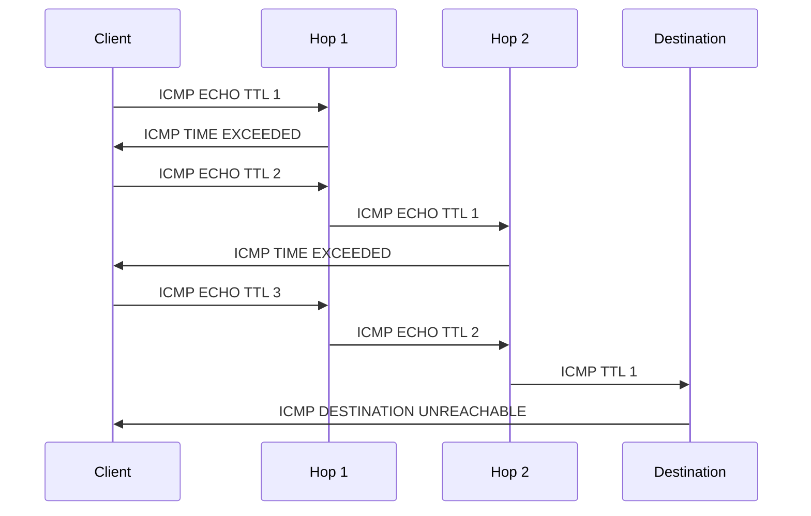
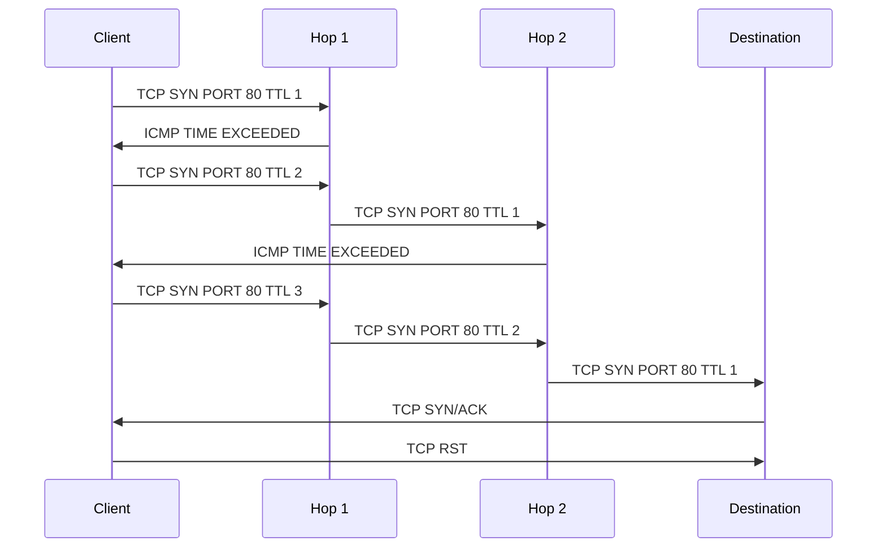

This section describes how various path tracing utilities work (in general).

When using ICMP mode, the tools will follow this general pattern:

1. Set the TTL field of the ICMP packet to 1.
2. Send this packet to the _destination_ address.
3. The first router in the path will decrement the TTL by 1, making it 0. This indicates to the router that the packet should be discarded.
4. The router replies with an "ICMP Time Exceeded" message that will identify the router to the tracepath utility.
5. The utility sends a new packet to the destination with TTL 1 higher than before, repeat from step 2.
6. Once the packet reaches the destination host, it replies with an ICMP echo reply.

Some of the challenges with ICMP:

1. Not all routers participate in ICMP Time Exceeded replies.
2. Some routers won't even decrement at all!
3. Asymmetric routing may differ from the forward path.
4. Some firewalls block ICMP.

To get around ICMP being blocked, there are other options, such as:

1. Using UDP packets (which are almost never blocked). `traceroute` does UDP probing by default.
2. Using TCP SYN probes.

## Utilities

The common utilities for network tracing are:

1. tracepath
2. traceroute
3. mtr

MTR is probably the most featured option; I recommend it for most use-cases. You can install it with most typical repositories:

=== brew

    ```
    brew install mtr
    ```

=== apt

    ```
    apt install mtr
    ```

=== yum

    ```
    yum install mtr
    ```

## ICMP Tracing



The `ICMP TIME EXCEEDED` message contains the IP of the router in which the TTL was exceeded. ICMP packets are encapsulated in IP headers. The header includes the first 64 bits of the original datagram's data, which allows the client to match the message to the appropriate process that initiated the tracing procedure.

The interesting thing to note is that ICMP tracing involves sending packets to a high-numbered port that is likely to _not_ have any process attached. When the ICMP packet arrives at the destination, a `DESTINATION UNREACHABLE` message is sent in reply, indicating the end of the packet's network path.

## TCP Tracing



TCP tracing works similarly to ICMP. Instead of using a plain ICMP packet, it uses the TCP protocol (which itself is also encapsulated in IP packets, of course) to appear to firewalls as legitimate traffic. It targets a specific port, usually 80 although it can be whatever port you'd like. Each hop in the route will send back the typical `ICMP TIME EXCEEDED` message when the TTL expires. The main difference is that the destination will reply with either a `TCP SYN/ACK` (in the case there is a process accepting connections on the port) or a `TCP RST` (in the case the destination rejects the connection). In either case, this is confirmation to the client that the packet has reached its final destination.

## Asymmetric Routing

These tools will often report when the packets go through different routers between the forward and return trips. Asymmetry can be detected in the following ways:

1. Inconsistent IPs for the same hop during subsequent probes.
2. Inconsistent RTT (round-trip-time) latency. Hops at higher indicies should always have higher latency. If this is not the case, it indicates possible routing asymmetry.
3. ICMP Time Exceeded response TTL is unexpected. The TTL in the response packet header should contain more or less the same number of decrements as expected for the number of hops.
