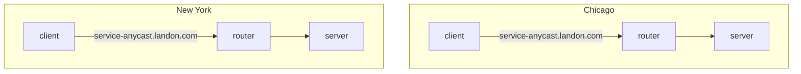
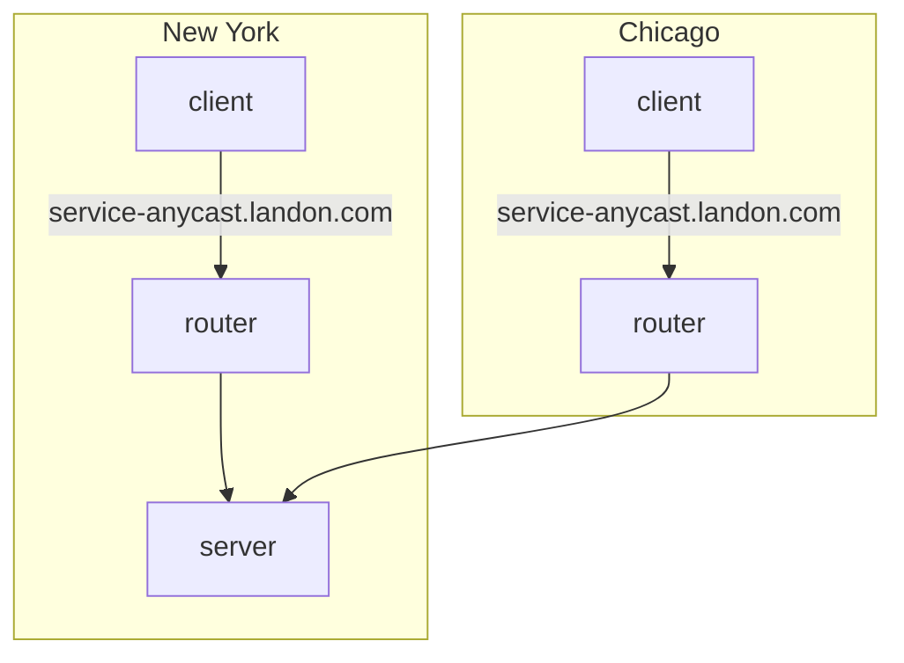
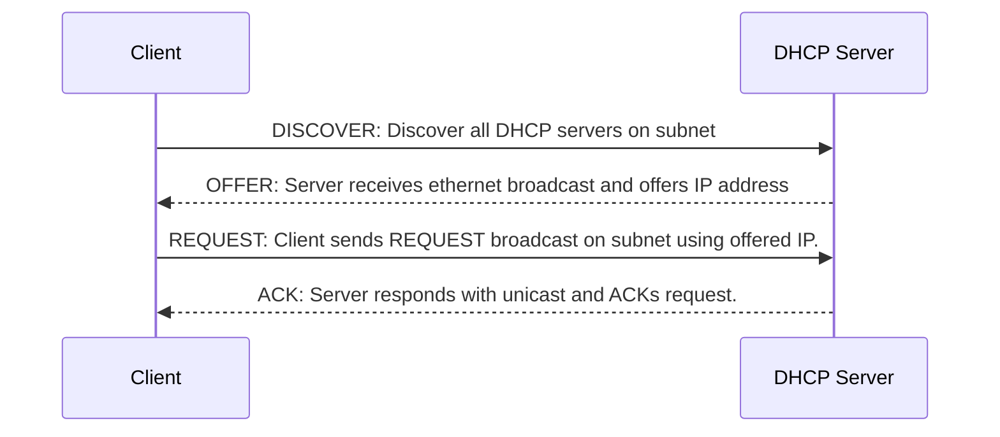

Anycast
-------

Anycast is a form of network routing whereby multiple servers share the same IP address, and messages to that IP address are routed to the server that is topographically the closest. Traffic to the IP address is routed according to the routing tables set up in the network's router. Administrators will often configure their routers to point to the geographically nearest server, although the scheme is flexible enough to allow re-routing to a different physical location should the need arise.



Administrators have the ability to change the routing in Chicago to New York, without needing any changes to the client.



Anycast is a popular way to route to DNS servers, as it removes the need for clients to understand where they are geographically, or to maintain a list of appropriate DNS servers. This is maintained by the network administrators via the routing tables.

Multicast
---------

Multicast is a routing mechanism that acts similar to a pub-sub topic. The typical IPv4 range is 224.0.0.0/4, which encompasses 224.0.0.0 to 239.255.255.255. Multicast is implemented using the Internet Group Management Protocol (IGMP). Clients must issue an IGMP JOIN command to the nearest switch or router to indicate it wants to be a member of the particular multicast group, identified as one of the aforementioned IP addresses. The router/switch maintains a list of hosts subscribed to each group and forwards the traffic to each IP in the list.

Kernel Routing Tables
---------------------

```
$ netstat -rn
Kernel IP routing table
Destination     Gateway         Genmask         Flags   MSS Window  irtt Iface
0.0.0.0         7.151.164.131   0.0.0.0         UG        0 0          0 eno1
7.0.0.0         7.151.164.131   255.0.0.0       UG        0 0          0 eno1
7.151.164.128   0.0.0.0         255.255.255.128 U         0 0          0 eno1
$ ip r s
default via 7.151.164.131 dev eno1 proto static metric 100
7.0.0.0/8 via 7.151.164.131 dev eno1 proto static metric 65024000
7.151.164.128/25 dev eno1 proto kernel scope link src 7.151.164.166 metric 100
7.151.176.0/21 dev ib0 proto kernel scope link src 7.151.181.31 metric 150
```

DHCP
----

DHCP, or Dynamic Host Configration Protocol, is a protocol used to dynamically assign IP address to hosts within its network. DHCP can also be used to send live kernel images, which is how many netbooting is performed.



### DISCOVER

Discover messages are sent out on the subnet the host is configured with using the broadcast address specific to the client's subnet. For example, in the case the subnet is located at 192.168.0.0/16, the broadcast address would be 192.168.255.255.

Clients can also request a specific IP address if desired. If not requested, the DHCP server will offer a random address from within its pool.

### DECLINE

There can be situations in which two clients are errnoneously allocated the same IP address. When a client receives an ACK from its DHCP server, indicating that particular server granted the IP lease, the client should use ARP to discover if any other computer on the subnet is using the same address. In the case the client determines this to be true, it should send a DECLINE broadcast to reneg the lease.

### RELEASE

When a client is done with an IP address, it can send a RELEASE broadcast to reneg the lease.

### Netbooting/PXE

DHCP servers can be configured to provide a `next-server` address, which is provided to the DHCP client when an IP address is given. Netbooting is not strictly part of the DHCP spec, but is rather executed as part of the PXE (Preboot Execution Environment) specification. A PXE boot utilizes the `next-server` address and `filename` parameters provided from DHCP that indicates an TFTP server that serves a loadable bootstrap program. When a client receives these parameters, it then initiates a download from the listed TFTP server and loads the bootstrap program. This interaction is usually done entirely in firmware on the NIC.

Arista MetaWatch
-----------------

https://www.arista.com/en/products/7130-meta-watch

Arista is a company that provides various networking solutions. They have developed a switch application called MetaWatch that you can install into your Arista 7130L Series devices. This application allows you to dynamically tap incoming ports in hardware instead of needing to use physical optical taps. The application can be configured to aggregate incoming ports into outgoing ports, which is a form of port multiplexing, AKA link aggregation, AKA port aggregation.

The power of in-hardware tapping is that you can dynamically re-assign where incoming ports are sent to without needing any physical work. The downside is that because the port aggregation/tapping is done in physical computing hardware, you can get into buffer overflow issues and drop packets. In practice this is usually not an issue, but it is a consideration that must be made.

Ethernet
--------


### Frame Check Sequence (FCS)

This is an error-detecting code added to the end of an ethernet frame to detect corruption in the packet. A common implementation for FCS is that the receiver will compute a running sum of the frame, including the trailing FCS. The summation is expected to result in a fixed number, often zero. Another common algorithm is the [CRC](https://en.wikipedia.org/wiki/Cyclic_redundancy_check).


## DNS

Types of DNS record types

| Name | Description |
|------|-------------|
| A record | The most common. It maps a name to an IP address |
| AAAA record | Same as A record, but points to an IPv6 address. |
| CNAME | Short for "canonical name," it creates an alias for an A record. Remember, these point to other A records, not to IP addresses. |
| NS | A nameserver record specifies DNS servers for a particular domain. |
| MX record | Mail Exchange records shows where emails for a domain should be routed to. |
| SOA | Start of Authority records stores admin info about a domain. Includes email of admin and other things as well. |
| TXT | A Text record stores arbitrary data |
| SRV | This record stores the IP and port of particular services. |
| CERT | Stores public key certificates. |
| DCHID | Stores information related to DHCP. |
| DNAME | A Delegation Name record allows you to redirect entire subdomains to a new domain. For example, `www.example.com` is often redirected to `example.com` in many companies, as the `www` prefix is often not actually used. |

## TCP

### Keepalive

Keepalive is an OS parameter that tells the OS to regularly send empty TCP packets across the network every so often in order to keep the connection alive and prevent network components from expiring the connection.

For example, in the `/etc/sysctl.conf` file, you can set these parameters:

```
net.ipv4.tcp_keepalive_time = 600
net.ipv4.tcp_keepalive_probes = 9
net.ipv4.tcp_keepalive_intvl = 25
```

If you find your TCP connections are hanging or being closed unexpectedly, it's possible they are being dropped by NAT or firewall.

Relevant Links:

- [TCP Keepalive Howto](https://tldp.org/HOWTO/TCP-Keepalive-HOWTO/overview.html)

### SSH Optimizations

TCP has a common problem in high-latency/lossy network paths where it will spend a lot of time establishing connections, acking packets, and re-sending packets. rsync uses SSH, which uses TCP to send data over the wire. OpenSSH does not provide any means of tuning TCP parameters, but there is an OpenSSH fork called [HPN-SSH](https://www.psc.edu/hpn-ssh-home/hpn-ssh-faq/) that provides options for you to tune things like:

1. [TCP Recieve buffer size](http://www.linux-admins.net/2010/09/linux-tcp-tuning.html)
2. TCP send buffer size
3. TCP window size

These parameters can be increased to provide more tolerance to lossy or high-latency networks. In addition, you might also want to select different SSH ciphers to reduce load on the CPU. [Here is a great blog](https://blog.twogate.com/entry/2020/07/30/benchmarking-ssh-connection-what-is-the-fastest-cipher) on various benchmarks that were performed on commonly-available ciphers.

[Redhat has a blog on how to set buffer sizes.](https://access.redhat.com/documentation/en-us/red_hat_enterprise_linux/5/html/tuning_and_optimizing_red_hat_enterprise_linux_for_oracle_9i_and_10g_databases/sect-oracle_9i_and_10g_tuning_guide-adjusting_network_settings-changing_network_kernel_settings)

```
# sysctl -w net.core.rmem_default=262144
# sysctl -w net.core.wmem_default=262144
# sysctl -w net.core.rmem_max=262144
# sysctl -w net.core.wmem_max=262144
```

## rsync

### Optimizations

rsync relies on SSH, and many optimizations can be applied to it [as shown here](#ssh-optimizations). This is where most of your performance improvements will come from.

The main method for improving aggregate rsync throughput is to spawn more processes so that more streams are being sent simultaneously. A single rsync process will eventually hit a max throughput, which is limited by TCP handshakes and retransmits. Some optimizations you can do:

1. Increase TCP window size (more data sent per round trip)
2. Increase TCP send buffer size (kernel parameter)
3. Increase TCP receive buffer size (kernel parameter)

## [RDMA](https://en.wikipedia.org/wiki/Remote_direct_memory_access)

Remote Direct Memory Access is a method of direct memory access across the network that does not involve either server's operating system.

### [RoCE](https://en.wikipedia.org/wiki/RDMA_over_Converged_Ethernet)


RDMA over Converged Ethernet is an RDMA implementation over ethernet. It utilizes an Infiniband payload encapsulated by ethernet. RoCE's goal is to port Infiniband's specification of how to do RDMA over an ethernet network. This is why the Infiniband payload is encapsulated as that protocol is still used on the host side to perform the RDMA access.

ARP
----

Address Resolution Protocol is used for mapping MAC addresses to IP addresses. This is often used by routers on a local network to figure out what host (or MAC) has been assigned a specific IP.

[MIME Types](https://en.wikipedia.org/wiki/Media_type)
----------

Media Types (or formerly known as MIME types) are names given to particular message formats. Historically this has been used in HTTP to define what kind of data is in the message body, but it is more broadly applicable to any kind of messaging protocol. The Media type is roughly analagous to a file extension.

Network Namespace
-----------------

Linux allows you to create a "network namespace" that acts kind of like a chroot but for network interfaces. It allows you to isolate a process from the host's network cards and create your own virtualized network topology.

https://medium.com/@tech_18484/how-to-create-network-namespace-in-linux-host-83ad56c4f46f

NCCL
----


NCCL stands for NVIDIA Collective Communication Library. It is a library used in applications that need to do collective, cross-GPU actions. It's topology-aware and allows an abstracted interface to the set of GPUs being used across a cluster system, such that applications don't need to understand where a particular GPU resides.

Load Balancing
--------------

### Layer 2 Direct Server Return (DSR)


DSR is a method of load balancing whereby the server sitting behind the load balancer will reply directly to the originating client instead of through the LB. The general flow is as follows:

1. Client packets arrive in the load balancer.
2. The load balancer makes a decision on which backend to forward to. It will modify the destination MAC address in the ethernet frame to the chosen backend and retransmit the packet to the MAC of its chosen backend (this is critical to make it appear to the layer 2 network that the packet did not originate from the LB).
3. The chosen backend receives the packet. Because the layer 3 IP frame was untouched, the packet appears in all respects as if it came from the originating client. Thus, the backend will respond directly to the client IP through the default IP gateway.

It should be noted that, of course, the backends and the load balancer need to be configured with a VIP. When the LB forwards the packet to the backend, the destination IP is unchanged, only the destination MAC. So this means that the LB and the backend services need to be on the same layer 2 network. Because all the backends are configured with the same VIP, they will respond to the LB-forwarded packet.

Topologies
----------

### [Rail-Optimized](https://infohub.delltechnologies.com/zh-cn/l/generative-ai-in-the-enterprise-with-nvidia-gpus-and-dell-powerswitch-networking/rail-optimized-topology/


In this topology, each NIC is connected to a different switch (or spine-leaf network) and is called a rail (represented by a unique color in the following figure). The rails are also interconnected at an upper tier. Therefore, this topology provides two ways to cross rails: through the Scale Up fabric (preferred) or through the upper tier of the Scale Out topology.

For example, to communicate with GPU 8 on server 2, GPU 4 on server 1 can either:

1. Transfer its data into the memory of GPU 8 on server 1. Then GPU 8 on server 1 communicates through NIC 8 on server 1 with GPU 8 on server 2, through NIC 8 on server 2. This path is shown with purple lines in Figure 14.
2. Send its data to NIC 4 on server 1, which can reach through the upper tier to NIC 8 on server 2, coupled with GPU 8 on server 2.

This property allows AI workloads to perform better on a Rail-Optimized topology than on a Pure Rail topology because the current Collective Communication Libraries are not yet fully optimized for the Pure Rail topology. As such, the Rail-Optimized topology is the recommended topology to build a Scale Out fabric.

