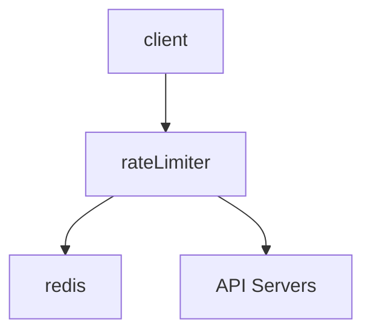
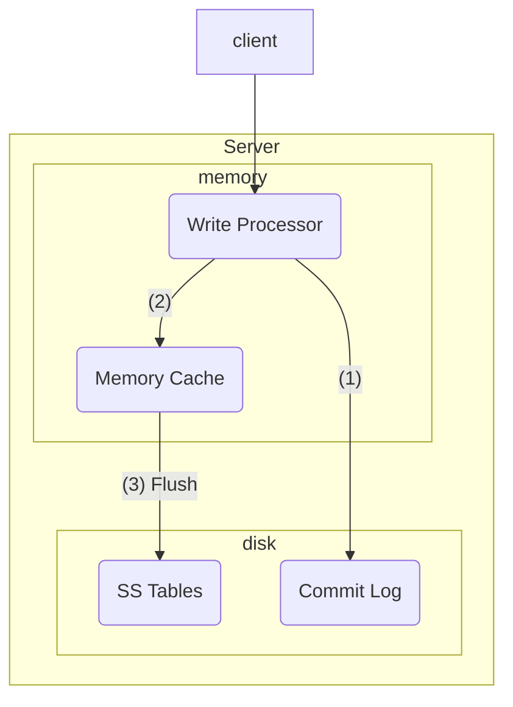
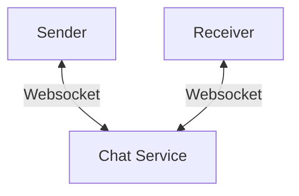
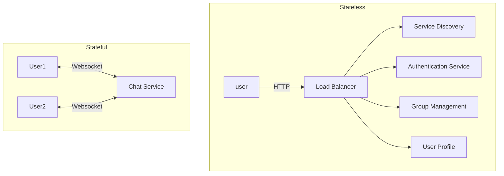
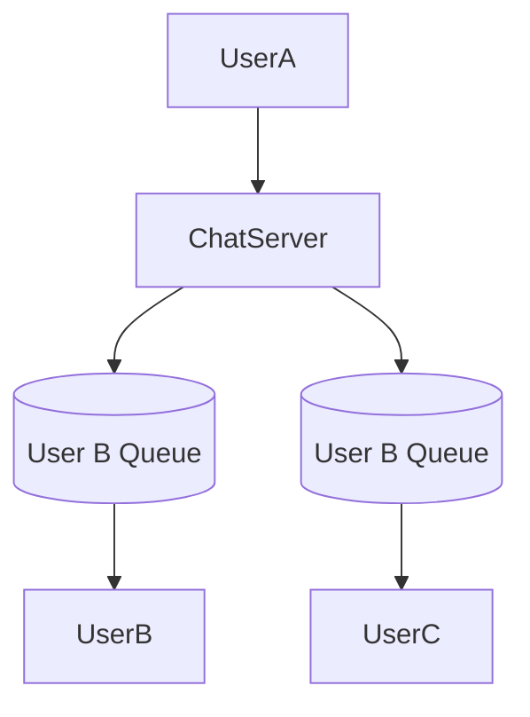

https://books.google.com/books/about/System_Design_Interview_An_Insider_s_Gui.html?id=b_mUzQEACAAJ&source=kp_book_description

## Chapter 1: Scale from Zero To Millions of Users

**Database Sharding**

Sharing is a horizontal scaling technique used in databases whereby multiple databases share the same schema, but will store different sets of data. Where a specific piece of data goes depends on the sharding key.

Sharding has many problems:

1. Resharding data: one shard might become too saturated due to uneven data distribution. This requires changing the sharding function and moving data around.
2. Celebrity problem: what if Lady Gaga gets put on a single shard? Now that shard will be overloaded with reads.
3. Joins: corss-shard joins become difficult (you need to think about how to optimize your query by considering where the data lives).

## Chapter 2: Back-of-the-Envelope Estimation

Back-of-the-envelope estimations are typically asked for in system design interviews.

Tips:

- Write down your assumptions
- Label your units
- Write down QPS (queries per second), peak QPS, storage, cache (if applicable), number of servers etc.

### Power of Two

| power | approximate value | full name | short name |
|-------|-------------------|-----------|------------|
| 10 | 1 Thousand | 1 Kilobyte | 1 KB |
| 20 | 1 Million | 1 Megabyte | 1 MB |
| 30 | 1 Billion | 1 Gigabyte | 1 GB |
| 40 | 1 Trillion | 1 Terabyte | 1 TB |
| 50 | 1 Quadrillion | 1 Petabyte | 1 PB |

### Latency numbers

Here are some typical latency numbers every programmer should know:

| Operation Name | Time |
|----------------|------|
| L1 cache reference | 0.5 ns |
| Branch mispredict | 5 ns |
| L2 cache reference | 7 ns |
| Mutex lock/unlock | 100 ns |
| Main memory reference | 100ns |
| Compress 1K bytes with Zippy | 10,000 ns = 10 μs |
| Send 2K bytes over 1Gbps network | 20,000 ns = 20 μs |
| Read 1 MB sequentially from memory | 250,000 ns = 250 μs |
| Round trip within the same datacenter | 500,000 ns = 500 μs |
| Disk seek | 10,000,000 ns = 10 ms | 
| Read 1 MB sequentially from network | 10,000,000 ns = 10 ms |
| Read 1 MB sequentially from disk | 30,000,000 ns = 30ms |
| Send packet (California -> Netherlands -> California) | 150,000,000 ns = 150ms |

### Availability numbers

Usually measured in "nines", or number of 9's digits. Example: 3 nines is 99.9% availability.

## Chapter 3: A Framework for System Design

#### 4-step process for interview

1. Understand the problem and establish design scope
    - Do not rush into starting a solution. Slow down, ask questions, and think deeply about the requirements and assumptions. This is extremely important.
    - When you ask a question, the interviewer will either answer or tell you to make an assumption. In either case, write down the answer, or the new assumption you have to make.
    - Ask questions to understand the requirements. Examples:
        - What specific features are we going to build?
        - How many users does the product have?
        - How fast does the company anticipate to scale up?
        - What is the company's technology stack? What existing services you might leverage to simplify the design?
2. Propose high-level design and get buy-in
    - Come up with an initial blueprint. Ask for feedback. Treat your interviewer as a teammate and work together.
    - Draw box diagrams with key components on a whiteboard or paper.
    - Do back-of-the-envelope calculations to evaluate if your blueprint fits the scale constraints. Think out loud. Communicate with interviewer if back-of-the-envelope is necessary before diving into it.
    - Go through a few concrete use-cases
    - Should we include API endpoints and database schema? What level of detail are we looking for?
3. Design deep dive
    - You and the interviewer should have already agreed on the following objectives:
        1. Agreed on overall goals
        2. Sketched out high-level blueprint for overall design
        3. Obtained feedback from interviewer on high-level design
        4. Had some intial ideas about areas to focus on based on interviewer's feedback
4. Wrap up
    - Interviewer might ask a few follow up questions:
        1. Identify system bottlenecks and potential improvements
        2. Might be useful to give the interviewer a recap of the design. Refreshing the interviewer's memory is helpful.
        3. Error cases?
        4. Operation issues. How do support this system in on-call? Observability/monitoring/logging?
        5. How to scale this up? If your design can handle 1 million users, what changes have to be made to scale to 10 million?
        6. Propose other refinements

##### Do's and Don'ts

**Dos**:

1. Ask for clarification. Do not assume assumption is correct.
2. Understand the requirements
3. There is no right answer nor the best answer. 
4. Let the interviewer know what you are thinking.
5. Suggest multiple approaches if possible.
6. Once you agree on blueprint, go into detail on each component. Design most critical components first.
7. Bounce ideas off interviewer
8. Never give up

**Don'ts**:

1. Don't be unprepared for typical interview questions
2. Don't jump into a solution without clarifying requirements
3. Don't go into too much detail on a single component. Start at high-level, then drill down where appropriate.
4. If you get stuck, don't hesitate to ask for hints.
5. Don't think in silence.
6. Don't think the interviewer is done when you give the design. Ask for feedback early and often.

#### Time allocation

Allocated 45 minutes or an hour is typical, but not enough to entirely flesh out a full system.

Step 1: understanding problem and design scope (3-10 minutes)

Step 2: Propose high-level design (10-15 minutes)

Step 3: Design deep dive (10-25 minutes)

Step 4: Wrap up (3-5 minutes)

## Chapter 4: Design a Rate Limiter

(these are just my notes of what the author would ask in such an interview)

### Step 1

1. What kind of rate limiter? Client or server side? Answer: server side.
2. Does the rate limiter throttle API requests based on IP, user ID, or other property? Answer: It should be flexible enough to support different kinds of throttle rules.
3. Scale of the system? Startup-scale or big company with large user base? Answer: Large number of users
4. Will the system work in a distributed environment? Answer: yes.
5. Is the rate limiter a separate service or is it implemented in application code? Answer: it's a design decision up to you.
6. Do we need to inform users when they're throttled? Answer: yes.

**Requirements**

1. Accurately limit excessive requests
2. Low latency
3. Use as little memory as possible
4. Distributed rate limiting. Rate limiter should be shared across multiple processes/servers.
5. Exception handling: show clear message to the user
6. High fault tolerance: any problems with rate limiter will not affect the entire system.

### Step 2

Where to put rate limiter? You could put it as a separate microservice next to the API servers, but this introduces an issue of the API servers needing to potentially query the rate limiter. It's not a scalable solution.

Cloud microservices usually implement rate limiting within an API gateway, in front of the API servers. 

These two implementations are both valid, but have various pros/cons. Things to consider:

1. Company's current tech stack
2. Identify rate limiting algorithm that meets business needs. You have much control if you implement your own solution. Using a third-party API gateway might limit you in your choices.
3. Building your own limiter takes time.

#### Choice of algorithms

1. Token bucket
    - Very common, well-understood.
    - Used by large companies like Amazon and stripe.
    - A bucket can contain a certain number of tokens. A refiller will periodically add a token to the bucket.
    - Consumers of the API grab a token. If no token exists, the request is rate limited.
    - Pros:
        - easy to implement
        - memory efficient
        - Allows bursts in traffic for short periods
    - Cons:
        - Two parameters to the algorithm might be challenging to tune properly.
2. Leaking bucket
    - Requests go into a queue. If the queue is full, the request is dropped.
    - The queue is processed at a fixed rate.
    - Pros:
        - Memory efficient given limited queue size
        - Requests are processed at a fixed rate, so it's suitable in cases where a stable outflow is needed.
    - Cons:
        - Bursts of traffic will fill up the queue with old requests. New requests will get dropped.
        - Two parameters to the algorithm (queue size, outflow rate) might be difficult to tune.
3. Fixed window counter algorithm
    - Each time window is allowed only a certain number of requests. If a request comes in when that limit is reached, it's dropped.
    - Pros:
        - Memory efficient
        - Easy to understand
        - Resetting available quota at the end of time unit might fit some use cases.
    - Cons:
        - Spike in traffic can cause more requests to come through than what is intended/allowed.
4. Sliding log window
    - Keeps track of request timestamps, cached in something like redis.
    - When new request arrives, remove timestamps from redis bucket that are older than `now - window_size`.
    - Add new request timestamp to bucket
    - If bucket size is less than or equal to max allowed size, allow the request. Otherwise, deny it.
    - Note: the main difference between the sliding log window and the fixed window is that the boundary of the fixed window is set on some regular interval (something like every second, or every minute, or every hour).
    - Pros: 
        - Rate limiting is very accurate. In any rolling window, requests will not exceed the limit.
    - Cons:
        - Memory intensive. Timestamps still need to be stored in memory even if the request is rejected.
5. Sliding window counter
    - We use a set of predefined time windows, as in the Fixed Window algorithm, that have boundaries on some regular interval.
    - We use another sliding window that overlaps these fixed windows.
    - To calculate the number of requests in our rolling window, we:
        - Calculate the number of requests in the previous minute. Multiply it by the percentage of which our sliding window overlaps with the previous window.
        - Calculate the number of requests in the current minute
        - Formula: `requests_current_window + (requests_previous_window * percent_overlap_previous_window)`.
    - Pros:
        - Smooths out spikes in traffic
        - Memory efficient (only have to store the requests counts of a few fixed windows)
    - Cons:
        - Assumes that the distribution of the previous window is uniform. Consequently, it might incorrectly block a request. For example, consider if all requests for the previous window came towards the beginning of the window. When we run our calculation, the average number of requests in the previous window might put us over our limit, even if our sliding window does not overlap when the previous requests happened.
        - Author notes that according to experiments at Cloudflare, only 0.003% of requests are incorrectly rate-limited or allowed over 400 million requests.

The author's high-level overview is as such:

### Step 3

A basic data structure in Redis is to have a single counter value that we increment/decrement. Race conditions arise when you have multiple API gateway instances trying to read this counter value. This can be solved by:

- Using locks (not preferrable as they slow down the system)
- [Sorted set data structure](https://redis.io/docs/data-types/sorted-sets/)
- Lua scripts (I don't know what the author means by this).

We want a centralized datastore like redis so that all rate limiter instances hit the same backing store. 

!!! question

    A question to myself is whether you should have one big-ass redis cluster for the whole world (probably not) or if you should have a single redis cluster for every datacenter (or region). With anycast DNS (or geocast), it might be sufficient for the rate limiters local to a specific datacenter to only use a redis backend specific to that datacenter. I can't immediately think of any reason why this wouldn't work.

The author does note that you want to synchronize the data across datacenters with an eventual consistency model. This will come up in Chapter 6.

## Chapter 5: Design Consistent Hashing

Notes on using different hashing methods to route your requests to a specific server.

### The rehashing problem

Using the hash method `serverIdx = hash(key) % N` works when server size is fixed, but if you add more servers, then the mappings will get reshuffled quasi-randomly. This causes tons of cache misses and will tank performance.

### [Consistent Hashing](https://en.wikipedia.org/wiki/Consistent_hashing)

Consistent hashing is the answer to the rehashing problem. I'm going to be borrowing a lot of diagrams from https://www.toptal.com/big-data/consistent-hashing, which is a great blog that describes in detail how consistent hashing works.

- 
- 

The general idea is that both servers and users live within the same hash space. The servers, more often than not, will have a hash key that depends on the name. The users will have a hash that depends on their name, but also possibly their location.

When a user is hashed, we find the closest adjacent server in a counter-clockwise manner (it could also be clockwise, it doesn't matter). When a new server gets added, there is only a small probability that any particular user needs to get re-mapped to a new server. Or in other words, the chance of a new server being blaced _between_ a user and that user's prior server is quite low.

In the case that does happen, a re-mapping will indeed have to occur, but the overall probability is low enough that the cache misses should be minimal.

!!! note

    The author notes that it's very likely for nodes in a hash ring to become too clumped together, which would cause uneven distribution (this is called the Hotspot Key Problem). He notes that for every "real" node, we can inject a finite number of virtual nodes and hash those as well. This effectively causes the hash ring to become more uniformly distributed as it causes the standard deviation (in terms of empty space in the ring) to be smaller.

## Chapter 6: Design a Key-Value Store

We want to design a distributed key-value store. These are the requirements:

1. Key-value pair is small: less than 10KB
2. Store big data
3. High availability
4. High scalability
5. Automatic scaling
6. Tunable consistency
7. Low latency

### CAP Theorem

CAP stands for Consistency, Availability, and Partition Tolerance. The theorem states that a distributed system cannot meet more than 2 of those attributes at once. Partition Tolerance refers to the ability of the system to tolerate its network being unintentionally partitioned/separated (think: split brain scenarios).

Key-value stores are categorized based on which of these attributes they meet:

- CP systems: supports consistency and partition tolerance while sacrificing availability.
- AP systems: supports availability and partition tolerance while sacrificing consistency.
- CA systems: supports consistency and availability while sacrificing partition tolerance. The author notes that because networks can fail, partition intolerance is generally not acceptable.

### Data partitions

We can use the consistent hashing method to partition data! This will minimize data movement when nodes are added/removed. We need to consider how to handle the case when data _does_ need to be moved when we add/remove nodes. We also need to consider how our data will be replicated to multiple nodes for high availability purposes. 

When creating a key, we can simply place it to the first N nodes seen (when rotating clockwise along the hash ring). We ensure that we only look at real nodes, not virtual nodes, to ensure we're not incorrectly writing a key multiple times to the same server.

### Consistency

Quorum consensus can be used to ensure read/write consistency. First some definitions:

- **N** = the number of replicas
- **W** = write quorum size. Write operations must be ack'ed by W replicas to be considered successful.
- **R** = read quorum size. Read must wait for responses from R replicas.

N/W/R can be tuned for various use cases:

- R=1, W=N, system optimized for fast read.
- W=1, R=N, systemm optimized for fast write.
- W+R>N, strong consistency is guaranteed.
- W+R<=N, strong consistency is not guaranteed.

Types of consistency models:

1. Strong consistency: read operations are guaranteed to have the most updated view of the data. Think: GPFS, LustreFS, most on-disk POSIX filesystems.
2. Weak consistency: subsequent read operations not guaranteed to see the most updated view.
3. Eventual consistency: read operations eventually receive the most updated view.

### Inconsistency resolution: versioning

When concurrent writes are made, how do we handle the conflicts. In CVMFS, all concurrent writes go through a serialization step on the publisher. Because it's all transaction based, transactions updates are processed serially, so there is no chance for conflicting writes to happen. CVMFS also explicitly versions each update in the root catalog.

#### [Vector Clock](https://en.wikipedia.org/wiki/Vector_clock#:~:text=A%20vector%20clock%20of%20a,vector%20clock%20maintained%20by%20process)

The author recommend a vector clock as one possible solution. It's a `<server,version>` pair associated with a data item.

### Failure detection

We need to detect failures in our system. There are a few methods of doing this.

#### Gossip Protocol

- Each nodes maintains node membership list, which contains member IDs and heartbeat counters
- Each node periodically increments its heartbeat counter
- Each node periodically sends heartbeats to a set of random nodes, which in turn propagate to other set of nodes
- Once nodes receive heartbeats, membership list is updated to the latest info.
- If heartbeat has not increased for more than predefined period, the member his considered as offline. (question: should a peer eagerly declare to other peers that it considers something offline?)

#### Temporary

In strict quorum approach, reads/writes will be blocked until there is quorum consensus. In a "sloppy quorum" approach, the system chooses the first W healthy servers for writes, and first R healthy servers for reads on the hash ring.

For sloppy quorum, unavailable servers which come back up will go through what's called a "hinted handoff," or in other words, its peers will push changes back to it to achieve consistency.

#### Permanent

What happens if replica is permanently unavailable? We use what's called an Anti-Entropy Protocol. A Merkle Tree is suggested, which surprise surprise, is exactly what CVMFS uses! Merkle trees verify integrity first by comparing the root hash. If the hash is the same, the trees are identical. If they're not, we need to recurse into the tree to find which nodes are different. This can be done in a $O(log(n))$ manner as each node contains hash pointers to its children, so we can easily find what part of the tree is different. Once the differences has been found, we can reconcile the differences.

#### Datacenter outages

Your data must be replicated across multiple datacenters. You can do this by having the client interact with a coordinator that acts as a proxy to the key-value store. Using a consistent hash ring helps resolve this, along with the gossip protocol.

### Write Path

The author proposes a write path that's similar to how Cassandra works.

1. The write request goes to a commit log in a file
2. Data is saved to in-memory cache
3. When cache is full, data is flushed to an SStable (1) on disk.

1. An SSTable is a sorted-string table. It's a sorted list of key/value pairs.

### Read Path

A client will reference the in-memory cache initially. If it's not in the cache, it will be retrieved from disk. We have to find what SSTable contains the key (because they can be dispersed through many). A bloom filter (1) is a common method of solving this.

1. What is a bloom filter? I had heard of this before but wasn't sure what exactly it is. It's a data structure that is used to test if an element is a member of a set. False positives are possible, but not false negatives, so it tells you either "possibly in set" or "definitely not in set." [Geeks for Geeks](https://www.geeksforgeeks.org/bloom-filters-introduction-and-python-implementation/) has a great article on how this works. It's actually quite a simple data structure, but it's very powerful!

### Summary

| Goal/Problems | Technique |
|---------------|-----------|
| Ability to store big data | Use consistent hashing to spread the load |
| High availability reads | Data replication. Multi-datacenter setup |
| High availability writes | Version and conflict resolution with vector clocks |
| Dataset partition | Consistent hashing |
| Incremental scalability | Consistent hashing |
| Heterogeneity | Consistent hashing |
| Tunable consistency | Quorum consensus |
| Handling temporary failures | sloppy quorum and hinted handoff |
| Handling permanent failures | Merkle tree |
| Handling data center outages | Cross-datacenter replication |

## Chapter 7: Design a Unique ID Generator in Distributed Systems

The interviewer asks us to design a unique ID generator that works globally. 

**Step 1**

We need to understand the problem scope. The constraints are:

1. IDs must be unique and sortable
2. It increments by time but not necessarily by 1.
3. It only contains numerical values
4. It should fit into 64 bits
5. The system should be able to generate 10,000 IDs per second

**Step 2**

We need to propose a high-level design. There are a few options:

1. UUID: this is a solution that already exists, however this doesn't work because it doesn't fit in 64 bits.
2. Auto-incrementing ID in a database: also doesn't work because it's not scalable.
3. Ticket server: a single server generates numeric IDs, but it's not scalable because it's a single point of failure.
4. "Twitter snowflake": this is the approach we'll try. Twitter has a system called snowflake that uses a 64 bit ID. These 64 bits are partitioned accordingly:

| bit range | description |
|-----------|-------------|
| 0:1 | reserved for future use |
| 1:42| timestamp |
| 42:47 | datacenter ID |
| 47:52 | machine ID |
| 52:64 | sequence number |

The timestamp is a millisecond-since-epoch timestamp, with the epoch being Nov 04, 2010, 01:42:54 UTC. The sequence number is incremented by every ID generated on the machine, and is reset back to 0 once per millisecond.

**Step 3**

Now let's go into a deep-dive on our design.

The timestamp uses 41 bits so it can only represent 2199023255551 milliseconds, or about 69 years. So this will work only up until sometime in 2079.

The sequence number lets us generate 4096 seqnums per millisecond, so this is the maximum threshold that each server can generate.

**Step 4**

Now we need to wrap up our design. We designed a system that requires no synchronization between ID generators and is capable of scaling out to a huge number of servers. It is not possible to generate duplicate IDs for 69 years, assuming all datacenter IDs and machine IDs (within their datacenter) are unique.

## Chapter 11: Design a News Feed System

I've skipped writing down notes for the previous few chapters as I'm intending to follow solutions for problems that are trivial to me personally (mind you, I still read the chapters obviously, but some of the design questions are fairly simple to me).

In this chapter, we're asked to design a news feed. 

**Step 1**

We need to ask follow-up questions. These are the author's questions:

1. **Question**: What kinds of devices does this run on? **Answer**: Web and mobile app.
2. **Question**: What are the important features? **Answer**: a user can publish a post and see friends' posts on the news feed page.
3. **Question**: Is the news feed sorted by reverse chronological order or any particular order such as topic scores? **Answer**: assume it's sorted by reverse chronological order.
4. **Question**: how many friends can a user have? **Answer**: 5000
5. **Question**: What is the traffic volume? **Answer**: 10 million DAU.
6. **Question**: Can it contain images, videos, or just text? **Answer**: it can contain media files, including images and videos.

These are the kinds of questions I would ask:

1. Can the news feed be populated via ads?
2. Can it be populated with relevant news articles that you may find interesting?
3. What are the latency requirements fom when a friend creates a post, to when it can potentially show up on a user's feed?
4. Can a user decide to hide a particular friend's posts?

**Step 2**

There are two main components to this: feed publishing, and feed building.

### Feed publishing API

To create a post, we send an HTTP POST request to an API:

| method | URL | params |
|--------|-----|--------|
| POST   | /v1/me/feed | <ul><li>content: the text of the post</li><li>auth_token: used to authenticate requests</li></ul> |

### Newsfeed retrieval API

To get the news feed, we do:

| method | URL | params |
|--------|-----|--------|
| GET  | /v1/me/feed | <ul><li>auth_token: used to authenticate requests</li></ul> |

!!! note

    This is not the way I would design such an API. My preference would be for the `POST` request to send to an endpoint like `/v1/me/posts`, which would then return a post ID that you could use to retrieve just that particular post, like `GET /v1/me/posts/51`. Additionally, it might make even more sense for the API to be structured around users. For example, if you wanted to get all posts for a particular user, you could do `GET /v1/users/8192/posts`. Under such a scheme, you would create a post under that user's ID like `POST /v1/users/8192/posts` and get a particular post like `GET /v1/users/8192/posts/51`. The feed for a particular user would be under `GET /v1/users/8192/feed`.

    This is a bit cleaner in my opinion and it makes it clear that every post and feed is specific to a particular user.

**Step 3**

### Fanout service

There are two primary ways to architect this: fanout on write, or fanout on read.

#### Fanout on Write

The feed is pre-computed for every user during write time. It's delivered to a friend's cache immediately after publish.

Pros:

1. Feed generated realtime and can be pushed immediately
2. Fetching feed is fast because it's already been pre-computed.

Cons:
1. If a user has many friends, fetching the friend list and generating feed is slow and time consuming. It's called the hotkey problem.
2. For inactive users, pre-computing the feed is a waste of resources.

#### Fanout on Read

Pros:

1. For inactive users, resources are not wasted on generating a feed.
2. Data is not published to friends so there is no hotkey problem

Cons:

1. Fetching news feed is slow as it's not pre-computed.

You can adopt a hybrid approach where we adtop a fanout-on-write model for most users, but for users like celebreties or well-connected accounts, we can grab the feed on read to prevent system overload. We can use consistent hashing here (yay consistent hashing! :partying_face:)

The fanout service works as follows:

1. Fetch friend IDs from the graph database.
2. Get friends info from the user cache. The system filters based on user settings, for example if the user mutes someone.
3. Send friends list and new post ID to the message queue.
4. Fanout workers fetch data from message queue and store news feed data in news feed cache. The news feed cache is a `<post_id,user_id>` mapping table. Whehter new post is made, it will be appended to news feed table.
5. Store `<post_id,user_id>` in news feed cache. 

### Newsfeed retrieval deep dive

1. A user sends a request to retrieve feed. The request looks like `GET /v1/me/feed`
2. Load balancer redistributes requests to web servers
3. Web server call the news feed service to fetch feed.
4. News feed service gets a list of post IDs from the feed cache.
5. A user's feed is more than just a list of feed IDs. Contains username, profile picture, post content, image etc. Thus, news feed service fetches the complete user and post objects to construct the full news feed.
6. News feed is returned in JSON format back to the client for rendering.

### Cache architecture

- News feed: stores IDs of new feeds
- Content: stores every post data.
- Social Graph: stores user relationships
- Action: stores info on whether a user liked, replied, or took another action on a post.
- Counters: stores counters for likes, replies, followers, following etc

**Step 4**

You can talk about scalability issues with this system. Maybe go into the ways in which other companies have solved this problem, like Twitter, Facebook etc. How might you scale the databases? SQL vs NoSQL? Read Replicas? How to keep web tier stateless? How to cache data? Supporting multiple datacenters? How to handle dead letter queues? Monitoring key metrics?

## Chapter 12: Design a Chat System

The interviewer asks us to design a chat system. 

### Step 1

Understand the requirements:

1. This should support both 1 on 1 and group chat
2. It's both a mobile and web app
3. It should support 50 million DAU
4. The important features are 1 on 1 chat, group chat, online indicator. The system only supports text messages.
5. Text length is less than 100,000 characters long.
6. e2e encryption is not an initial requirement.
7. Chat history should be stored forever.

### Step 2

There are 3 main ways we could implement sending messages from client to client:

1. Short polling: a client would periodically poll the server for new messages. This would work but it's inefficient because it requires opening and closing many connections.
2. Long polling: same as short polling, but we can keep the connection open until we receive new messages. The disadvantages are:
    - The sender and receiver might not be on the same server.
    - The server has no good way to tell if a client is disconnected.
    - It's inefficient because long polling will still make periodic connection requests even if there are no messages being sent.
3. Websocket: Websocket is a protocol that allows you to asynchronously send and receive messages over the same connection. 

#### High-level design

Our system is partitioned into two types of services: stateful, and stateless. The stateful service includes the websocket connections for sending/receiving data. The stateless service includes things like user settings, group memberships, service discovery etc. Stateless services can remain as HTTP endpoints.

Many of the stateless services listed above can be implemented using third-party solutions. The service discovery unit is a service that provides the client with a list of possible DNS names that it could connect to for the chat service. 

Where should we store chat history? A common solution might be a relational database, but at the scale needed by this system, SQL will begin to slow down tremendously as the indexes grow. A previous study showed that Facebook messenger and Whatsapp process 60 billion messages per day. That's probably not going to fit in most modern relational databases. Further, only the most recent chat messages are retrieved. A key-value store is a good fit for this pattern:

- It allows easy horizontal scaling
- It provides low latency access
- Relational databases do not handle long tails well
- Key-value stores are adopted by other proven chat systems. Facebook uses HBase and Discord uses Cassandra.

### Step 3

#### Service Discovery

The service discovery will recommend the best chat server for the client to connect to. Based off of things like geographical region, node health, node load etc. Zookeeper is a popular choice for this.

#### Chat flow

One way to route messages is for each user to have their own queue. This works fine for small-membership groups, but once membership becomes large, it becomes unacceptable to store the same message multiple times. This is why many chat services limit the number of members in a group.

#### Online Presence Indicator

We can have the user client send a heartbeat to the presence service. If the presence service doesn't receive a heartbeat within some amount of time, it can mark the user as offline. To fanout, we can have the presence service send to each user's individual queue. Again, this is okay for small groups, but is unsustainable for larger groups.

