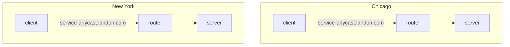
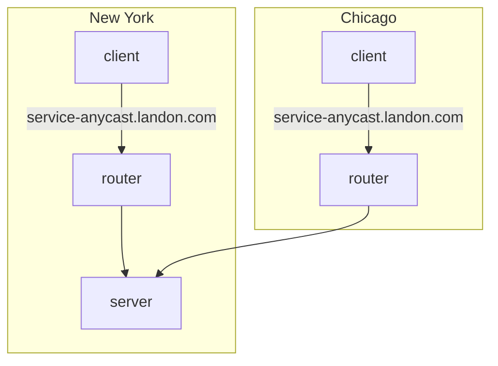

Anycast
-------

Anycast is a form of network routing whereby multiple servers share the same IP address, and messages to that IP address are routed to the server that is topographically the closest. Traffic to the IP address is routed according to the routing tables set up in the network's router. Administrators will often configure their routers to point to the geographically nearest server, although the scheme is flexible enough to allow re-routing to a different physical location should the need arise.

Administrators have the ability to change the routing in Chicago to New York, without needing any changes to the client.

Anycast is a popular way to route to DNS servers, as it removes the need for clients to understand where they are geographically, or to maintain a list of appropriate DNS servers. This is maintained by the network administrators via the routing tables.

Multicast
---------

Multicast is a routing mechanism that acts similar to a pub-sub topic. The typical IPv4 range is 224.0.0.0/4, which encompasses 224.0.0.0 to 239.255.255.255. Multicast is implemented using the Internet Group Management Protocol (IGMP). Clients must issue an IGMP JOIN command to the nearest switch or router to indicate it wants to be a member of the particular multicast group, identified as one of the aforementioned IP addresses. The router/switch maintains a list of hosts subscribed to each group and forwards the traffic to each IP in the list.
