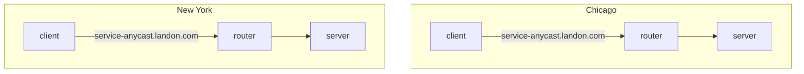
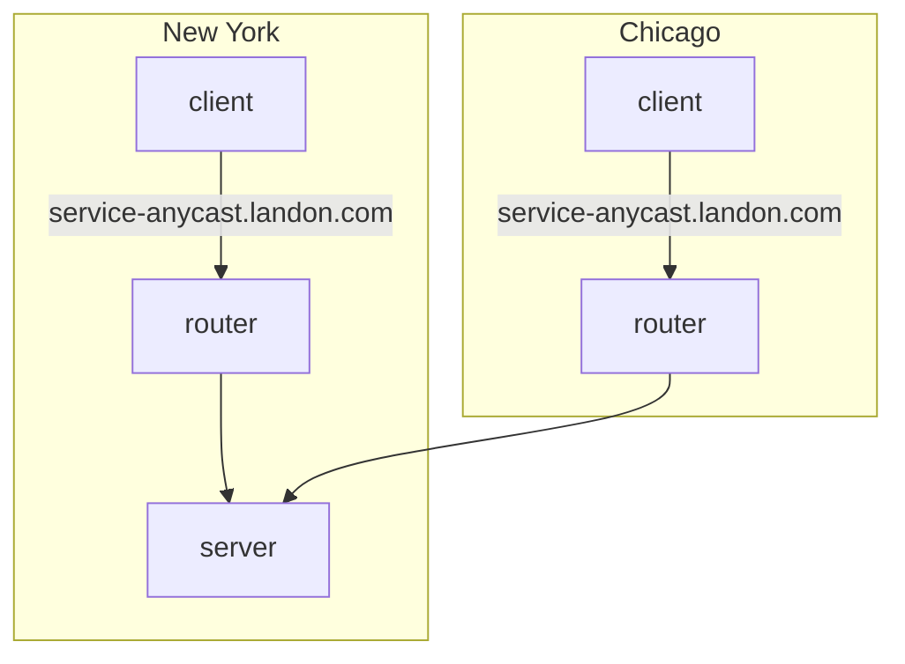
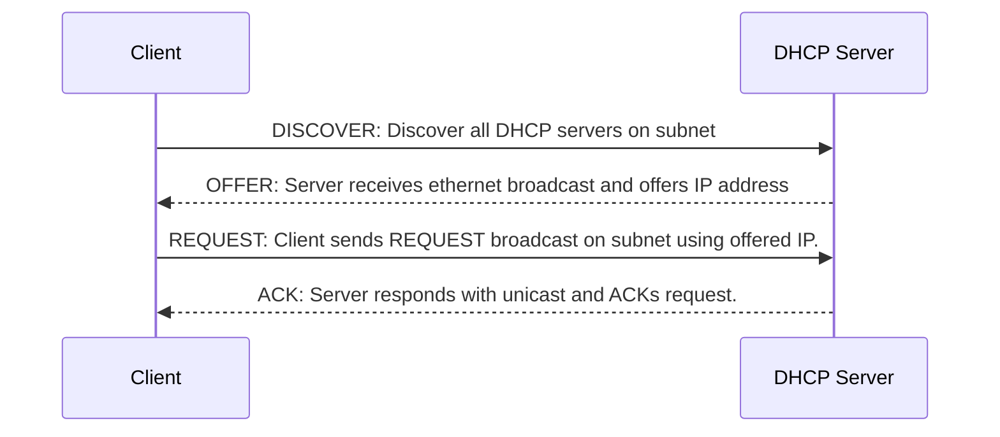

Anycast
-------

Anycast is a form of network routing whereby multiple servers share the same IP address, and messages to that IP address are routed to the server that is topographically the closest. Traffic to the IP address is routed according to the routing tables set up in the network's router. Administrators will often configure their routers to point to the geographically nearest server, although the scheme is flexible enough to allow re-routing to a different physical location should the need arise.



Administrators have the ability to change the routing in Chicago to New York, without needing any changes to the client.



Anycast is a popular way to route to DNS servers, as it removes the need for clients to understand where they are geographically, or to maintain a list of appropriate DNS servers. This is maintained by the network administrators via the routing tables.

Multicast
---------

Multicast is a routing mechanism that acts similar to a pub-sub topic. The typical IPv4 range is 224.0.0.0/4, which encompasses 224.0.0.0 to 239.255.255.255. Multicast is implemented using the Internet Group Management Protocol (IGMP). Clients must issue an IGMP JOIN command to the nearest switch or router to indicate it wants to be a member of the particular multicast group, identified as one of the aforementioned IP addresses. The router/switch maintains a list of hosts subscribed to each group and forwards the traffic to each IP in the list.

Kernel Routing Tables
---------------------

```
$ netstat -rn
Kernel IP routing table
Destination     Gateway         Genmask         Flags   MSS Window  irtt Iface
0.0.0.0         7.151.164.131   0.0.0.0         UG        0 0          0 eno1
7.0.0.0         7.151.164.131   255.0.0.0       UG        0 0          0 eno1
7.151.164.128   0.0.0.0         255.255.255.128 U         0 0          0 eno1
$ ip r s
default via 7.151.164.131 dev eno1 proto static metric 100 
7.0.0.0/8 via 7.151.164.131 dev eno1 proto static metric 65024000 
7.151.164.128/25 dev eno1 proto kernel scope link src 7.151.164.166 metric 100 
7.151.176.0/21 dev ib0 proto kernel scope link src 7.151.181.31 metric 150 
```

DHCP
----

DHCP, or Dynamic Host Configration Protocol, is a protocol used to dynamically assign IP address to hosts within its network. DHCP can also be used to send live kernel images, which is how many netbooting is performed.



### DISCOVER

Discover messages are sent out on the subnet the host is configured with using the broadcast address specific to the client's subnet. For example, in the case the subnet is located at 192.168.0.0/16, the broadcast address would be 192.168.255.255.

Clients can also request a specific IP address if desired. If not requested, the DHCP server will offer a random address from within its pool.

### DECLINE

There can be situations in which two clients are errnoneously allocated the same IP address. When a client receives an ACK from its DHCP server, indicating that particular server granted the IP lease, the client should use ARP to discover if any other computer on the subnet is using the same address. In the case the client determines this to be true, it should send a DECLINE broadcast to reneg the lease.

### RELEASE

When a client is done with an IP address, it can send a RELEASE broadcast to reneg the lease.

### Netbooting/PXE

DHCP servers can be configured to provide a `next-server` address, which is provided to the DHCP client when an IP address is given. Netbooting is not strictly part of the DHCP spec, but is rather executed as part of the PXE (Preboot Execution Environment) specification. A PXE boot utilizes the `next-server` address and `filename` parameters provided from DHCP that indicates an TFTP server that serves a loadable bootstrap program. When a client receives these parameters, it then initiates a download from the listed TFTP server and loads the bootstrap program. This interaction is usually done entirely in firmware on the NIC.

Arista MetaWatch
-----------------

https://www.arista.com/en/products/7130-meta-watch

Arista is a company that provides various networking solutions. They have developed a switch application called MetaWatch that you can install into your Arista 7130L Series devices. This application allows you to dynamically tap incoming ports in hardware instead of needing to use physical optical taps. The application can be configured to aggregate incoming ports into outgoing ports, which is a form of port multiplexing, AKA link aggregation, AKA port aggregation.

The power of in-hardware tapping is that you can dynamically re-assign where incoming ports are sent to without needing any physical work. The downside is that because the port aggregation/tapping is done in physical computing hardware, you can get into buffer overflow issues and drop packets. In practice this is usually not an issue, but it is a consideration that must be made.

Ethernet
--------


### Frame Check Sequence (FCS)

This is an error-detecting code added to the end of an ethernet frame to detect corruption in the packet. A common implementation for FCS is that the receiver will compute a running sum of the frame, including the trailing FCS. The summation is expected to result in a fixed number, often zero. Another common algorithm is the [CRC](https://en.wikipedia.org/wiki/Cyclic_redundancy_check).

