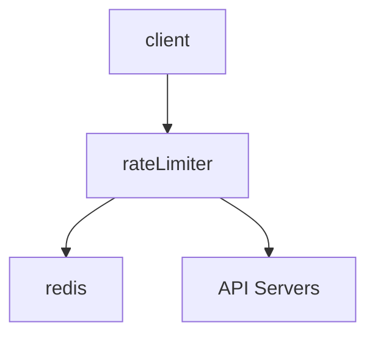

https://books.google.com/books/about/System_Design_Interview_An_Insider_s_Gui.html?id=b_mUzQEACAAJ&source=kp_book_description

## Chapter 1: Scale from Zero To Millions of Users

**Database Sharding**

Sharing is a horizontal scaling technique used in databases whereby multiple databases share the same schema, but will store different sets of data. Where a specific piece of data goes depends on the sharding key.

Sharding has many problems:

1. Resharding data: one shard might become too saturated due to uneven data distribution. This requires changing the sharding function and moving data around.
2. Celebrity problem: what if Lady Gaga gets put on a single shard? Now that shard will be overloaded with reads.
3. Joins: corss-shard joins become difficult (you need to think about how to optimize your query by considering where the data lives).

## Chapter 2: Back-of-the-Envelope Estimation

Back-of-the-envelope estimations are typically asked for in system design interviews.

Tips:

- Write down your assumptions
- Label your units
- Write down QPS (queries per second), peak QPS, storage, cache (if applicable), number of servers etc.

### Power of Two

| power | approximate value | full name | short name |
|-------|-------------------|-----------|------------|
| 10 | 1 Thousand | 1 Kilobyte | 1 KB |
| 20 | 1 Million | 1 Megabyte | 1 MB |
| 30 | 1 Billion | 1 Gigabyte | 1 GB |
| 40 | 1 Trillion | 1 Terabyte | 1 TB |
| 50 | 1 Quadrillion | 1 Petabyte | 1 PB |

### Latency numbers

Here are some typical latency numbers every programmer should know:

| Operation Name | Time |
|----------------|------|
| L1 cache reference | 0.5 ns |
| Branch mispredict | 5 ns |
| L2 cache reference | 7 ns |
| Mutex lock/unlock | 100 ns |
| Main memory reference | 100ns |
| Compress 1K bytes with Zippy | 10,000 ns = 10 μs |
| Send 2K bytes over 1Gbps network | 20,000 ns = 20 μs |
| Read 1 MB sequentially from memory | 250,000 ns = 250 μs |
| Round trip within the same datacenter | 500,000 ns = 500 μs |
| Disk seek | 10,000,000 ns = 10 ms | 
| Read 1 MB sequentially from network | 10,000,000 ns = 10 ms |
| Read 1 MB sequentially from disk | 30,000,000 ns = 30ms |
| Send packet (California -> Netherlands -> California) | 150,000,000 ns = 150ms |

### Availability numbers

Usually measured in "nines", or number of 9's digits. Example: 3 nines is 99.9% availability.

## Chapter 3: A Framework for System Design

#### 4-step process for interview

1. Understand the problem and establish design scope
    - Do not rush into starting a solution. Slow down, ask questions, and think deeply about the requirements and assumptions. This is extremely important.
    - When you ask a question, the interviewer will either answer or tell you to make an assumption. In either case, write down the answer, or the new assumption you have to make.
    - Ask questions to understand the requirements. Examples:
        - What specific features are we going to build?
        - How many users does the product have?
        - How fast does the company anticipate to scale up?
        - What is the company's technology stack? What existing services you might leverage to simplify the design?
2. Propose high-level design and get buy-in
    - Come up with an initial blueprint. Ask for feedback. Treat your interviewer as a teammate and work together.
    - Draw box diagrams with key components on a whiteboard or paper.
    - Do back-of-the-envelope calculations to evaluate if your blueprint fits the scale constraints. Think out loud. Communicate with interviewer if back-of-the-envelope is necessary before diving into it.
    - Go through a few concrete use-cases
    - Should we include API endpoints and database schema? What level of detail are we looking for?
3. Design deep dive
    - You and the interviewer should have already agreed on the following objectives:
        1. Agreed on overall goals
        2. Sketched out high-level blueprint for overall design
        3. Obtained feedback from interviewer on high-level design
        4. Had some intial ideas about areas to focus on based on interviewer's feedback
4. Wrap up
    - Interviewer might ask a few follow up questions:
        1. Identify system bottlenecks and potential improvements
        2. Might be useful to give the interviewer a recap of the design. Refreshing the interviewer's memory is helpful.
        3. Error cases?
        4. Operation issues. How do support this system in on-call? Observability/monitoring/logging?
        5. How to scale this up? If your design can handle 1 million users, what changes have to be made to scale to 10 million?
        6. Propose other refinements

##### Do's and Don'ts

**Dos**:

1. Ask for clarification. Do not assume assumption is correct.
2. Understand the requirements
3. There is no right answer nor the best answer. 
4. Let the interviewer know what you are thinking.
5. Suggest multiple approaches if possible.
6. Once you agree on blueprint, go into detail on each component. Design most critical components first.
7. Bounce ideas off interviewer
8. Never give up

**Don'ts**:

1. Don't be unprepared for typical interview questions
2. Don't jump into a solution without clarifying requirements
3. Don't go into too much detail on a single component. Start at high-level, then drill down where appropriate.
4. If you get stuck, don't hesitate to ask for hints.
5. Don't think in silence.
6. Don't think the interviewer is done when you give the design. Ask for feedback early and often.

#### Time allocation

Allocated 45 minutes or an hour is typical, but not enough to entirely flesh out a full system.

Step 1: understanding problem and design scope (3-10 minutes)

Step 2: Propose high-level design (10-15 minutes)

Step 3: Design deep dive (10-25 minutes)

Step 4: Wrap up (3-5 minutes)

## Chapter 4: Design a Rate Limiter

(these are just my notes of what the author would ask in such an interview)

### Step 1

1. What kind of rate limiter? Client or server side? Answer: server side.
2. Does the rate limiter throttle API requests based on IP, user ID, or other property? Answer: It should be flexible enough to support different kinds of throttle rules.
3. Scale of the system? Startup-scale or big company with large user base? Answer: Large number of users
4. Will the system work in a distributed environment? Answer: yes.
5. Is the rate limiter a separate service or is it implemented in application code? Answer: it's a design decision up to you.
6. Do we need to inform users when they're throttled? Answer: yes.

**Requirements**

1. Accurately limit excessive requests
2. Low latency
3. Use as little memory as possible
4. Distributed rate limiting. Rate limiter should be shared across multiple processes/servers.
5. Exception handling: show clear message to the user
6. High fault tolerance: any problems with rate limiter will not affect the entire system.

### Step 2

Where to put rate limiter? You could put it as a separate microservice next to the API servers, but this introduces an issue of the API servers needing to potentially query the rate limiter. It's not a scalable solution.

Cloud microservices usually implement rate limiting within an API gateway, in front of the API servers. 

These two implementations are both valid, but have various pros/cons. Things to consider:

1. Company's current tech stack
2. Identify rate limiting algorithm that meets business needs. You have much control if you implement your own solution. Using a third-party API gateway might limit you in your choices.
3. Building your own limiter takes time.

#### Choice of algorithms

1. Token bucket
    - Very common, well-understood.
    - Used by large companies like Amazon and stripe.
    - A bucket can contain a certain number of tokens. A refiller will periodically add a token to the bucket.
    - Consumers of the API grab a token. If no token exists, the request is rate limited.
    - Pros:
        - easy to implement
        - memory efficient
        - Allows bursts in traffic for short periods
    - Cons:
        - Two parameters to the algorithm might be challenging to tune properly.
2. Leaking bucket
    - Requests go into a queue. If the queue is full, the request is dropped.
    - The queue is processed at a fixed rate.
    - Pros:
        - Memory efficient given limited queue size
        - Requests are processed at a fixed rate, so it's suitable in cases where a stable outflow is needed.
    - Cons:
        - Bursts of traffic will fill up the queue with old requests. New requests will get dropped.
        - Two parameters to the algorithm (queue size, outflow rate) might be difficult to tune.
3. Fixed window counter algorithm
    - Each time window is allowed only a certain number of requests. If a request comes in when that limit is reached, it's dropped.
    - Pros:
        - Memory efficient
        - Easy to understand
        - Resetting available quota at the end of time unit might fit some use cases.
    - Cons:
        - Spike in traffic can cause more requests to come through than what is intended/allowed.
4. Sliding log window
    - Keeps track of request timestamps, cached in something like redis.
    - When new request arrives, remove timestamps from redis bucket that are older than `now - window_size`.
    - Add new request timestamp to bucket
    - If bucket size is less than or equal to max allowed size, allow the request. Otherwise, deny it.
    - Note: the main difference between the sliding log window and the fixed window is that the boundary of the fixed window is set on some regular interval (something like every second, or every minute, or every hour).
    - Pros: 
        - Rate limiting is very accurate. In any rolling window, requests will not exceed the limit.
    - Cons:
        - Memory intensive. Timestamps still need to be stored in memory even if the request is rejected.
5. Sliding window counter
    - We use a set of predefined time windows, as in the Fixed Window algorithm, that have boundaries on some regular interval.
    - We use another sliding window that overlaps these fixed windows.
    - To calculate the number of requests in our rolling window, we:
        - Calculate the number of requests in the previous minute. Multiply it by the percentage of which our sliding window overlaps with the previous window.
        - Calculate the number of requests in the current minute
        - Formula: `requests_current_window + (requests_previous_window * percent_overlap_previous_window)`.
    - Pros:
        - Smooths out spikes in traffic
        - Memory efficient (only have to store the requests counts of a few fixed windows)
    - Cons:
        - Assumes that the distribution of the previous window is uniform. Consequently, it might incorrectly block a request. For example, consider if all requests for the previous window came towards the beginning of the window. When we run our calculation, the average number of requests in the previous window might put us over our limit, even if our sliding window does not overlap when the previous requests happened.
        - Author notes that according to experiments at Cloudflare, only 0.003% of requests are incorrectly rate-limited or allowed over 400 million requests.

The author's high-level overview is as such:

### Step 3

A basic data structure in Redis is to have a single counter value that we increment/decrement. Race conditions arise when you have multiple API gateway instances trying to read this counter value. This can be solved by:

- Using locks (not preferrable as they slow down the system)
- [Sorted set data structure](https://redis.io/docs/data-types/sorted-sets/)
- Lua scripts (I don't know what the author means by this).

We want a centralized datastore like redis so that all rate limiter instances hit the same backing store. 

??? question

    A question to myself is whether you should have one big-ass redis cluster for the whole world (probably not) or if you should have a single redis cluster for every datacenter (or region). With anycast DNS (or geocast), it might be sufficient for the rate limiters local to a specific datacenter to only use a redis backend specific to that datacenter. I can't immediately think of any reason why this wouldn't work.

The author does note that you want to synchronize the data across datacenters with an eventual consistency model. This will come up in Chapter 6.

## Chapter 5: Design Consistent Hashing

